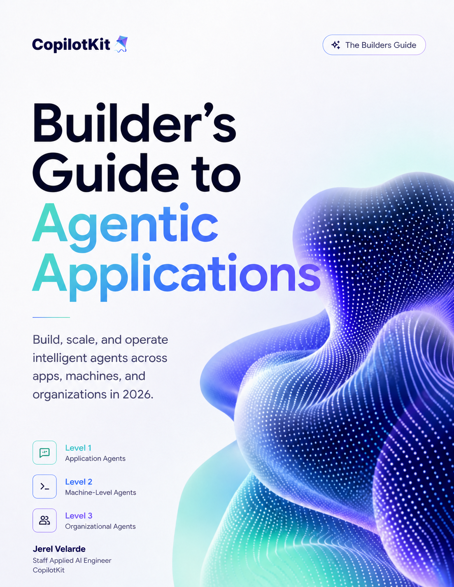

# The Builder's Guide to Agentic Applications 2026



An actionable guide to designing, building, and operating production-grade agentic applications across applications, machines, and organizations.

## Start here

1. **Read the book:** [Open the 317-page First Draft PDF](book/agentic-applications-2026-first-draft.pdf).
2. **Choose your operating surface:** use the [Builder Guide](builder-guide/README.md) to jump to the chapters and code for Level 1, Level 2, Level 3, or production engineering.
3. **Run the examples:** clone the repository and work through the tested [`companion/`](companion/README.md) package.
4. **Inspect the source projects:** see the pinned [reference-project pointers](reference-projects/README.md) used by the book.

The First Draft contains 26 chapters, 67,271 words including code, and 97 unique embedded visual assets. It is a working first draft, not a final publication.

## The three levels

| Level | Operating surface | Builder focus | Start |
| --- | --- | --- | --- |
| **1 — Application agents** | Web and mobile products | CopilotKit, typed tools, Generative UI, shared state, human intervention, LangChain, and LangGraph | [Level 1 guide](builder-guide/level-1-application-agents.md) |
| **2 — Machine agents** | CLI, workspace, or dedicated host | Skills, filesystem and shell access, permissions, sandboxing, harnesses, evidence, and recovery | [Level 2 guide](builder-guide/level-2-machine-agents.md) |
| **3 — Organizational agents** | Slack, Teams, Discord, and shared systems | Channels SDK, identity, delegation, policy, institutional memory, approvals, and audit | [Level 3 guide](builder-guide/level-3-organizational-agents.md) |

Production concerns that cut across all three levels are collected in the [production guide](builder-guide/production.md).

## Repository map

| Path | For | Contents |
| --- | --- | --- |
| [`book/`](book/README.md) | Everyone | PDF, cover, build manifest, and validation report |
| [`builder-guide/`](builder-guide/README.md) | Readers and builders | Level-by-level reading paths and code maps |
| [`companion/`](companion/README.md) | Builders | Executable TypeScript and Python examples |
| [`reference-projects/`](reference-projects/README.md) | Readers and researchers | Pinned pointers to the projects examined in the book |
| [`book-components/`](book-components/README.md) | Author and contributors | Manuscript, diagrams, source evidence, authoring rules, build tools, and the live improvement tracker |

The repository uses pointers instead of Git submodules so a normal clone stays lightweight and immediately usable.

## Run the companion code

```bash
cd companion
npm ci
npm run verify
```

```bash
cd companion/python
uv sync --group dev --python 3.11
uv run ruff format --check .
uv run ruff check .
uv run pytest -q
```

The package is marked `private` only to prevent accidental npm publication. Its original code is public and MIT-licensed.

## Licensing

- **Book content:** CC BY-NC-ND 4.0. See [`LICENSE-CONTENT.md`](LICENSE-CONTENT.md).
- **Original code:** MIT. See [`LICENSE-CODE`](LICENSE-CODE).
- **Scope and third-party exceptions:** [`LICENSE.md`](LICENSE.md).

## Author

**Jerel Velarde**<br>
Staff Applied AI Engineer<br>
CopilotKit

- X: [@jerelvelarde](https://x.com/jerelvelarde)
- LinkedIn: [jereljohnvelarde](https://www.linkedin.com/in/jereljohnvelarde/)
