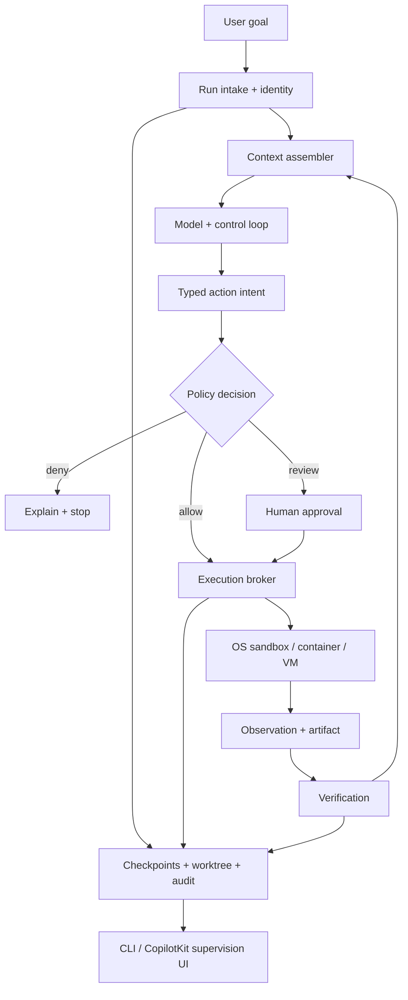
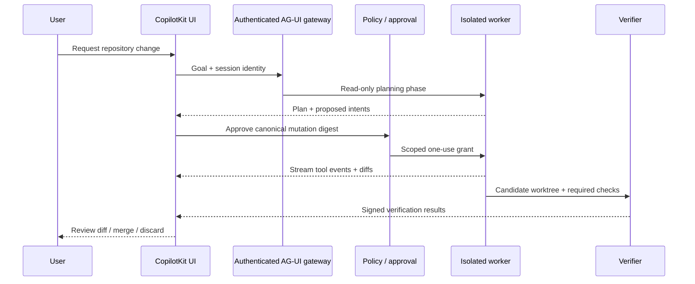

# Level 2 evidence packet — Machine-level agents

> Research substrate for Chapters 11–16 of *Builder’s Guide to Agentic Applications 2026*. This is an evidence packet, not final manuscript prose. It identifies defensible claims, exact code seams, runnable teaching material, screenshot opportunities, and claims the book must not make.

**Evidence cutoff:** 2026-07-14, America/Los_Angeles

**Primary-source access date:** 2026-07-14

**Book layer:** Level 2 — machine-level agents

**Pinned project examples:** `hermes-cpk@fc43491368f19248ca58e1409501cd28722d0f61`; `GTM Operations Workspace`

## Evidence legend

Every material claim in this packet carries one of these labels:

- **[D] Documented:** stated in first-party documentation or a first-party repository at the cited revision.
- **[S] Source-present:** directly observable in a cited, pinned source file. It was reviewed statically but not necessarily exercised.
- **[R] Runtime-verified:** exercised in the research environment. The exact verification envelope is stated; adjacent behavior is not implied.
- **[X] Externally dependent:** the path relies on a package, service, credential, fork, or runtime absent from the pinned repository or research environment.
- **[A] Aspirational:** recommended target architecture, original example, proposed control, or future work. It must not be described as already implemented.

Labels are about evidence, not quality. A documented default may be unsafe for a particular deployment, while an aspirational control may be the right production design.

## Source registry and reproduction pins

| Subject | Captured revision or version | Primary sources | Evidence note |
|---|---|---|---|
| Claude Code | Repository `b7784f2c63ed4585c32bc20b94d3b64cf4fe6df3`; local CLI reported `2.1.207` | [repository](https://github.com/anthropics/claude-code/tree/b7784f2c63ed4585c32bc20b94d3b64cf4fe6df3), [permissions](https://code.claude.com/docs/en/permissions), [sandboxing](https://code.claude.com/docs/en/sandboxing), [security](https://code.claude.com/docs/en/security), [hooks](https://code.claude.com/docs/en/hooks), [subagents](https://code.claude.com/docs/en/sub-agents), [memory](https://code.claude.com/docs/en/memory), [MCP](https://code.claude.com/docs/en/mcp), [worktrees](https://code.claude.com/docs/en/worktrees), [devcontainers](https://code.claude.com/docs/en/devcontainer) | **[D]** Docs are rolling; the repository pin preserves the inspected distribution snapshot. **[R]** Only `claude --version` was runtime-verified, not a live tool run. |
| Hermes Agent | `5d410355ac2ca49241edcbb20f2b37e1b725ca91`; package `0.18.2` | [repository](https://github.com/NousResearch/hermes-agent/tree/5d410355ac2ca49241edcbb20f2b37e1b725ca91), [architecture](https://github.com/NousResearch/hermes-agent/blob/5d410355ac2ca49241edcbb20f2b37e1b725ca91/website/docs/developer-guide/architecture.md), [agent loop](https://github.com/NousResearch/hermes-agent/blob/5d410355ac2ca49241edcbb20f2b37e1b725ca91/website/docs/developer-guide/agent-loop.md), [toolsets](https://github.com/NousResearch/hermes-agent/blob/5d410355ac2ca49241edcbb20f2b37e1b725ca91/website/docs/reference/toolsets-reference.md), [security](https://github.com/NousResearch/hermes-agent/blob/5d410355ac2ca49241edcbb20f2b37e1b725ca91/website/docs/user-guide/security.md), [checkpoints](https://github.com/NousResearch/hermes-agent/blob/5d410355ac2ca49241edcbb20f2b37e1b725ca91/website/docs/user-guide/checkpoints-and-rollback.md), [worktrees](https://github.com/NousResearch/hermes-agent/blob/5d410355ac2ca49241edcbb20f2b37e1b725ca91/website/docs/user-guide/git-worktrees.md), [Docker](https://github.com/NousResearch/hermes-agent/blob/5d410355ac2ca49241edcbb20f2b37e1b725ca91/website/docs/user-guide/docker.md) | **[D]** Current upstream is materially more capable and hardened than the older external fork required by the CopilotKit demo. Do not transfer current-upstream properties to that absent fork without reproduction. |
| OpenClaw | `2372c71697113eed6247af9bdb7f58d684844251`; package `2026.7.2` | [repository](https://github.com/openclaw/openclaw/tree/2372c71697113eed6247af9bdb7f58d684844251), [architecture](https://github.com/openclaw/openclaw/blob/2372c71697113eed6247af9bdb7f58d684844251/docs/concepts/architecture.md), [agent workspace](https://github.com/openclaw/openclaw/blob/2372c71697113eed6247af9bdb7f58d684844251/docs/concepts/agent.md), [security](https://github.com/openclaw/openclaw/blob/2372c71697113eed6247af9bdb7f58d684844251/docs/gateway/security/index.md), [sandboxing](https://github.com/openclaw/openclaw/blob/2372c71697113eed6247af9bdb7f58d684844251/docs/gateway/sandboxing.md), [sandbox vs policy](https://github.com/openclaw/openclaw/blob/2372c71697113eed6247af9bdb7f58d684844251/docs/gateway/sandbox-vs-tool-policy-vs-elevated.md), [exec approvals](https://github.com/openclaw/openclaw/blob/2372c71697113eed6247af9bdb7f58d684844251/docs/tools/exec-approvals.md), [skills](https://github.com/openclaw/openclaw/blob/2372c71697113eed6247af9bdb7f58d684844251/docs/tools/skills.md), [managed worktrees](https://github.com/openclaw/openclaw/blob/2372c71697113eed6247af9bdb7f58d684844251/docs/concepts/managed-worktrees.md) | **[D]** Treat OpenClaw as a gateway and personal-agent runtime, not merely another coding CLI. Its first-party security model explicitly rejects hostile multi-tenant use inside one trust boundary. |
| Hermes + CopilotKit demo | `fc43491368f19248ca58e1409501cd28722d0f61` | [repository](https://github.com/jerelvelarde/hermes-cpk/tree/fc43491368f19248ca58e1409501cd28722d0f61) and exact file links in Chapter 15 | **[S]** The web UI exists in the pin; the Hermes AG-UI adapter does not. **[X]** A fork and preview client package complete the path. |
| GTM Operations Workspace | `private revision omitted` | GTM Operations Workspace and exact file links in Chapter 15 | **[S]** Backend selection, renderer, access gate, and adapter launch seam are present. **[X]** A live Hermes adapter is outside the pin. |

## Executive findings the manuscript should preserve

1. **[D][S] A working directory is routing and context, not confinement.** Claude Code, Hermes, OpenClaw, and both pinned demos use a workspace or current directory to decide what the agent sees and where relative paths land. That does not create an operating-system boundary. The `hermes-cpk` launcher literally changes directory before starting the adapter; it does not jail the process.

2. **[D] “Can the model call this tool?” and “Can the process perform this action?” are different questions.** Tool policy, approval policy, OS sandboxing, container/VM isolation, and host identity are separate layers. A denied file tool does not stop a terminal running as the same user unless the terminal is independently constrained.

3. **[S] Visibility is not authorization.** A CopilotKit renderer can make a tool call legible, show a diff, or offer an Undo button. Those are valuable interaction controls, but they do not prove the action was authorized, confined, transactional, or recoverable.

4. **[D] The three compared systems are not interchangeable products.** Claude Code is a managed coding agent with a strong permission and lifecycle surface; Hermes is an open, provider-flexible agent harness with many tools and execution backends; OpenClaw is a persistent gateway and personal-agent runtime spanning channels, devices, skills, and host execution. Compare knobs and trust models, not a single “best agent” score.

5. **[D] Agent instructions and retrieved content are untrusted inputs.** Repository files, issues, web pages, email, documents, logs, skills, plugins, and MCP servers can influence an agent. Prompt injection is therefore a capability-routing problem, not only a prompt-writing problem.

6. **[D][A] Recovery must be engineered before autonomy is increased.** Git worktrees, checkpoints, snapshots, compensating actions, immutable logs, and verification gates solve different failure modes. “Undo” is not a property of the UI; it is a property of the side effect and its recovery design.

7. **[S][X] The pinned Hermes/CopilotKit repositories are excellent teaching baselines but not evidence of a production deployment.** They expose the integration seam and the missing controls. Their AG-UI path depends on an external Hermes fork and preview package that were not present in the research environment.

## Chapter 11 — The machine as an agent environment

### 11.1 Machine-agent harness anatomy

**[D]** A machine-level agent is not “an LLM with shell access.” A useful harness has at least ten cooperating parts:

1. **Goal and session intake:** turns a user request into a run identity, thread, budget, and trust context.
2. **Context assembly:** selects instructions, repository metadata, memory, user input, tool outputs, and retrieved content.
3. **Model/provider adapter:** formats requests, streams responses, enforces structured tool calls, and handles provider errors.
4. **Planning and control loop:** decides whether to call a tool, ask the user, delegate, retry, verify, or stop.
5. **Capability registry:** defines tools, schemas, execution backends, skills, MCP servers, and subagents.
6. **Policy and approval engine:** decides whether an intent is allowed, denied, sandboxed, or requires a reviewer.
7. **Execution boundary:** runs file, process, browser, network, and external-service actions under an identity and isolation policy.
8. **Persistence:** records sessions, checkpoints, artifacts, worktrees, memory, and resumable state.
9. **Observability and interaction:** streams messages, tool intents, tool results, diffs, approval requests, failures, and costs to a CLI or UI.
10. **Verification and recovery:** runs tests and policy checks, records postconditions, and provides rollback or compensation.

**[A] Figure 11.1 — The machine-agent harness**



**[D]** Claude Code documents permissions, hooks, MCP, subagents, memory, worktrees, and OS-level Bash sandboxing as distinct surfaces. Hermes documents its agent loop, prompt builder, toolsets, terminal backends, approvals, sessions, skills, checkpoints, and worktrees. OpenClaw documents a gateway, agent workspace, sessions, tools, skills, sandbox modes, exec approvals, nodes, and managed worktrees. The common abstraction is the harness; implementations and defaults differ.

### 11.2 The run/step/tool cycle

**[A]** Use this operational state machine in the chapter rather than an anthropomorphic “agent thinks” diagram:

```text
run.created
  -> context.assembled
  -> model.requested
  -> action.proposed
  -> policy.evaluated
     -> action.denied | approval.requested | action.dispatched
  -> action.observed
  -> state.checkpointed
  -> result.verified
     -> model.requested | user.input.requested | run.failed | run.completed
```

**[A]** Each event should carry `run_id`, `step_id`, actor identity, workspace identity, tool name, redacted arguments, policy decision, isolation backend, start/end time, result digest, and artifact references. Never require the UI to infer authority from prose.

### 11.3 Five boundaries builders must not collapse

| Boundary | What it controls | What it does **not** control | Builder question |
|---|---|---|---|
| Working directory / workspace | Relative-path base, project discovery, local instructions, default context | OS access outside the directory | “Where does this run begin, and which repository is it for?” |
| Agent tool policy | Which named capabilities the harness will dispatch | Direct actions by an unconstrained child process; kernel access | “May this actor request `terminal`, `write_file`, or `browser`?” |
| Approval policy | Which intents need a human decision | Containment after approval; identity if approvals are shared | “Who may authorize this exact action, for how long?” |
| OS sandbox | Filesystem, process, and sometimes network operations enforced below the model | Host compromise through exposed sockets or broad mounts; external API authorization | “What can the process actually touch?” |
| Container, VM, or dedicated host | Kernel/user/account/blast-radius separation, disposable environment | Application-level tenant policy; safe credentials by itself | “What survives if the agent is compromised?” |

**[D]** Claude Code’s sandbox uses platform mechanisms for Bash subprocesses and separately documents permission mediation for built-in tools. Its docs warn that a sandbox can fall back to unsandboxed execution unless strict failure is configured, that unsandboxed escape hatches are separate permissions, and that broad network destinations, Unix sockets, inherited environment variables, and container sockets change the boundary. See [sandboxing](https://code.claude.com/docs/en/sandboxing).

**[D]** Hermes’ file safety guards apply to file tools, while its own security documentation states that terminal commands running as the same OS user can bypass those guards. Its documented stronger boundary is an isolated terminal backend such as Docker, SSH, Daytona, Modal, or Singularity, configured according to the threat model.

**[D]** OpenClaw states the distinction directly: sandboxing controls where tools run, tool policy controls which tools exist, and elevated execution is an exec-only escape hatch. Its sandbox is off by default at the captured revision, and its gateway/host exec posture must be configured deliberately. See [sandbox vs policy vs elevated](https://github.com/openclaw/openclaw/blob/2372c71697113eed6247af9bdb7f58d684844251/docs/gateway/sandbox-vs-tool-policy-vs-elevated.md).

### 11.4 Threat model before product selection

**[A]** The chapter should make the reader write down these actors and assets before enabling tools:

- requesters: one trusted operator, an authenticated team, or mutually untrusted tenants;
- input sources: repository, tickets, web, chat channels, email, uploaded documents, logs;
- assets: source code, customer data, credentials, signing keys, cloud control plane, personal browser profile;
- side effects: local edits, package installation, network requests, deployment, messaging, billing, deletion;
- persistence: memory, session transcripts, worktrees, caches, logs, skill/plugin directories;
- recovery objective: restore files, reverse an API operation, revoke credentials, rebuild a host, or prove what occurred.

**[D]** OpenClaw’s security guide explicitly says a single gateway is not a hostile multi-tenant security boundary. Separate gateways—and preferably OS users or hosts—are the appropriate pattern for adversarial users. That is a useful general lesson: application authentication cannot manufacture kernel-level tenant isolation.

## Chapter 12 — Harnesses, skills, context, and verification

### 12.1 Context is influence, not authority

**[D]** Claude Code supports project instruction files and auto memory; Hermes scans project context such as `.hermes.md`, `HERMES.md`, `AGENTS.md`, and compatible instruction files; OpenClaw bootstraps an agent workspace with files such as `AGENTS.md`, `SOUL.md`, `TOOLS.md`, `IDENTITY.md`, `USER.md`, `HEARTBEAT.md`, and memory files. These mechanisms influence decisions. They do not enforce filesystem, network, or credential boundaries.

**[A]** Teach four classes of context:

| Class | Examples | Default trust | Treatment |
|---|---|---|---|
| Control-plane policy | signed organization policy, server-side allowlist | High, but versioned | Keep out of model-editable workspace; enforce outside model |
| Project instructions | `AGENTS.md`, `CLAUDE.md`, `HERMES.md` | Repository contributor trust | Review like code; bind to repository and revision |
| Retrieved evidence | web pages, issues, docs, logs, email | Untrusted | Delimit, label source, prevent it from granting capabilities |
| Memory | preferences, prior summaries, institutional notes | Mixed and potentially stale | Record provenance, scope, author, expiry, and deletion path |

**[D]** Claude Code’s memory documentation distinguishes instruction files and auto memory from enforceable settings. Hermes’ prompt assembly scans and truncates context but scanning is not a hard security boundary. OpenClaw stores workspace memory as files; those files are part of the persistent attack surface and data-retention surface.

### 12.2 Skills are supply-chain artifacts

**[D]** Across these systems, skills can provide instructions, scripts, dependencies, environment requirements, credentials, or tools. Claude Code plugins may bundle skills, hooks, MCP configuration, LSP configuration, and executables. Hermes skills can declare environment and credential-file requirements. OpenClaw treats dynamic skills and plugins as trusted code, and plugin install/update can execute code.

**[A]** A production skill registry should record:

```yaml
id: repo-migration
version: 3.2.1
source:
  url: https://github.com/example/agent-skills
  commit: 4f0d...
integrity: sha256:...
owner: developer-platform
reviewed_at: 2026-07-10
capabilities:
  tools: [read_file, patch_file, run_test]
  network: [registry.npmjs.org]
  secrets: []
  writable_paths: [src, tests, package.json]
install:
  may_execute_code: false
expiry: 2026-10-10
```

**[A]** Treat a skill update like a dependency update: pin it, inspect its diff, run static policy checks, test it in a disposable environment, record provenance, and promote it. Do not let the model install arbitrary “helpful” skills into a persistent privileged agent.

### 12.3 Prompt injection crosses tool boundaries

**[D]** Claude Code warns users to review commands, avoid piping untrusted material into privileged execution, verify critical changes, and use stronger isolation for untrusted code or external web content. OpenClaw explicitly notes that injection can arrive through web pages, email, documents, attachments, logs, and source code even when only the owner can message the agent. These are first-party acknowledgments that trusted requester identity does not make retrieved content trusted.

**[A]** Use this teaching scenario:

1. A trusted engineer asks an agent to summarize a dependency’s migration guide.
2. The guide contains instructions directed at the agent rather than the reader.
3. The agent has a package-manager tool and an inherited registry token.
4. A content-only task becomes package installation plus network access.

The control is not “prompt harder.” The control is to route research through read-only capabilities, strip credentials, deny package installation, isolate the browser, require a typed proposal before mutation, and move installation into a separately approved phase.

### 12.4 Hooks, approvals, and deterministic gates

**[D]** Claude Code hooks expose lifecycle events including pre-tool and post-tool stages. Its hook semantics matter: a blocking outcome requires the documented blocking exit behavior; a generic failure does not automatically mean “deny.” Builders must test fail-closed behavior rather than assume any hook error blocks execution.

**[D]** Hermes documents approval modes and a YOLO/off path. OpenClaw documents exec approvals with security and ask modes. In every case, an approval prompt is useful only when it names the actual intent, target, authority, and effect.

**[A]** Approval payload:

```ts
type ActionIntent = {
  runId: string;
  stepId: string;
  actor: { agentId: string; onBehalfOf: string };
  tool: "write_file" | "run_command" | "http_request" | "deploy";
  target: { workspaceId: string; path?: string; host?: string; environment?: string };
  argsDigest: string;
  display: { summary: string; diffRef?: string; commandArgv?: string[] };
  impact: "read" | "local-write" | "external-write" | "destructive";
  reversible: boolean;
  expiresAt: string;
};
```

**[A]** Bind approval to the digest of canonical arguments, actor, workspace, and expiration. If the command or target changes after approval, evaluate again. “Allow terminal for this session” is a convenience mode, not a high-assurance review.

### 12.5 Verification is a separate loop

**[A]** The model that made a change can propose verification, but the harness should own required checks. For a code change, a policy can require:

```text
format -> lint -> typecheck -> focused tests -> build -> diff policy -> secret scan
```

**[A]** Record each check’s executable identity, argv, environment profile, exit code, duration, output digest, and artifact. The UI should say “tests passed” only when the verifier event exists, not because the assistant said it ran tests.

## Chapter 13 — Access, restrictions, and dedicated machines

### 13.1 Start with a capability matrix

**[A]** Scope permissions across four dimensions instead of one global “agent access” switch:

| Capability | Read | Local write | External write | Destructive |
|---|---:|---:|---:|---:|
| Filesystem | inspect source | patch worktree | upload artifact | remove/overwrite |
| Process | inspect status | run tests | trigger remote job | kill/modify service |
| Network | fetch allowlisted docs | download pinned package | call write API | change infra/billing |
| Identity | use anonymous | use run-scoped token | act as service account | impersonate user/admin |
| Persistence | read run state | append trace | update shared memory | delete/audit rewrite |

**[A]** A production policy should express path roots, command identities, argument constraints, network destinations, HTTP methods, credential scopes, resource budgets, approval classes, and isolation backends. A shell-string allowlist is too weak when arguments, interpreters, redirections, subprocesses, and package scripts can change behavior.

### 13.2 Credentials: broker, do not blanket-inherit

**[D]** Claude Code’s sandbox documentation warns that subprocesses inherit environment variables unless builders take steps to reduce exposure. Hermes and OpenClaw both support credential-bearing integrations and persistent configuration. Containers and dedicated machines do not help if every secret is copied into them.

**[A]** Preferred pattern:

1. The run starts with no long-lived credential in its environment.
2. A credential broker evaluates actor, tool, resource, and policy.
3. It issues a short-lived token scoped to one service and action class.
4. The execution broker injects it only into that tool process.
5. Logs redact it; egress policy limits where it can be sent.
6. The token expires or is revoked when the run ends.

**[A]** Separate read and write identities. Never use a personal browser profile, SSH agent, cloud-admin token, signing key, or production kubeconfig merely because the agent runs on a “dedicated” machine.

### 13.3 Network policy is part of the data boundary

**[D]** Claude Code’s sandbox documentation explains that hostname allowlisting and TLS inspection are distinct; a broad permitted domain can still provide an exfiltration path. OpenClaw’s documented Docker sandbox defaults its network to none. Hermes terminal backends make network and environment forwarding explicit configuration concerns.

**[A]** Default-deny egress for mutation runs. Route outbound HTTP through an authenticated proxy that records destination, method, byte counts, and policy decision. Allow documentation retrieval and source mutation in separate phases when possible. Deny cloud metadata endpoints and local-control sockets. Treat Docker/container-engine sockets as host control, not “just another Unix socket.”

### 13.4 Paths, symlinks, and traversal

**[D]** Current Hermes upstream includes realpath-based file-safety and path-security helpers that normalize traversal and follow symlinks before checking roots: [file safety](https://github.com/NousResearch/hermes-agent/blob/5d410355ac2ca49241edcbb20f2b37e1b725ca91/hermes_cli/agent/file_safety.py) and [path security](https://github.com/NousResearch/hermes-agent/blob/5d410355ac2ca49241edcbb20f2b37e1b725ca91/hermes_cli/tools/path_security.py). This is stronger than string-prefix checking, but file-tool guards still do not constrain an unconstrained terminal.

**[S]** The pinned `hermes-cpk` file and PDF routes normalize a path and check its string prefix against `process.cwd()`: [file route lines 7–41](https://github.com/jerelvelarde/hermes-cpk/blob/fc43491368f19248ca58e1409501cd28722d0f61/expense-tracker-live/app/api/file/route.ts#L7-L41) and [PDF route lines 7–35](https://github.com/jerelvelarde/hermes-cpk/blob/fc43491368f19248ca58e1409501cd28722d0f61/expense-tracker-live/app/api/pdf/route.ts#L7-L35). Because the code does not canonicalize existing filesystem objects before access, an in-root symlink can resolve outside the nominal root. This is a static threat-model finding, not a runtime exploit claim.

**[A]** A better application-level check canonicalizes both the configured root and existing target. It is still not a race-free replacement for OS isolation:

```ts
import path from "node:path";
import { realpath } from "node:fs/promises";

export async function resolveExistingInside(rootInput: string, userPath: string) {
  const root = await realpath(rootInput);
  const candidate = path.resolve(root, userPath);
  const target = await realpath(candidate); // follows symlinks
  if (target !== root && !target.startsWith(root + path.sep)) {
    throw new Error("path escapes workspace");
  }
  return target;
}
```

**[A]** For creating new files, canonicalize the nearest existing parent and constrain the final name. For stronger assurance, have a small broker open files relative to a pre-opened directory with no-follow semantics and pass the descriptor, or perform the operation in a mount namespace/container that exposes only the intended root. A check-then-open sequence in application code can race with filesystem changes.

### 13.5 Unsafe-content and dependency controls

**[A]** Test these cases in the reference implementation:

- repository instruction requests secret disclosure;
- issue body asks the agent to disable policy;
- symlink inside the workspace points to an external credential file;
- path uses `..`, alternate separators, Unicode confusables, or case variations;
- package install runs a lifecycle script;
- skill install modifies hooks or tool policy;
- MCP server returns an instruction to call a more privileged tool;
- command uses an allowed interpreter to run arbitrary code;
- process writes through a mounted Docker socket;
- “read-only” operation sends retrieved data to an allowed external host.

**[A]** A secure demo should include one visible denial for each class. A book screenshot of a real denial teaches more than a policy file alone.

### 13.6 When to use a worktree, container, VM, or dedicated machine

| Environment | Best fit | Isolation reality | Residual risk |
|---|---|---|---|
| Git worktree | Parallel code changes, clean diff, cheap discard | Repository-state separation, not process isolation | Same user, secrets, network, and host remain reachable unless separately constrained |
| OS sandbox | Frequent local runs with narrow file/network needs | Kernel-enforced policy for covered processes | Coverage gaps, escape hatches, sockets, inherited env, platform variance |
| Container | Reproducible dependencies and mount/network control | Namespace/cgroup boundary under host kernel | Host mounts, privileged mode, engine socket, kernel boundary, persistent volumes |
| VM | Untrusted builds, browser automation, stronger disposable boundary | Separate guest kernel and virtual hardware | Hypervisor/admin plane, copied secrets, image persistence, network reach |
| Dedicated host/account | Persistent personal or organizational agent with contained identity | Reduces personal-device and cross-account blast radius | Still not tenant isolation by itself; host can accumulate sensitive state |

**[D]** Claude Code publishes a devcontainer pattern and warns that bind-mounted workspace writes persist on the host, secrets should not be mounted casually, tokens should be scoped and short-lived, versions should be pinned, and permission bypass belongs only in disposable trusted environments. Hermes documents isolated terminal backends and Docker persistence. OpenClaw recommends dedicated machines/VMs/containers, OS users, browser profiles, and service accounts for stronger separation; it warns against mixing personal identity with a persistent agent.

**[A] Dedicated-machine baseline:** minimal OS image; full-disk encryption; non-admin agent user; inbound deny; egress proxy; no personal accounts; no personal browser profile; short-lived service identities; automatic security updates; immutable base image; per-run worktree or VM; resource and cost limits; centralized redacted logs; remote kill/revoke path; scheduled destruction or rebuild; tested restore.

## Chapter 14 — Claude Code, Hermes, and OpenClaw: a dated, fair comparison

### 14.1 Comparison at the evidence cutoff

**[D]** This table describes the captured revisions above, not permanent product identity.

| Dimension | Claude Code | Hermes Agent | OpenClaw |
|---|---|---|---|
| Primary shape | Managed terminal/IDE coding agent | Open-source general agent harness and CLI | Persistent personal-agent gateway spanning channels, devices, and tools |
| License/source posture | Public distribution repository under Anthropic’s stated terms; not an open-source codebase to treat as MIT | MIT open source at the captured pin | MIT open source at the captured pin |
| Model posture | Anthropic-managed Claude product | Provider/model flexible; supports multiple API modes | Provider/model configurable through gateway runtime |
| Context and memory | Project/user instructions, auto memory, resumable sessions | Project context, sessions, memory, skills, delegation | Agent workspace bootstrap files, sessions, Markdown memory, skills |
| Capability extension | Tools, MCP, hooks, skills/plugins, subagents/agent teams | Toolsets, MCP, skills, plugins, delegation, multiple terminal backends | Tools, skills, plugins, nodes, channels, browser/device capabilities |
| Approval posture | Default permission prompts for mutating/non-read-only actions; rule precedence and modes documented | `smart`, `manual`, and `off`/YOLO modes documented | Exec security/ask modes and approvals documented; host default requires deliberate hardening |
| Isolation | OS-level Bash sandbox support; devcontainer/worktree patterns | Local or isolated terminal backends including Docker/SSH/remote options | Sandbox modes/backends including Docker/SSH/OpenShell; gateway remains on host |
| Recovery | Worktrees, hooks, normal version-control workflow | Opt-in checkpoints plus worktree workflow | Managed worktrees with snapshot/restore behavior |
| Best teaching use | Managed coding workflow, permissions, hooks, sandbox configuration | Harness internals, provider/tool flexibility, execution backends | Persistent gateway trust, channels/devices, dedicated-agent operations |

### 14.2 Claude Code findings

**[D]** Claude Code’s default permission flow distinguishes read-only work from edits and non-read-only Bash. Rules are evaluated with deny before ask before allow. Modes include normal/default behavior, accepting edits, planning, noninteractive denial behavior, and documented high-autonomy/bypass modes. Exact names and availability should be rechecked at book release because the docs are rolling.

**[D]** Its sandboxing surface covers Bash subprocesses with OS mechanisms—Seatbelt on macOS and bubblewrap on Linux/WSL2 according to the captured documentation—while built-in file operations remain permission-mediated. Builders can configure failure when the sandbox is unavailable and can disable unsandboxed escape behavior. These strictness settings are as important as enabling the sandbox itself.

**[D]** Hooks provide deterministic interception points; subagents isolate context but run under the same overall process/sandbox configuration unless tools and permissions are narrowed; MCP adds external tools/resources; worktrees provide parallel repository checkouts. None should be presented as automatic multi-tenant isolation.

**[R]** The local binary returned `2.1.207 (Claude Code)`. No live model call, mutation, denial, hook, or sandbox escape test was performed in this evidence pass.

### 14.3 Hermes findings

**[D]** At `0.18.2`, upstream Hermes documents an `AIAgent` loop, prompt construction, provider resolution, tool dispatch, persisted sessions, many tools grouped into core/composite/platform toolsets, and local or isolated terminal backends. It can be used through a CLI, gateway, ACP, or Python/library path. Exact tool counts are intentionally omitted from manuscript claims because they change quickly and add little builder value.

**[D]** Hermes documents file-write safety, protected paths, approval modes, SSRF-related controls, MCP environment filtering, Docker execution, checkpoints, and git worktrees. Its checkpoint system is opt-in at the captured revision and uses a shadow repository; the docs recommend pairing recovery with worktree isolation. Lazy dependency installation is an explicit supply-chain knob and should be disabled or controlled in high-assurance deployments.

**[D]** Current upstream path helpers use resolved/canonical paths. Yet its file-tool safety cannot stop terminal commands executed as the same user, a limitation its own security guidance makes clear. Stronger security requires constraining or isolating terminal execution.

**[S]** The captured upstream repository contains no AG-UI adapter or `@ag-ui/hermes` implementation. Therefore the book must not say “Hermes 0.18.2 has native AG-UI/CopilotKit support” based on this pin.

### 14.4 OpenClaw findings

**[D]** OpenClaw is architected around a WebSocket gateway, agent workspaces/sessions, channels, nodes, skills, and tools. A loopback gateway address and pairing/token mechanisms are relevant transport controls; possession of an operator token should be treated as operator authority.

**[D]** At the captured revision, sandboxing is off by default. For gateway/node host execution, the documented exec security default is permissive (`full`) and the ask default is off; sandbox host execution has a different default posture. This is a product trust-model default, not an exploit. The correct lesson is to configure `where`, `which`, and `when-to-ask` explicitly before connecting untrusted content or additional users.

**[D]** Sandbox modes include off, non-main, and all; scope can be agent/session/shared; workspace exposure can be none/read-only/read-write; the documented Docker network default is none. Plugins run in process and skills are trusted code. Bind mounts and container-engine sockets can collapse isolation. Session logs and persistent state can contain private data or credentials.

**[D]** OpenClaw’s managed-worktree design creates independent checkouts and snapshots tracked plus eligible untracked content before cleanup, enabling restore. Its repository-local setup script is code and should be treated as an administrator-reviewed trust surface.

### 14.5 Selection guidance

**[A]** Choose based on boundary and operating model:

- Choose Claude Code when the primary job is managed software development and its product permission, hooks, IDE/CLI, and Anthropic model workflow fit the organization.
- Choose Hermes when the team needs an open harness, model/provider flexibility, broad tool composition, or explicit local/remote execution backends—and is prepared to own integration and hardening.
- Choose OpenClaw when the product is a persistent personal or team agent gateway across channels/devices, and the organization can dedicate identities and infrastructure to its trust model.
- Combine them only across typed, authenticated boundaries. Do not give one broad agent three overlapping terminal paths and call that defense in depth.

**[A]** The chapter should include a “re-run this comparison” date box. Defaults, versions, pricing, product names, and supported platforms are time-sensitive; immutable pins preserve evidence but do not prove current behavior at publication.

## Chapter 15 — Supervising Hermes with CopilotKit

### 15.1 What the pinned demo actually proves

**[S]** `hermes-cpk@fc434…` provides a concrete UI seam:

```text
CopilotKit React UI
  -> local Next.js /api/copilotkit
  -> @ag-ui/hermes HermesAgent client
  -> external Hermes AG-UI adapter
  -> Hermes model/tool loop
  -> file/terminal operations in the launch working directory
  -> AG-UI tool events
  -> CopilotKit cards, diffs, and PDF renderer
```

**[S]** Exact evidence:

- The launcher selects an app directory, enables the `hermes-acp` toolset, defaults `HERMES_YOLO` to `1`, changes into that directory, and invokes `python -m agui_adapter`: [run-adapter.sh lines 4–46](https://github.com/jerelvelarde/hermes-cpk/blob/fc43491368f19248ca58e1409501cd28722d0f61/run-adapter.sh#L4-L46).
- The Next.js route registers `HermesAgent` under `default` and points it at `AGENT_URL`: [CopilotKit route lines 1–24](https://github.com/jerelvelarde/hermes-cpk/blob/fc43491368f19248ca58e1409501cd28722d0f61/expense-tracker-live/app/api/copilotkit/%5B%5B...all%5D%5D/route.ts#L1-L24).
- The provider shares ledger context and uses a wildcard `useRenderTool` renderer to display reads, writes, patches, generic tool calls, and PDFs: [providers lines 24–124](https://github.com/jerelvelarde/hermes-cpk/blob/fc43491368f19248ca58e1409501cd28722d0f61/expense-tracker-live/app/providers.tsx#L24-L124).
- `DiffCard` computes a client-side diff and exposes an Undo action backed by the app’s file route: [DiffCard lines 12–61](https://github.com/jerelvelarde/hermes-cpk/blob/fc43491368f19248ca58e1409501cd28722d0f61/expense-tracker-live/components/DiffCard.tsx#L12-L61).

**[X]** The adapter module and its runtime behavior are not in the pin. The README points to an external Hermes fork branch and a preview `@ag-ui/hermes` build. Without those exact dependencies and credentials, no end-to-end tool execution can be claimed.

**[R]** During the broader capture pass, the reference web surfaces returned HTTP 200 and the CopilotKit runtime info endpoint reported a registered default agent. This proves that the local web shell and runtime route answered. It does **not** prove a model call, AG-UI stream, file edit, diff, PDF creation, approval, denial, or rollback. No Level 2 screenshot is runtime-verified in this packet.

### 15.2 Why this is an intentionally useful unsafe baseline

**[S]** The launcher’s default `HERMES_YOLO=1` avoids an interactive approval stall for the live-edit demo. It also means the demo cannot be cited as evidence of a real approval flow.

**[S]** `cd "$APP_DIR"` determines relative paths and project context. It does not prevent the Hermes process or terminal tool from accessing other paths available to the OS user.

**[S]** The renderer observes tool events and makes changes legible. It does not authorize those events. Registering a display-only renderer is not a server-side capability rule.

**[S]** The file and PDF routes contain prefix-based path checks but no canonical symlink resolution. The route source itself has no authentication or per-user authorization. Deployment middleware or a surrounding gateway could add access control, but none should be inferred from these files.

**[S]** Diff Undo is best effort. For patches it reads the current file and performs string replacement; for writes it sends cached prior text. It does not check the POST response before declaring success, bind Undo to a file hash/version, or perform an atomic transaction. Concurrent edits can make the replacement a no-op or overwrite newer work. Call it a demo Undo, not rollback.

**[S][X]** The launch script sources an environment file into the adapter process. Whether and how the absent adapter forwards those variables to terminal subprocesses was not verified. The production design should inject credentials per tool rather than assume process inheritance is safe.

### 15.3 GTM Operations Workspace adds a second, complementary seam

**[S]** `GTM Operations Workspace@9e095…` contains a client-selectable backend route. The Hermes branch registers a `HermesAgent`; Anthropic and OpenAI branches use service adapters: GTM Operations Workspace.

**[S]** Its health endpoint probes Hermes reachability but treats provider-key presence as “configured” for other backends and returns `agent_url`: GTM Operations Workspace. Key presence is readiness metadata, not a live smoke test. Returning an internal adapter URL may be an information-exposure concern depending on deployment.

**[S]** The backend registry explicitly says readiness is environment-derived and a live smoke test is separate: GTM Operations Workspace.

**[S]** The frontend uses a render-only `useDefaultTool` catch-all. Its comments record a valuable protocol lesson: advertising a wildcard callable frontend tool can misclassify server tools and leave the run waiting for a client result; a renderer should not accidentally become a capability: GTM Operations Workspace.

**[S]** Middleware can apply Basic Auth or a shared-password cookie gate, but is inert when configuration is absent: GTM Operations Workspace. This is a single-account deployment gate, not per-user identity, per-tool authorization, or tenant isolation.

**[X]** The adapter launcher points at an external Hermes virtual environment and invokes `agui_adapter`; the adapter implementation is not bundled: GTM Operations Workspace.

### 15.4 Hardening ladder for the reference build

**[A]** Preserve the unsafe baseline in the narrative, then improve one property per rung so readers can see why each exists:

1. **Visibility:** stream tool name, canonical target, status, result summary, and diff. Label evidence versus model narration.
2. **Authentication:** require an authenticated user/session at the CopilotKit route and adapter. Authenticate service-to-service traffic; do not expose the adapter directly.
3. **Scope:** assign a server-side workspace ID that maps to a root. Ignore client-supplied absolute roots. Canonicalize paths and enforce tool/network/command policy.
4. **Approval:** replace YOLO with typed intents and contextual approval for mutation, external communication, package installation, and escalation. Bind decision to digest and expiry.
5. **Isolation:** execute each run in a worktree inside an OS sandbox/container/VM with minimal mounts, default-deny egress, no inherited personal secrets, resource ceilings, and a non-admin identity.
6. **Recovery:** checkpoint before mutation; preserve base revision, patch, artifact hashes, and external action IDs. Provide git restore/revert or compensating API actions, not string-replacement Undo.
7. **Verification:** run deterministic checks and policy assertions before presenting “complete.” Require a final diff review before merge or deployment.

**[A] Target sequence diagram**



### 15.5 Proposed server-side tool broker

**[A]** This is original illustrative code, not a claim about current CopilotKit or Hermes APIs:

```ts
type RunContext = {
  runId: string;
  subjectId: string;
  workspaceId: string;
  grantIds: string[];
};

export async function executeTool(
  ctx: RunContext,
  rawIntent: unknown,
): Promise<{ eventId: string; resultRef: string }> {
  const intent = ActionIntentSchema.parse(rawIntent);
  const workspace = await workspaceRegistry.requireForSubject(
    ctx.workspaceId,
    ctx.subjectId,
  );
  const canonical = await canonicalizeIntent(workspace, intent);
  const decision = await policy.evaluate(ctx, canonical);

  if (decision.kind === "deny") throw new PolicyDenied(decision.reason);
  if (decision.kind === "review") {
    await approvals.requireGrant(ctx, canonical, decision);
  }

  const worker = await workers.requireIsolated(ctx.runId, workspace.profile);
  const result = await worker.execute(canonical, {
    credentialLease: await credentials.leaseFor(canonical, ctx),
    timeoutMs: decision.timeoutMs,
  });
  return audit.recordResult(ctx, canonical, decision, result);
}
```

**[A]** The important pattern is ownership: the server resolves workspace and identity, policy sees canonical arguments, the worker enforces isolation, credentials are leased for the action, and the audit record is generated outside the model.

### 15.6 Required screenshots for the book

| ID | Screenshot | Required evidence in frame | Status at cutoff |
|---|---|---|---|
| L2-S1 | Reference financial ledger + Hermes pane | App, agent identity, exact pinned commit in caption | Web shell HTTP-verified; screenshot not yet captured |
| L2-S2 | Tool call rendered in CopilotKit | Tool name, canonical path, in-progress/completed state | Externally dependent on adapter and model |
| L2-S3 | File diff | Before/after, base hash, worktree name, run ID | Current UI has demo diff; hardened evidence not built |
| L2-S4 | Real approval | Proposed argv/path, risk class, reviewer, expiry, approve/edit/deny | Not present; must be built, never stage a YOLO dialog as approval |
| L2-S5 | Real policy denial | Attempted external path or denied network destination plus policy reason | Not present; required for final manuscript |
| L2-S6 | Verification panel | Actual command, exit code, duration, artifact/diff | Not present |
| L2-S7 | Rollback | Failed candidate, restore action, clean worktree or compensating result | Demo Undo exists; transactional recovery not present |
| L2-S8 | Dedicated worker topology | Worker identity, isolation backend, mounts, network policy, credential lease | Architecture figure until implemented |

**[A] Screenshot rule:** never use a screenshot as evidence for behavior outside the frame. Pair each with repository SHA, command/setup, timestamp, data classification, and a short “what this proves / does not prove” caption.

## Chapter 16 — Operating machine agents

### 16.1 Durable run model

**[A]** Persist a run independently from a web request or terminal session:

```ts
type MachineRun = {
  id: string;
  requester: string;
  workspace: { id: string; baseRevision: string; worktree: string };
  status:
    | "queued"
    | "planning"
    | "waiting_for_approval"
    | "executing"
    | "verifying"
    | "waiting_for_review"
    | "completed"
    | "failed"
    | "cancelled"
    | "rolled_back";
  policyVersion: string;
  isolationProfile: string;
  budget: { maxSteps: number; maxSeconds: number; maxCostUsd: number };
  checkpointRefs: string[];
  artifactRefs: string[];
};
```

**[A]** Queue work, lease it to a worker, heartbeat, and make tool side effects idempotent where possible. A retry after a timeout must not send a second email, create a duplicate ticket, or deploy twice. Use idempotency keys and record external operation IDs.

### 16.2 Recovery taxonomy

**[A]** Teach recovery as four mechanisms:

- **Discard:** delete an unmerged worktree or disposable VM when no external side effect occurred.
- **Restore:** return a file/repository to a recorded version or snapshot.
- **Revert:** create a new version-control change that reverses an already-recorded change.
- **Compensate:** call an external system to counteract an irreversible or non-transactional action; compensation can itself fail.

**[D]** Claude Code worktrees, Hermes checkpoints/worktrees, and OpenClaw managed-worktree snapshots provide different pieces of this story. None automatically reverses an email, payment, ticket, cloud mutation, or leaked secret.

**[A]** Before each write, record the base revision/hash and expected postcondition. After each write, record the result hash. Reject stale Undo if the current version no longer matches the version being reversed. Prefer git-native patches or content-addressed snapshots over UI caches.

### 16.3 Cancellation semantics

**[A]** The UI must distinguish:

- stop token generation;
- request cancellation of the current tool;
- stop after current atomic step;
- terminate the worker;
- discard uncommitted changes;
- begin rollback/compensation.

Killing a process does not undo its completed side effects. Display cancellation acknowledgment from the execution broker, not merely a closed streaming connection.

### 16.4 Audit and privacy

**[A]** Log the decision trail without turning logs into a secret warehouse. Store identity, policy version, canonical intent digest, approval decision, isolation profile, result digest, and artifact references. Redact credential values and sensitive tool output at ingestion. Restrict transcript access, define retention/deletion, and record memory writes separately from ephemeral context.

**[D]** OpenClaw’s first-party security guidance notes that session logs and state can contain sensitive material. The same is true of any harness that persists prompts, terminal output, environment diagnostics, diffs, or browser content.

### 16.5 Operational metrics

**[A]** Minimum dashboard:

| Metric | Why it matters |
|---|---|
| Successful runs by verified outcome | Separates persuasive answers from completed work |
| Denials and approvals by capability | Reveals policy pressure and approval fatigue |
| Approval rejection/edit rate | Shows whether proposed actions are trustworthy and well scoped |
| Tool error/retry rate | Detects brittle integrations and duplicate-side-effect risk |
| Steps and wall time per successful run | Measures execution efficiency |
| Cost per verified outcome | Connects model/tool cost to value |
| Sandbox unavailable/escape requests | Detects silent boundary degradation |
| Credential leases by scope | Detects privilege creep |
| Network destinations and denied egress | Detects unexpected data flow |
| Rollback/compensation rate and success | Measures recoverability |
| User correction rate | Provides high-value evaluation cases |
| Stale worktrees/checkpoints | Reveals retention, disk, and data-governance risk |

### 16.6 Failure and incident playbook

**[A]** When suspicious behavior occurs:

1. stop new scheduling and revoke active worker leases;
2. terminate affected workers without claiming completed effects were undone;
3. revoke credential leases and rotate any possibly exposed long-lived secret;
4. preserve immutable logs, worktree/snapshot, policy version, skill/plugin hashes, and external operation IDs;
5. block implicated egress destinations, tools, skills, plugins, or MCP servers;
6. determine affected repositories, accounts, tenants, and external systems;
7. restore/revert/compensate according to recorded effects;
8. turn the incident trajectory into a regression evaluation and policy test;
9. rebuild disposable infrastructure from a trusted image rather than “cleaning” an unknown host;
10. communicate what was observed, inferred, remediated, and still unknown.

### 16.7 Production rollout sequence

**[A]** Roll out authority gradually:

1. offline evaluations with synthetic repositories and adversarial files;
2. read-only shadow runs with no credentials;
3. local-write runs in disposable worktrees, mandatory human review;
4. narrowly allowlisted network reads;
5. low-risk external writes with one-use credentials and approval;
6. selected teams and repositories with online monitoring;
7. higher autonomy only after denial, recovery, and incident exercises pass.

Do not graduate based only on demo success rate. Require evidence for tenant isolation, path constraints, credential scoping, denied egress, idempotency, cancellation, recovery, and verified outcomes.

### 16.8 Reference acceptance tests

**[A]** The Level 2 sample is publication-ready only when these are reproducible from a clean machine:

- install from pinned dependencies without undisclosed local forks;
- start UI, gateway, worker, and verifier with one documented command;
- authenticate one user and reject an unauthenticated CopilotKit/adapter request;
- bind a run to one server-selected workspace and unique worktree;
- deny read/write through an in-root symlink to an outside file;
- deny an unapproved external command and network destination;
- show an approval bound to exact canonical arguments;
- run an approved edit with no long-lived secret in the worker environment;
- stream real tool events and a content-addressed diff;
- cancel a run and report the tool’s actual cancellation state;
- run deterministic checks and show their exit codes;
- discard a candidate cleanly, then separately demonstrate restore/revert;
- redact a canary secret from UI, logs, and traces;
- restart the UI/gateway and resume a waiting run from persisted state;
- record repository SHA, dependency lock, policy version, and isolation profile.

## Claim map for Chapters 11–16

| Chapter | Defensible headline | Best evidence | Required caveat |
|---|---|---|---|
| 11 — Machine as environment | A machine agent is a harness operating across multiple boundaries | Claude/Hermes/OpenClaw architecture and security docs | Working directory and UI are not containment |
| 12 — Harnesses and skills | Context, skills, plugins, and MCP expand both capability and supply-chain risk | First-party memory/skill/plugin/MCP docs | Instructions influence; external policy enforces |
| 13 — Access and restrictions | Policy, approval, OS sandbox, container/VM, and identity solve different problems | First-party sandbox/security docs; pinned path code | No single switch creates least privilege |
| 14 — Three systems | Claude Code, Hermes, and OpenClaw serve overlapping but distinct operating models | Pinned repos and first-party docs | Comparison expires; avoid one-dimensional ranking |
| 15 — Hermes + CopilotKit | CopilotKit can supervise and render an AG-UI-connected machine agent | Pinned frontend/routes/launchers | Adapter is external; demo is not production evidence |
| 16 — Operations | Durable state, verification, recovery, audit, and incident response make autonomy operable | Worktree/checkpoint docs plus target architecture | Filesystem recovery does not undo external effects |

## Prohibited or gated claims

The manuscript must not make these claims without new evidence:

1. **“Hermes has built-in/native AG-UI or CopilotKit support.”** **[S][X]** Not present in upstream Hermes pin; demo requires an external fork and preview package.
2. **“The Hermes/CopilotKit reference path was run end to end.”** **[R][X]** Only web/HTTP surfaces were verified; no adapter/model/tool run was.
3. **“The working directory confines the agent.”** **[D][S]** It sets context/routing only.
4. **“CopilotKit’s diff/renderer authorizes tool calls.”** **[S]** It renders events; policy must live server-side.
5. **“Undo safely rolls back a run.”** **[S]** Current demo Undo is best effort and filesystem-only.
6. **“A normalized prefix check prevents all path escape.”** **[S]** It does not resolve symlink targets; stronger checks still need OS enforcement for high assurance.
7. **“A container is a complete security boundary.”** **[D]** Mounts, sockets, privileges, network, kernel, and credentials determine the real boundary.
8. **“OpenClaw is secure by default for untrusted teams.”** **[D]** Captured defaults and first-party trust model require deliberate hardening and separation.
9. **“Claude subagents are isolated machines.”** **[D]** Context separation is not independent OS isolation.
10. **“A provider key means the backend works.”** **[S]** GTM Operations Workspace correctly separates environment-derived readiness from live smoke tests.
11. **“The three systems were benchmarked.”** No comparative runtime benchmark was performed.
12. **“Dedicated machine means safe.”** **[D][A]** Identity, secrets, egress, persistence, and operator trust remain design decisions.
13. **Any current price, model default, exact tool count, market-share, or ‘best’ claim.** Re-research at publication and cite dated first-party evidence.
14. **Any screenshot of a mocked approval, denial, diff, or rollback presented as a live run.** Captions must distinguish illustrative, source-present, HTTP-verified, and end-to-end runtime evidence.

## Editorial through-line

**[A]** The Level 2 section should open the hood in this order:

1. establish the harness and five boundaries;
2. show how context, skills, memory, tools, and retrieved content influence the loop;
3. turn access into explicit path/command/network/credential policy;
4. compare three systems by operating model and defaults;
5. inspect the real Hermes/CopilotKit seam as an unsafe but legible baseline;
6. harden it through authentication, scope, approval, isolation, recovery, and verification;
7. finish with the operational evidence required before autonomy expands.

The recurring builder question is:

> **What authority is this run using, which boundary enforces it, what evidence will the user see, and how will we recover if the action is wrong?**

That question distinguishes a compelling machine-agent demo from a production-grade Level 2 application.
