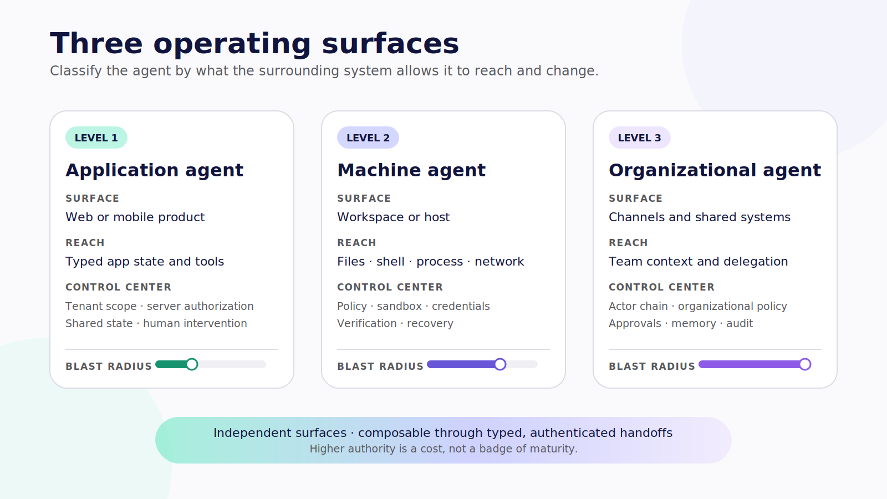

# The Builder's Guide to Agentic Applications

## 2026

### Applications. Machines. Organizations.

**Jerel Velarde**

---

## The promise of this book

By the end of this book, you will be able to design, build, and operate production-grade agentic applications across application, machine, and organizational environments. You will know which parts of the system deserve adaptive model judgment, where each tool should execute, what state must survive, where authority must be enforced, how people should intervene, and what evidence a team needs before it can safely ship.

The short version is simpler:

> Build production-grade agents for applications, machines, and organizations.

This is not a promise that one framework makes a system production-grade. It is a promise that you will learn how to inspect the whole system and make the engineering decisions yourself.

## Introduction — Open the hood

The first time you use a capable agent, the experience can feel complete. You state a goal. The model responds with a plan. Tools appear to run. A polished card arrives with an answer. From the driver's seat, the machine seems almost effortless.

Then you try to build one.

The first questions are familiar: Which model should we use? How do we define a tool? How do we stream the answer? Those questions matter, but they are the visible controls on the dashboard. The harder questions sit beneath them.

What happens when a tool succeeds but the connection drops before the interface receives the result? Which state belongs to the user interface, which belongs to the runtime, and which belongs in long-term memory? Who is allowed to approve a proposed action? Does closing the browser stop the work, or only stop the stream? Can a machine agent read outside the repository? If a request begins in Slack, whose authority follows it into a shell? When a retry occurs after an ambiguous timeout, how do you prevent the same payment, email, deployment, or database mutation from happening twice?

These are not edge questions. They are the product.

An agentic application is the complete system that surrounds one or more agent loops: interface, runtime, model, tools, skills, state, memory, policy, identity, evaluation, observability, and operations. Users do not experience those parts independently. They experience whether the system remains useful when work takes longer than expected, whether they can correct it before a consequential action, whether it remembers the right things, and whether it can explain what actually changed.

That is why this book begins with a distinction that will recur on nearly every page:

> The model may choose the next action. The application decides whether that action deserves to exist in the real world.

The practical shift is often described as moving from prompt and response to goal and autonomy. That description points in the right direction, but it leaves out the engineering work between those words. A useful goal-driven system needs a bounded execution loop:

```text
goal
  → decide
  → act
  → observe
  → update state
  → continue, pause, fail, or finish
```

Every arrow raises a design question. Who decides? Which actions exist? What observations are trusted? Where is state stored? What can pause the run? What counts as finished? A builder's job is to turn those questions into explicit components, contracts, and controls.

This book gives you that map.

## Three operating surfaces

We will study agentic applications across three levels:

1. **Level 1 — Application Agents.** Agents embedded in purpose-built web and mobile products, operating through application-scoped tools and state.
2. **Level 2 — Machine Agents.** Agents operating in a workstation, server, container, virtual machine, or dedicated machine through filesystems, shells, processes, browsers, CLIs, and configured services.
3. **Level 3 — Organizational Agents.** Shared agents acting in collaboration and work systems under explicit organizational identity, authority, policy, memory, and accountability.

These levels are not a maturity ladder. Level 3 is not automatically better than Level 1. They are operating surfaces with different authority and blast radius. A focused application agent with typed tools may be the strongest architecture for a financial workflow. A machine agent is justified when the outcome inherently requires files, commands, tests, or installed software. An organizational agent is justified when the system must act as a shared participant across people, channels, policies, and systems.

The right default is to choose the smallest authority surface that can produce the outcome. When levels compose, the task contract, requester identity, policy, provenance, and recovery expectations must survive every handoff.



*Figure 0.1 — The three operating surfaces are independent authority surfaces, not a maturity ladder.*

## The stack we will build with

CopilotKit is the canonical interaction layer in this book. We use it to build application-native task surfaces, register frontend capabilities, render semantic tool results, mediate human interaction, and connect agents to collaboration channels. [AG-UI](https://docs.ag-ui.com/concepts/events) provides the event vocabulary between a runtime and a user-facing application: run lifecycle, messages, tool calls, state, activity, and interruption.

LangChain supplies model, tool, and agent abstractions. LangGraph supplies explicit stateful orchestration when durable checkpoints, branching, interrupts, or long-running execution justify the added machinery. LangSmith supplies tracing and evaluation examples. These products fit together, but they do not replace one another. AG-UI is not a tool protocol. MCP is not a user-interface protocol. This edition references [MCP specification 2025-11-25](https://modelcontextprotocol.io/specification/2025-11-25); pin the implementation SDK separately. A runtime is not an authorization layer. A rendered approval is not an enforced policy.

The durable pattern comes first; the implementation follows.

> **Version note — Verified July 2026.** API names, package versions, product availability, and channel support in this edition are tied to the source pins and official documentation cited in the text. The companion examples were checked against CopilotKit React Core `1.62.3`, AG-UI `0.0.57`, Channels `0.1.1`, Channels Slack `0.1.2`, and LangGraph `1.2.9`. Recheck the edition matrix before copying code into a newer stack.

## The reference builds

The book uses real projects because architecture becomes clearer when the gaps are visible.

- For Level 1, the canonical mobile reference is the pinned [personal-finance-copilot](https://github.com/jerelvelarde/personal-finance-copilot/tree/d8760064c626712a8fa15c192a8c4bc69bb24055). It demonstrates a bare React Native application with frontend reads, inline native results, a receipt flow, and human-gated write proposals. The GTM Operations Workspace project supplies the web/PWA contrast and a bridge to a machine-agent backend.
- For Level 2, the pinned [hermes-cpk](https://github.com/jerelvelarde/hermes-cpk/tree/fc43491368f19248ca58e1409501cd28722d0f61) project exposes the seam between a CopilotKit interface and a Hermes machine agent. It is intentionally useful as an unsafe baseline: visibility exists, while identity, policy, isolation, approval, and recovery still need to be engineered.
- For Level 3, current package and code truth comes from CopilotKit's pinned [Channels packages](https://github.com/CopilotKit/CopilotKit/tree/855446e1abc8f29756dc5e539e5e50a90321ac2d/packages/channels) and Slack example. [OpenTag](https://github.com/CopilotKit/OpenTag/tree/df93bc0dccd0afc8eb7bb02206ffbe2ef7922322) supplies the open-source product case study. The book then adds the identity, approval, memory, audit, and delegation controls required for a governed organizational actor.

None of those pins is presented as a complete production system. That is deliberate. Our recurring teaching method is:

```text
working demo
  → boundary audit
  → hardening ladder
  → measured verification
  → production gate
```

You will learn as much from what the examples do not establish as from what their code already contains.

## How evidence works in this edition

Technical books age when they blur documentation, source code, and demonstrated behavior. This edition keeps them separate.

- **Documented** means a current primary document states the behavior.
- **Source-present** means the behavior or API can be traced to an immutable repository revision, but we do not claim it ran in the book's environment.
- **Runtime-verified** means the exact scenario ran with recorded versions, commands, fixtures, results, and capture metadata.
- **Early access** means a capability is beta, preview, waitlisted, internal, or otherwise availability-limited at the stated date.
- **Editorial synthesis** means the model or recommendation belongs to this book and is supported by the surrounding evidence.
- **Target architecture** means the control is proposed for the hardened companion but is not present in the audited source.

Reader-facing prose uses ordinary citations and plain qualifications rather than littering every paragraph with internal status codes. The distinction still matters. A committed screenshot is source evidence, not proof that a fresh install works. A component that renders a button is not proof that the correct person was authorized to click it. A trace that records a tool call is not the product's durable state or its immutable action ledger.

The original companion snippet suite is more concrete. Its deterministic TypeScript controls and LangGraph interrupt example pass their recorded tests. The CopilotKit hook and Channels examples compile against the pinned packages. Browser rendering, model-backed AG-UI runs, Slack connectivity, and external writes still require credentials and fresh capture runs. Every time that boundary matters, the chapter says so.

## How to use this book

If you are building your first application agent, read the four foundation chapters and then work through Level 1 in order. The personal ledger example will give you a bounded domain in which to practice tool placement, shared state, generative UI, human control, persistence, and production hardening.

If you already operate coding or machine agents, do not skip the interface chapters. A machine harness needs a control plane just as much as an application agent does. Then use Level 2 to map the working directory, tool policy, approval policy, operating-system sandbox, container or VM, and machine identity as separate boundaries.

If you are bringing agents into Slack, Teams, or Discord, begin with the foundations and then move to Level 3. The central questions are not merely how to receive a mention or render a button. They are who asked, which agent acted, which credentials were used, who could approve, what memory survived, and which audit record joins the channel request to the side effect.

Each chapter gives you:

- one central engineering decision;
- a durable mental model before the framework API;
- implementation or architecture examples;
- the knobs and tradeoffs you must choose;
- failure and security modes;
- an inspectable exercise;
- a production gate and Builder Checklist.

Do the exercises against one real use case. A completed authority map, state ownership table, policy test, or recovery drill is more valuable than another folder of prompts.

## What this book does not promise

This is not a beginner's guide to React, TypeScript, Python, HTTP, or cloud deployment. It does not offer a universal vendor ranking. It does not present a synthetic personal ledger as financial advice or regulated banking software. It does not treat a prompt as a security policy, a schema as authorization, a spinner as progress, a checkpoint as automatic undo, or a plausible final answer as proof of a safe trajectory.

It also does not promise access to hidden chain-of-thought. Good agentic interfaces expose operational evidence: the plan the system is following, the action it proposes, safe arguments, sources, state changes, approvals, results, and recovery options. That evidence is more useful to a builder and more honest to a user.

The goal is not to maximize autonomy. The goal is to make useful agency legible, bounded, testable, and operable.

## Contents

### Part I — Foundations

1. Three Surfaces of Agency
2. When Software Starts Choosing
3. Open the Hood
4. The Interface Is the Control Plane

### Part II — Level 1: Application Agents

5. Inside the Application Agent
6. Put the Tool in the Right Place
7. When the Result Is an Interface
8. One State, Two Editors
9. The Right Moment to Ask
10. Ship the Whole System

### Part III — Level 2: Machine Agents

11. The Machine Is the Environment
12. The Harness Is the Product
13. Draw the Blast Radius
14. Choose the Harness, Not the Logo
15. From Visibility to Supervision
16. Operate the Worker

### Part IV — Level 3: Organizational Agents

17. When the Agent Joins the Team
18. One Agent, Many Channels
19. Who Asked, Who Acts, Who Approves
20. Delegation Without Ambient Authority
21. Managed, Open, and In Between
22. Operate the Organizational Actor

### Part V — Production Engineering

23. Evaluate the Trajectory
24. Secure the Authority Surface
25. Reliability Has a Budget
26. Choose the Smallest Sufficient Level

---

# Part I — Foundations

The next four chapters establish the mental model for everything that follows. We begin by locating agency, then define when software is actually choosing, open the complete production stack, and finally turn that stack toward the person supervising it.

Do not rush this part. Framework APIs will change. These boundaries will remain.
