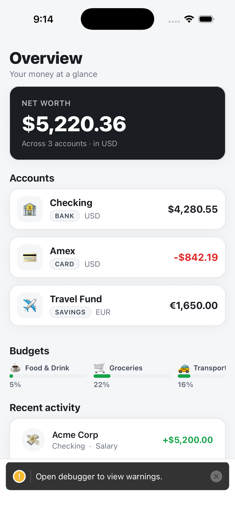
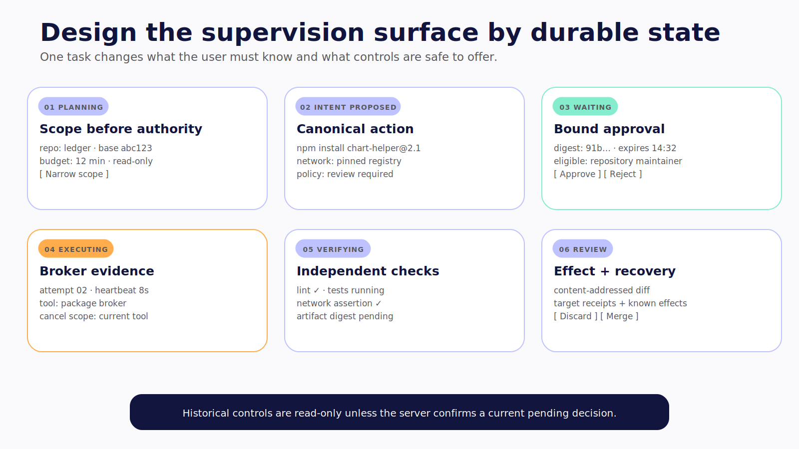
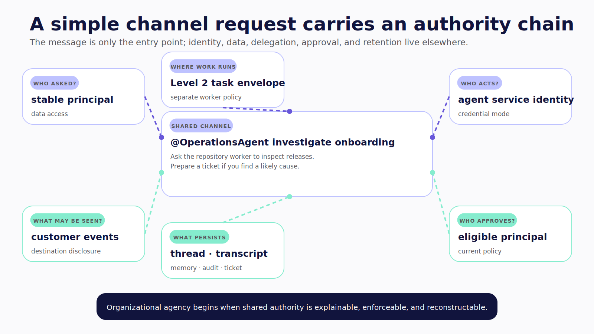
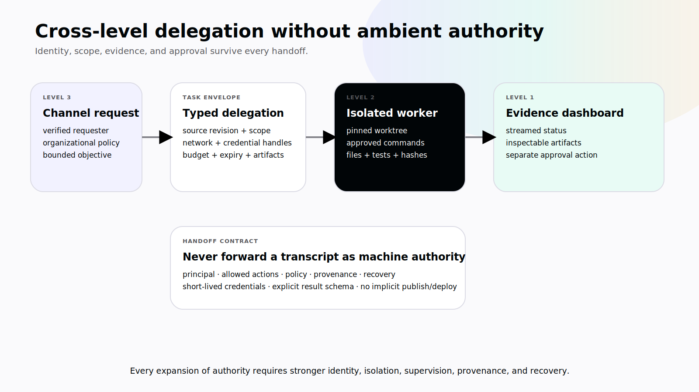

# Chapter 1 — Three Surfaces of Agency

Imagine the same request arriving in three places:

> Investigate why onboarding conversion dropped this week. Return the likely causes and recommend what we should do next.

Inside a product dashboard, the agent can read approved analytics, compare release markers, update a visible investigation plan, and render a report. Inside a repository workspace, the agent can inspect files, run commands, test recent commits, and produce a diff. Inside a shared Slack channel, the agent can receive requests from several people, use team systems, delegate work, ask an authorized reviewer for approval, and report the result back to the group.

The goal barely changes. The system around it changes completely.

In the dashboard, the main authority surface is a set of application objects and APIs. In the repository, the surface expands to files, processes, network access, installed tools, and credentials. In Slack, the agent becomes a shared actor. The design must preserve who asked, which service identity acted, what policy applied, who approved, and who owns the outcome.

If you classify those three systems by how fluent the model sounds, they may look identical. If you classify them by what they can reach and change, their engineering differences become obvious.

That is the purpose of the three-level model.

> **Reader outcome:** By the end of this chapter, you will be able to classify an agentic system by operating surface, authority, and blast radius, identify when levels compose, and choose the smallest sufficient level for a use case.

## Levels are surfaces, not a scoreboard

The word _level_ can imply a ladder: start at Level 1, graduate to Level 2, and eventually arrive at Level 3. That is not how this book uses it.

The levels name three independent operating surfaces:

- **Level 1 — Application Agents** operate inside a purpose-built web or mobile product through application-scoped state and tools.
- **Level 2 — Machine Agents** operate inside a workstation, server, container, virtual machine, or dedicated machine through filesystem, shell, process, browser, CLI, network, and configured tool access.
- **Level 3 — Organizational Agents** operate in shared collaboration and work systems under an organizational identity, policy, memory, and accountability model.

A product may remain Level 1 for its entire life and be exactly right. A Level 2 worker may have enormous technical reach but no reason to appear in a shared channel. A Level 3 agent may delegate one narrow task to a Level 2 worker while keeping the rest of its work inside typed application APIs.

The useful question is not, “How do we move up?” It is:

> Where must the agent operate, and what is the least authority it needs to produce the outcome?


*Figure 1.1 — Application, machine, and organizational agents expand different authority surfaces; none is an automatic upgrade from another.*

## The classification test

Use three variables before you look at frameworks or models.

### 1. Operating surface

Where does the work begin, remain visible, and receive human input?

For a Level 1 agent, that surface is the product: a financial ledger, a CRM, a document editor, a mobile trip planner, or an internal operations console. The agent should operate through capabilities that belong to that product.

For a Level 2 agent, the machine is part of the environment. The working directory may provide context and route relative paths, but it is not confinement. First-party machine-agent documentation consistently separates workspace context, tool policy, approval policy, and operating-system isolation. A process that runs as the same user may reach beyond the directory unless a lower boundary prevents it. The [Claude Code sandbox documentation](https://code.claude.com/docs/en/sandboxing), [Hermes security documentation](https://github.com/NousResearch/hermes-agent/blob/5d410355ac2ca49241edcbb20f2b37e1b725ca91/website/docs/user-guide/security.md), and [OpenClaw's sandbox-versus-policy guide](https://github.com/openclaw/openclaw/blob/2372c71697113eed6247af9bdb7f58d684844251/docs/gateway/sandbox-vs-tool-policy-vs-elevated.md) each make versions of that distinction.

For a Level 3 agent, the surface is social and shared: a Slack thread, a Teams channel, a Discord server, a ticket queue, or an organizational workflow. The channel supplies context and interaction. It does not supply business authorization.

### 2. Authority

What can the system read, propose, change, or delegate?

An application agent may read a user's synthetic ledger and propose a transaction through a typed API. A machine agent may edit source files and execute tests. An organizational agent may create a ticket under a service identity, retrieve team documents, or delegate repository analysis to a sandboxed worker.

Authority is not identical to the list of tools shown to the model. A schema tells the runtime how arguments should look. It does not authenticate the requester. A permission prompt records a decision. It does not confine an already approved process. A platform scope allows an integration to call an API. It does not prove that a particular person is entitled to a particular record.

Write authority as a sentence with a subject, action, and object:

```text
The authenticated ledger user may propose a transaction
against accounts in the user's tenant.

The repository worker may edit files under the assigned worktree
and run commands from the approved command set.

The product-operations agent may create a ticket in this workspace
after an eligible approver accepts the exact proposal.
```

If you cannot write the sentence precisely, the boundary is not ready.

### 3. Blast radius

What is the maximum credible harm if the agent, a tool, an input, or an operator is wrong?

At Level 1, the dominant risks are usually incorrect application actions, cross-user data leakage, stale shared state, and broken business invariants. At Level 2, the same model can encounter malicious repository instructions, exfiltrate credentials, overwrite files, install an unsafe dependency, or change infrastructure. At Level 3, a confused-deputy failure can combine shared service authority with requests from people who have different rights.

Blast radius includes recovery. A bad UI state update may be easy to reverse. An email already sent, a deployment already accepted, or a secret already exposed requires a different response. The presence of an “Undo” button says nothing about whether the domain provides compensation.

## A builder's comparison

| Dimension          | Level 1 — Application                                  | Level 2 — Machine                                     | Level 3 — Organization                                  |
| ------------------ | ------------------------------------------------------ | ----------------------------------------------------- | ------------------------------------------------------- |
| Primary surface    | Web, mobile, or product UI                             | CLI, IDE, workstation, container, VM                  | Slack, Teams, Discord, shared work systems              |
| Default context    | Current user, document, page, account, typed app state | Files, processes, shell, installed tools, environment | Tenant, workspace, channel, thread, requester, policy   |
| Typical tools      | Product APIs and application actions                   | Filesystem, shell, browser, CLIs, MCP, network        | Organizational APIs, channel actions, delegated workers |
| Default identities | End user and application service                       | Operator and machine worker                           | Requester, agent principal, delegate, approver          |
| Dominant control   | State ownership and server authorization               | Tool policy, approval, OS isolation, credentials      | Identity, policy, delegation, memory governance, audit  |
| Dominant failure   | Wrong app mutation or cross-tenant state               | Machine compromise or unsafe external action          | Confused deputy or organizational misuse                |
| CopilotKit role    | Native interaction and task surface                    | Supervision and evidence interface                    | Channel-neutral interaction layer                       |
| Runtime role       | Bounded loop or durable application graph              | Machine harness and worker lifecycle                  | Governed orchestration and delegation                   |

This table is a classification aid, not a vendor feature matrix. A specific architecture can be weak or strong at any level.

## The canonical examples

The book will return to one primary example at each surface.

### Level 1: a personal ledger on web and mobile

The pinned [personal-finance-copilot](https://github.com/jerelvelarde/personal-finance-copilot/tree/d8760064c626712a8fa15c192a8c4bc69bb24055) source gives us a useful mobile starting point. At that revision, the bare React Native application contains five frontend read-tool registrations, four human-gated write proposals, native result UI, and a receipt flow. It does not establish production authentication, tenant isolation, durable LangGraph state, or financial-system controls. Those gaps become the hardening work rather than footnotes we hide. **Verified July 2026.**

The pinned GTM Operations Workspace source provides the web/PWA contrast and a backend-selection seam. It also previews how a Level 1 control plane can display work performed by a Level 2 machine agent.

### Level 2: Hermes behind a CopilotKit control plane

The pinned [hermes-cpk](https://github.com/jerelvelarde/hermes-cpk/tree/fc43491368f19248ca58e1409501cd28722d0f61) source makes machine activity visible through CopilotKit and AG-UI. That visibility is valuable. It is not yet authorization or containment. The separately required Hermes runtime, broad execution posture, and absent production identity, policy, sandbox, and recovery controls make the project a compelling unsafe baseline for the hardening ladder in Part III. **Verified July 2026.**

### Level 3: Channels and OpenTag

The pinned CopilotKit source contains the current `@copilotkit/channels*` package family, including channel-neutral runtime and UI packages plus Slack, Discord, and Teams adapters. The source-present package map is visible at the pinned [Channels revision](https://github.com/CopilotKit/CopilotKit/tree/855446e1abc8f29756dc5e539e5e50a90321ac2d/packages/channels). [OpenTag](https://github.com/CopilotKit/OpenTag/tree/df93bc0dccd0afc8eb7bb02206ffbe2ef7922322) supplies a compact self-hosted case study with rich channel interactions and MCP-connected tools.

Neither a sender-context string nor a confirmation component is enough to create a governed organizational actor. We will add trusted identity mapping, tool-bound authorization, approver binding, durable state, institutional-memory governance, audit, and narrow machine delegation.

> **Version note — Verified July 2026.** These repository observations are tied to the immutable commits linked above. They are source-present findings, not claims that every scenario was rerun in the book environment.



*Figure 1.2a — Repository-provided application reference. Publication still requires rights, privacy, and provenance clearance; this frame is reference evidence rather than newly reproduced proof.*



*Figure 1.2b — Source-faithful machine supervision schematic; it explains states rather than claiming a live Hermes run.* **Verified July 2026.**



*Figure 1.2c — Source-faithful organizational-request schematic showing the identity and authority chain behind a channel message.*

## When the levels compose

The most interesting systems often cross surfaces. Consider the onboarding investigation from the opening:

```text
Slack request
  → organizational policy resolves requester and allowed scope
  → Level 3 agent creates a bounded repository-analysis task
  → isolated Level 2 worker inspects a pinned worktree and runs tests
  → worker returns files, commands, test results, hashes, and unresolved risks
  → Level 1 dashboard streams status and renders the artifacts
  → an eligible reviewer approves a separate ticket or deployment action
```



*Figure 1.3 — Cross-level delegation preserves identity, scope, evidence, and approval instead of forwarding ambient authority.*

The arrows are where systems lose accountability. A channel transcript should not become the machine worker's unconstrained prompt. The organization agent should send a structured task envelope: objective, acceptance criteria, source revision, path and command scope, network policy, budgets, credential handles, expiry, and return-artifact requirements.

The worker should return evidence, not only prose: files inspected, files changed, commands and exit statuses, test results, network calls, policy exceptions, and artifact hashes. A separate decision should govern publication, merge, deploy, or external communication.

This yields a rule we will reuse throughout the book:

> Every expansion of authority requires stronger identity, isolation, supervision, provenance, and recovery.

## Decision knobs

Before choosing a level, write down these knobs:

| Knob          | Question                                                                  |
| ------------- | ------------------------------------------------------------------------- |
| Outcome       | What must be true in the world when the task finishes?                    |
| Surface       | Where does the user initiate, inspect, correct, and recover work?         |
| Resources     | Which application objects, files, systems, and channels are reachable?    |
| Identity      | Who requests, which principal acts, and who can approve?                  |
| Side effects  | Which actions are read-only, reversible, consequential, or external?      |
| Isolation     | What boundary limits a compromised run?                                   |
| Human control | Where must the system pause, and what exact proposal is reviewed?         |
| State         | What must persist across steps, refreshes, retries, and handoffs?         |
| Evidence      | Which artifacts prove the task and each side effect completed correctly?  |
| Recovery      | Can work stop, resume, compensate, or require manual reconciliation?      |
| Operations    | Who owns deployment, spend, alerts, incidents, retention, and retirement? |

Do not start with “Which agent framework should we use?” Start with “Which authority surface are we willing to operate?”

## Failure modes: two easy classification errors

### Error 1: calling a chat layout an application agent

A conversational interface might front one model call, a fixed workflow, or a real agent loop. The UI alone does not tell you. If application code always chooses the route and the model only produces text, you may have a valuable model-powered feature, but you do not yet have adaptive execution.

The cost of misclassification is not embarrassment. Teams add memory, permissions, and approval components to a system without first identifying which decisions are actually adaptive. They end up with ceremony around a workflow instead of control around an agent.

### Error 2: calling a Slack bot an organizational agent

A bot can receive an event and post a response. A channel agent can also plan and call tools. A governed organizational actor must preserve a service identity, requester and approver identities, enforceable policy, institutional-memory rules, and a cross-system action record.

The CopilotKit Channels source provides important application primitives such as identity correlation, state, transcripts, locks, deduplication, queues, and semantic UI. Those primitives do not decide whether a particular Slack user may access a customer record or approve a consequential action. Authorization still belongs at a trusted tool boundary.

## Exercise — Draw an authority map

Choose one agent product you use or want to build. Write a one-page map with these fields:

```text
Goal:
Primary operating surface:
Smallest sufficient level:
Default context:
Reachable resources:
Requesting principal:
Acting principal:
Eligible approver:
Read-only actions:
Consequential side effects:
Isolation boundary:
Stop and recovery semantics:
Evidence returned to the user:
Cross-level handoffs, if any:
```

Now remove one source of authority. Can a typed application API replace shell access? Can a narrow delegated worker replace a persistent machine identity? Can a dashboard replace a shared channel without losing the product outcome?

The inspectable result is a decision record that names the chosen level and rejects at least one broader alternative.

## Builder Checklist

- [ ] The operating surface is explicit.
- [ ] The smallest sufficient level is justified by the required outcome.
- [ ] Requester, agent, delegate, and approver identities are named where relevant.
- [ ] Reachable resources and side effects are mapped.
- [ ] Tool policy is not confused with process isolation.
- [ ] Platform scopes are not confused with application authorization.
- [ ] Cross-level handoffs use a narrow task contract.
- [ ] Policy and provenance survive every handoff.
- [ ] Recovery matches the actual side effects.
- [ ] A broader level is not treated as a maturity badge.

## Bridge

We now know where an agent operates. We still need to know whether the software is acting as an agent at all.

The next chapter looks behind four interfaces that appear almost identical and asks which parts of their execution path are fixed, which parts are adaptive, and which decisions should never have been delegated to a model.
