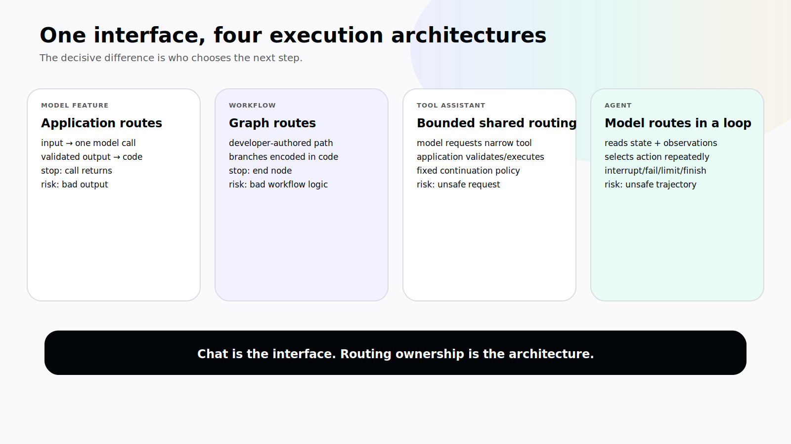
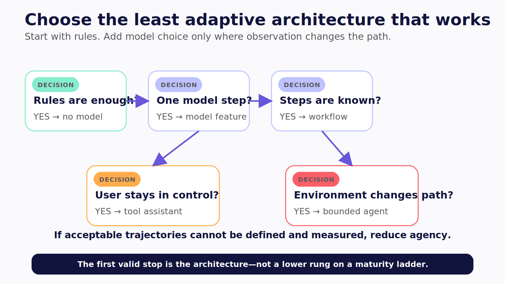

# Chapter 2 — When Software Starts Choosing

Four products place the same chat box beneath the same prompt:

> Find the cause of this failed order and fix it if the correction is safe.

The first sends the message to a model and prints its answer. The second runs a fixed sequence: fetch the order, summarize the error, generate a reply. The third lets the model request one of three tools, but application code decides which requests can run and whether another model call follows. The fourth lets a model select actions from the current state, observe results, revise its route, request help, or stop inside a bounded runtime loop.

From the user's seat, all four can look like chat. Under the hood, only one gives the model meaningful control over the execution path.

This distinction matters because every adaptive decision introduces variance. Variance can create value when the path cannot be known in advance. It also adds latency, cost, evaluation work, security exposure, and failure modes. If we call every model-powered interface an agent, we cannot tell which controls the system actually needs.

> **Reader outcome:** By the end of this chapter, you will be able to distinguish a model-powered feature, workflow, tool-using assistant, and agent, then decide which choices deserve adaptive model judgment.

## Chat is an interface, not an architecture

A chat surface says how a person communicates with software. It says nothing about how the software executes.

A chatbot can front:

- one model call;
- a retrieval pipeline;
- a deterministic workflow;
- an agent loop;
- a human support queue;
- or a combination of them.

Likewise, an agent does not require chat. It may operate through an editor, a dashboard, a command line, a mobile task screen, a pull-request review, or a channel thread.

The architecture becomes visible only when you trace who controls routing.

## Four execution models

### Model-powered feature

Application code invokes a model for a bounded task such as extraction, classification, summarization, structured generation, or ranking. The application decides when the call happens and what follows.

```text
application input → model call → validated output → application code
```

This can be the right architecture. A model that categorizes transaction text does not need permission to choose a database tool, retry indefinitely, or alter the ledger. The model contributes interpretation; ordinary code owns execution.

LangChain's current [model interface documentation](https://docs.langchain.com/oss/python/langchain/models) separates model invocation and tool-call output from the agent abstraction that supplies a continuing model–tool loop. That boundary is easy to miss when a provider can emit tool-call-shaped output in one request. **Verified July 2026.**

### Workflow

A workflow has a developer-authored path or graph. Nodes may call models, and branches may depend on state, but the permitted route is encoded by the application.

```text
input → validate → retrieve → classify → branch → produce artifact
```

“Predetermined” does not mean there is only one straight line. A graph can have conditions, retries, parallel branches, and human review while remaining a workflow. The important point is that the developer defines the routing rules.

The current [LangGraph workflow and agent guide](https://docs.langchain.com/oss/python/langgraph/workflows-agents) uses this distinction: workflows follow predetermined code paths, while agents dynamically determine their process and tool use. **Verified July 2026.**

### Tool-using assistant

A model can request a typed tool while the surrounding application retains a fixed execution policy. For example, the model may choose `searchOrders` or `lookupShipment`, but application code executes at most one read tool and then always produces a final response.

```text
model → requested tool → application validates and executes → final model call
```

This design has limited adaptive choice, but it may not have a general agent loop. Tool calling alone does not prove autonomy. It proves that the model can produce a structured action request.

### Agent

An agent runs when a model can choose the next action from current state and observations, within a harness that defines tools, policy, budgets, interruption, and termination.

```text
goal
  → read state
  → select response or action
  → evaluate policy
  → execute or pause
  → observe result
  → update state
  → continue, fail, or finish
```

LangChain's current [agent documentation](https://docs.langchain.com/oss/python/langchain/agents) describes an agent as a system that combines a model with tools in a loop and continues until a stopping condition is met. The definition is useful, but the production question begins one layer deeper: which choices are assigned to the model, and which remain enforced by code? **Verified July 2026.**



*Figure 2.1 — The interface can look identical while routing ownership, state, stop conditions, and risk change completely.*

## The decisive variable: who chooses the next step?

Use this table to classify a system.

| Dimension       | Model feature         | Workflow                  | Tool-using assistant                  | Agent                                    |
| --------------- | --------------------- | ------------------------- | ------------------------------------- | ---------------------------------------- |
| Primary routing | Application           | Application graph         | Shared, usually bounded               | Model inside runtime constraints         |
| Tool choice     | None or app-selected  | Encoded by workflow       | Model may request from a narrow set   | Model selects as state changes           |
| State           | Call input/output     | Workflow state            | Conversation plus bounded tool result | Task state updated across observations   |
| Adaptation      | None inside call      | Pre-authored branches     | Limited                               | Repeated action selection                |
| Stop condition  | Return from call      | End node                  | Application policy                    | Completion, interrupt, failure, or limit |
| Main evaluation | Output quality/schema | Node and path correctness | Tool request plus result              | Outcome and full trajectory              |
| Main risk       | Bad output            | Bad workflow logic        | Unsafe request or execution           | Runaway or policy-breaking path          |

An agent begins where the execution path stops being fully known in advance and where controls therefore need to become explicit.

That does not mean the model should choose everything.

## Deterministic code belongs inside agentic systems

Suppose a refund policy says orders above $500 require a senior reviewer. That is not an invitation to write, “Use good judgment for large refunds” in the agent prompt. It is a business invariant with a deterministic enforcement point.

The rule can remain ordinary code even if an agent decides which evidence to collect:

```ts
type RefundRoute = "automatic" | "review";

export function refundRoute(amountCents: number): RefundRoute {
  if (!Number.isInteger(amountCents) || amountCents <= 0) {
    throw new Error("amount must be a positive integer");
  }
  return amountCents > 50_000 ? "review" : "automatic";
}
```

**Status:** Illustrative deterministic code, not a framework API. The point is ownership: the model may collect context or propose a refund, while code owns the threshold.

The same principle applies to tenant boundaries, allowed file paths, command policy, required approvals, rate limits, retention, and idempotency. The model can select an intended action. It cannot grant itself authority.

Start with one agent and deterministic tools. Add another agent only when there is a real boundary in context, capability, security, ownership, execution environment, or evaluation. Five workflow steps do not require five agents.

## Decide where adaptation earns its cost

Adaptive judgment is valuable when:

- the order of operations depends on observations that cannot be enumerated reasonably;
- tool selection changes as new evidence arrives;
- the system must recover by choosing an alternate route;
- the user states a goal rather than a complete procedure;
- interpretation is central and bounded errors are acceptable;
- the environment provides feedback that should change the plan.

Prefer a workflow or ordinary application code when:

- the path and inputs are known;
- correctness must be exact and rules can express it;
- the model would choose among a tiny, stable set of steps;
- the user needs a form, query, filter, or report rather than delegation;
- a wrong action cannot be bounded, reviewed, or recovered;
- the team cannot define acceptable trajectories;
- the latency and cost variance add no user value.

An LLM can still contribute at one narrow node. A workflow that uses a model to extract fields remains a workflow. This is not a downgrade. It is often better product engineering.



*Figure 2.2 — Stop at the first architecture that can create the outcome; “use no model” is a valid production decision.*

## Bound the loop before you run it

The moment software can choose another step, you need a termination contract.

At minimum, define:

1. **Goal condition.** What observable state means the user's objective is satisfied?
2. **Failure condition.** Which errors end the run, and which may be corrected or retried?
3. **Human condition.** Which ambiguity or risk causes an interrupt rather than another autonomous step?
4. **Step limit.** How many model or action cycles are allowed?
5. **Time limit.** What is the run deadline, not merely one HTTP timeout?
6. **Cost limit.** What token, model-call, tool-call, and monetary budget is enforced?
7. **Tool policy.** Which capabilities are available in each phase?
8. **Cancellation contract.** What does a stop request prevent, and what may already have happened?

A step limit is a containment mechanism, not a success state. If the runtime reaches ten steps without satisfying the goal, the interface should say that the limit was reached, preserve useful artifacts, and offer a safe next action. It should not convert exhaustion into “Done.”

The CopilotKit `BuiltInAgent` source and configuration surface include bounded loop controls such as `maxSteps`, while LangGraph adds explicit graph routing and recursion limits. Use the control that matches the runtime, then test the terminal behavior. See the pinned [`BuiltInAgent` implementation](https://github.com/CopilotKit/CopilotKit/blob/855446e1abc8f29756dc5e539e5e50a90321ac2d/packages/runtime/src/agent/index.ts) and [CopilotKit advanced configuration](https://docs.copilotkit.ai/advanced-configuration).

> **Version note — Verified July 2026.** Runtime option names are version-sensitive. Treat the cited CopilotKit commit and current LangChain/LangGraph documentation as the evidence set for this edition, not as a permanent API promise.

## Observe actions without inventing thoughts

An execution loop must be observable, but observability does not require hidden chain-of-thought.

Record and expose the operational facts a user or engineer needs:

- the run and stable task identifier;
- the current stage;
- the tool the runtime proposes;
- safe-to-display arguments;
- the policy decision;
- the tool result or external receipt;
- state changes;
- sources and assumptions;
- the reason for waiting, retrying, or stopping;
- the remaining budget;
- recovery options.

AG-UI defines lifecycle, step, message, tool, state, and activity event families for this kind of interaction. Its [event documentation](https://docs.ag-ui.com/concepts/events) should be read as an observable protocol contract, not a promise that a UI can or should expose private model reasoning.

## Failure modes

### Infinite or wasteful loops

The model repeatedly searches, rewrites, or calls the same tool because the goal is vague or observations do not change state. Bound steps, detect repeated actions, require progress signals, and let the runtime fail clearly.

### Fake completion at a limit

The runtime exhausts its budget and the interface renders the last message as a successful result. Separate `complete`, `limited`, `partial`, and `failed` terminal outcomes.

### Write tools appear too early

The agent can select a mutation before it has collected evidence or received approval. Use phase-specific tool sets: read and plan first, then expose a narrowly scoped write path after policy and human conditions are satisfied.

### Business rules live only in prompts

The prompt says “never refund more than $500 without approval,” but the tool accepts any valid amount. Move the invariant to a trusted policy or tool boundary and test valid-shape, unauthorized cases.

### Model fallback changes the safety contract

A provider failure silently routes to another model with different tool behavior, data policy, or quality. Treat fallback as an evaluated configuration with explicit eligibility, not as an unconditional catch block.

## Exercise — Remove unnecessary agency

Choose a five-step AI workflow you know. Draw the current route, then label each decision:

- **D** for deterministic;
- **A** for genuinely adaptive;
- **H** for human judgment;
- **P** for enforced policy.

For every adaptive decision, write the observation that can change the next action. If you cannot name one, replace that decision with code or a workflow edge.

For the remaining agent loop, define:

```text
goal condition:
available tools by phase:
step limit:
deadline:
cost budget:
interrupt condition:
failure condition:
terminal outcomes shown to the user:
```

The inspectable result is a smaller agent surface and an explicit stop contract.

## Builder Checklist

- [ ] Chat is not being used as proof of agent architecture.
- [ ] The model-powered, workflow, assistant, and agent boundaries are named.
- [ ] Every adaptive decision has a specific reason to remain adaptive.
- [ ] Deterministic invariants live in code or policy, not prompt prose.
- [ ] The tool set is phase-specific and least-privileged.
- [ ] Goal, failure, interrupt, and terminal conditions are explicit.
- [ ] Step, time, tool, and cost budgets are enforced.
- [ ] Reaching a limit is not reported as success.
- [ ] Evaluation covers the path, not only the final text.
- [ ] Another agent is added only for a real boundary.

## Bridge

Once you can identify the loop, it is tempting to treat the loop as the whole product. It is not.

Chapter 3 opens the rest of the machine: runtime, tools, state, memory, identity, policy, interface, protocols, evaluation, observability, and operations. That is where a clever demo becomes a system a team can actually own.
