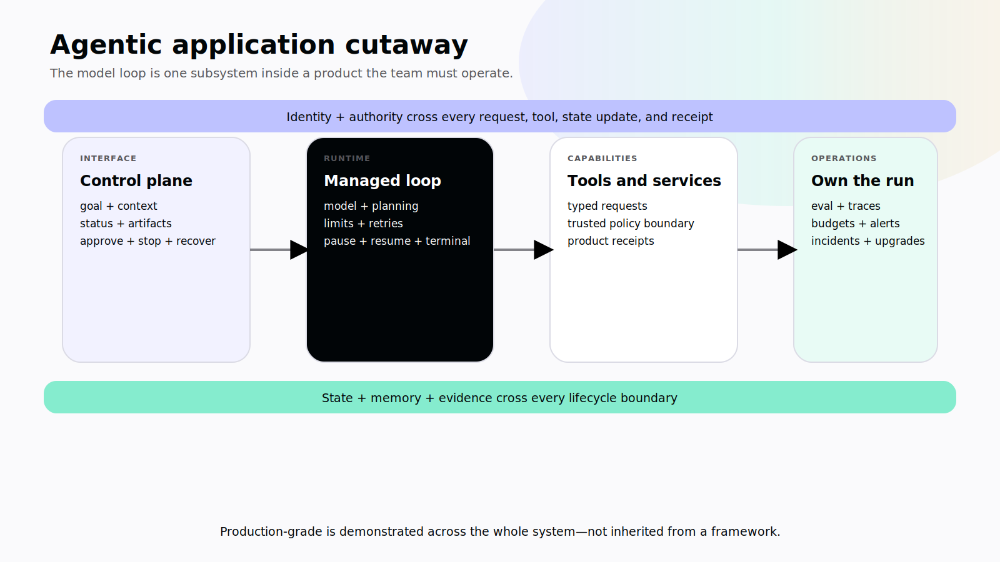
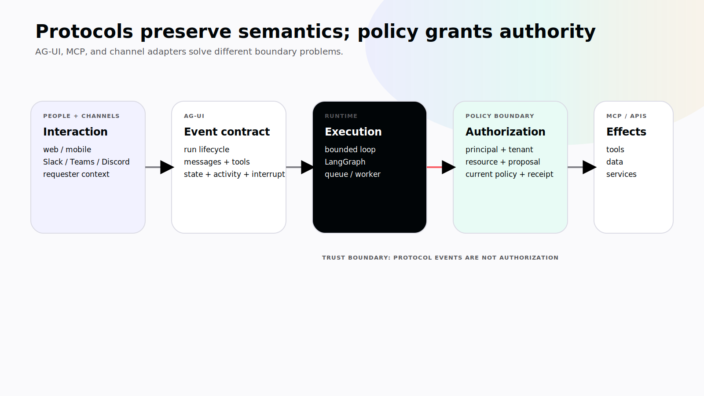
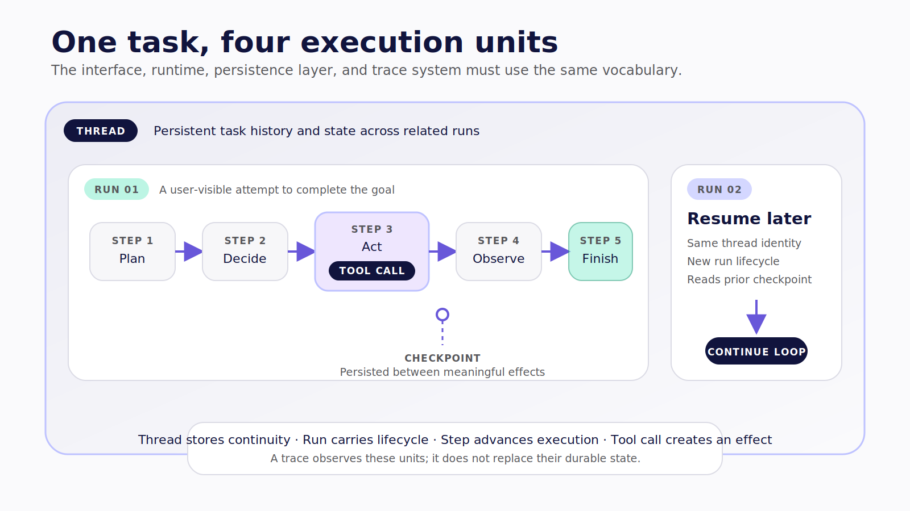

# Chapter 3 — Open the Hood

The demo looked ready.

The model called the right tool. The interface streamed a polished answer. The team refreshed the page, watched the same flow work again, and started planning the launch.

Then the failure sequence began.

A user refreshed during a write and the application submitted it twice. A second user guessed a thread identifier and saw state that did not belong to them. A tool timed out after the target system accepted the action, so the runtime marked the step failed and retried. The interface showed “Done,” but no product-system receipt existed. When the team opened its traces, it found a beautiful record of model and tool activity with no reliable connection to the application's acting user, durable state, or external outcome.

The model had worked. The application had not.

This is the moment most builders discover that an agent loop is one component inside a much larger product system. The loop can select an action. It cannot, by itself, authenticate a person, scope a tenant, persist a thread, prevent duplicate writes, reconcile an ambiguous outcome, render a recovery path, or wake an on-call engineer.

> **Reader outcome:** By the end of this chapter, you will be able to identify the major subsystems behind an agentic application, assign each responsibility to an owner, and draw the trusted boundaries where authority is actually enforced.

## The model is not the product

An agentic application has at least eleven engineering concerns. Some are boxes. Others cut through every box.

| Concern                | Builder question                                                                | Failure if omitted                                                        |
| ---------------------- | ------------------------------------------------------------------------------- | ------------------------------------------------------------------------- |
| Model                  | Which model and configuration fit the task, data policy, latency, and fallback? | Behavior changes silently with provider or model drift.                   |
| Runtime and harness    | Who owns the loop, limits, retries, pause, resume, and lifecycle?               | A request drop destroys work or an unbounded loop keeps spending.         |
| Tools and skills       | What capabilities and procedures exist, and where do they execute?              | Secrets leak, unsafe actions compose, or skills expand supply-chain risk. |
| State and memory       | What is true now, what persists, and who may change or retrieve it?             | UI and runtime maintain incompatible realities.                           |
| Policy and planning    | What may be chosen, and what is enforced outside the model?                     | Prompt guidance is mistaken for a permission boundary.                    |
| Identity and authority | Which principal acts for which user, tenant, workspace, or organization?        | The system becomes a confused deputy.                                     |
| Interface              | What can a person see, edit, approve, stop, resume, or recover?                 | Work hides behind a spinner and errors become duplicate requests.         |
| Protocols              | How do runtimes, interfaces, tools, and channels exchange typed events?         | Integrations depend on one-off message parsing and lose semantics.        |
| Evaluation             | What outcome and trajectory count as correct?                                   | Plausible prose hides wrong tools, arguments, or policy violations.       |
| Observability          | Which traces, metrics, logs, and correlations diagnose behavior safely?         | Failures cannot be explained, or sensitive context leaks into telemetry.  |
| Operations             | Who owns deployment, budgets, incidents, retention, upgrades, and retirement?   | The demo has no sustainable operating model.                              |

“Production-grade” describes demonstrated behavior across this whole system. It is not a property inherited from a framework choice.



*Figure 3.1 — The agent loop is one subsystem inside a product whose identity, state, consequences, evidence, and operations must all be owned.*

## The runtime owns execution; the application owns consequence

The runtime or harness turns a goal into a managed run. It assembles context, invokes a model, receives a proposed response or tool call, evaluates the next step, emits events, applies limits, and either continues or reaches a terminal condition.

For a narrow Level 1 application, CopilotKit's `BuiltInAgent` can supply an in-process model–tool loop and AG-UI integration. The pinned implementation exposes bounded configuration such as step limits; it should not be described as durable merely because the class exists. See the source-present [`BuiltInAgent`](https://github.com/CopilotKit/CopilotKit/blob/855446e1abc8f29756dc5e539e5e50a90321ac2d/packages/runtime/src/agent/index.ts).

When the task requires an explicit state machine, long-running branches, checkpoints, or runtime-enforced human interrupts, LangGraph becomes a stronger fit. With a configured checkpointer, LangGraph persists state at graph super-steps under a thread identifier; its [persistence documentation](https://docs.langchain.com/oss/python/langgraph/persistence) describes how those checkpoints support inspection, intervention, time travel, and fault-tolerant recovery. **Verified July 2026.**

The choice is not “simple framework versus advanced framework.” It is an execution-topology decision:

- Use a bounded loop when the task is narrow, short-lived, and recoverable through ordinary application controls.
- Use a durable graph when explicit state transitions, interruption, rejoin, branching, or recoverable long-running work are part of the product contract.
- Use a queue and worker boundary when work must outlive the web process, scale independently, or run in an isolated environment.

None of those runtimes authorizes a business action simply by invoking it. The application or trusted tool service must still verify the principal, tenant, resource, invariants, approval, idempotency key, and current policy.

## Tools are capabilities, not methods with good names

A tool is a typed capability through which the runtime reads, computes, or changes something. Its name and schema help a model request it correctly. Its placement and enforcement determine its authority.

Consider four tools that all sound harmless:

- `showCurrentFilters` reads client-local view state;
- `searchTransactions` queries protected data through a server;
- `createTransaction` performs a domain write;
- `analyzeRepository` dispatches work to an isolated machine worker.

They should not share the same credentials, lifecycle, retry behavior, or approval policy.

A frontend tool can read the current selection or open a local editor. It cannot safely store a service secret or become the sole authority for an important write. A backend tool can derive the user and tenant from authenticated context, enforce business rules, and return a durable receipt. An external worker needs a signed job, narrow credentials, async status, deduplication, isolation, and artifact provenance.

The companion's `L1-BOUNDARY` excerpt makes one enforcement choice concrete. The client may propose the mutation, but only an authenticated server context supplies tenant identity and the write port:

```ts
export async function executeLedgerWrite(
  context: AuthenticatedRequestContext,
  input: Omit<CreateTransactionInput, "tenantId" | "idempotencyKey">,
  risk: ToolRiskMetadata,
  port: LedgerWritePort,
): Promise<TransactionReceipt> {
  if (risk.effect !== "write" || risk.approval !== "always") {
    throw new Error("ledger mutation must use an approval-gated write policy");
  }
  if (input.proposalVersion !== context.approvedProposalVersion) {
    throw new Error("approval does not match the current proposal version");
  }
  return port.createTransaction(
    {
      ...input,
      tenantId: context.tenantId,
      idempotencyKey: context.idempotencyKey,
    },
    context.principalId,
  );
}
```

**Snippet `L1-BOUNDARY`:** Original book code in `companion/src/level-1/runtime-boundary.ts`. Verified July 15, 2026 through formatting, lint, strict companion typecheck, and build gates. It is **compile-verified**, not a claim that a real financial service was called.

The important line is not a framework hook. It is the boundary: the model and client do not get to choose `tenantId` or invent the acting principal.

## State is what the system believes; memory is what it carries forward

State and memory are often collapsed into “chat history.” That makes recovery, privacy, and ownership nearly impossible to reason about.

Use a more precise taxonomy:

| Kind                 | Example                                     | Typical lifetime           | Owner question                                            |
| -------------------- | ------------------------------------------- | -------------------------- | --------------------------------------------------------- |
| View state           | Open panel, selected date range             | Component or session       | Does the agent need it at all?                            |
| Task state           | Phase, active tool, current proposal        | One run                    | Who may update each field?                                |
| Thread state         | Accepted plan, messages, artifacts          | Related runs               | Who may rejoin, export, or delete it?                     |
| Long-term memory     | Currency preference, saved rule             | Across a user's threads    | What is its source, confidence, TTL, and correction path? |
| Institutional memory | Approved policy or glossary                 | Across organizational work | Who promotes, reviews, scopes, and retires it?            |
| Telemetry            | Spans, latency, errors, model/tool metadata | Operational retention      | What must be redacted, sampled, and access-controlled?    |

AG-UI supports state snapshots and deltas as part of its event model, while LangGraph checkpointers provide thread-scoped execution state and stores can provide cross-thread memory. Those are different contracts. [AG-UI events](https://docs.ag-ui.com/sdk/js/core/events) describe transport semantics; [LangGraph persistence](https://docs.langchain.com/oss/javascript/langgraph/persistence) describes runtime persistence semantics. Your product database remains the source of truth for product records. **Verified July 2026.**

Every state field needs an owner: user, runtime, backend, jointly edited, or derived. Every jointly edited object needs a conflict strategy. Every memory needs provenance, scope, retention, and correction. Every trace needs a privacy policy.

## Policy lives at an enforcement point

Prompts can guide a model. They cannot create a trusted boundary.

An effective control is complete only when you can state four things:

```text
intent → enforcement point → evidence → failure behavior
```

For example:

```text
Intent: Only the current tenant may create this transaction.
Enforcement point: Authenticated ledger service before the write.
Evidence: Authorization decision plus product-system receipt.
Failure behavior: Deny without mutation; show a scoped error; record the attempt.
```

“The system prompt tells the agent not to cross tenants” supplies guidance, not enforcement. “The tool uses a Zod schema” supplies shape validation, not authorization. “The button says Approve” supplies interaction, not approver identity.

At Level 2, policy and isolation split again. Tool policy decides which named action the harness may dispatch. Approval policy decides which action needs a reviewer. The operating-system sandbox or container determines what the process can actually touch. The host or machine identity determines which credentials and external systems remain reachable.

At Level 3, the decision must combine the requester, agent service identity, channel or workspace, action, target resource, risk, credential mode, and approval state. Sender context shown to a model is not enough.

## Protocols preserve semantics across boundaries

Protocols help the system keep important concepts typed while components change.

AG-UI carries run, message, tool, state, activity, and interrupt events between an agent runtime and a user-facing application. Its [event architecture](https://docs.ag-ui.com/concepts/events) uses lifecycle patterns for runs and streamed start/content/end patterns for messages and calls.

MCP connects an agent to tools, resources, and data. A Channels adapter connects one semantic agent application to Slack, Teams, Discord, or another collaboration surface. These boundaries can compose, but they solve different problems:

```text
user or channel
  → CopilotKit interaction surface
  → AG-UI event contract
  → runtime or LangGraph
  → trusted policy and tool boundary
  → MCP, APIs, databases, workers, or services
```

A protocol makes events interoperable. It does not make them authorized. Treat every protocol transition as a trust-boundary review.



*Figure 3.2 — Protocols preserve typed semantics across components; the trusted application boundary still grants or denies authority.*

## Run, step, tool call, thread, checkpoint, and trace

These words sound universal, but runtimes use them differently. The book uses the following working definitions:

- A **run** is one user-visible attempt to pursue a goal under a start and terminal lifecycle. In LangSmith, a run can also mean a traced span, so qualify the term in observability sections.
- A **step** is a named unit inside the user-visible run. It is not guaranteed to equal a model thought, graph node, or tool call.
- A **tool call** is a structured request to invoke a named capability with arguments, optionally followed by a result. A request event does not prove that an external side effect completed.
- A **thread** is a stable task or conversation container joining related runs and durable state. It is not merely an array of browser messages.
- A **checkpoint** is persisted runtime state at a recoverable boundary. It does not reverse side effects accepted by another system.
- A **trace** is an observability record composed of spans or runs. It is not product state, long-term memory, or the immutable action ledger.

The AG-UI lifecycle defines events such as `RUN_STARTED`, `RUN_FINISHED`, and `RUN_ERROR`, plus step and tool-call families. LangGraph checkpointers index execution state by a thread identifier. LangSmith's [observability concepts](https://docs.langchain.com/langsmith/observability-concepts) use runs and traces for telemetry. The terms can be mapped without pretending they are identical.



*Figure 3.3 — A thread can contain multiple runs; a run advances through steps, a tool call is one possible effect inside a step, and a trace observes rather than replaces durable state.*

## Evaluation, observability, and operations are separate jobs

Evaluation asks whether behavior was acceptable. Observability records what happened and helps diagnose it. Operations keeps the service reliable and accountable over time.

For the duplicate-write demo, evaluation should detect that one proposed action produced two domain mutations. Observability should correlate the user-visible run, tool attempt, authorization decision, idempotency key, and product receipt. Operations should define the alert, owner, recovery procedure, and regression case.

A polished trace is not a passing evaluation. A passing offline dataset is not an incident response plan. A checkpoint is not an outcome receipt. Production engineering depends on keeping these records distinct.

## The eleven-knob worksheet

Use the same worksheet at every level:

1. **Surface:** Where do people initiate and supervise work?
2. **Runtime:** What executes, persists, interrupts, and resumes it?
3. **Models:** Which configurations, routes, fallbacks, and data policies apply?
4. **Tools and skills:** What capabilities and procedures exist, and where?
5. **State and memory:** What survives, who owns it, and how is it corrected?
6. **Identity and authority:** Which principals and scopes reach every action?
7. **Permissions and isolation:** What can the runtime request, and what can the process actually do?
8. **Human control:** What pauses, who decides, and what exact proposal is bound?
9. **Evaluation:** Which outcomes, trajectories, and failure cases must pass?
10. **Observability:** Which evidence and correlations diagnose the run safely?
11. **Operations:** Who owns cost, SLOs, incidents, retention, upgrades, and retirement?

If a responsibility has no box, owner, or enforcement point, it has probably fallen into the prompt.

## Failure modes

### Trace as database

The interface reconstructs product state from observability spans. Sampling, retention, redaction, or a provider outage then destroys the user experience. Keep product state in a durable application store and correlate it to telemetry.

### Checkpoint as undo

The runtime restores an earlier state and the team assumes a payment, email, file write, or deployment was reversed. Use a domain-specific compensation or manual-reconciliation path and preserve the action record.

### Schema as authorization

Arguments are well-shaped but target another user's record. Derive ownership and tenant scope from trusted identity, then apply domain policy at the server or tool boundary.

### Renderer as proof

The UI shows a completed tool card when it has only received a call-end event. Require the authoritative result or product-system receipt before rendering success.

### Framework as operating model

The team chooses LangGraph, CopilotKit, or another runtime and assumes persistence, security, cost controls, incident response, and upgrades are solved. Inventory each subsystem explicitly and test the behavior you rely on.

## Exercise — Annotate your architecture

Take an existing agent diagram. For every box, add:

```text
owner:
trusted inputs:
untrusted inputs:
output:
acting identity:
persistence:
enforcement point:
failure behavior:
operational signal:
recovery owner:
```

Draw a red line at every trust transition: client to runtime, runtime to tool, tool to external system, channel to application identity, organization agent to machine worker.

Highlight every responsibility that currently exists only in prompt text. The inspectable result is an architecture cutaway with no invisible ownership.

## Builder Checklist

- [ ] Model, runtime, tools, state, memory, policy, identity, interface, evaluation, observability, and operations are named.
- [ ] Each subsystem has an owner and failure behavior.
- [ ] Trust boundaries are drawn at protocol and execution transitions.
- [ ] Identity and tenant scope reach every consequential tool.
- [ ] Tool schema validation is not treated as authorization.
- [ ] State, memory, telemetry, checkpoints, and outcome records remain distinct.
- [ ] Runtime durability claims name the actual persistence implementation.
- [ ] External side effects use receipts, idempotency, and recovery semantics.
- [ ] Framework selection is not presented as production readiness.
- [ ] The interface receives enough typed evidence to supervise the run.

## Bridge

Once the whole system is visible, the next question turns toward the person using it.

A traditional interface assumes a quick, deterministic response. An agentic application may stream partial work, wait for a tool, survive a disconnect, ask for approval, retry, fail, or finish with side effects already committed. Chapter 4 makes that uncertainty a first-class interface design problem.
