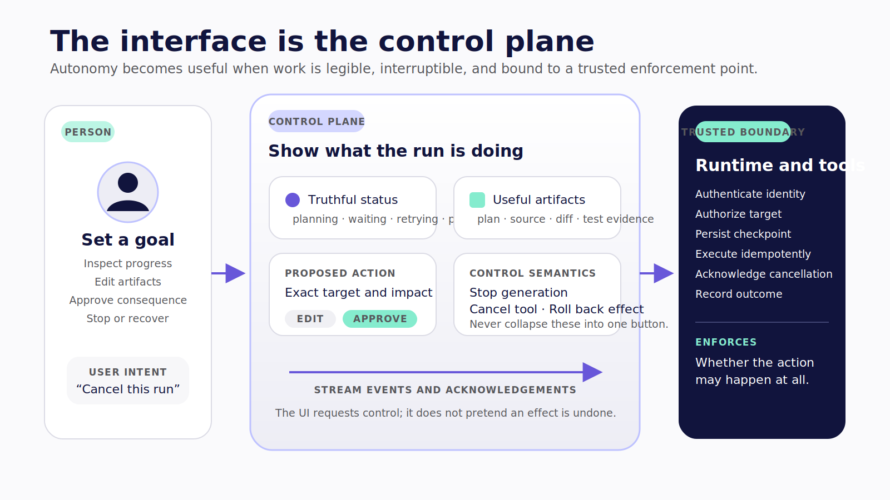
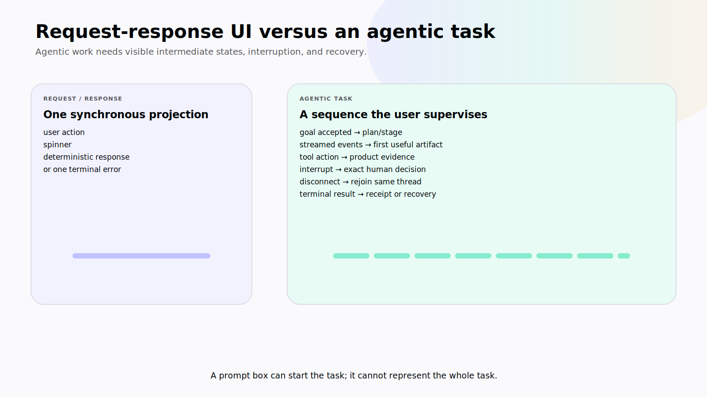
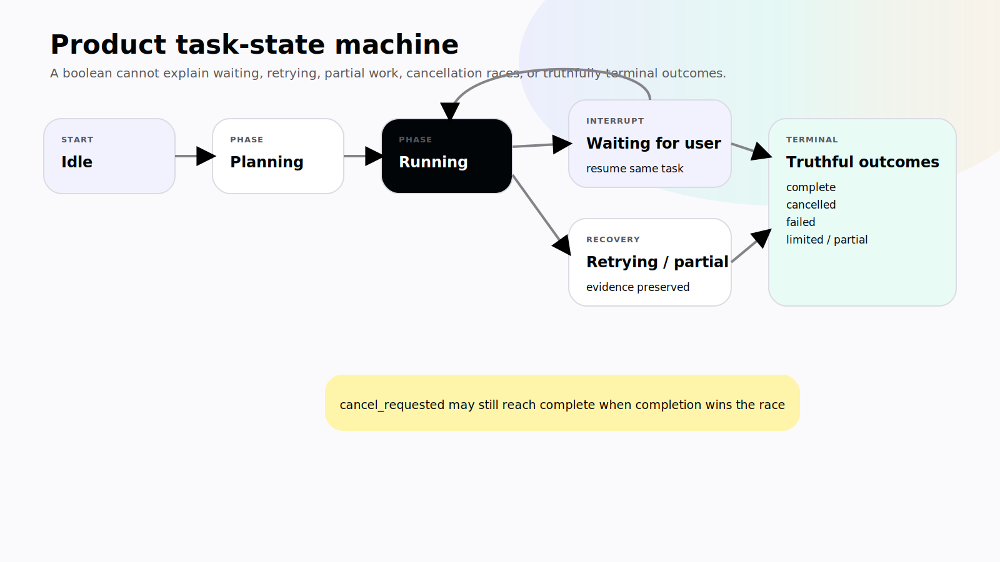
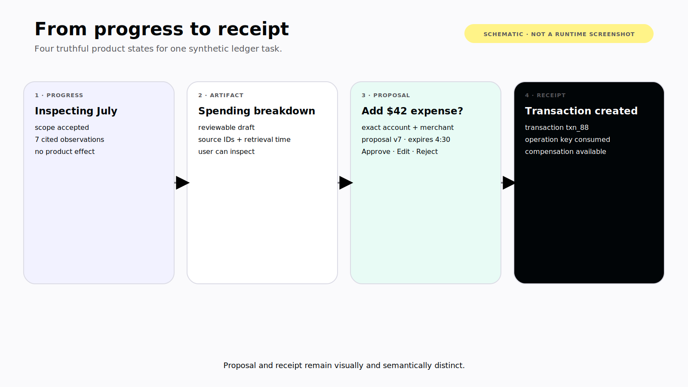
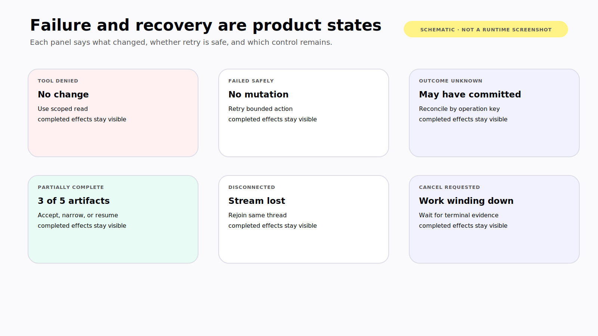

# Chapter 4 — The Interface Is the Control Plane

Thirty seconds after submitting the request, the user saw the same spinner.

No stage. No current action. No indication that the agent had already created a record in an external system. The user assumed the request had stalled, closed the panel, opened it again, and submitted the same instruction.

The second run began while the first was still active. One tool had timed out after the external service accepted its write. The runtime retried. The interface eventually displayed two success messages and three new records.

Traditional interfaces are often built around a short contract:

```text
user action → deterministic response
```

Agentic work has a different shape:

```text
user goal
  → uncertain plan
  → streamed events
  → partial artifacts
  → tool calls and side effects
  → possible interruption, retry, or failure
  → terminal outcome and recovery
```

> **Reader outcome:** By the end of this chapter, you will be able to design a task surface for streamed, partial, fallible, and interruptible work with truthful status, explicit control semantics, and recoverable outcomes.

## The prompt box is only the entrance

A useful agentic interface must answer questions throughout a run:

- Did the system accept my goal?
- Which task and thread am I looking at?
- What stage is active?
- What useful artifact exists already?
- Which tool is being requested or executed?
- What has been proposed, and what has actually changed?
- Is the system waiting for me, retrying, disconnected, or finished?
- What will “Stop” prevent?
- Which side effects are already complete?
- Can I edit, reject, resume, retry, compensate, or escalate?

A token stream does not answer most of those questions. Treat the interface as a projection of typed task state and observable events, not as a transcript with buttons attached.

> In an agentic application, the interface is not the prompt box; it is the place where autonomy becomes legible and controllable.



*Figure 4.0 — The interface makes work legible and requests control; the trusted runtime enforces authority and records consequences.*

## Five interface assumptions that break

### Assumption 1: requests finish quickly

The work may outlive the HTTP request, browser tab, mobile foreground session, or channel connection. Design for acknowledgement, first useful artifact, and then terminal outcome.

### Assumption 2: the final message is the result

For many tasks, the real result is a semantic artifact:

- a list of cited findings;
- a proposed transaction;
- a chart with a data timestamp;
- a file diff;
- a test report;
- a migration plan;
- an approval record;
- an external-system receipt.

Stream and persist those artifacts directly. Do not bury them in prose and later parse the prose back into application state.

### Assumption 3: the frontend owns all state

The runtime can update progress, artifacts, and proposals while the user edits filters, corrects a draft, or rejects an action. Without field ownership and revisions, a full snapshot from either side can erase newer work.

The UI must distinguish view, task, and thread state from product records, memory, and telemetry. Shared state has two editors, so every jointly edited object needs a conflict strategy.

### Assumption 4: failure is terminal and simple

A tool can fail before execution, after a partial result, or after an external system commits. The runtime may retry, ask for correction, pause, or require reconciliation.

“Something went wrong” hides the only facts the user needs. Show what failed, what changed, what did not change, whether a retry is safe, and which recovery action is available.

### Assumption 5: users act only before execution

Users may need to edit a proposal, approve an exact action, deny privilege escalation, change scope, cancel future work, or compensate for a completed action. Human control is part of the running system, not a form placed before it.



*Figure 4.1 — A prompt box may start both interactions, but only the task surface represents uncertain work the user must supervise.*

## Replace `running: boolean` with a task state machine

A boolean tells the interface too little. It cannot explain whether the runtime is planning, executing, waiting for a person, retrying, partially complete, cancelling, or terminal.

Start with an explicit product state model:

```ts
type TaskPhase =
  | "idle"
  | "planning"
  | "running"
  | "waiting_for_user"
  | "retrying"
  | "partially_complete"
  | "cancel_requested"
  | "cancelled"
  | "failed"
  | "complete";
```

**Status:** Editorial task-state type, not a CopilotKit export. The hardened companion should derive phases from AG-UI run, step, tool, state, activity, and interrupt events plus authoritative application outcomes.

The type is only the beginning. Define valid transitions. For example:

```text
idle → planning → running
running → waiting_for_user → running
running → retrying → running
running → partially_complete → running | waiting_for_user | complete
running → cancel_requested → cancelled | complete
running → failed
```

Why can `cancel_requested` reach `complete`? Because cancellation may race with completion. A tool may commit just before the runtime receives the stop signal. The interface must reconcile the actual outcome rather than force the user's intention into history.

Every transition should have:

- an event or product record that justifies it;
- a timestamp;
- a stable run and thread identifier;
- user-facing copy;
- allowed controls;
- invalid-transition behavior;
- an observability correlation.

AG-UI defines run lifecycle, step, message, tool-call, state, and activity event families that can drive this projection. Its [event specification](https://docs.ag-ui.com/sdk/js/core/events) uses start/content/end and snapshot/delta patterns. The application still owns the semantic mapping. A `TOOL_CALL_END` event, for example, says that streamed arguments ended; it does not prove that a payment or database write completed.



*Figure 4.2 — Product phases need explicit transitions and evidence; `cancel_requested` cannot force history to say an already completed effect was cancelled.*

## Show progress that is true

A fabricated percentage is worse than no percentage because it claims knowledge the runtime does not have.

Use numeric progress only when the work is measurable: twelve of twenty documents parsed, four of six tests complete, 180 of 500 records migrated. When the path is adaptive, prefer stages and evidence:

```text
✓ Request understood
✓ Read-only scope accepted
● Inspecting approved sources
  First artifact: 7 cited observations
○ Comparing release changes
○ Drafting recommendations
```

Good progress answers four questions:

1. What stage is active?
2. What action is happening now?
3. What useful artifact exists already?
4. Is the runtime waiting, retrying, blocked, or making forward progress?

Keep raw logs in a developer view. AG-UI activity and custom events can carry domain progress, but emit them from measurable work: “Parsed 8 of 12 approved files,” not “Thinking hard.”

## Design partial artifacts as real product objects

Intermediate work can be more valuable than the final paragraph. Stream sources, plans, diffs, tests, and proposals as semantic artifacts, and keep proposals separate from authoritative receipts.

Each artifact needs a lifecycle:

```text
draft → streaming → reviewable → accepted | rejected | superseded
```

Persist semantic data, not formatted status sentences. Give each artifact a stable ID, version, source, timestamp, owner, and status. When the user edits it, preserve the relationship between the agent proposal and the approved version.

This is the foundation of generative UI: the agent selects a semantic object or registered component; the application owns rendering, accessibility, validation, and action boundaries.



*Figure 4.3 — Source-faithful control-plane states. This deterministic schematic specifies the required UI contract; it is not a live ledger or model-runtime screenshot.*

## Name every control by what it actually does

The most dangerous word in an agentic interface may be “Stop.” Users read it as a broad promise. Runtimes usually implement something narrower.

| User intent                | Mechanism                              | What may stop                                 | What may remain                                     | Honest interface language                                |
| -------------------------- | -------------------------------------- | --------------------------------------------- | --------------------------------------------------- | -------------------------------------------------------- |
| Stop visible generation    | Abort model/client run                 | Further token generation and cooperative work | Completed tools; non-cooperative background work    | Stop run                                                 |
| Cancel current client tool | Abort signal                           | Handler work that observes the signal         | Work already accepted elsewhere                     | Cancel current action                                    |
| Close or disconnect        | Stream closes                          | Display updates                               | Backend run may continue                            | Disconnected; work may still be running                  |
| Pause for a person         | Frontend wait or durable interrupt     | Progress past the decision point              | Earlier steps and side effects                      | Waiting for your review                                  |
| Cancel queued work         | Queue/runtime cancellation             | Unclaimed future attempt                      | Accepted or already running work depends on runtime | Cancel queued task                                       |
| Roll back runtime state    | Restore or remove checkpoint/run state | Runtime history or future execution           | External side effects                               | Restore task state                                       |
| Undo a business action     | Domain compensation                    | Nothing automatically; a new action runs      | Audit history and possibly irreversible effects     | Reverse transaction, revert commit, or exact domain term |

The pinned CopilotKit core `stopAgent` path invokes abort behavior on the active run. See the source-present [`stopAgent`](https://github.com/CopilotKit/CopilotKit/blob/855446e1abc8f29756dc5e539e5e50a90321ac2d/packages/core/src/core/core.ts). That is useful cancellation machinery, but every frontend and external tool still needs a scenario-specific contract.

LangChain's [join and rejoin guidance](https://docs.langchain.com/oss/python/langchain/frontend/join-rejoin) explains that a client can disconnect and reconnect to a running stream when the application uses LangGraph Agent Server and preserves the thread ID. A custom deployment must implement equivalent durable run and replay semantics explicitly. LangSmith's [cancel-run documentation](https://docs.langchain.com/langsmith/cancel-run) documents runtime-specific interrupt and rollback-like options. Neither source implies that an external side effect is compensated.

> **Version note — Verified July 2026.** Cancellation, join/rejoin, and rollback semantics are runtime- and deployment-specific. Pin the exact runtime and prove each tool's behavior under disconnect, timeout, and cancellation before labeling a control.

## Human control needs exact context

A generic “Allow” button asks the reviewer to approve a feeling. A production approval binds a decision to a canonical proposal.

For a consequential action, display:

- the action category, such as `create transaction`, not `use tool`;
- target system, account, environment, or resource;
- exact arguments and where important values came from;
- expected impact and reversibility;
- requesting user and acting agent;
- eligible approving principal;
- evidence, assumptions, and ambiguity;
- proposal version or digest;
- expiry and staleness behavior;
- approve, edit, reject, and safer-alternative actions;
- the post-decision receipt or failure.

The client may mediate the decision. The trusted boundary must verify that the principal is eligible, the proposal is current, the action remains authorized, and replay is prevented.

## Trust comes from operational evidence

Users do not need private model reasoning. They need facts that let them supervise the work:

1. **Status:** What is happening now?
2. **Plan or stage:** What bounded sequence is the system attempting?
3. **Action:** Which tool or system is in use, with which safe arguments?
4. **Evidence:** Which source, record version, timestamp, or calculation supports it?
5. **Change:** What is proposed, and what has actually changed?
6. **Control:** Can the user edit, reject, stop, retry, or compensate?
7. **Provenance:** Which runtime, tool, model configuration, requester, and approver produced the result?

AG-UI's optional reasoning-related events are not a mandate to expose hidden chain-of-thought. Plans, actions, sources, state changes, approvals, and receipts are more useful.

## Failure and recovery are first-class screens

Design these states before the happy-path screenshot:

### Tool denied

Explain which policy boundary denied the action and what safer alternative exists. Do not invite the model to find a more permissive tool.

### Tool failed safely

Show that no mutation occurred, preserve the proposal, and offer a bounded retry if the error is transient.

### Outcome ambiguous

Say that the external result is unknown. Disable immediate replay. Query by idempotency key or send the task to manual reconciliation.

### Partially complete

List finished artifacts and unfinished work. Let the user accept the partial result, resume, narrow scope, or stop.

### Disconnected

Tell the user whether only the stream was lost or the runtime was also cancelled. Rejoin the same thread rather than issuing a duplicate request.

### Cancel requested

Show which work is still winding down and which completed side effects remain. Do not render “Cancelled” until the runtime reports a terminal outcome.



*Figure 4.4 — Failure and recovery state specification. The diagram is a deterministic schematic, not evidence that these paths were executed in a live runtime.*

## Accessibility is part of supervision

An inaccessible control plane is an unsafe control plane.

- Status must not rely on color alone. Pair color with text, iconography, and appropriate live-region behavior.
- Streaming content should not steal focus on every token.
- Approval actions need a logical keyboard and screen-reader order, unambiguous labels, and a non-destructive default.
- Charts need a textual summary and accessible data table.
- Narrow mobile views must keep the action, target, amount, source, and controls visible.
- Completed historical tool cards must not retain active buttons after remount.
- Error messages must say what changed and what did not, not only expose an internal exception.

Test with large text, keyboard navigation, reduced motion, screen readers, mobile backgrounding, and interrupted network.

## Exercise — Replace one spinner

Choose an AI feature that currently shows a spinner or streaming paragraph. Replace that projection with a small task surface containing:

```text
stable task/thread identity
current phase
current semantic action
first useful artifact
evidence or source
stop semantics
completed side effects
recovery action
```

Then test two failures:

1. Disconnect the client while the backend continues.
2. Cause a tool to time out after the target may have accepted the action.

Your inspectable result is not a prettier loading state. It is a state-transition table showing what the user sees, which event or record justifies it, what controls are available, and whether retry is safe.

## Builder Checklist

- [ ] The interface represents a task, not only a transcript.
- [ ] Task phases and invalid transitions are explicit.
- [ ] Progress comes from measurable stages or artifacts.
- [ ] Partial artifacts are typed, versioned, and persistent where needed.
- [ ] Proposed actions and completed changes look different.
- [ ] Tool success requires an authoritative result or receipt.
- [ ] Stop, cancel, disconnect, interrupt, rollback, and compensation are distinguished.
- [ ] Approval binds an eligible principal to an exact current proposal.
- [ ] Completed side effects remain visible after cancellation or failure.
- [ ] Ambiguous outcomes block blind replay.
- [ ] Failure and recovery states are designed beside the happy path.
- [ ] Status, streaming, charts, and controls pass accessibility checks.

## Bridge to Level 1

We now have the four foundation pieces:

- agency is classified by operating surface and authority;
- an agent exists where adaptive action selection begins;
- the agent loop sits inside a larger product stack;
- the interface is the control plane for uncertain, consequential work.

Part II turns those ideas into the smallest authority surface: an agent embedded in an application. We will trace a CopilotKit interaction from web and mobile UI through AG-UI to a runtime, put each tool at the right boundary, render results as real interface components, synchronize shared state, and add human control that survives contact with production.
