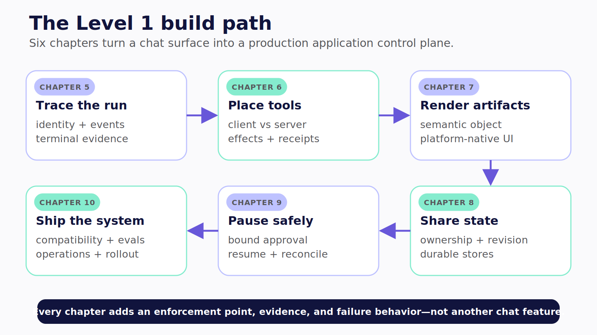

# Part II — Level 1: Application Agents

The smallest useful authority surface is often the strongest place to begin.

An application agent operates through the objects and actions of a purpose-built product. It can know which ledger the user has open, render a spending chart beside the source data, propose a transaction, wait for a correction, and return an authoritative receipt. It does not need arbitrary access to the user's machine or a shared organizational identity to do that work.

This part builds that system around a synthetic personal financial ledger that works across web and mobile. The domain is familiar enough to make the interaction concrete and consequential enough to expose weak boundaries quickly. A balance is not just text. A transaction proposal is not the same as a committed transaction. A category correction can race with an agent update. A retry after a timeout can duplicate a write. A mobile app can disappear into the background while its backend run continues.

The starting source is intentionally imperfect. At the pinned revision, [personal-finance-copilot](https://github.com/jerelvelarde/personal-finance-copilot/tree/d8760064c626712a8fa15c192a8c4bc69bb24055) demonstrates a bare React Native shell, five frontend read tools, four human-gated write proposals, native result UI, and a receipt flow. It does not demonstrate production authentication, tenant isolation, durable threads, or LangGraph. The pinned GTM Operations Workspace source supplies the web/PWA contrast and a selectable-runtime pattern, but it does not turn a client-selected backend into a complete authorization model. **Verified July 2026.**

We will keep those boundaries visible. The audited projects show patterns in the wild. The original companion snippets show controls written for the book. Compile verification, deterministic tests, and live runtime proof remain distinct.

The build proceeds in six steps:

1. Trace one request through CopilotKit, AG-UI, the runtime, and product services.
2. Place every capability at the correct trust and lifecycle boundary.
3. Render semantic results as application-owned interface components.
4. Give user and agent state explicit ownership and conflict rules.
5. Pause at the last responsible moment before consequence.
6. Ship identity, persistence, evaluation, recovery, accessibility, and operations with the feature.

The recurring question is simple:

> What can the agent propose, what can the application enforce, and what evidence proves the difference?

By the end of Part II, you will have a production-readiness model for a Level 1 application, not merely a better chat screen.

*Figure II.1 — The Level 1 build path adds an enforcement point, evidence, and failure behavior at every stage.*
