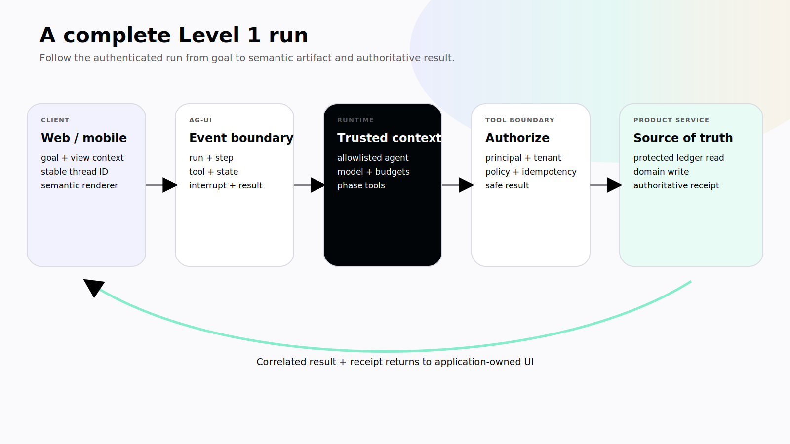
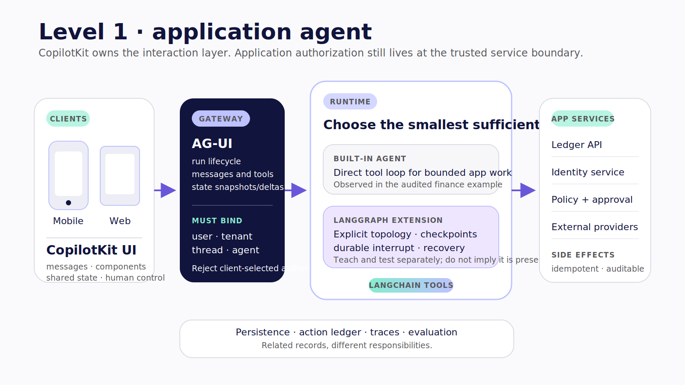

# Chapter 5 — Inside the Application Agent

The user opens the ledger on a phone and asks a plain question:

> Where did I overspend this month?

The answer appears as a chart, a short explanation, and a link to the transactions behind the largest category. It feels like one interaction. The application has crossed at least six boundaries.

The mobile screen captured the goal and current product context. CopilotKit resolved an agent and attached frontend-provided capabilities. An authenticated request reached the runtime over an AG-UI route. The runtime assembled messages, state, instructions, model configuration, and allowed tools. The model selected a read capability. The handler obtained ledger data. AG-UI events described the run, tool call, result, and visible state. The application rendered the semantic result as native UI. **Verified July 2026.**

If you stop at the chart, every failure beneath it looks like “the AI is broken.” If you trace the handoffs, each failure has an owner.

> **Reader outcome:** By the end of this chapter, you will be able to trace one application-agent run from web or mobile UI through CopilotKit and AG-UI to a runtime and product service, then choose between a bounded built-in loop, a service adapter, and a LangGraph extension.

## Follow the run, not the chat

Use one stable run to open the hood:

```text
1. User submits goal inside an authenticated ledger
2. Client selects agent ID and existing thread
3. AG-UI request crosses the authenticated runtime boundary
4. Runtime resolves the allowed agent and trusted user context
5. Agent loop selects a registered read capability
6. Tool executes at its declared boundary
7. AG-UI emits lifecycle, message, tool, and state events
8. UI renders a typed spending artifact
9. Runtime records terminal outcome and correlation data
```

The numbers are a teaching projection, not a guarantee that every runtime emits exactly one step per line. They force useful questions:

- Who creates the run and thread identifiers?
- Can a client choose any agent or backend name?
- Which identity reaches the runtime?
- Which product context is trusted, and which is merely client input?
- Which tool registration exists only for this view?
- What event makes the interface show “executing”?
- Which result proves the ledger read completed?
- What survives a refresh or mobile background transition?

> The fastest way to misunderstand an agentic app is to start at the chat box and stop before the runtime boundary.



*Figure 5.1 — A complete Level 1 run crosses client, protocol, runtime, tool-policy, and product-data boundaries before the application renders a result.*

## The client is a control surface

On the client, CopilotKit connects application context and UI to an AG-UI-compatible agent. In the pinned CopilotKit source, the v2 `useAgent` hook resolves and subscribes to an `AbstractAgent`; it exposes the agent's messages, state, and run status through that agent abstraction rather than through a guessed universal `{ state, start }` return shape. The lower-level `useCopilotKit` context provides imperative orchestration for custom shells. See the pinned [`useAgent` source](https://github.com/CopilotKit/CopilotKit/blob/855446e1abc8f29756dc5e539e5e50a90321ac2d/packages/react-core/src/v2/hooks/use-agent.tsx) and the current [`useCopilotKit` reference](https://docs.copilotkit.ai/reference/hooks/useCopilotKit). **Verified July 2026.**

At the audited finance pin, the custom React Native [`ChatScreen.tsx`](https://github.com/jerelvelarde/personal-finance-copilot/blob/d8760064c626712a8fa15c192a8c4bc69bb24055/apps/finance-mobile/src/ChatScreen.tsx) uses those lower-level surfaces to add a message, start the run, and traverse rendered tool calls. That makes it a useful source-reading example. It also creates an upgrade obligation: a custom shell depends on more framework behavior than a packaged chat component would.

The client may provide valuable context:

- visible date range;
- selected transaction;
- current route or document;
- unsaved local draft;
- device affordances such as navigation or attachment selection;
- components registered for semantic rendering.

It must not become the authority for:

- the authenticated principal or tenant;
- access to protected ledger records;
- service credentials;
- whether a proposal is still approved;
- whether a write is idempotent;
- the authoritative transaction receipt.

The application can display and propose. The trusted server decides which protected facts and consequences exist.

## The AG-UI boundary carries observable events

AG-UI gives the client and runtime a shared event vocabulary. Current official documentation defines run lifecycle, step, message, tool-call, state, and activity event families. [AG-UI's event architecture](https://docs.ag-ui.com/concepts/events) also distinguishes streamed start/content/end patterns from snapshot and delta patterns. **Verified July 2026.**

Map those events to product questions:

| Event family  | What the UI can learn                                      | What it cannot infer                                  |
| ------------- | ---------------------------------------------------------- | ----------------------------------------------------- |
| Run lifecycle | Accepted, finished, or errored run; run/thread correlation | That every external side effect succeeded             |
| Message       | Partial or complete conversational output                  | The complete semantic task state                      |
| Tool call     | Tool name, argument lifecycle, result event                | Authorization or external commit merely from call-end |
| State         | Task snapshot or delta                                     | Product database truth or long-term memory            |
| Activity      | Domain progress emitted by the runtime                     | A universal percentage or hidden reasoning            |
| Interrupt     | Runtime or tool is waiting for external input              | That the current viewer is eligible to decide         |

Do not rebuild task state by parsing assistant prose. Do not mark a transaction search complete when arguments merely stopped streaming. Do not show a committed ledger mutation until the product service returns an authoritative receipt.

The interface should preserve correlation IDs in a developer view or trace, while presenting business language to the user. “Searching transactions from July 1–31” is useful. `TOOL_CALL_ARGS` is an implementation detail.

## The runtime owns the loop

The runtime receives the request, resolves the named agent, assembles context, invokes the model, exposes tools, applies step and retry limits, emits events, and reaches a terminal outcome.

At the audited finance revision, the server constructs a CopilotKit `BuiltInAgent`, sets a bounded step count, and accepts frontend-provided tools. The source-present implementation is visible in [`finance-agent.ts`](https://github.com/jerelvelarde/personal-finance-copilot/blob/d8760064c626712a8fa15c192a8c4bc69bb24055/apps/runtime/lib/finance-agent.ts); the catch-all runtime route is visible in the pinned [`route.ts`](https://github.com/jerelvelarde/personal-finance-copilot/blob/d8760064c626712a8fa15c192a8c4bc69bb24055/apps/runtime/app/api/copilotkit/%5B%5B...all%5D%5D/route.ts). Those paths establish source shape, not a fresh runtime run. **Verified July 2026.**

A production route adds controls the demo pin does not establish:

1. Authenticate before resolving the thread or agent.
2. Derive principal and tenant from trusted server context.
3. Server-allowlist agent and backend choices.
4. Reject missing model configuration before streaming success headers.
5. Bound steps, time, tools, tokens, and cost.
6. Redact internal errors and sensitive tool payloads.
7. Correlate run, thread, user, tenant, model configuration, and trace.
8. Persist state only through the selected ownership and retention model.

A public runtime URL is not proof that a caller may access every thread behind it. A client-supplied `agentId`, `threadId`, or backend header is input to validate, not authority to honor.

## Choose the smallest runtime that satisfies recovery

The Level 1 architecture does not require LangGraph by default. It requires a runtime whose behavior matches the task.

| Decision       | `BuiltInAgent`                                                     | Service adapter                                               | LangGraph-backed runtime                                              |
| -------------- | ------------------------------------------------------------------ | ------------------------------------------------------------- | --------------------------------------------------------------------- |
| Best fit       | Narrow in-process model/tool loop                                  | Existing provider or external agent behind a stable interface | Explicit state machine, branching, checkpointing, long waits          |
| Topology       | Bounded loop                                                       | Defined by provider/adapter                                   | Developer-authored graph or LangChain agent on LangGraph              |
| State          | AG-UI state exchange; application-owned persistence still required | Adapter-specific                                              | Typed graph state; persisted with configured checkpointer             |
| Human pause    | Client-mediated tool wait can work for present-user cases          | Adapter-specific                                              | Runtime `interrupt()` can suspend and resume when checkpointed        |
| Recovery       | App/runtime-specific                                               | Adapter-specific                                              | Checkpoint inspection and resume; side effects still need idempotency |
| Operating cost | Lowest                                                             | Depends on external runtime                                   | Higher storage, migration, deployment, and recovery burden            |

Use `BuiltInAgent` when the ledger task is short, narrow, and safe to restart or fail through ordinary application controls. Use a service adapter when the product already has an agent runtime or provider integration whose execution semantics you are prepared to own. Add LangGraph when explicit topology, durable thread state, disconnect/rejoin, or runtime-enforced interrupts are product requirements.

LangGraph's official [persistence documentation](https://docs.langchain.com/oss/python/langgraph/persistence) states that a configured checkpointer saves state under a thread identifier at graph super-steps. Its [interrupt documentation](https://docs.langchain.com/oss/python/langgraph/interrupts) explains pause and resume through the same thread. Neither capability appears in the audited finance or GTM Operations Workspace projects. The tested `L1-GRAPH` companion extension introduced in Chapters 8 and 9 is separate and uses an in-memory checkpointer for the self-contained test. Production durability still requires a real store and recovery run.

> **Version note — Verified July 2026.** The book's companion compiles against CopilotKit React Core `1.62.3` and tests its LangGraph excerpt on `1.2.9`. The audited finance project requests an older CopilotKit range. Do not splice the demo's package assumptions and the companion's v2 hooks into one unpinned install.

## Web and mobile share a contract, not an implementation

The web and mobile clients should share semantic state, tool schemas, authentication rules, and scenario tests. They should not be forced into identical UI code.

On web, a Next.js route may sit at the runtime boundary, browser refresh is common, and cookies or headers may carry application authentication. On mobile, the runtime may not be reachable through the same `localhost` address; tokens belong in platform-appropriate secure storage; backgrounding can drop the stream while backend work continues; native attachments and permissions introduce additional failure states.

At the pinned finance revision, the application is bare React Native, not Expo. The current CopilotKit React Native documentation and pinned source disagree on some polyfill and prebuilt-component details, so the publication workflow must choose one exact release and run the target platforms rather than blending docs and source. See the [React Native quickstart](https://docs.copilotkit.ai/react-native) and pinned [`@copilotkit/react-native` exports](https://github.com/CopilotKit/CopilotKit/blob/855446e1abc8f29756dc5e539e5e50a90321ac2d/packages/react-native/src/index.ts). **Verified July 2026.**

The invariant across clients is this:

```text
same authenticated product identity
+ same semantic task/thread contract
+ same server authorization and receipts
+ platform-native rendering and lifecycle behavior
```



*Figure 5.2 — Web and mobile share authenticated identity, semantic task state, authorization, and receipts while retaining platform-native rendering and lifecycle behavior.*

## The GTM Operations Workspace lesson: selectable does not mean interchangeable

The pinned GTM Operations Workspace source registers Hermes, Anthropic, and OpenAI paths behind one CopilotKit surface. Its backend registry distinguishes configuration-derived readiness from a live smoke test, and its server route selects among allowlisted runtime paths. **Verified July 2026.**

This is valuable product architecture. It is not evidence that the backends have equivalent tool behavior, latency, cost, privacy, or safety. A client-selected header must map to a server allowlist and user policy. Readiness should distinguish at least:

```text
configured → reachable → authenticated → smoke-tested → scenario-tested
```

A provider key in the environment proves only configuration. A health route proves only the layer it checks. A successful shell render proves only the UI shell.

## Write the runtime contract before the prompt

The runtime contract should fit on one reviewable page. It names the agent, accepted thread state, authenticated context, allowed tools, event families, step and time budgets, terminal outcomes, and recovery behavior. The system prompt can change inside that envelope; it must not silently expand it.

For the ledger, specify:

- the agent may analyze only accounts authorized for the current principal;
- transaction searches return bounded, redacted semantic records;
- no mutation tool is available until a versioned proposal exists;
- a run reaches `complete`, `waiting_for_approval`, `cancelled`, or `error` under product-defined rules;
- every product effect ends in an authoritative receipt or an explicit unknown outcome;
- reconnect joins the existing run instead of submitting a second goal.

Turn that page into contract tests. Send an unknown `agentId`; it must fail. Omit the model key; availability must fail before the stream begins. Join a thread as another tenant; no state or timing detail should leak. Exceed the step budget; the runtime should return a bounded partial outcome. Disconnect after a tool starts; the rejoined client should reconcile the same tool call and result.

This creates a useful division of work. Prompt and model evaluations measure whether the agent makes good choices inside the contract. Runtime tests prove that a poor choice cannot escape the declared authority. UI tests prove that observable events remain honest when the run is slow, interrupted, or incomplete.

The contract is also the handoff between teams. Frontend engineers can build lifecycle states against it. Backend engineers can enforce identity and product policy. Agent engineers can tune selection behavior without redefining what “allowed” means. Operators can alert on terminal outcomes rather than scraping prose.

## Failure and security drills

### Missing model key

Fail before starting a run. Return a safe configuration error and mark the agent unavailable. Do not emit a convincing partial response from a fallback the user did not authorize.

### Unreachable runtime

Show that the task was not accepted. Preserve the user's draft goal and offer a retry that cannot duplicate an existing run.

### Unknown backend or agent ID

Reject at the server. Do not dynamically import or proxy an arbitrary name supplied by the client.

### Unauthenticated thread access

Authorize every read, join, update, and delete against trusted user and tenant context. Thread IDs should be unguessable, but secrecy is not authorization.

### Stream disconnect

Document whether backend work continues. Rejoin with stable run and thread identity rather than submitting a new goal.

### Event/result mismatch

If the UI sees a tool-call event but not an authoritative result, show unknown or still-running status. Never infer product success from a message.

## Exercise — Annotate one complete run

Run the pinned shell if your environment is ready, or inspect the immutable source paths if it is not. Produce a trace worksheet:

```text
client and platform:
agent ID and server allowlist:
authenticated principal and tenant source:
thread ID origin and access check:
runtime route:
runtime type and step limit:
registered tools and execution locations:
AG-UI event families observed or expected:
product source-of-truth boundary:
terminal receipt or result:
disconnect/rejoin behavior:
evidence status for each claim:
```

If you run it, record the exact commit, lockfile, environment, command, synthetic fixture, and result. If you only inspect it, label the artifact source-present. The inspectable result is a boundary-annotated run, not a screenshot of chat.

## Builder Checklist

- [ ] Client, AG-UI boundary, runtime, tools, and product services are drawn.
- [ ] Agent and backend choices are server-allowlisted.
- [ ] Principal, tenant, thread, and run identities are correlated.
- [ ] Thread access is authenticated for create, join, update, and delete.
- [ ] Missing configuration fails loudly before a run starts.
- [ ] Event families map to product states without inventing success.
- [ ] Runtime, model, package, and protocol versions are pinned.
- [ ] `BuiltInAgent`, adapter, and LangGraph claims match the selected runtime.
- [ ] Mobile disconnect/background behavior is documented.
- [ ] Source inspection and runtime verification remain distinct.

## Bridge

The run is connected. The next architecture decision is where each capability should execute.

In Chapter 6, two tools will accept the same transaction-shaped arguments. One will be safe only for client-local work. The other will derive identity, validate domain rules, write idempotently, and return a receipt from a trusted server boundary.
