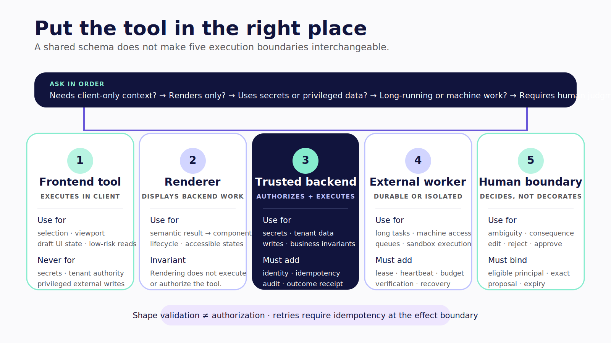
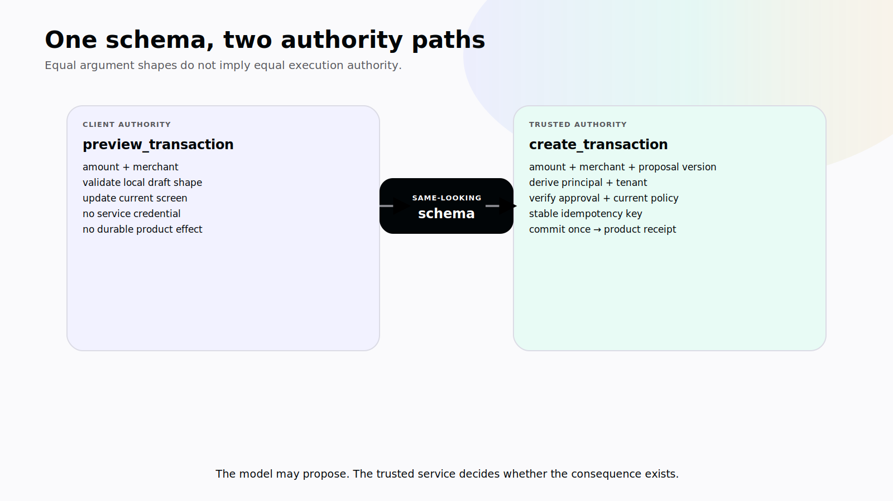
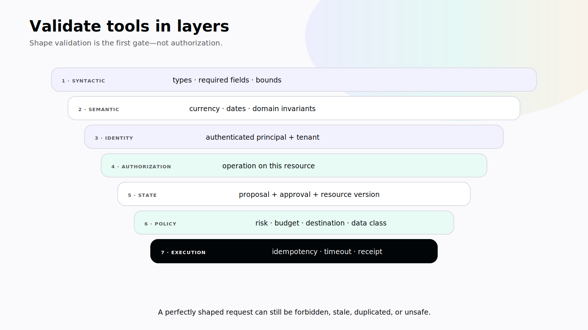
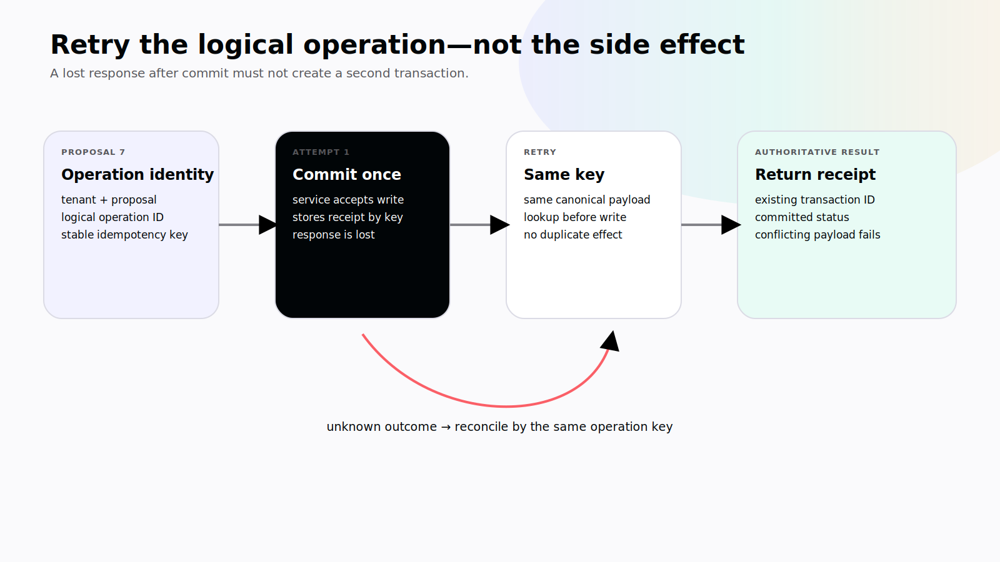
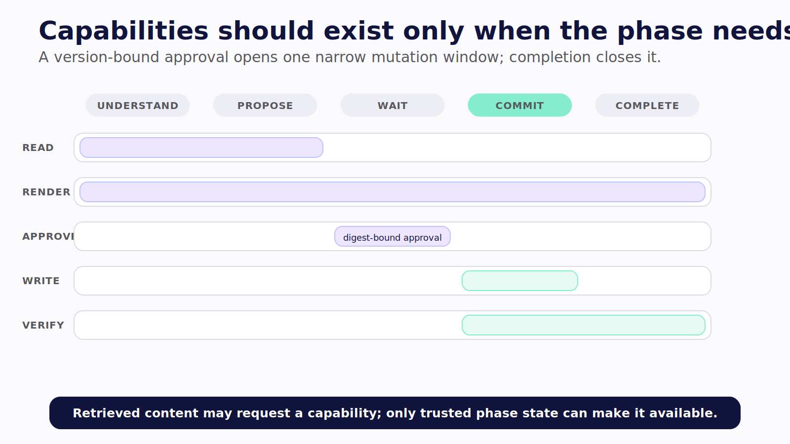

# Chapter 6 — Put the Tool in the Right Place

Two tools can accept the same arguments and belong on opposite sides of your system.

`preview_transaction({ amountCents, merchant })` can update a draft card that exists only on the user's screen. `create_transaction({ amountCents, merchant })` changes the financial ledger shared across devices. The first may execute in the client. The second must pass through authenticated server policy, current approval, tenant authorization, domain validation, and an idempotent write.

Their schemas may look nearly identical. Their authority is not.

> **Reader outcome:** By the end of this chapter, you will be able to place a capability at the correct execution boundary, classify its risk, expose it through CopilotKit without mistaking schemas for authorization, and make consequential retries safe.

## A tool is more than a function

To the model, a tool usually has a name, description, input schema, and result. To the product, it also has an execution location, identity, permission, data classification, side-effect policy, timeout, retry contract, audit requirement, and owner.

That larger contract determines where the tool belongs.

| Question                                           | If the answer is yes                                          | Likely boundary                                   |
| -------------------------------------------------- | ------------------------------------------------------------- | ------------------------------------------------- |
| Does it need a browser or native UI capability?    | Read selection, navigate, open a picker, update a local draft | Client/frontend tool                              |
| Does it expose a result produced elsewhere?        | Render a server-side search or analysis                       | Client renderer; execution stays elsewhere        |
| Does it read protected product data?               | Query accounts, transactions, or private documents            | Authenticated server or constrained data service  |
| Does it mutate durable state?                      | Create, update, send, publish, pay, deploy                    | Trusted server with policy and receipt            |
| Can the effect escape the product?                 | Email, message, purchase, infrastructure change               | Trusted server plus explicit approval as required |
| Does it require secrets or privileged credentials? | API keys, database credentials, cloud roles                   | Never the client                                  |

Do this classification before writing the hook. Framework primitives express a decision; they do not make the decision for you.



*Figure 6.0 — Tool placement follows context, execution, secrets, duration, effects, and human judgment—not schema similarity.*



*Figure 6.1 — Similar schemas can terminate at opposite authority boundaries: a local draft versus a durable product effect.*

## Give every tool a risk declaration

The companion turns implicit risk into reviewable metadata:

```ts
export type ToolEffect = "read" | "write" | "external" | "privileged";
export type ApprovalMode = "never" | "conditional" | "always";

export interface ToolRiskMetadata {
  readonly effect: ToolEffect;
  readonly reversible: boolean;
  readonly approval: ApprovalMode;
  readonly dataClass: "public" | "internal" | "sensitive";
}
```

This is excerpt `L1-RISK` from the tested companion. The ledger classifies aggregate reads and searches as sensitive reads, and transaction proposals as approval-gated writes. In a real product, extend the declaration with allowed principals, rate limits, retention, logging policy, maximum transaction value, and compensation behavior.

Risk metadata should influence runtime policy. It should also influence the interface. A read can show lightweight progress. A consequential write needs the exact target, effect, reversibility, and approval state. A privileged action should not silently appear merely because the model discovered its name.

Treat the tool registry as an attack surface. Register the smallest capability set for the current route, user, tenant, and run. Prefer a narrow `search_transactions` contract over a generic `run_sql`. Prefer `create_draft_category_rule` over `execute_javascript`.

## Frontend tools are for client authority

CopilotKit's v2 `useFrontendTool` registers a tool whose handler executes in the application client. That is useful when the capability genuinely belongs to the current interface. **Verified July 2026.**

The compile-verified `L1-TOOLS` excerpt registers a read of the aggregate ledger already visible in the UI:

```tsx
useFrontendTool<z.output<typeof visibleLedgerSchema>>({
  name: "get_visible_ledger",
  description: "Read the aggregate ledger currently visible in the UI.",
  parameters: visibleLedgerSchema,
  available: options.authenticated,
  handler: async ({ period }, { signal }) => {
    if (signal?.aborted) throw new Error("ledger read aborted");
    return options.readVisibleLedger(period);
  },
});
```

The handler respects cancellation and reads information the application has already authorized and loaded. It does not contain a database key. It does not accept a tenant ID from the model. It does not grant access to transactions that are merely invisible on the current screen.

The `available` flag improves capability exposure and UX. It is not an authorization control. A modified client can call an endpoint directly, forge tool arguments, or omit your React condition entirely. Protected operations must enforce policy again at the trusted boundary.

Use a frontend tool for operations such as:

- focusing a specific ledger row;
- navigating to a transaction already visible to the user;
- reading an unsaved form draft with the user's knowledge;
- opening a native attachment picker;
- changing a local chart range;
- returning viewport context needed to interpret “this.”

Avoid putting secrets, unrestricted fetch clients, broad filesystem access, or durable writes in it. On mobile, also assume the application can be backgrounded between tool selection and handler completion.

The precise v2 behavior used here is grounded in the pinned [`useFrontendTool` source](https://github.com/CopilotKit/CopilotKit/blob/855446e1abc8f29756dc5e539e5e50a90321ac2d/packages/react-core/src/v2/hooks/use-frontend-tool.tsx). The companion compiled against React Core `1.62.3`; a source pin is still not a browser run. **Verified July 2026.**

## Rendering a tool does not move its execution

`useRenderTool` associates UI with a named tool that executes through the agent's backend or external runtime. Its presence in React does not turn the operation into a client-side tool. The distinction matters because the UI may receive arguments and results containing sensitive data while having no authority to rerun or alter the operation.

Keep three questions separate:

1. Where is the capability selected?
2. Where is it executed and authorized?
3. Where is its lifecycle rendered?

The answers may be runtime, server service, and client respectively. Chapter 7 builds the rendering contract. For now, never move a protected search into the browser just because its result deserves a rich component.

## Approval is not execution authority

`useHumanInTheLoop` can render a frontend decision surface and hold its handler until the application calls `respond`. That is a useful interaction contract for present-user decisions. It does not, by itself, authorize the subsequent server write.

An approval response is untrusted input until the server establishes all of the following:

- the reviewer is authenticated;
- the reviewer is eligible for this action;
- the approval refers to the exact current proposal version;
- the proposal has not expired or been superseded;
- policy still permits the action;
- the write has not already committed;
- the idempotency key belongs to this logical operation.

The UI records intent. The trusted runtime converts valid intent into authority under policy.

## Derive identity at the server boundary

The client may propose an amount, merchant, and proposal version. It must not choose the authoritative tenant or principal. The `L1-BOUNDARY` companion excerpt makes that separation concrete:

```ts
export async function executeLedgerWrite(
  context: AuthenticatedRequestContext,
  input: Omit<CreateTransactionInput, "tenantId" | "idempotencyKey">,
  risk: ToolRiskMetadata,
  port: LedgerWritePort,
): Promise<TransactionReceipt> {
  if (risk.effect !== "write" || risk.approval !== "always") {
    throw new Error("ledger mutation must use an approval-gated write policy");
  }
  if (input.proposalVersion !== context.approvedProposalVersion) {
    throw new Error("approval does not match the current proposal version");
  }
  if (!context.idempotencyKey) {
    throw new Error("idempotency key is required");
  }

  return port.createTransaction(
    {
      ...input,
      tenantId: context.tenantId,
      idempotencyKey: context.idempotencyKey,
    },
    context.principalId,
  );
}
```

Notice what the caller cannot supply through `input`: `tenantId` and `idempotencyKey`. The authenticated server context owns them. The boundary also checks that risk policy requires approval and that the approved proposal version matches the one being committed.

This excerpt is intentionally smaller than a production policy layer. A real service should also validate amount bounds and currency, normalize merchant data, check account membership, enforce role and transaction policy, record the approval principal and time, apply rate or budget limits, and write an audit event without leaking sensitive fields.

The `LedgerWritePort` keeps product execution behind an interface. The model never receives a raw database client. Tests can replace the port with an in-memory fake and assert the exact derived tenant, principal, and idempotency key.

## Schemas validate shape, not permission

Zod, JSON Schema, Pydantic, and typed tool definitions are valuable. They prevent entire classes of malformed input. They cannot tell you whether the current user owns account `acct_42`, whether the assistant is allowed to create a transaction, or whether an apparent instruction arrived through prompt injection.

Validate tools in layers:

1. **Syntactic validation:** required fields, types, formats, bounds.
2. **Semantic validation:** valid currency, known category, sensible date, positive amount.
3. **Identity validation:** authenticated principal and tenant from trusted context.
4. **Authorization:** principal may perform this operation on this resource.
5. **State validation:** proposal, approval, and resource versions are current.
6. **Policy validation:** budget, approval mode, data class, and destination are allowed.
7. **Execution control:** idempotency, timeout, retry, circuit breaker, and receipt.



*Figure 6.2 — A schema-valid request is only through the first gate; identity, authorization, current state, policy, and execution controls still decide whether it may act.*

The tool description is also not policy. “Only use this for the current user's ledger” may influence model selection, but an attacker or a model error can still produce forbidden arguments. Put enforcement in code below the agent loop.

## Design retries around unknown outcomes

A timeout does not mean a write failed. The service may have committed the transaction while the response was lost. If the agent retries with a new operation identity, the ledger can contain duplicates.

Assign an idempotency key to the logical action before the first attempt. The product service should atomically associate that key with the resulting receipt. A retry with the same key returns the same outcome; a conflicting payload under the same key fails loudly.

```text
proposal version 7
  + authenticated tenant
  + logical operation ID
  → stable idempotency key
  → create transaction
  → authoritative receipt
```



*Figure 6.3 — Retry the logical operation with the same idempotency key; never turn an unknown outcome into a second write.*

Keep the key stable across network retries and runtime resumption. Do not reuse it for a materially changed proposal. Store enough status to distinguish `not_started`, `in_flight`, `committed`, `rejected`, and `unknown`. If the external system lacks idempotency support, add a server-side operation ledger or require manual reconciliation for ambiguous outcomes.

Reads may be retried more freely, but even reads can be costly, rate-limited, or privacy-sensitive. Define maximum attempts, backoff, timeout, and cancellation. Carry abort signals where the underlying operation supports them, and never describe cancellation as rollback.

## Put each control where it can hold

| Control                                   |       Client |                   Agent runtime |             Product service |
| ----------------------------------------- | -----------: | ------------------------------: | --------------------------: |
| Hide unavailable capability               |          Yes |                             Yes |                          No |
| Validate tool argument shape              |          Yes |                             Yes |             Yes at boundary |
| Derive authenticated principal and tenant |           No |    Yes, from trusted middleware |                         Yes |
| Enforce resource authorization            |           No |                  May coordinate |                         Yes |
| Check proposal and approval version       | Display only |                             Yes |           Yes before commit |
| Enforce idempotency                       |           No |                    Preserve key |             Yes, atomically |
| Render progress and receipt               |          Yes |                      Emit event | Return authoritative result |
| Hold service credentials                  |        Never | Only when required and isolated |                 Prefer here |

Defense in depth is not duplicated confusion. Each layer checks what it can know and control. The client prevents accidental misuse and communicates state. The runtime constrains agent behavior and correlates the run. The product service protects the source of truth.

## Scope capabilities to the moment

A static registry containing every tool the organization has ever built creates a selection problem and an authority problem. Register or expose the narrow set that applies to the current task phase.

The ledger can move through capability phases:

```text
understand goal
  → visible-ledger read and scoped transaction search
build proposal
  → category lookup and proposal creation
wait for decision
  → no new mutation capability
commit approved proposal
  → one version-bound write path
complete
  → receipt lookup only
```

Capability changes should be derived from trusted run state, not from the model asking for more access. If a task requires privilege elevation, pause and run the product's ordinary authorization flow. Record which tool-set version was active for each step so a trajectory can be reproduced.



*Figure 6.4 — Temporal least privilege exposes a version-bound mutation path only after approval, then closes it when the run completes.*

Descriptions should be mutually clear. If `search_transactions`, `get_visible_ledger`, and `export_ledger` all say “use this to inspect spending,” the model must infer boundaries that the registry failed to express. Name the resource, scope, effect, and intended stage. Keep examples free of secrets and cross-tenant identifiers.

Apply least privilege to results as well as execution. A search tool should return only the fields needed for the next decision, with a stable resource identifier for authorized drill-down. It should not return full account records because the model might use one field later. Bound row counts, truncate oversized text, and state whether pagination is complete.

## Treat tool output as untrusted input

Tools can return malicious or malformed content. A merchant name, uploaded receipt, retrieved document, or external API response may contain text that tells the agent to ignore policy or call another capability. That text is data, even when the model can read it.

Separate instructions from retrieved content structurally. Validate result schemas. Attach provenance and data classification. Strip executable markup. Limit the result's size and permitted links. Never pass tool-returned credentials into a second tool because the content suggested it.

For high-risk workflows, place an interceptor between tool result and next model step. It can redact sensitive fields, label untrusted content, reject an unexpected schema, and record a digest for audit. The product service still enforces final authorization; the interceptor reduces the chance that hostile data steers selection.

Test result-side attacks deliberately. Put instruction-like text in a synthetic merchant field, return an unexpected tenant identifier, inject a huge string, omit a required field, and return a URL outside the allowlist. The desired outcome is a controlled tool error or safely labeled data, not a model improvisation.

## Failure and abuse drills

### A secret in a frontend tool

Treat it as exposed. Rotate it, remove it from the bundle and history as appropriate, and move the operation behind an authenticated server. Environment-variable syntax does not make a value private if it ships to the client.

### Client-supplied tenant ID

Ignore it for authorization. Derive tenancy from the authenticated request and verify resource membership below the agent runtime. Add a cross-tenant test that sends another tenant's identifier.

### Schema-valid destructive request

Reject it through policy and authorization. A perfectly formed request can still be forbidden.

### Retried write after a timeout

Reuse the same idempotency key and retrieve the existing receipt. If outcome remains unknown, stop autonomous retries and surface reconciliation.

### Approval for an old proposal

Fail closed on the version mismatch. Render the updated proposal and request a new decision. Never silently transfer approval to changed arguments.

### Wildcard tool exposure

Use wildcard rendering only as a developer fallback, not as permission to execute an unknown tool. Server-allowlist executable names and log unexpected calls as contract failures.

## Test the boundary, not the happy-path chat

For each tool, create a table-driven suite that covers:

- valid authorized call;
- malformed arguments;
- authenticated but unauthorized principal;
- wrong tenant or resource;
- stale proposal and stale approval;
- missing or reused idempotency key;
- timeout before and after commit;
- abort during a client-local operation;
- redaction of secrets and sensitive fields;
- exact receipt mapping.

Then add one agent-level scenario that proves the model selects the narrow tool for the intended goal. Tool-unit tests establish safety. Agent scenarios establish selection behavior. You need both.

The companion boundary and risk excerpts were formatted, typechecked, tested, and built in a clean install. They were not connected to a live bank, model, or production identity provider. That evidence boundary belongs in the screenshot caption and release note.

## Exercise — Place the ledger capabilities

Classify the following before implementing them:

```text
focus_transaction
get_visible_ledger
search_transactions
export_ledger_csv
propose_transaction
create_transaction
send_monthly_summary
delete_account
```

For each, record:

```text
semantic purpose:
execution location:
trusted identity source:
effect and reversibility:
data class:
approval rule:
argument schema:
authorization rule:
idempotency or retry rule:
receipt or result contract:
audit and retention rule:
```

If two capabilities require different authority, do not collapse them into one generic tool for convenience.

## Builder Checklist

- [ ] Every tool has an explicit execution location and owner.
- [ ] Client tools contain no secrets or unrestricted privileged clients.
- [ ] Protected identity and tenancy are derived from trusted server context.
- [ ] Schemas, semantic validation, authorization, and policy are separate checks.
- [ ] Consequential actions bind approval to an exact proposal version.
- [ ] Durable writes use stable idempotency keys and return receipts.
- [ ] Timeouts and cancellation do not pretend to prove rollback.
- [ ] Tool availability is scoped to the current route, principal, tenant, and run.
- [ ] Cross-tenant, stale-state, replay, and unknown-outcome tests exist.
- [ ] Runtime evidence is labeled separately from source and compile evidence.

## Bridge

The capabilities now execute at trustworthy boundaries. The next question is what the user should see while they run.

Chapter 7 replaces prose about transactions with semantic, accessible components. It separates display-only generative UI, backend-tool rendering, frontend execution, and human decisions so a rich interface never blurs authority.
