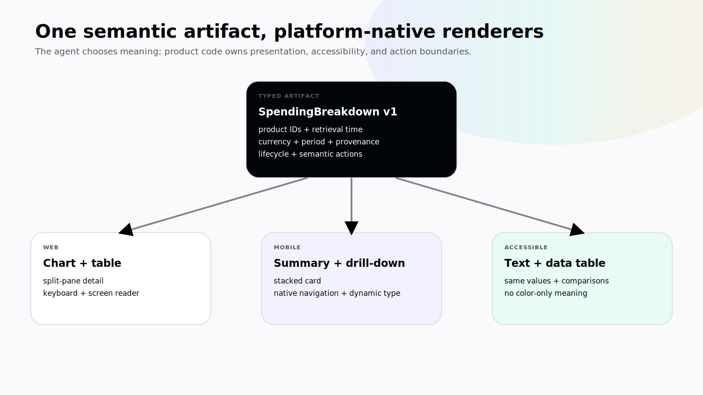
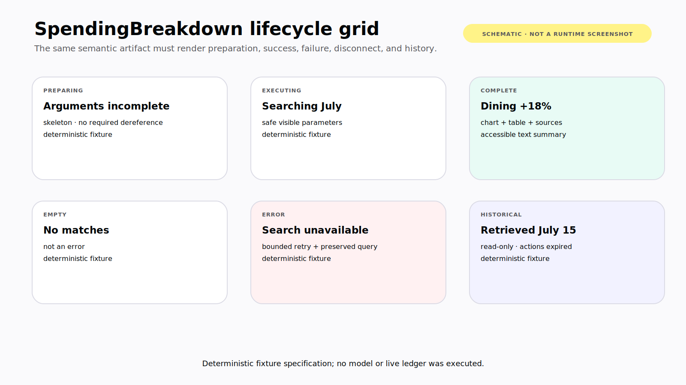

# Chapter 7 — When the Result Is an Interface

Compare two answers to the same ledger question.

The first says, “Dining was your largest discretionary category at $684, up 18 percent.” The second shows the amount, comparison period, calculation basis, category trend, and the five transactions that produced the change. Each row can open the existing transaction view. The chart has a text summary. The component preserves the source range and makes uncertainty visible.

The second answer is not better because an agent wrote more frontend code. It is better because the application and agent share a semantic UI contract.

> **Reader outcome:** By the end of this chapter, you will be able to define semantic artifacts, choose the correct CopilotKit rendering primitive, handle streaming tool lifecycles, and ship accessible web and mobile renderers without letting generated content escape product control. **Verified July 2026.**

## Let the model choose meaning, not arbitrary code

A production agent should usually choose a registered semantic object:

```json
{
  "component": "SpendingBreakdown",
  "period": "2026-07",
  "currency": "USD",
  "categories": [
    { "name": "Dining", "amountCents": 68400, "changeBasisPoints": 1800 }
  ]
}
```

The application owns the component implementation, design system, formatting, navigation, analytics, accessibility, and policy. The model does not emit an arbitrary React bundle, invent an unreviewed form, or decide which server endpoint a button calls.

This division gives builders leverage without surrendering the interface:

```text
agent chooses semantic artifact
→ schema validates arguments
→ registered component renders lifecycle
→ product code owns interaction and authority
```

Name artifacts after product meaning, not visual shape. `SpendingBreakdown` can render as a wide chart and table on desktop, stacked cards on mobile, and a concise accessible summary in a constrained surface. `PurpleThreeColumnChart` hard-codes a presentation that will not travel.



*Figure 7.1 — The agent chooses a registered semantic artifact; reviewed product code owns platform composition, accessibility, and action boundaries.*

## Choose the primitive that matches the job

CopilotKit's current v2 surface separates capabilities that are easy to blur together: **Verified July 2026.**

| Primitive              | The capability executes              | The client provides                        | Use it for                                          |
| ---------------------- | ------------------------------------ | ------------------------------------------ | --------------------------------------------------- |
| `useComponent`         | No tool execution                    | Display-only registered component          | Agent-selected semantic presentation                |
| `useRenderTool`        | Backend or external runtime          | Lifecycle renderer for a named tool        | Rich UI around server-side search or analysis       |
| `useFrontendTool`      | In the client handler                | Capability plus optional visible lifecycle | Navigation, local state, device or viewport work    |
| `useHumanInTheLoop`    | Decision handler waits in the client | Proposal and `respond` interaction         | Present-user review or missing input                |
| `useDefaultRenderTool` | Wherever the unknown tool runs       | Wildcard fallback renderer                 | Development visibility and graceful unknown-tool UI |

`useDefaultTool` belongs to a legacy surface in the pinned source and should not be taught as the current v2 default. A wildcard renderer also does not authorize a wildcard executor.

The exact behaviors above are grounded in the pinned CopilotKit sources for [`useComponent`](https://github.com/CopilotKit/CopilotKit/blob/855446e1abc8f29756dc5e539e5e50a90321ac2d/packages/react-core/src/v2/hooks/use-component.tsx), [`useRenderTool`](https://github.com/CopilotKit/CopilotKit/blob/855446e1abc8f29756dc5e539e5e50a90321ac2d/packages/react-core/src/v2/hooks/use-render-tool.tsx), [`useFrontendTool`](https://github.com/CopilotKit/CopilotKit/blob/855446e1abc8f29756dc5e539e5e50a90321ac2d/packages/react-core/src/v2/hooks/use-frontend-tool.tsx), and [`useHumanInTheLoop`](https://github.com/CopilotKit/CopilotKit/blob/855446e1abc8f29756dc5e539e5e50a90321ac2d/packages/react-core/src/v2/hooks/use-human-in-the-loop.tsx). Recheck names and status at publication freeze.

## Design the artifact schema like a public API

A semantic artifact may outlive the run that created it. It can appear in a transcript, a mobile notification, a saved report, or a later client version. Give it the discipline of a product API.

Include:

- an artifact type and schema version;
- stable product identifiers rather than copied full records;
- explicit currency, locale, unit, and time-zone semantics;
- calculation window and retrieval time;
- provenance for claims and aggregates;
- confidence or incompleteness where meaningful;
- allowed action intents, each with version and expiry rules;
- a redaction class for fields that may enter logs or analytics.

Avoid a single untyped `data` field. It invites every renderer to guess. Avoid embedding presentation instructions such as pixel widths or CSS classes. Let the renderer choose layout from platform, container, and accessibility context.

Version only when meaning changes, not for every additive optional field. When a breaking change is necessary, keep the old renderer available for retained threads or migrate stored artifacts under tested code. An unknown artifact version should produce a safe “Update required” surface with preserved raw evidence for support—not a blank component and not an attempt to coerce data into the newest shape.

Actions should also be semantic. `open_transaction({ id })` expresses product intent. `onClickRunCode("...")` bypasses the registry and cannot be reviewed as a capability. Resolve the semantic action through the same authentication, version, and policy boundaries used elsewhere.

## Keep the component registry reviewable

Treat registered components as part of the agent's capability surface. For every component, maintain a small contract:

```text
semantic name and owner
schema versions accepted
surfaces supported
data classification
interactive actions exposed
historical-mode behavior
loading, empty, error, and disconnect states
accessibility fixture
visual-regression fixture
analytics and redaction rules
```

Review new components for overlap. If three teams register slightly different transaction tables, the model must choose among product inconsistencies and users get different action semantics. Prefer one product-owned `TransactionList` with explicit variants.

Registration should be contextual. A renderer can be broadly available without its actions being active, but even display availability affects what the model may choose. Limit the registry to artifacts the current surface can render well. A compact mobile notification should not advertise a complex editable canvas merely because the desktop app supports it.

When no named renderer exists, a wildcard fallback can show a safe developer representation or a user-facing unsupported-result card. It should escape content, cap size, hide sensitive fields, and expose no arbitrary execution. Alert on fallback usage: it usually signals a schema, version, or deployment mismatch.

## Render the lifecycle, not only the result

A tool component can exist before complete arguments or a final result exists. The compile-verified ledger renderer handles meaningful stages:

```tsx
useRenderTool({
  name: "search_transactions",
  parameters: searchSchema,
  render: ({ status, parameters, result }) => {
    if (status === "inProgress") return <p>Preparing transaction search…</p>;
    if (status === "executing") {
      return <p>Searching for “{parameters.query}”…</p>;
    }
    return <pre aria-label="Transaction search result">{result}</pre>;
  },
});
```

This `L1-TOOLS` excerpt proves the hook shape compiles against the pinned dependency. Its final `<pre>` is deliberately simple; a production renderer should validate a structured result and hand it to an accessible component.

Design every renderer for at least these product states:

- **Preparing:** arguments may still be incomplete; do not dereference required fields blindly.
- **Executing:** show the specific operation and safe parameters.
- **Partial result:** render only when the protocol and schema support a coherent partial artifact.
- **Complete:** validate the result and show provenance or receipt.
- **Empty:** distinguish no matches from a failure.
- **Error:** provide a safe, actionable explanation and recovery path.
- **Cancelled or disconnected:** do not present the operation as rolled back or failed unless known.
- **Historical:** render a record without leaving stale actions active.

Do not turn an incrementally streamed JSON fragment into UI before it is valid. Prefer protocol-level argument and state events, then render a skeleton until required fields are present. A runtime message saying “done” is not a substitute for a complete tool result.

## Human decisions deserve purpose-built UI

The ledger's approval tool renders the exact amount, merchant, and proposal version, then returns a structured decision:

```tsx
useHumanInTheLoop<z.output<typeof proposalSchema>>({
  name: "propose_transaction",
  description: "Ask the user to approve a transaction proposal.",
  parameters: proposalSchema,
  render: (props) => {
    if (props.status === ToolCallStatus.Complete) {
      return <p>Decision recorded.</p>;
    }

    const { amountCents, merchant, proposalVersion } = props.args;
    return (
      <section aria-label="Transaction approval">
        <p>
          Add ${(amountCents / 100).toFixed(2)} at {merchant}?
        </p>
        <button
          type="button"
          onClick={() =>
            void props.respond({ approved: false, proposalVersion })
          }
        >
          Reject
        </button>
        <button
          type="button"
          onClick={() =>
            void props.respond({ approved: true, proposalVersion })
          }
        >
          Approve
        </button>
      </section>
    );
  },
});
```

The component is not merely decoration around two buttons. It binds a human decision to visible semantics. In production, add the target account, category, evidence, reversibility, expiration, requesting agent, and reviewer eligibility. After a decision, disable the old controls and render who decided, when, and what version was reviewed.

The UI should never imply that `respond({ approved: true })` itself committed the transaction. Chapter 9 connects the decision to durable runtime state and the trusted write boundary.

## Build components as product surfaces

Generative UI does not receive an accessibility exception. It needs the same or higher standard as deterministic product UI because its appearance and ordering vary at runtime.

For the spending breakdown:

- use semantic headings and landmarks;
- provide a textual summary for every chart;
- expose values and comparison periods to assistive technology;
- preserve keyboard order when components stream into the page;
- move focus only for a clear user-initiated reason;
- announce important status changes without reading every token;
- do not encode positive, negative, pending, or error state through color alone;
- honor text scaling, reduced motion, high contrast, and touch target guidance;
- format money and dates with explicit locale and currency;
- make source transactions reachable without trapping the user in chat.

An agent may choose which registered artifact appears. It should not choose ARIA labels, focus behavior, color contrast, or permission wiring. Those belong to reviewed product code.

Security follows the same rule. Render data as data. Escape untrusted strings. Avoid injecting raw model HTML. Sanitize rich text through a narrow allowlist if the product truly needs it. Never place access tokens, hidden prompts, internal traces, or sensitive tool arguments in component props merely because the component does not display them.

## Web and mobile need different compositions

Responsive web is not the same as native mobile. A desktop ledger can place conversation, chart, transactions, and source detail side by side. A phone may render the same artifact as a compact summary card that opens a native detail screen.

Keep the semantic contract shared:

```text
artifact type + schema version + product identifiers + lifecycle + actions
```

Adapt the composition:

| Concern       | Web                               | Mobile                                  |
| ------------- | --------------------------------- | --------------------------------------- |
| Space         | Split panes, tables, hover detail | Stacked cards, drill-down screens       |
| Input         | Keyboard, pointer, drag, copy     | Touch, keyboard, camera, share sheet    |
| Navigation    | URL and in-page anchors           | Native stack, deep links, back behavior |
| Lifecycle     | Refresh and multiple tabs         | Backgrounding, process death, reconnect |
| Accessibility | Browser and screen-reader matrix  | VoiceOver/TalkBack, dynamic type        |
| Network       | Often persistent foreground       | Intermittent, metered, suspended        |

At the pinned finance revision, the custom React Native screen is useful source-present evidence for mobile tool rendering. It is not proof of live parity with the web application. CopilotKit's live React Native documentation and pinned package source differ on some export and polyfill details; pin one release, inspect its exports, and run iOS and Android before printing a “works on mobile” claim. **Verified July 2026.**

## Historical UI is a record, not a live control panel

Agent threads persist. A component rendered yesterday may reappear after a refresh. If its Approve button still executes against today's proposal, your transcript has become a replay vulnerability.

Every interactive artifact needs a lifecycle policy:

- **Ephemeral:** valid only while the current run is active.
- **Version-bound:** active only while the referenced resource and proposal versions match.
- **Time-bound:** expires at a recorded timestamp.
- **Single-use:** a decision or action ID can be consumed once.
- **Read-only historical:** always renders, never acts.

The server must enforce the same rule. Disabling a button is not enough. A stale client can still send the request.

For historical approvals, replace actions with a decision receipt. For transaction searches, show the original query and retrieval time. For charts, preserve the calculation basis or label the view as recomputed with current data. Avoid silently blending old conversation state with new source-of-truth data.

## Test components with deterministic states

Do not wait for a model to produce the exact lifecycle you need to inspect. Build fixtures for each semantic artifact and render state.

The minimum test matrix includes:

1. preparing with incomplete optional arguments;
2. executing with safe visible parameters;
3. complete with normal data;
4. complete with empty data;
5. large and adversarial strings;
6. malformed backend result;
7. error and retry state;
8. disconnected or cancelled state;
9. expired historical action;
10. keyboard, screen-reader, text-scale, and color checks.

Add visual regression snapshots for stable fixtures, not screenshots driven by a nondeterministic live model. Then run a smaller set of end-to-end agent scenarios to prove that the runtime selects the semantic object and that AG-UI delivers the expected lifecycle. **Verified July 2026.**

For the book, capture screenshots in layers:

```text
A. deterministic component fixture
B. local runtime with synthetic ledger data
C. optional live-model run with exact model and date
```

Label each layer. A polished fixture proves layout. A runtime capture proves integration. Neither proves production reliability.



*Figure 7.2 — Deterministic lifecycle specification for the spending component. It defines the desktop and mobile states that a release fixture must exercise; it is not a runtime capture.*

## Failure drills

### Raw model HTML enters the component tree

Render it as text or sanitize it through a tightly controlled parser. Do not give generated markup access to scripts, event handlers, arbitrary URLs, or product actions.

### The component mounts before arguments are complete

Render a safe preparation state. Treat required properties as unavailable until schema validation succeeds.

### A tool result is too large

Return a typed summary and paginated identifiers. Keep the source data behind an authorized query instead of sending the entire ledger through the model and UI stream.

### A stale approval remains clickable

Disable it in the historical renderer and reject it at the server by version, expiry, eligibility, and single-use decision ID.

### The mobile stream disconnects

Show disconnected rather than failed. Rejoin by stable run/thread identity and reconcile the latest artifact state before restoring actions.

### The chart is incomprehensible to a screen reader

Treat the textual summary and navigable data table as first-class output, not a caption added after launch.

## Exercise — Define one semantic artifact

Specify `SpendingBreakdown` without writing presentation-specific names:

```text
semantic purpose:
schema and version:
required and optional fields:
source identifiers and retrieval time:
lifecycle states:
empty and error behavior:
allowed user actions:
action expiry and version rules:
web composition:
mobile composition:
accessible text equivalent:
sensitive-data and retention rules:
fixture and end-to-end tests:
```

Build the deterministic fixture first. Only then let the agent select it.

## Builder Checklist

- [ ] The model selects registered semantic artifacts, not arbitrary frontend code.
- [ ] Display, backend rendering, frontend execution, and human decisions use distinct contracts.
- [ ] Every renderer handles preparation, completion, empty, error, disconnect, and history.
- [ ] Tool results are validated before product components consume them.
- [ ] Historical components cannot replay stale actions.
- [ ] Accessibility is tested across variable ordering and streamed content.
- [ ] Untrusted content is escaped or narrowly sanitized.
- [ ] Web and mobile share semantics but use platform-native composition.
- [ ] Deterministic fixtures and live agent scenarios are tested separately.
- [ ] Screenshot captions state whether evidence is fixture, runtime, or live model.

## Bridge

The application can now render real product UI around agent work. But both the user and the agent can change what that UI represents.

Chapter 8 defines ownership, revisions, reducers, checkpoints, and memory so a late agent update cannot erase a user's newer edit.
