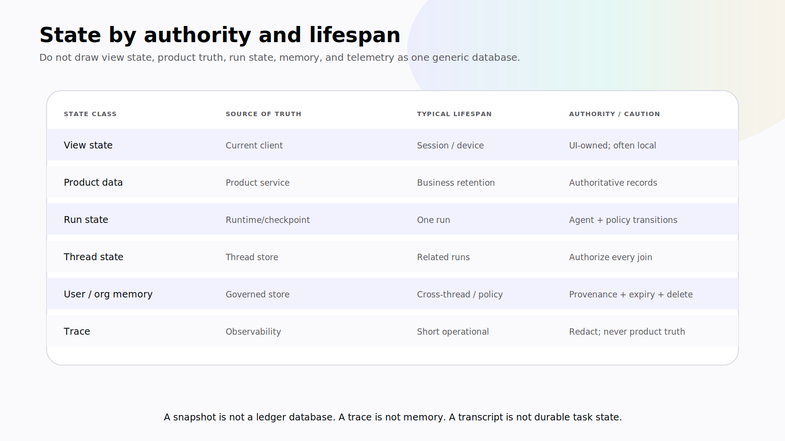
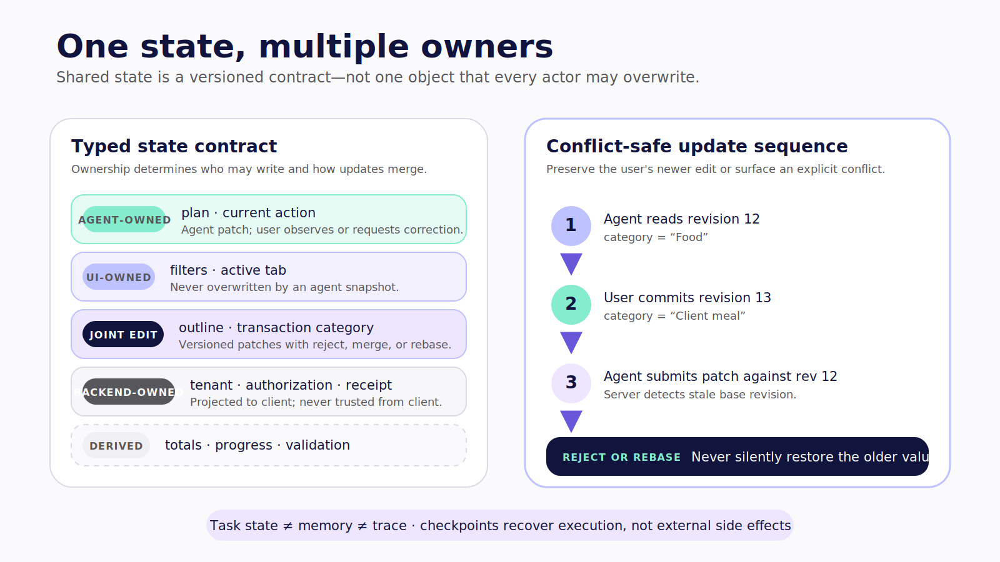
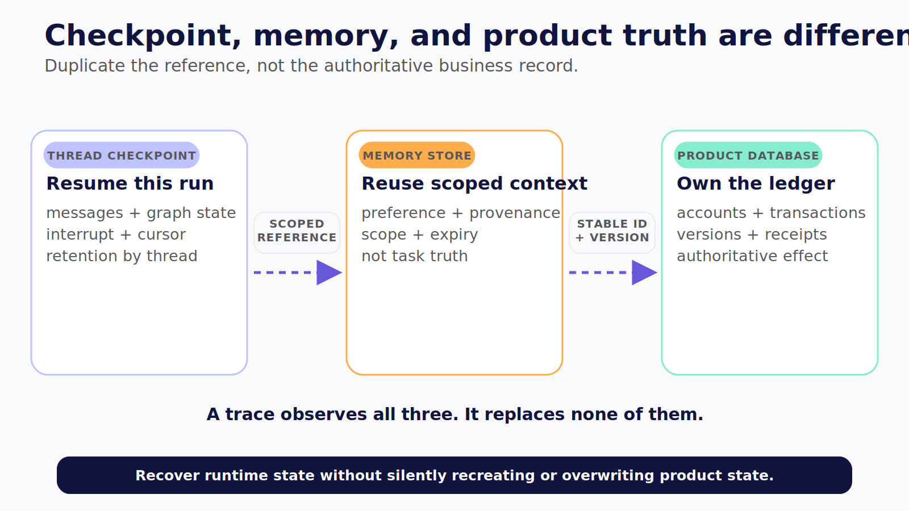
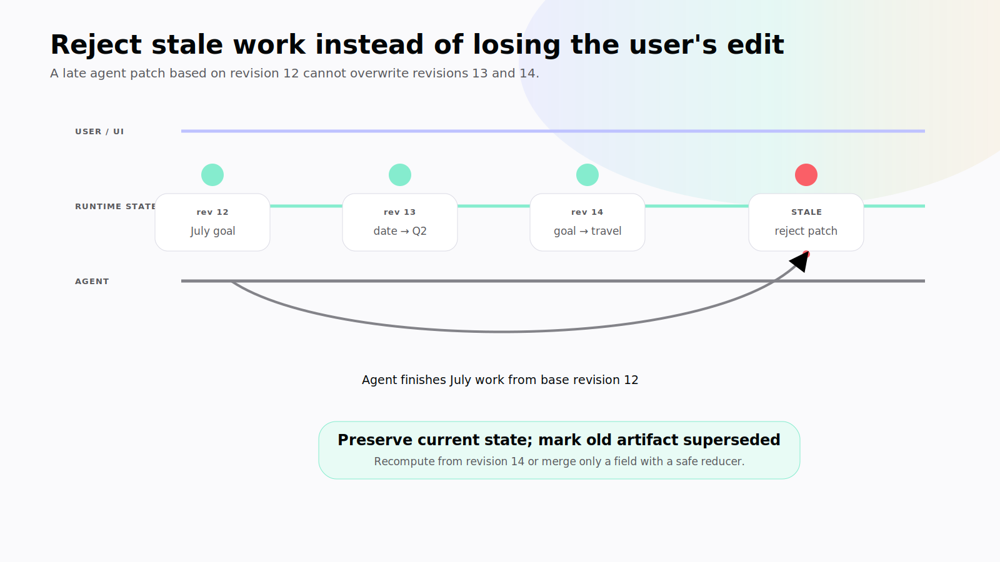

# Chapter 8 — One State, Two Editors

The agent drafts a monthly summary. While it searches for supporting transactions, the user changes the date range from July to the second quarter and edits the objective. Three seconds later, a state update produced from the old July context arrives and replaces both edits.

Nothing crashed. The UI remained responsive. The result is still wrong.

Shared state is not “put the same JSON on both sides.” It is a concurrency contract between actors that reason and update at different speeds.

> **Reader outcome:** By the end of this chapter, you will be able to classify application, run, thread, and memory state; assign field ownership; reject stale updates; add persisted LangGraph checkpoints when needed; and migrate state without losing user work or crossing tenant boundaries.

## Start with semantic state

Store facts and product objects, not sentences that happen to describe them.

Prefer:

```json
{
  "status": "working",
  "dateRange": { "from": "2026-04-01", "to": "2026-06-30" },
  "draftSummary": "Dining rose after the conference trip.",
  "selectedTransactionId": "txn_42"
}
```

Avoid making the only state:

```json
{
  "message": "I'm analyzing Q2 and you selected transaction 42."
}
```

Semantic state can drive web, mobile, tests, recovery, and accessibility. Prose is presentation. If the application must parse assistant messages to learn which date range is active, the state contract is missing.

Then separate state by lifespan and authority:

| State class           | Example                                                | Source of truth           | Typical lifespan            |
| --------------------- | ------------------------------------------------------ | ------------------------- | --------------------------- |
| View state            | Open pane, scroll position, unsaved filter             | Current client            | Session or device           |
| Application data      | Transactions, accounts, category rules                 | Product service/database  | Product retention policy    |
| Run state             | Current plan, status, proposal, intermediate artifacts | Agent runtime/checkpoint  | One run                     |
| Thread state          | Related messages and resumable task context            | Thread store/checkpointer | Multiple runs               |
| User memory           | Approved preferences, recurring intent                 | Scoped memory store       | Cross-thread with retention |
| Organizational memory | Policy and approved institutional knowledge            | Governed shared store     | Policy-defined              |
| Trace                 | Events, timing, model/tool diagnostics                 | Observability system      | Short operational retention |

An AG-UI state snapshot is not automatically your transaction database. A trace is not automatically memory. A chat transcript is not automatically the task's durable state.



*Figure 8.1 — State classes differ by authority and lifespan; a runtime snapshot is not product truth, and a trace is not memory.*

## Assign ownership field by field

The companion ledger makes ownership executable:

```ts
export const LEDGER_STATE_OWNERSHIP = {
  schemaVersion: "derived",
  revision: "derived",
  objective: "ui",
  status: "agent",
  selectedTransactionId: "ui",
  dateRange: "shared",
  draftSummary: "agent",
} as const satisfies Readonly<Record<keyof LedgerState, FieldOwner>>;
```

This is the central decision in `L1-STATE`.

- The **UI** owns the user's objective and current selection.
- The **agent** owns run status and the draft it is producing.
- The date range is **shared** because either actor may legitimately refine it.
- Schema version and revision are **derived** by the state mechanism.

“Shared” should be the exception, not the default. It requires a merge policy. If you cannot say who wins when two actors update a field, the design is incomplete.

Use four ownership labels:

1. **UI-owned:** user intent, selection, unsaved edits, presentation preference.
2. **Agent-owned:** plan status, generated draft, intermediate finding.
3. **Shared:** jointly edited artifact with an explicit reducer or conflict UI.
4. **Derived:** computed values no actor writes directly.

Product data remains outside this map unless this state object is itself the product source of truth. A transaction ID can be shared state; the transaction record belongs to the ledger service.



*Figure 8.2 — Shared state is a versioned ownership contract, not one object that every actor may overwrite.*

## Reject stale patches

Each patch should say which state revision it was based on. The companion rejects any mismatch before applying field-level ownership:

```ts
export function applyLedgerStatePatch(
  state: LedgerState,
  actor: StateActor,
  patch: LedgerStatePatch,
): LedgerState {
  if (patch.baseRevision !== state.revision) {
    throw new Error(
      `stale state patch: expected revision ${state.revision}, got ${patch.baseRevision}`,
    );
  }

  let next = state;
  const changes = patch.changes;

  if (changes.objective !== undefined) {
    assertMayWrite(actor, LEDGER_STATE_OWNERSHIP.objective, "objective");
    next = { ...next, objective: changes.objective };
  }
  // The full companion applies the same ownership check to every field.
  return { ...next, revision: state.revision + 1 };
}
```

The verified tests cover the two most important invariants:

```ts
it("rejects a stale revision", () => {
  expect(() =>
    applyLedgerStatePatch(STATE, "ui", {
      baseRevision: 3,
      changes: { objective: "Old edit" },
    }),
  ).toThrow("stale");
});

it("rejects an agent write to a UI-owned field", () => {
  expect(() =>
    applyLedgerStatePatch(STATE, "agent", {
      baseRevision: 4,
      changes: { objective: "Overwrite" },
    }),
  ).toThrow("ui-owned");
});
```

Rejection is only the first step. The runtime needs a recovery policy:

- fetch the latest state;
- preserve the user's newer edit;
- recompute agent work from current semantic input;
- apply a field-specific merge when safe;
- or surface a conflict the user can resolve.

Never solve a stale patch by silently changing its base revision and replaying it. That converts an explicit conflict into lost work.

## Reducers encode collaboration

A reducer says how concurrent or repeated updates combine. Choose it per field.

| Field shape            | Safe reducer examples                                         | Dangerous default              |
| ---------------------- | ------------------------------------------------------------- | ------------------------------ |
| Set of source IDs      | Union with stable ordering                                    | Last writer deletes sources    |
| Append-only event list | Deduplicate by event ID                                       | Blind concatenation on retries |
| User-edited text       | Versioned patch or explicit conflict                          | Agent replaces entire string   |
| Agent draft            | Replace only if objective revision matches                    | Late draft overwrites new goal |
| Progress counters      | Derive from completed step IDs                                | Add the same retry twice       |
| Date range             | Last explicit user edit, otherwise versioned agent suggestion | Arrival-time wins              |

Reducers must be deterministic and retry-safe. If replaying the same update changes the outcome twice, recovery will corrupt state.

For rich co-editing, consider operation IDs, JSON Patch with preconditions, CRDTs, or domain-specific commands. Do not introduce a distributed data structure merely to avoid choosing ownership. Most application-agent state is clearer with narrow commands and optimistic concurrency.

## Use AG-UI state as a synchronization contract

AG-UI includes state snapshot and delta event patterns. The client can use them to render runtime-owned semantic state without scraping messages. Define what each event means in your application:

```text
snapshot = complete task-state view at a known schema and revision
delta    = valid change against an expected base revision
event    = observable fact about execution, not durable product truth
```

The runtime should emit a snapshot after join or recovery, then deltas or updated snapshots under a documented ordering policy. The client should detect gaps, unknown schema versions, and out-of-order revisions. When it cannot safely apply a delta, request a fresh snapshot.

Avoid sending every product record through shared agent state. Put identifiers and compact semantic artifacts in the state, then authorize direct product reads for detail. This reduces token exposure, event volume, mobile bandwidth, and accidental retention.

State events should also avoid hidden chain-of-thought. Expose product-useful fields such as current stage, selected sources, proposal, blockers, and unresolved questions. Internal reasoning text is neither a stable schema nor a trustworthy explanation.

## Add LangGraph when state must survive the process

A short Level 1 run can keep state in an application-managed thread and use a bounded CopilotKit agent loop. A task that must pause across disconnects or process restarts needs durable runtime state.

LangGraph models execution as nodes operating on typed state. With a configured checkpointer and a stable `thread_id`, it saves checkpoints during graph execution. The tested companion extension defines semantic ledger state and compiles a two-node graph:

```py
class LedgerState(TypedDict):
    objective: str
    proposal: Proposal
    decision: Literal["pending", "approved", "rejected"]
    receipt_id: str | None


def build_ledger_graph():
    builder = StateGraph(LedgerState)
    builder.add_node("request_approval", request_approval)
    builder.add_node("commit", commit)
    builder.add_edge(START, "request_approval")
    builder.add_edge("request_approval", "commit")
    builder.add_edge("commit", END)
    return builder.compile(checkpointer=InMemorySaver())
```

`L1-GRAPH` passed its Python tests on LangGraph `1.2.9`. Its `InMemorySaver` is for a self-contained example, not production durability. A service restart loses it. Production requires an appropriate persistent checkpointer, encrypted storage, backup and restore, retention, migrations, operational monitoring, and a recovery drill. **Verified July 2026.**

LangGraph's official [persistence guide](https://docs.langchain.com/oss/python/langgraph/persistence) separates checkpointed thread state from longer-term stores. That distinction matters:

- **Checkpoint:** state needed to replay or resume this thread.
- **Store:** memory or data intentionally available beyond one thread.
- **Product database:** authoritative business records and transactions.

Do not copy the same sensitive payload into all three by default.



*Figure 8.4 — Checkpoints resume execution, memory reuses governed context, and the product database owns business truth; a trace observes all three without replacing them.*

Neither the pinned finance application nor GTM Operations Workspace audited for this book establishes a LangGraph runtime. The companion graph is an independently tested extension that teaches the pattern. Keep that evidence statement beside any graph screenshot.

## Bind threads to trusted identity

A thread identifier is a lookup key, not an access-control rule. Every create, join, snapshot, update, resume, list, and delete operation must authorize the thread against the trusted principal and tenant.

Use an internal record similar to:

```text
thread ID
tenant ID
owner or membership policy
agent/runtime type
state schema version
created and updated times
retention class
checkpoint namespace
```

Do not let the client select a checkpoint namespace that escapes its tenant. Do not accept a user ID embedded in state as authenticated identity. If users may collaborate, model membership explicitly and audit who changed which field.

Mobile rejoin needs special care. The device can lose the stream, refresh its token, and reconnect after the backend advanced. Re-authenticate, authorize the thread, retrieve the current snapshot, compare the local unsaved revision, and present a conflict rather than automatically resubmitting the goal.

Multiple browser tabs create the same problem. Test them.

## Version state before you need a migration

The companion state starts with `schemaVersion: 1`. That field becomes useful only when the runtime refuses unknown versions and you define migration behavior.

A safe rollout sequence is:

1. deploy readers that understand old and new schemas;
2. begin writing the new schema;
3. migrate durable checkpoints or migrate on read under a tested function;
4. observe old-version volume and failures;
5. remove old readers only after retained threads expire or migrate.

Pin component schemas, tool schemas, state schemas, and runtime versions together in a compatibility manifest. A renderer built for proposal version 1 should fail clearly if version 2 changes currency or account semantics.

Migration tests should use real historical fixtures with synthetic sensitive data. Test paused threads, not only completed ones. A deploy that can read old messages but cannot resume an old interrupt is not backward compatible.

## Memory requires provenance and deletion

Useful memory is deliberately written, scoped, and governed. “The user prefers summaries under five bullets” may be an approved preference. “The user spent heavily on dining” is time-bound financial data that should not become a permanent cross-thread personality fact.

Every memory entry should carry:

- subject and tenant scope;
- source and retrieval time;
- who or what wrote it;
- confidence or verification state;
- purpose;
- retention or expiry;
- visibility and editability;
- deletion path.

Do not promote model inference into memory without a product rule. Do not let retrieved text instruct the agent to rewrite policy or access control. Treat memory as data that can be stale, poisoned, overbroad, or legally sensitive.

Tracing has a different purpose. Keep enough event metadata to diagnose runs, but redact financial details, secrets, raw credentials, and unnecessary personal data. Sample and retain traces according to an explicit operational policy. Debug convenience is not consent for indefinite storage.

## Walk through the lost-edit race

Make concurrency visible with one timeline:

```text
revision 12: objective = "Review July", dateRange = July
agent starts analysis from revision 12
user patch at base 12 changes dateRange to Q2
revision 13: dateRange = Q2
user patch at base 13 changes objective to "Explain travel impact"
revision 14: objective = travel impact
agent finishes July draft and submits patch at base 12
runtime rejects stale patch
```



*Figure 8.3 — Reject stale work, preserve the user's newer intent, and recompute from the current semantic state instead of silently rebasing obsolete conclusions.*

After rejection, the runtime should not merely retry the old draft against revision 14. Its evidence and conclusion were produced from July. It should mark the old work superseded, preserve it in the trace if policy permits, and begin a new bounded analysis from the current objective and date range.

Now change the field. Suppose the agent patch adds source ID `txn_42` to a shared evidence set and that ID remains inside Q2. A deterministic union reducer may safely rebase that one operation after revalidation. The correct recovery depends on field semantics, not on which actor arrived last.

Expose the outcome in the UI. “Your date change updated the analysis; the July draft was discarded” teaches the user what happened. A silent restart looks like latency. A silent overwrite looks like betrayal.

Test the same race across two clients. A phone changes the date range while the web app changes the selected transaction. The selection may remain device-local, while the date range becomes thread state. If both are stored in one undifferentiated object, harmless view behavior can create unnecessary global conflicts.

## Plan checkpoint recovery as an operation

Persistence is only useful if operators can recover it. Document how to list stuck threads without exposing payloads, inspect the current node and schema version, expire abandoned runs, replay from a safe checkpoint, and reconcile external receipts.

Define recovery invariants:

- never resume a thread under a different tenant or agent version accidentally;
- never repeat a non-idempotent effect to reconstruct state;
- never discard a pending human decision without a terminal record;
- never migrate a checkpoint without retaining a reversible backup or tested path;
- never expose raw financial state to an operator who lacks product-data access.

Run a game day with synthetic threads: one paused on approval, one between external commit and receipt persistence, one on an old schema, and one with a missing state delta. Measure whether the team can diagnose and restore each case from documented signals. A database backup alone does not prove graph recovery; the runtime, product service, and operation ledger must agree on what already happened.

Recovery tools need the same boundaries as customer tools. An operator may be allowed to inspect status and retry a safe read without seeing transaction content. Resuming a consequential node may require an audited break-glass role and a second reviewer. Avoid a console that can edit arbitrary checkpoint JSON; it bypasses schema migrations, ownership rules, and product authorization.

When manual repair is unavoidable, record the before state, intended invariant, approved command, actor, time, and resulting receipt. Then turn the incident into a deterministic repair function and regression fixture. Operational state edits are part of the system's behavior, even when they happen outside the agent UI.

Practice that path before an incident; recovery procedures written only after corruption are assumptions, not controls.

## Failure drills

### A late agent patch overwrites a user edit

Reject it by revision and ownership. Recompute from current input or show a conflict.

### A client misses two state deltas

Detect the revision gap and request a fresh authorized snapshot. Do not guess the missing operations.

### A service restarts during a paused graph

An in-memory checkpointer loses the task. A production design restores the thread from a persistent checkpointer and verifies pending external effects before continuing.

### A second tenant guesses a thread ID

Return no data and log the authorization failure. The identifier's entropy is not the primary defense.

### A new deployment cannot read an old checkpoint

Stop and surface a migration error. Do not discard state or restart a consequential task from the beginning.

### A trace contains full transaction payloads

Treat it as a data-handling incident. Redact at instrumentation boundaries and shorten retention; hiding fields in the UI is insufficient.

## Exercise — Write the state contract

For the ledger, complete this worksheet before connecting the agent:

```text
field:
semantic type and schema version:
owner: UI | agent | shared | derived
source of truth:
base revision/precondition:
merge or rejection rule:
visibility and data class:
checkpointed?:
cross-thread memory?:
retention and deletion:
migration fixture:
```

Then simulate: a user edits the date range while the agent finishes a draft based on the prior revision. The correct outcome must be deterministic.

## Builder Checklist

- [ ] Product data, view state, run state, thread state, memory, and traces are separated.
- [ ] Every shared-state field has an owner and merge or rejection rule.
- [ ] Patches carry revisions, and stale patches fail without lost work.
- [ ] Reducers are deterministic, retry-safe, and field-specific.
- [ ] AG-UI snapshots and deltas have explicit schema and ordering semantics.
- [ ] Thread access is authorized for every operation.
- [ ] Checkpointer choice matches the durability claim.
- [ ] State and paused-thread migrations are tested before deployment.
- [ ] Memory has provenance, scope, retention, edit, and deletion rules.
- [ ] Traces exclude unnecessary sensitive payloads.

## Bridge

The application can now preserve current intent and resume from known state. That creates the foundation for a meaningful pause.

Chapter 9 turns human review from a transient button click into a version-bound, identity-bound, idempotent interruption that can survive disconnect and resume safely.
