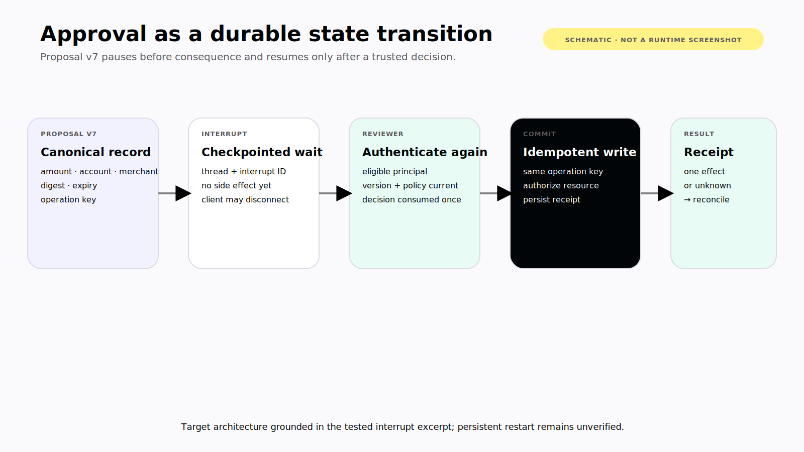
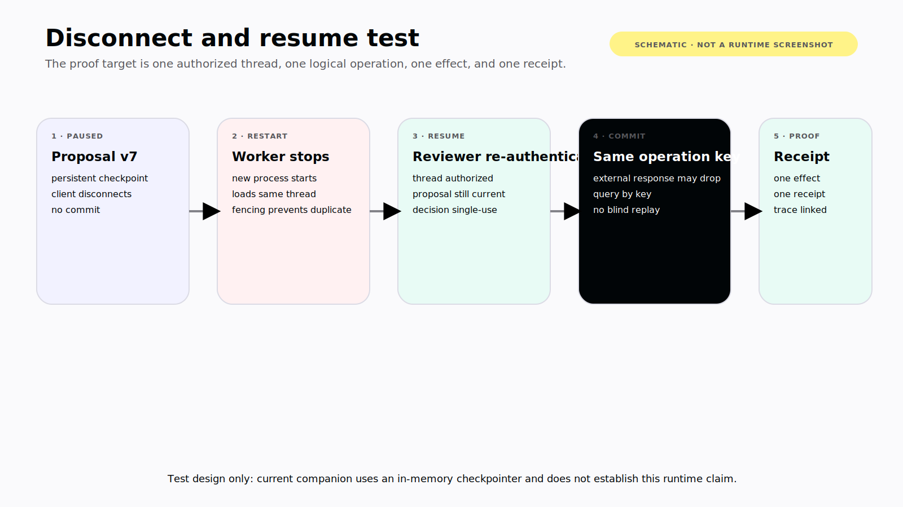

# Chapter 9 — The Right Moment to Ask

“Allow?” is not an approval interface.

Allow what action, against which account, for which amount, using which proposal version? Who requested it? Who may approve it? How long does the decision remain valid? Is the action reversible? Has it already happened?

Human-in-the-loop is not the presence of two buttons. It is a state transition in a running system.

> **Reader outcome:** By the end of this chapter, you will be able to choose between an immediate frontend decision and a durable runtime interrupt, bind approvals to exact proposals and eligible principals, resume safely after disconnect, and distinguish stopping future work from undoing past effects.

## Pause at a decision boundary

Do not ask for approval on every tool call. Repeated low-information prompts train people to click through them. Pause where a human can change the outcome:

- before an irreversible or costly effect;
- before external communication or publication;
- before a durable write outside the user's current editing context;
- when identity or authorization must be elevated;
- when ambiguity changes the target or consequence;
- when policy requires separation of duties;
- when the agent cannot safely choose among materially different options.

A good decision card shows:

```text
action and target
exact proposed arguments
expected effect
evidence and assumptions
reversibility or compensation path
requesting agent and originating user
eligible reviewer
proposal version and expiration
Approve, Reject, Edit, or provide missing context
```

The card should let the reviewer understand the consequence without reading the entire conversation. It should not expose hidden reasoning or sensitive internal traces.



*Figure 9.1 — Target architecture for a durable approval transition, grounded in the companion's tested in-memory interrupt path. Persistent restart behavior remains unverified; this is not a runtime screenshot.*

## Choose the right kind of wait

Level 1 applications commonly need two different human-interaction patterns.

| Pattern            | Frontend-mediated tool wait                                 | Durable runtime interrupt                                            |
| ------------------ | ----------------------------------------------------------- | -------------------------------------------------------------------- |
| CopilotKit surface | `useHumanInTheLoop`                                         | LangGraph interrupt rendered with CopilotKit's interrupt integration |
| Best for           | Present user, short wait, missing input or immediate review | Disconnect, long wait, process restart, external reviewer            |
| State holder       | Active client/tool handler plus runtime integration         | Checkpointed graph thread                                            |
| Resume identity    | Current tool interaction                                    | Same authorized thread and interrupt                                 |
| Durability         | Application/runtime-specific                                | Checkpointer-defined                                                 |
| Main risk          | Tab closes before response                                  | Replayed, stale, or wrongly authorized resume                        |

In the pinned v2 source, `useHumanInTheLoop` holds the frontend handler's Promise until `respond` is called. This is useful when the decision belongs in the active client. It does not automatically make the wait survive a browser refresh, mobile process death, runtime restart, or handoff to another reviewer.

A LangGraph `interrupt()` pauses graph execution and relies on checkpointed thread state. The external caller resumes the same thread with a decision. CopilotKit's [`useInterrupt` reference](https://docs.copilotkit.ai/reference/hooks/useInterrupt) describes the frontend side of the LangGraph-specific flow; LangGraph's official [`interrupt` guide](https://docs.langchain.com/oss/python/langgraph/interrupts) defines the runtime semantics. Pin and test the exact integration you publish.

Use the lighter mechanism when the user is present and losing the interaction is harmless or recoverable. Use a durable interrupt when the task must wait beyond the connection or when another actor may decide.

## Bind the decision to a versioned proposal

An approval must identify the exact thing reviewed. The ledger proposal carries:

```py
class Proposal(TypedDict):
    amount_cents: int
    merchant: str
    version: int
    idempotency_key: str
```

In production, add currency, target account, category, evidence references, effect classification, reversibility, expiry, and a server-generated proposal ID. Keep secrets and unnecessary sensitive data out of the decision payload.

If any material field changes, increment the proposal version and invalidate prior approval. A change from $42 to $420 is obvious. A change of account, recipient, environment, currency, or attached file is just as material.

Do not ask the model whether a change is material. Define the comparison in product code.

## Interrupt before the effect

The tested `L1-GRAPH` extension pauses before committing:

```py
def request_approval(state: LedgerState) -> dict[str, str]:
    proposal = state["proposal"]
    # LangGraph restarts this node on resume. Keep side effects after interrupt.
    decision: ApprovalDecision = interrupt(
        {
            "type": "ledger_write_approval",
            "proposal": proposal,
            "expected_version": proposal["version"],
        }
    )
    if decision["proposal_version"] != proposal["version"]:
        raise ValueError("approval does not match current proposal version")
    return {"decision": "approved" if decision["approved"] else "rejected"}
```

The ordering is critical. LangGraph restarts the node from the beginning when execution resumes. Pure reads and deterministic preparation before `interrupt()` are safe. An email, payment, transaction insert, or counter increment before the interrupt may run again.

Put consequential effects after the interrupt, preferably in a separate node. Make them idempotent anyway, because process failure can occur after the external system commits and before the graph records the result.

The companion's `commit` node demonstrates the contract without a real write:

```py
def commit(state: LedgerState) -> dict[str, str | None]:
    if state["decision"] != "approved":
        return {"receipt_id": None}
    return {"receipt_id": f"receipt:{state['proposal']['idempotency_key']}"}
```

That receipt is synthetic. A production adapter should call the authenticated boundary from Chapter 6, pass the same stable idempotency key, and persist the product service's authoritative receipt. The graph test used `InMemorySaver`; durable pause/resume claims require a persistent checkpointer and a restart test.

## Authenticate the resume

The resume endpoint is a privileged action. An interrupt identifier or thread ID does not prove that the caller may decide.

At resume time:

1. authenticate the caller again;
2. authorize access to the tenant and thread;
3. verify that the caller is an eligible reviewer;
4. load the current interrupt and proposal from trusted checkpoint state;
5. compare proposal version and decision expiry;
6. ensure the decision ID has not already been consumed;
7. validate any edited arguments through the normal policy boundary;
8. record reviewer identity, time, decision, and evidence;
9. resume the same thread exactly once;
10. execute the idempotent effect and persist its receipt.

Do not trust `reviewerId`, `tenantId`, `approvedProposalVersion`, or role claims supplied in the decision body. Derive them from server authentication and policy.

If approval requires recent authentication, prompt for it before accepting the decision. The original login may be hours old by the time a long-running task resumes.

## Store a decision record

An approval history needs more structure than a chat message:

```text
decision ID
tenant and thread ID
interrupt ID
proposal ID and version
proposal digest or canonical arguments
effect and reversibility
eligible-reviewer policy
reviewer principal and authentication strength
approved | rejected | edited | expired
decision time and expiry
idempotency key
commit receipt or terminal failure
```

Use a canonical representation or server-side proposal record so the approved arguments cannot be swapped between review and commit. The approval record should reference evidence, not duplicate every sensitive payload into an audit log.

An “Edit and approve” flow creates a new proposal version unless policy explicitly treats the edit as the decision payload and validates it as such. Make that transition visible. Silent mutation destroys the meaning of the audit trail.

For multi-user applications, decide whether one approval is enough, whether the requester may approve their own action, and whether roles must be separated. Those are product policy questions, not model prompts.

## Survive disconnect and handoff

A browser refresh or mobile background transition can occur while the graph is paused. The client should recover through durable identifiers and server truth:

```text
re-authenticate
→ authorize thread
→ fetch current run and interrupt state
→ reconcile local unsaved input
→ render current proposal and eligibility
→ submit one versioned decision
```

Do not automatically resubmit the original goal. That can create a second run and a second proposal. Do not assume a disconnected client means the runtime stopped.

If a different reviewer opens the task, show the same canonical proposal and current state. Record the actual reviewer. If the original requester no longer has permission, do not preserve authority merely because the task began earlier.

If the proposal expires while the app is offline, show it as expired and require regeneration. If policy or account data changed, reevaluate authorization even when the proposal version did not.

## Stop, cancel, reject, and rollback are different

Agentic interfaces often place one red “Stop” button over several incompatible operations.

| User intent             | System behavior                                               |
| ----------------------- | ------------------------------------------------------------- |
| Stop generation         | End current model token production                            |
| Cancel current tool     | Request cooperative cancellation; outcome may remain unknown  |
| Halt after current step | Prevent the runtime from selecting another step               |
| Reject proposal         | Resume the paused task with a negative decision               |
| Terminate run           | Move the run to a terminal state and block further execution  |
| Roll back               | Reverse already committed effects where a true inverse exists |
| Compensate              | Perform a new action that mitigates a prior effect            |

Stopping a stream does not unsend an email. Cancelling an HTTP request does not prove the database transaction aborted. Restoring a LangGraph checkpoint does not automatically reverse a product-service write.

Every consequential tool should declare whether it is reversible and how:

- exact inverse, such as removing an uncommitted draft;
- compensating action, such as creating a correcting ledger entry;
- provider-specific cancellation before settlement;
- manual recovery;
- irreversible.

Show the user what actually happened. “Run stopped; one transaction was already created” is honest. “Cancelled” alone is not.

## Timeouts and escalation

Every pending decision needs a timeout policy:

- expire and terminate;
- expire and regenerate against current data;
- route to another eligible reviewer;
- fall back to a safer read-only outcome;
- remain paused under retention and cost limits.

Never interpret silence as approval for a consequential action. Avoid indefinite checkpoints without retention, notification, and cleanup. Expired interrupts should become terminal or explicitly regenerable states, not invisible storage leaks.

Escalation should preserve context and authority boundaries. A manager receiving an approval request needs the exact proposal, evidence, and effect—not an exported chain-of-thought. If the organization requires two reviewers, model two decisions and their order explicitly.

## Walk the proposal through every state

Use a state machine rather than a collection of button booleans:

```text
draft
  → pending_review
  → approved | rejected | expired | superseded
approved
  → committing
  → committed | failed_known | outcome_unknown
outcome_unknown
  → reconciled_committed | reconciled_not_committed | manual_review
```


*Figure 9.3 — Every proposal transition has an authorized actor and precondition; material edits create a new version, and ambiguous commits enter reconciliation rather than blind retry.*

Every transition has one authorized actor and a precondition. The agent may create a draft. Trusted runtime code publishes a pending proposal. An eligible human decides. The product service commits. A reconciliation worker resolves unknown outcomes. The model does not skip states because the user typed “just do it.”

Consider a concrete run. Proposal 7 requests a $42 transaction at Transit Cafe. The reviewer opens the card, but before approving, a receipt parser changes the merchant to Transit Café and the amount to $47. The runtime creates proposal 8 and marks proposal 7 superseded. Clicking an old notification for proposal 7 must return a stale-decision result without resuming the graph. Proposal 8 requires a new review because amount changed; product code defines that rule.

After approval, the runtime writes with operation key `ledger:thread-9:proposal-8`. The ledger service commits and returns transaction `txn_88`, but the response connection drops. The runtime records `outcome_unknown`, then queries by the same idempotency key. It finds `txn_88`, stores the receipt, and completes. It does not create proposal 9 or call create with a new key.

This sequence gives the UI honest states. Pending review can show actions. Superseded and expired proposals are read-only. Committing cannot promise success. Unknown outcome asks the user not to retry manually until reconciliation finishes. Committed shows the authoritative receipt and any compensation option.

## Make edits and delegation explicit

Approval workflows often need more than yes or no. “Edit” can mean sending suggestions back to the agent, changing permitted fields directly, or creating a replacement proposal. Pick one and encode it.

If reviewers may edit arguments, define editable fields, validation, and whether the editor becomes the proposer. Re-run authorization and risk classification. Recalculate any evidence affected by the edit. Assign a new version and capture both the original and replacement references without duplicating sensitive data.

Delegation also changes authority. Forwarding a link should not grant approval rights. The server resolves the recipient's current role when they open the decision. If policy routes an expired request to another reviewer, record the transition and notify the original requester. A shared team role may be eligible, but the audit record still names the individual principal who decided.

For separation of duties, model requester, preparer, and approver roles independently. A model acting for the requester cannot satisfy a human approval requirement. An administrator should not bypass dual approval through a generic debug endpoint. Emergency overrides need their own explicit policy, stronger authentication, reason, alert, and review.

Notifications are invitations to inspect, not approval tokens. Email, push, Slack, or an in-app badge may deep-link to the pending decision, but the destination must authenticate, authorize, and load the current proposal. Never encode a reusable approve action in a link that a scanner, forwarded message, or notification preview can trigger.

## Failure and security review: test pause and resume as a distributed system

The happy path is the smallest test. Add scenarios for:

- approve with matching version;
- reject;
- edit into a new version;
- stale version;
- expired proposal;
- unauthorized reviewer;
- reviewer loses permission before resume;
- duplicate decision submission;
- duplicate runtime resume;
- process restart while paused;
- mobile disconnect and rejoin;
- external commit succeeds but receipt persistence fails;
- cancellation before and after the effect;
- compensation succeeds and fails.

For the restart test, use the production-class persistent checkpointer, stop the process, start a new worker, resume the same authorized thread, and verify one external effect and one receipt. An in-memory unit test cannot prove this.

For security testing, attempt to resume another tenant's interrupt, swap proposal arguments, replay an old approval, and call the product write without an approval record. All should fail below the model layer.



*Figure 9.2 — Persistent disconnect-and-resume test design. The companion has not yet executed this persistent-checkpointer scenario, so the figure is a specification rather than runtime evidence.*

## Exercise — Design the ledger approval

Write the full contract for creating a synthetic ledger transaction:

```text
proposal ID and version:
canonical arguments:
effect and reversibility:
evidence shown:
eligible reviewer policy:
fresh-auth requirement:
expiry:
decision states:
idempotency key origin:
resume authorization:
commit boundary:
receipt:
cancel behavior before commit:
compensation after commit:
retention and audit fields:
restart and replay tests:
```

Then change the amount after approval. The old decision must become unusable without relying on the UI button state.

## Builder Checklist

- [ ] Pauses occur at meaningful consequence or ambiguity boundaries.
- [ ] Decision UI shows exact action, target, effect, evidence, version, and expiry.
- [ ] Immediate frontend waits and durable runtime interrupts are used intentionally.
- [ ] Every resume re-authenticates and re-authorizes the reviewer.
- [ ] Approval is bound to a canonical, versioned proposal.
- [ ] Side effects occur after `interrupt()` and are idempotent.
- [ ] Duplicate, stale, expired, and cross-tenant decisions fail closed.
- [ ] Disconnect recovery rejoins the same run rather than creating another.
- [ ] Stop, cancel, reject, rollback, and compensation have distinct semantics.
- [ ] Persistent restart and one-effect receipt tests exist before durability claims.

## Bridge

The Level 1 application now has a UI control plane, trustworthy tools, semantic components, conflict-safe state, and resumable human decisions.

Chapter 10 treats those pieces as one deployable system. The finish line is not a successful model response; it is a release you can authenticate, observe, evaluate, recover, and roll back without lying to the user.
