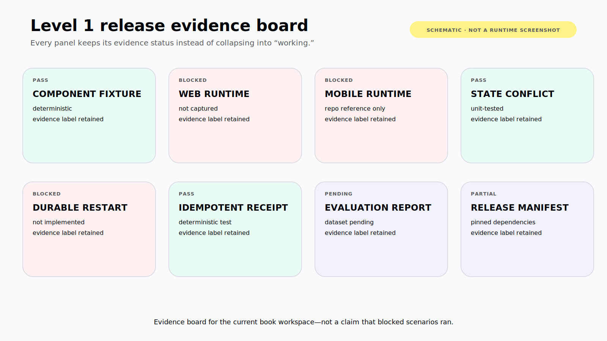

# Chapter 10 — Ship the Whole System

The ledger works on the developer's laptop. The model answers the demo question. The chart renders. The approval button creates one synthetic transaction.

None of that tells you what happens when a mobile client reconnects to an old thread, a model update chooses a different tool, two workers resume the same interrupt, a tenant ID is forged, or a tool times out after the external write commits.

You are not shipping a prompt. You are shipping a distributed product with a nondeterministic decision-maker inside it.

> **Reader outcome:** By the end of this chapter, you will be able to define a Level 1 production topology, compatibility contract, evaluation suite, observability model, rollout plan, and release gate for a web-and-mobile agentic application.

## Draw the production path

Start with the full path that must hold:

```text
web or mobile client
  → authenticated CopilotKit / AG-UI gateway
  → server-allowlisted agent runtime
  → model and tool-selection loop
  → policy-enforced tool boundary
  → product services and databases
  → checkpoint, thread, audit, and trace stores
  → semantic result and authoritative receipt
```

Each arrow needs an owner, timeout, authentication rule, retry contract, correlation ID, and failure state. Each store needs tenant isolation, encryption, retention, deletion, backup, restore, and schema migration.

For the ledger, deploy read and write paths separately where practical. Reads can use scoped service credentials and return compact semantic results. Writes pass through approval, current policy, idempotency, and a product-service receipt. The agent runtime does not receive a general database connection simply because both paths happen in one local demo.


*Figure 10.1 — A production Level 1 topology keeps identity continuous, separates read and write authority, and correlates runtime state with product receipts and redacted evidence.*

## Release a compatibility set

Agentic applications have more versioned surfaces than ordinary client/server products:

- web and mobile application versions;
- CopilotKit package and runtime versions;
- AG-UI event contract;
- LangChain/LangGraph versions when used;
- model provider and exact model identifier;
- system instructions and tool descriptions;
- tool argument and result schemas;
- shared-state and checkpoint schemas;
- semantic component schemas;
- product-service API versions;
- evaluation dataset and evaluator versions.

Record them in one release manifest. Do not publish “latest” as a reproducible configuration.

A safe compatibility gate answers:

```text
Can the new client join an old thread?
Can the new runtime read and resume an old checkpoint?
Can the old client render the new semantic artifact safely?
Can a model change call the same tools with valid arguments?
Can a rolling deployment prevent two commits for one operation?
Can the release be rolled back without orphaning paused work?
```

The book's companion proves a narrower envelope: TypeScript formatting, typechecking, tests, and build; Python formatting and tests; compile verification against pinned CopilotKit and LangGraph dependencies. It does not prove a live browser, live model, durable database, mobile platform run, or production deployment. **Verified July 2026.**

## Make identity continuous

Authentication cannot end at the chat shell. Carry trusted identity and tenancy through the gateway, thread access, runtime, tool policy, product service, audit record, and observability correlation.

The client may supply a session token. Server middleware verifies it and derives the principal. The runtime receives a constrained identity context, not a user-editable identity field. Product services authorize resources again.

Test at least:

- anonymous access to every runtime and thread route;
- user A reading, joining, or resuming user B's thread;
- tenant A passing tenant B's resource identifier;
- a client selecting an unapproved agent, model, or backend;
- expired credentials during a long pause;
- revoked role before approval resume;
- sensitive tool results in logs, events, and analytics.

Use synthetic accounts for the book. Do not put real personal-finance data in screenshots, traces, fixtures, or prompts.

## Engineer latency as visible state

Users experience latency in stages: request acceptance, time to first useful event, tool execution, first artifact, human wait, and terminal completion. Measure each separately.

Stream what helps the user act:

- accepted goal and current stage;
- bounded progress such as sources searched or files processed;
- safe tool activity;
- partial semantic artifacts when structurally valid;
- blockers and approval requests;
- authoritative receipts.

Avoid fake percentages for open-ended work. Do not stream hidden reasoning. A stage such as “Searching July transactions” is useful; a constantly changing model monologue is not.

Set budgets for steps, tokens, wall time, tool calls, result size, retries, and cost. When a budget ends, produce a truthful partial outcome and recovery path. Define whether stopping the client stream stops the runtime, and whether the runtime can rejoin after mobile backgrounding.

Caching also needs policy. Cache immutable public references or safe deterministic transformations. Be cautious with personalized ledger results, authorization-dependent data, stale approvals, and tool results that can change after a write. A cache hit must preserve tenant scope and freshness semantics.

## Observe evidence, not private reasoning

Correlate:

```text
request → run → thread → step → tool call → product operation → receipt
```

For each run, capture model and prompt version, allowed tools, validated arguments or redacted digest, lifecycle timing, state revision, approval decision metadata, retries, terminal outcome, and cost. Record enough to reconstruct operational behavior without storing unnecessary sensitive payloads.

Useful Level 1 metrics include:

- task success rate;
- correct-tool and valid-argument rate;
- time to first useful artifact;
- p50 and p95 run duration;
- tool error, timeout, and retry rate;
- stale-state rejection rate;
- approval, rejection, expiry, and replay-rejection rate;
- disconnect/rejoin success rate;
- duplicate-effect rate;
- cost per successful task;
- accessibility and client crash regressions.

LangSmith can support trace inspection, datasets, and offline or online evaluation; its official [evaluation guidance](https://docs.langchain.com/langsmith/evaluation) should be pinned and rechecked with the plan and retention model used at publication time. An OpenTelemetry-based stack can carry similar operational signals. The product requirement is the evidence, not a particular vendor. **Verified July 2026.**

## Evaluate the result and the trajectory

A fluent answer can hide the wrong path. Evaluate multiple layers:

| Layer          | Ledger example                                         | Evaluation method                         |
| -------------- | ------------------------------------------------------ | ----------------------------------------- |
| Final result   | Correct overspending categories and totals             | Deterministic calculation against fixture |
| Tool selection | Uses scoped search, never a generic privileged tool    | Exact or judged trajectory check          |
| Arguments      | Correct date range, account scope, limits              | Schema plus domain assertions             |
| State          | Preserves user objective and revision                  | Reducer and concurrency tests             |
| Policy         | No write without current eligible approval             | Adversarial scenario                      |
| Recovery       | One effect after timeout, restart, or duplicate resume | Fault-injection integration test          |
| UI             | Correct lifecycle, accessible semantic result          | Component and end-to-end tests            |
| Evidence       | Claims map to transactions and calculation time        | Citation/provenance assertion             |

Build a versioned dataset of realistic goals, not only prompts that match your descriptions. Include terse requests, ambiguous pronouns, conflicting edits, prompt injection in merchant text, empty ledgers, large result sets, and requests outside the agent's authority.

Keep deterministic expectations deterministic. Exact totals, tenant isolation, schema validity, and one-write guarantees should not depend on an LLM judge. Use model-based evaluators for genuinely qualitative properties, calibrate them against human review, and pin their prompts and models.

Production failures should become regression cases with redacted or synthetic fixtures. Track whether a release improves the target outcome without increasing cost, latency, intervention, or unsafe trajectories.

Define service objectives around user outcomes, not token throughput. Measure the share of accepted runs that produce a first useful artifact within the target window, the share that reach a truthful terminal state, and the share of approved writes that produce exactly one receipt. Set a separate objective for rejoining an active mobile run. Error budgets should trigger narrower capability, model rollback, or read-only mode—not pressure to relabel unknown outcomes as success.

## Failure and security review: run the release scenario suite

Before a Level 1 release, run this minimum suite against the actual release manifest:

1. Web asks “Where did I overspend?” and receives a typed, sourced artifact.
2. Mobile runs the same semantic task and survives background/rejoin.
3. User changes the date range while the agent works; no edit is lost.
4. Protected search rejects a cross-tenant identifier.
5. Transaction proposal shows exact effect and version.
6. Stale, expired, duplicate, and unauthorized approvals fail.
7. Runtime restarts while paused and resumes one authorized thread.
8. External write commits while response is lost; retry returns one receipt.
9. Cancellation before and after commit reports different truthful outcomes.
10. New model and prompt versions meet trajectory, quality, latency, and cost gates.
11. Old client/new runtime and new client/old thread compatibility are exercised.
12. Trace and screenshot review finds no secrets or real financial data.

Mark each result with evidence status:

```text
source-present | compile-verified | unit-tested | integration-tested
runtime-verified | restart-verified | platform-verified | production-observed
```

Do not collapse those labels into “working.”



*Figure 10.2 — Honest release-evidence board. Each panel is labeled by evidence strength; blocked panels are requirements, not claims of runtime completion.*

## Roll out by authority, not excitement

Increase scope in controlled stages:

```text
internal synthetic data
→ read-only employee dogfood
→ narrow user cohort with read tools
→ draft/proposal tools
→ approval-gated reversible writes
→ broader rollout after recovery evidence
```

At each stage, define entry and rollback criteria. A kill switch should disable individual tools, agent versions, model versions, or write paths without taking the entire product offline. Prefer a read-only degraded mode to an unannounced fallback model with different behavior.

Use canaries for runtime and schema changes. Drain or explicitly migrate paused work before incompatible deploys. Keep old workers available long enough to finish compatible threads, or route threads by runtime version.

Review operational ownership before launch:

- Who responds to model-provider failure?
- Who can disable a tool?
- Who handles stuck interrupts and unknown writes?
- Who approves state and checkpoint migrations?
- Who reviews cross-tenant alerts?
- Who owns user deletion across threads, memory, traces, and backups?

If the answer is “the AI team” for every item, the system has no usable incident boundary.

## Make screenshots reproducible

Screenshots in an actionable book are test artifacts, not decoration. Every capture should have a small record:

```text
repository and immutable commit
release manifest
command and environment
synthetic fixture or dataset ID
platform, viewport, and accessibility setting
runtime/model configuration
scenario and expected result
capture date
evidence status and known gaps
```

Blur is not a substitute for synthetic data. Capture deterministic component states before live-model variants. For mobile, include platform and OS version. For streamed UI, capture the lifecycle grid rather than selecting only the prettiest final frame.

The current finance and GTM Operations Workspace images in the workspace remain reference-only. They can guide composition, but they do not prove the companion ran. The final publication should replace or caption them accordingly.

## Production Readiness Gate

Score each item `0` absent, `1` designed, `2` tested, `3` recovery-tested in the release environment:

| Category             | Required evidence                                   |
| -------------------- | --------------------------------------------------- |
| Identity and tenancy | Cross-tenant and revoked-access tests               |
| Tools and policy     | Risk inventory, narrow schemas, authorization tests |
| State                | Ownership, revisions, migration, conflict tests     |
| Persistence          | Restart, resume, backup, and restore exercise       |
| Human control        | Versioned approval, expiry, replay rejection        |
| Idempotency          | One effect and one receipt under fault injection    |
| UI                   | Lifecycle, accessibility, web/mobile platform runs  |
| Evaluation           | Versioned dataset and release comparison            |
| Observability        | Correlated redacted trace and alerts                |
| Operations           | Budgets, kill switches, rollback, incident owner    |

Do not ship consequential writes with a zero in identity, policy, approval, or idempotency. A production target should have no unowned category and no claim whose evidence label is weaker than the risk permits.

## Exercise — Write the Level 1 release packet

Create one reviewable packet for the synthetic ledger:

```text
architecture and trust boundaries
release compatibility manifest
tool risk inventory
state ownership and migration plan
approval and idempotency contract
web/mobile lifecycle behavior
scenario dataset and results
latency, cost, and reliability budgets
redacted trace example
rollback and kill-switch runbook
screenshot evidence ledger
known gaps and next proof required
```

A reviewer should be able to reject the release without opening the source code, then inspect code and traces to verify every high-risk claim.

## Builder Checklist

- [ ] The full client-to-receipt topology is owned and observable.
- [ ] Versions form one reproducible compatibility manifest.
- [ ] Identity and tenancy are enforced through every thread and tool boundary.
- [ ] Latency, retry, step, token, result-size, and cost budgets exist.
- [ ] Final output, trajectory, state, policy, recovery, and UI are evaluated.
- [ ] Web and mobile lifecycle scenarios run against the release candidate.
- [ ] Persistent restart and idempotent unknown-outcome tests pass.
- [ ] Traces, fixtures, and screenshots use redacted or synthetic data.
- [ ] Rollout stages, degraded mode, kill switches, and incident owners are defined.
- [ ] Evidence labels match what was actually inspected or executed.

## Bridge to Level 2

Level 1 constrains the agent to the authority and context of an application. That boundary is powerful: it lets builders design explicit tools, state, UI, approvals, and receipts around product semantics.

Level 2 changes the surface. The agent gains a workspace, filesystem, shell, installed CLIs, credentials, and potentially a dedicated machine. The same production disciplines still apply, but the capability set is broader, more discoverable, and harder to reverse.

The next part opens that machine boundary without forgetting what this application layer taught us: authority must remain legible, interruptible, and accountable.
