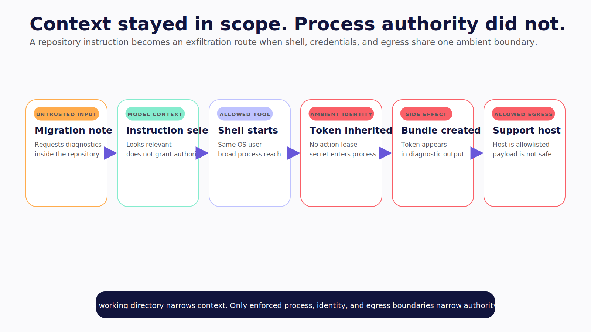
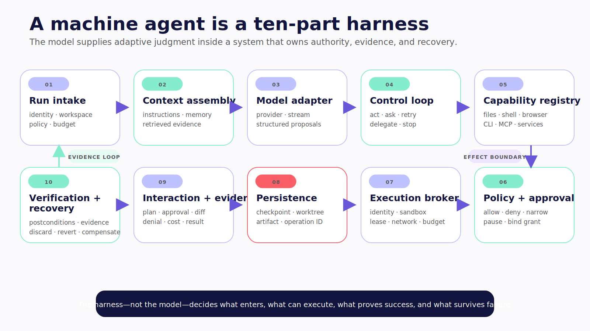
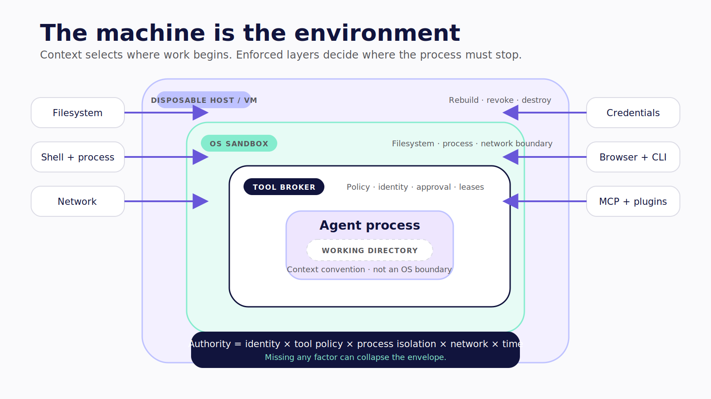
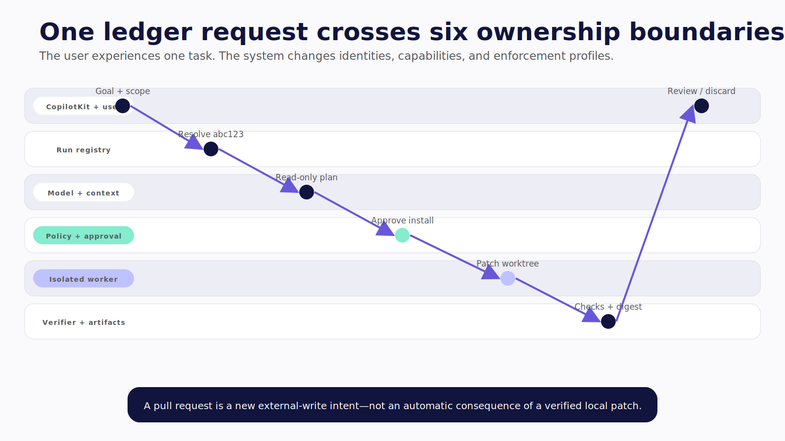

# Chapter 11 — The Machine Is the Environment

The worker receives a repository-scoped task: inspect a failed dependency upgrade and propose a fix.

Inside the repository, a migration note tells automated assistants to collect environment diagnostics before continuing. The agent reads it as context. It invokes an allowed shell. The shell inherits a cloud token and can reach the public network. A command prints the token into a diagnostic bundle, then sends the bundle to an allowed support host.

The model never escaped the repository. The process was never confined to it.



*Figure 11.2 — Repository scope did not constrain the process, identity, or outbound data path.*

> **Reader outcome:** By the end of this chapter, you will be able to map a machine-agent harness, separate workspace routing from tool policy and OS isolation, inventory every capability surface, and write a threat model before choosing a product.

## A machine agent is a harness

“An LLM with shell access” describes one dangerous connection, not the product. A usable machine agent has at least ten cooperating parts:

1. **Run intake** turns a request into a run identity, requester, workspace assignment, policy, and budget.
2. **Context assembly** selects project instructions, user input, memory, retrieved content, and prior observations.
3. **Model adapter** formats requests, streams output, validates structured action proposals, and handles provider failure.
4. **Control loop** chooses whether to act, delegate, ask, verify, retry, or stop.
5. **Capability registry** describes filesystem, terminal, browser, CLI, MCP, and external-service tools.
6. **Policy and approval** allow, deny, narrow, or pause a canonical action intent.
7. **Execution broker** runs the action under an identity, isolation profile, credential lease, network policy, and resource budget.
8. **Persistence** records run state, checkpoints, worktrees, artifacts, memory, and external operation IDs.
9. **Interaction and observability** expose plans, actions, diffs, denials, approvals, results, cost, and failure through a CLI or UI.
10. **Verification and recovery** test postconditions, return evidence, and discard, restore, revert, or compensate when needed.

The model supplies adaptive judgment inside this system. The harness decides what context enters, what authority exists, what evidence is required, and what happens after failure.



*Figure 11.3 — The model supplies judgment inside a harness that owns capability, restraint, proof, and recovery.*



*Figure 11.1 — A working directory is context; the broker, sandbox, host, identity, and network form the authority envelope.*

## Follow action intent through enforcement

Use operational events instead of anthropomorphic “thinking” bubbles:

```text
run.created
  → context.assembled
  → model.requested
  → action.proposed
  → policy.evaluated
     → denied | approval.requested | dispatched
  → action.observed
  → state.checkpointed
  → result.verified
     → continue | request.input | fail | complete
```

Every event should correlate run, step, requester, acting identity, workspace, tool, redacted arguments, policy decision, isolation backend, timing, result digest, and artifacts. The interface should not infer authority from assistant prose.

This sequence also gives each failure an owner. If the model selects the wrong tool, evaluation catches selection. If policy allows an out-of-scope command, policy is wrong. If a supposedly denied process reaches a file, the execution boundary failed. If tests never ran, verification failed. “The agent made a mistake” is too broad to operate.

## Five boundaries that look alike in demos

| Boundary                         | What it controls                                                          | What it does not control                                             |
| -------------------------------- | ------------------------------------------------------------------------- | -------------------------------------------------------------------- |
| Workspace or working directory   | Relative paths, repository discovery, local instructions, default context | OS access outside the directory                                      |
| Agent tool policy                | Which named capabilities the harness dispatches                           | Direct behavior of an unconstrained child process                    |
| Approval policy                  | Which exact intents require an eligible human                             | Containment after approval or reviewer identity by itself            |
| OS sandbox                       | Covered filesystem, process, and sometimes network operations             | External API authorization, broad mounts, exposed privileged sockets |
| Container, VM, or dedicated host | Account, kernel, persistence, and host blast radius                       | Application tenancy, least-privilege credentials, safe egress        |

> A working directory tells the agent where to begin; only an enforced boundary tells the process where it must stop.

Changing into `/workspace/ledger` does not prevent `../../.ssh`, an absolute path, a symlink target, a child process, or a mounted socket from reaching elsewhere. A worktree provides another repository checkout. It does not create another OS user or network.

Tool policy also has a bypass problem when capabilities overlap. Denying `read_file("~/.env")` does little if `terminal` can run an interpreter that opens the same file. An approved `npm test` can execute repository-defined lifecycle scripts. An MCP server may expose an external capability the local policy inventory forgot.

Approval is a decision, not containment. A reviewer can approve the wrong command. The approved process can invoke children or reach more data than the card displayed unless the execution broker constrains it.

First-party documentation makes these distinctions explicit. Claude Code documents permission mediation and OS-level Bash sandboxing as separate surfaces, including strictness and escape behavior in its [sandbox guide](https://code.claude.com/docs/en/sandboxing). Hermes states that file-tool guards do not constrain terminal commands running as the same OS user in its pinned [security guide](https://github.com/NousResearch/hermes-agent/blob/5d410355ac2ca49241edcbb20f2b37e1b725ca91/website/docs/user-guide/security.md). OpenClaw separates sandbox location, tool policy, and elevated exec in its pinned [boundary guide](https://github.com/openclaw/openclaw/blob/2372c71697113eed6247af9bdb7f58d684844251/docs/gateway/sandbox-vs-tool-policy-vs-elevated.md).

> **Version note — Verified July 2026.** These statements describe the captured documentation and repository revisions. Defaults and strictness controls are date-sensitive and must be rechecked against the exact release deployed.

## Inventory the machine as capability surfaces

Do not write “machine access” as one box. Inventory each surface independently:

| Surface         | Read examples           | Consequential examples                  | Hidden expansion                                  |
| --------------- | ----------------------- | --------------------------------------- | ------------------------------------------------- |
| Filesystem      | Source, config, logs    | Patch, delete, overwrite                | Symlinks, mounts, home directory                  |
| Processes       | Status, test output     | Start, kill, daemonize                  | Child processes, interpreters                     |
| Shell and CLIs  | `git diff`, test runner | Package install, deploy, cloud mutation | Shell parsing, config files, plugins              |
| Browser         | Public documentation    | Authenticated form, download, upload    | Personal profile, cookies, extensions             |
| Network         | Allowlisted GET         | POST, webhook, artifact upload          | DNS, redirects, broad domains, sockets            |
| Credentials     | Anonymous or public     | Service token, signing key, cloud role  | Inherited environment, keychain, agent socket     |
| MCP and plugins | Read-only resource      | Remote tool or dynamic code             | Server instructions, update behavior              |
| Persistence     | Run checkpoint          | Shared memory, skill install, daemon    | Poisoned memory, stale workspace, retained secret |

Map the intersection. A read-only filesystem plus unrestricted egress still allows source-code exfiltration. A network-disabled container with a mounted Docker socket may control the host. A dedicated machine logged into personal email carries personal identity into every browser action.

## Threat-model the run before the product

Write six lists before comparing harnesses.

### Requesters

Is this one trusted operator, a team whose members share authority, or mutually untrusted customers? Authentication identifies a caller. It does not make callers safe to place behind one privileged OS user.

OpenClaw's pinned [security model](https://github.com/openclaw/openclaw/blob/2372c71697113eed6247af9bdb7f58d684844251/docs/gateway/security/index.md) explicitly rejects treating one gateway as a hostile multi-tenant security boundary. The general lesson travels: separate adversarial tenants with distinct gateways, operating-system identities, or hosts, not only application session IDs.

### Untrusted inputs

Include repository files, pull requests, issues, web pages, documents, email, logs, test output, package metadata, model output, memory, skills, plugins, MCP results, and filenames. A trusted engineer can ask the question while an untrusted file steers the answer.

### Assets

List source code, unreleased product plans, customer data, credentials, signing keys, cloud control planes, personal browser sessions, package registries, production databases, and internal network access.

### Side effects

Separate local reads, local writes, external reads, external writes, privileged changes, and destructive actions. “Run command” is not an impact class. `git diff`, `npm install`, `gh pr create`, and `kubectl delete` have different consequences.

### Persistence

Inventory transcripts, auto memory, checkpoints, caches, worktrees, installed dependencies, skill directories, shell history, logs, browser profiles, background processes, and external resources the run creates. Persistent state can carry both sensitive data and hostile instructions into a later run.

### Recovery objective

Decide whether failure requires discarding a worktree, restoring a snapshot, reverting a commit, compensating an API action, revoking a secret, or rebuilding the host. If the answer is “Undo,” the design is not specific enough.

## Give the run an identity of its own

Do not run a shared machine agent as the developer's normal admin account. Create an execution identity with the smallest host and service authority needed for the run.

A useful run envelope includes:

```text
requester principal
acting worker identity
workspace ID and base revision
policy and isolation profile
credential lease handles
network profile
step, time, compute, and cost budgets
worktree or disposable environment ID
artifact and checkpoint namespace
expiry and cleanup owner
```

The server, not the client or repository, selects this envelope. The user may request a repository. A trusted registry resolves that request to an approved source revision, workspace root, isolation profile, and service identity.

For a personal developer workstation, “same user” may be an accepted low-assurance choice for a narrow trusted task. State it. Do not let a convenience posture become an invisible production default.

## Separate context, authority, and evidence

These three words solve different problems:

- **Context** helps the model decide. Repository instructions and current files belong here.
- **Authority** determines which action can actually occur. Policy, identity, and isolation belong here.
- **Evidence** lets the user and operator verify what occurred. Events, diffs, exit codes, hashes, and receipts belong here.

CopilotKit and AG-UI can make a machine run legible. They can display a proposed command, policy decision, diff, and test result. That visibility is valuable. It does not stop a process from reading a file or reaching the network. Enforcement must occur in the policy and execution path below the UI.

This is the Level 1 control-plane lesson under greater pressure. In an application, a typed tool narrowed authority to a product action. On a machine, a broad terminal can recreate many tools dynamically. The harness must constrain the resulting process, not only the model's menu.

## Walk one request through the boundaries

Return to the ledger category-budget task. The user asks the agent to add a warning when monthly dining spend crosses a configured limit.

Run intake authenticates the user and resolves the ledger repository through a registry. The registry selects commit `abc123`, a clean worktree, a non-production worker profile, and a policy that permits reads under the repository, writes under application and test directories, and no network during the first phase.

Context assembly reads the root project instructions and relevant package manifests. It labels those files as repository-controlled context. The model proposes inspecting the mobile budget card and web category chart. Those reads are canonicalized and allowed.

The model then proposes `npm install chart-helper`. Policy does not treat that as another harmless command. Installation can change the lockfile, run package scripts, contact a registry, and execute downloaded code. The harness creates a canonical proposal containing the exact package and version, registry destination, lifecycle-script policy, writable paths, and expected lockfile change. The user can approve, edit, or reject that proposal.

If approved, the execution broker starts a fresh attempt under the mutation profile. It receives a one-use registry credential only if the package requires it. The sandbox mounts the worktree, denies the host home directory and privileged sockets, and permits egress only to the pinned registry. Tool policy determines that installation may be requested. The sandbox and network broker determine what the resulting process can touch.

After the patch, a verifier runs the repository-owned check pipeline under a separately recorded profile. It returns exit codes, output digests, changed-file policy, and artifact hashes. CopilotKit renders the plan, proposal, policy decision, tool lifecycle, diff, and checks through AG-UI. That projection helps the user supervise. It grants no authority to the process.

If verification fails, the candidate remains in its worktree. The user can inspect or discard it. No production ledger changed, so recovery is local. If a later step opens a pull request, that is a separate external-write intent with its own service identity, approval rule, idempotency key, and receipt.

This trace shows why “give it repository access” is too vague. The run moves through several identities, capability phases, and enforcement layers even though the user experiences one task.



*Figure 11.4 — One user task crosses several identities and enforcement phases before it becomes a reviewable candidate.*

## Failure drills

### Working-directory fallacy

Start the worker in a test repository and ask an allowed command to read a known canary outside it. The command must fail at an OS boundary. A denied file-tool call alone does not pass the test.

### Inherited secret

Place a canary credential in the parent environment. Start the worker profile. The variable and any related keychain, SSH agent, or cloud config should be absent unless a specific action receives a lease.

### Broad egress

Attempt to send a harmless canary to an unapproved host, a redirect target, and an allowed host under an attacker-controlled path. Capture the proxy or sandbox denial.

### Exposed socket

Mount no container-engine, SSH-agent, desktop-control, or privileged Unix socket by default. If a run needs one, classify it as host or identity authority and test it separately.

### Shared hostile users

Submit tasks from two synthetic tenants. Verify distinct execution identities, workspaces, checkpoint namespaces, credentials, and logs. If the harness does not provide that boundary, deploy separate instances rather than inventing it in prompt text.

## Exercise — Draw the machine authority map

Choose one real task, such as upgrading the ledger application's chart library. Produce a one-page threat model:

```text
requester and acting identity:
repository and immutable base revision:
untrusted inputs:
assets reachable:
filesystem read/write roots:
commands and child-process behavior:
network destinations and methods:
credential leases:
MCP, skills, plugins, and browser profile:
isolation boundary:
persistent state:
maximum side effect:
recovery objective:
evidence required:
```

Then draw every enforcement boundary. If a control exists only as an instruction to the model, label it context, not enforcement.

## Builder Checklist

- [ ] The machine agent is mapped as a complete harness.
- [ ] Workspace routing, tool policy, approval, OS sandbox, and host isolation remain distinct.
- [ ] Filesystem, shell, processes, browser, network, MCP, credentials, and persistence are inventoried.
- [ ] The server selects workspace, policy, isolation, and worker identity.
- [ ] Untrusted inputs include repository content and tool results.
- [ ] Mutually untrusted users do not share one privileged OS boundary.
- [ ] The worker receives no ambient personal or admin credentials.
- [ ] UI visibility is not described as machine enforcement.
- [ ] One real denial is captured below the model layer.
- [ ] Recovery objectives match every credible side effect.

## Bridge

The machine boundary is visible. Chapter 12 fills the harness with instructions, memory, skills, plugins, MCP, capabilities, approvals, and deterministic checks.

The next risk is subtler: everything that helps the agent work can also steer what it chooses to do.
