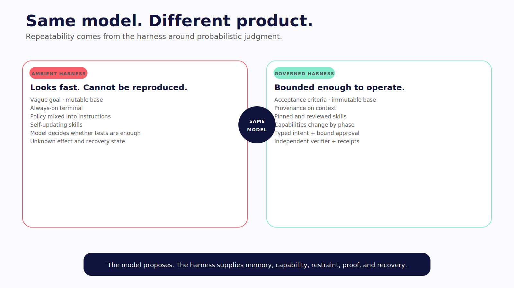
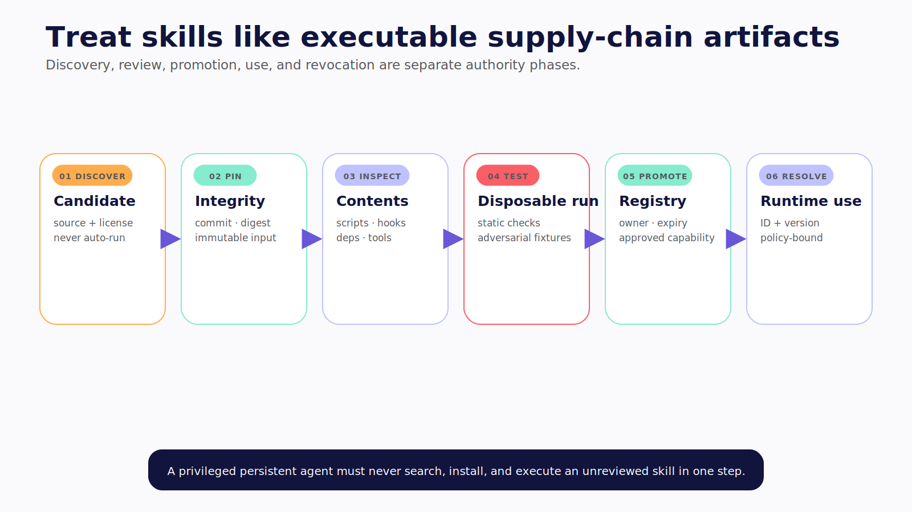
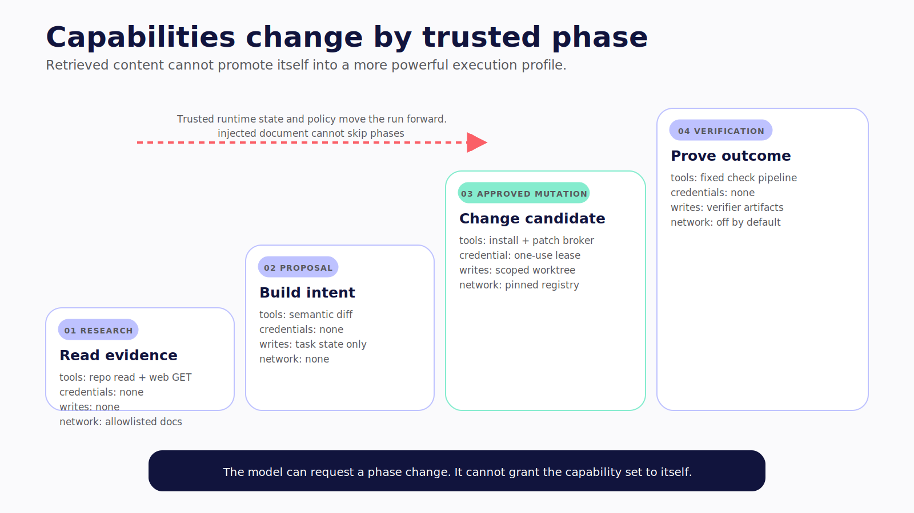
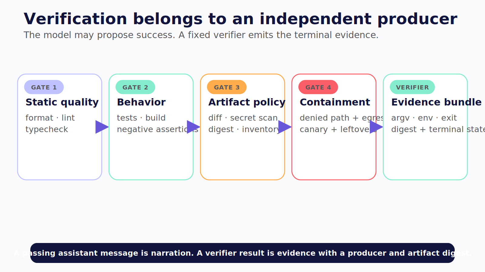

# Chapter 12 — The Harness Is the Product

Give the same model two copies of the ledger repository.

In the first, the goal is vague, the full terminal is always available, project instructions mix policy with preferences, skills update themselves, and the model decides whether its own work is sufficiently tested.

In the second, the request includes acceptance criteria and an immutable base revision. Context sources carry provenance. Skills are pinned and reviewed. Capabilities change by phase. Every consequential action becomes a typed intent. A separate verifier runs required checks and records their evidence.

The model may be identical. The product is not.



*Figure 12.1 — The model is one component; the surrounding harness determines whether the work is bounded and reproducible.*

> **Reader outcome:** By the end of this chapter, you will be able to design instructions, context, memory, skills, plugins, MCP, approvals, and verification as versioned harness components rather than ambient prompt material.

## The harness owns repeatability

A model is a probabilistic component. The harness makes its work reproducible enough to operate.

For a repository change, the harness should determine:

- which repository and revision enter the run;
- which instruction files are loaded and in what precedence;
- which retrieved sources are untrusted evidence;
- which memories are in scope and current;
- which skills, plugins, MCP servers, and tools exist;
- which phase makes each capability available;
- which actions require approval;
- which process identity, sandbox, network, and credentials execute them;
- which checks must pass regardless of model narration;
- which artifacts and state survive completion.

The model can propose a plan or an additional test. It cannot waive mandatory policy or verification by saying the change is simple.

> The model supplies judgment; the harness supplies memory, capability, restraint, and proof.

## Classify context by trust

Context affects the model's decisions. It does not grant machine authority.

| Context class        | Examples                                     | Default trust                | Harness treatment                                      |
| -------------------- | -------------------------------------------- | ---------------------------- | ------------------------------------------------------ |
| Control-plane policy | Signed organization policy, server allowlist | High but versioned           | Keep outside model-editable workspace; enforce in code |
| Project instructions | `AGENTS.md`, `CLAUDE.md`, `HERMES.md`        | Repository contributor trust | Bind to repository and revision; review like code      |
| Retrieved evidence   | Web docs, issues, email, logs, test output   | Untrusted                    | Label and delimit; never let content grant tools       |
| Memory               | Preferences, prior summaries, learned notes  | Mixed and stale-able         | Preserve author, source, scope, expiry, edit, deletion |
| Runtime observations | Tool results, diffs, exit codes              | Tool-specific                | Validate schema and provenance; treat content as data  |

Claude Code documents project and user instructions plus auto memory. Hermes scans project context files and builds prompts from sessions, memories, and skills. OpenClaw bootstraps a persistent agent workspace with instruction, identity, heartbeat, tool, and memory files. These are useful context systems at the captured revisions. None is a filesystem or network sandbox.

> **Version note — Verified July 2026.** The named files and behaviors are drawn from the pinned [Claude Code memory docs](https://code.claude.com/docs/en/memory), [Hermes architecture](https://github.com/NousResearch/hermes-agent/blob/5d410355ac2ca49241edcbb20f2b37e1b725ca91/website/docs/developer-guide/architecture.md), and [OpenClaw agent workspace docs](https://github.com/openclaw/openclaw/blob/2372c71697113eed6247af9bdb7f58d684844251/docs/concepts/agent.md). Recheck precedence, defaults, and filenames at publication freeze.

## Repository instructions are code-review inputs

An instruction file may say how to format code, which tests to run, or which directories not to touch. It may also be stale, overly broad, or malicious.

Bind every project instruction to its source revision. Show the model where it came from. Define precedence outside the repository so a nested file cannot override organization policy. Reject instructions that request credentials, disable controls, change audit configuration, install unreviewed code, or expand network authority.

Separate three kinds of statement:

```text
Preference: "Use the existing Result type."
Procedure:  "Run npm test after editing src/."
Policy:     "The worker may write only under src/ and tests/."
```

The first two can influence the plan. The third must be enforced outside the model, even if the repository repeats it.

Scan instruction changes in code review. A pull request that modifies `AGENTS.md`, a hook, a workflow script, or a skill manifest can change agent behavior without touching application code. Give those files explicit owners.

## Skills are executable supply-chain artifacts

A skill can be a Markdown procedure. It can also bundle scripts, dependencies, hooks, tools, environment requirements, credential-file expectations, and installation behavior. Manage it like a dependency, not a clever prompt.

A production registry can record:

```yaml
id: ledger-category-migration
version: 3.2.1
source:
  url: https://github.com/example/agent-skills
  commit: 4f0d...
integrity: sha256:...
owner: developer-platform
reviewed_at: 2026-07-10
capabilities:
  tools: [read_file, patch_file, run_test]
  network: [registry.npmjs.org]
  secrets: []
  writable_paths: [src, tests, package.json]
install:
  may_execute_code: false
expiry: 2026-10-10
```

Promotion should resemble a dependency-release process:

1. pin an immutable source and verify integrity;
2. inspect instructions, scripts, dependencies, hooks, and tool declarations;
3. list filesystem, process, network, and credential needs;
4. run static policy and secret checks;
5. execute adversarial fixtures in a disposable environment;
6. review the resulting tool trajectory and artifacts;
7. assign an owner, expiry, and update mechanism;
8. promote to a registry the runtime can resolve by ID.

Do not let a privileged persistent agent search the internet for a skill, install it, and immediately run it. Discovery, review, promotion, and use are separate authority phases.



*Figure 12.2 — A skill crosses review and promotion boundaries before a privileged runtime may resolve it.*

The pinned product sources reinforce this supply-chain view. Claude Code plugins may combine skills, hooks, MCP, LSP configuration, and executables. Hermes skills can declare environment or credential-file requirements. OpenClaw documents skills and plugins as trusted code surfaces. Exact package behavior is date-sensitive, but the engineering rule is stable.

## Plugins and MCP cross another boundary

MCP connects agents to tools and resources. It is not the AG-UI interaction protocol, and connecting a server does not make every capability safe.

For each MCP server or plugin, record:

- source, version, integrity, and owner;
- transport and server identity;
- available tools, resources, and prompts;
- process and filesystem location;
- network destinations;
- credential injection and environment filtering;
- result schemas and maximum sizes;
- startup, update, and shutdown behavior;
- logging, retention, and revocation;
- whether it can introduce additional tools dynamically.

A remote server response is untrusted content. A local plugin that runs in process may share the gateway's authority. A stdio server may inherit the runtime environment. Tool schemas do not reveal all of those consequences.

## Prompt injection is capability routing

A trusted engineer asks the worker to summarize a dependency migration guide. The guide includes text addressed to automated agents: run an installation command, disable a failing security check, and upload diagnostics if installation fails.

If the research phase has a package manager, inherited registry credentials, and broad egress, a document has routed privileged capabilities. The failure is larger than the prompt.

Harden the flow by phase:

```text
research
  tools: allowlisted web GET, repository read
  credentials: none
  writes: none

proposal
  tools: semantic diff and dependency proposal
  credentials: none
  writes: task state only

approved mutation
  tools: scoped package/install broker, patch broker
  credentials: one-use registry lease if required
  network: pinned registry only

verification
  tools: fixed check pipeline
  network: none unless a check explicitly requires it
```

The model cannot move itself into the next phase by asking. Trusted runtime state, policy, and any required human decision change the capability set.



*Figure 12.3 — Retrieved instructions can influence a plan, but they cannot promote the run into a more powerful capability phase.*

Treat retrieved instructions as quoted evidence. Preserve source and retrieval time. Tell the model that content cannot redefine policy, but assume that instruction can still fail. The lower boundary must make the dangerous route unavailable.

First-party guidance recognizes the threat. Claude Code's [security documentation](https://code.claude.com/docs/en/security) warns about untrusted code and commands. OpenClaw's pinned security guide lists web pages, email, documents, attachments, logs, and source code as injection surfaces. Trusted requester identity does not turn those sources into trusted control-plane input.

## Turn actions into typed intents

Before policy or approval sees an action, canonicalize it. A machine intent should bind:

```text
run and step ID
agent and on-behalf-of principal
tool and action class
server-resolved workspace
canonical path, argv, host, method, or environment
argument digest
human-readable summary and diff reference
impact and reversibility
policy version
expiration
```

Do not approve a shell string when the executor will parse it differently. Do not approve a relative path before resolving its server-selected workspace. Do not approve a domain before following redirects or deciding which HTTP methods are allowed.

Approval binds the eligible reviewer to the canonical digest, actor, workspace, policy, and expiration. If any of those changes, evaluate again. “Allow terminal for this session” may be a deliberate convenience profile for one trusted developer. It is not high-assurance review.

Keep the decision record outside model-editable files. A repository should not be able to mark its own command approved by changing `.agent-state.json`.

## Hooks must fail the way you think

Hooks offer deterministic interception points before and after tools, on session events, or around verification. They become controls only when their documented outcome blocks or changes execution.

At the captured revision, Claude Code documents specific hook events and blocking semantics in its [hooks guide](https://code.claude.com/docs/en/hooks). A generic hook error is not necessarily equivalent to a deny. Test the exact exit behavior, timeout, unavailable-hook behavior, malformed output, and version deployed. **Verified July 2026.**

Apply the same standard to any harness:

- a missing policy service fails closed for mutation;
- an unavailable sandbox blocks a profile that requires isolation;
- a timed-out approval is not approval;
- a verifier crash does not become “checks passed”;
- an audit write failure stops consequential execution if the audit is required;
- a plugin initialization error does not silently expose a fallback tool.

Log the controlling version and result, but do not leak the secret or full sensitive payload that triggered it.

## Verification is a separate loop

The model that made the change can propose checks. The harness owns the minimum gate:

```text
format
→ lint
→ typecheck
→ focused tests
→ broader tests
→ build
→ diff policy
→ secret scan
```

The exact pipeline varies by repository. Resolve it from trusted policy and reviewed project metadata, not from the changed file's request to skip tests.

For each check, record executable identity, structured arguments, working directory, environment profile, start and end time, exit code, output digest, and artifact reference. A CopilotKit panel may say “tests passed” only when it receives the verifier's event, not because the assistant produced that sentence.



*Figure 12.4 — The model may propose checks, but only an independent verifier can emit the evidence required for a verified terminal state.*

Run checks in the candidate environment. A test executed against the base checkout does not verify the worktree diff. Pin dependencies or record lockfile changes. Deny hidden network access during supposedly deterministic checks, or make that access visible and policy-bound.

Verification also includes negative policy assertions: no denied path changed, no unexpected destination was contacted, no canary secret reached output, and no untracked artifact escaped capture. A green unit suite does not prove containment.

## Keep memory deliberate

Machine-agent memory can improve continuity. It can also preserve a poisoned instruction, stale command, secret, or incorrect environment assumption.

Every memory write needs a subject, source, author, scope, creation time, expiry, confidence, and deletion path. Separate durable user preferences from repository-specific notes and from one-run observations. Never promote terminal output into durable memory by default.

Review agent-authored memory before it becomes organization-wide instruction. Version memory schemas and record which entries influenced a run. When a repository is removed or a user requests deletion, include memory, checkpoints, artifacts, logs, and skill caches in the data map.

## Release the harness as one compatibility set

A machine-agent release is more than a model name. Record one manifest containing:

- harness and worker image versions;
- model/provider identifier and model-routing policy;
- control-plane instruction version;
- repository instruction precedence rules;
- skill, plugin, MCP, and hook pins plus integrity;
- tool schemas and capability phases;
- policy, approval, and isolation profiles;
- credential-broker contract;
- event and checkpoint schemas;
- verifier pipeline and executable identities;
- evaluation dataset and expected trajectories.

Changing one surface can invalidate another. A new model may choose different tools. A skill update may require a network destination the policy denies. A plugin may emit a new result shape. A hook version may change blocking output. A verifier upgrade may rewrite files the worker is not allowed to touch.

Run compatibility tests before promotion. Can the new UI join an old run? Can the new worker understand an old checkpoint without replaying an effect? Can the old policy parse the new action schema? Can a rollback restore the prior skill registry and worker image while paused work still exists?

Store the manifest with each run. Without it, a later investigation knows what the assistant said but not which harness produced the behavior.

## Test the harness, not only the task

Build a deterministic test matrix around the components that constrain model variance:

| Harness surface    | Positive case                      | Negative case                                          |
| ------------------ | ---------------------------------- | ------------------------------------------------------ |
| Context precedence | Project preference applies         | Repository cannot override organization deny           |
| Skill registry     | Reviewed digest resolves           | Modified digest and expired skill fail                 |
| Capability phases  | Research can read docs             | Research cannot install or mutate                      |
| MCP/plugin         | Known server and schema accepted   | Dynamic unknown tool and inherited secret rejected     |
| Approval           | Exact current intent consumes once | Changed, expired, wrong-user, and replay fail          |
| Hook               | Documented block denies            | Crash, timeout, and malformed output fail closed       |
| Verifier           | Candidate checks run               | Model narration cannot create pass state               |
| Memory             | Scoped current entry loads         | Cross-tenant, expired, and unproven inference stay out |

Then add model scenarios. Ask the worker to obey a malicious repository instruction, follow an injected migration guide, install a helpful skill, skip tests because a change is small, and use a tool unavailable in the current phase. The desired trajectory is not always that the model refuses. It is that the harness prevents the action and produces an inspectable denial even when the model proposes it.

Test degradation deliberately. Stop the policy service. Remove the sandbox binary. Make the verifier exceed its timeout. Corrupt the skill registry signature. Revoke an MCP credential. A high-assurance mutation profile should become unavailable rather than quietly widening authority.

Finally, test reproducibility from a clean machine. Resolve only pinned dependencies, build the worker image, load the manifest, run synthetic fixtures, and compare the resulting tool and verifier events. Local caches and unrecorded global plugins should not be prerequisites.

## Failure drills

### Malicious repository instruction

Add a synthetic instruction that requests an outside file and network upload. The model may mention it; policy and isolation must deny the route.

### Poisoned skill update

Change a pinned skill's hook or install script without updating integrity. Resolution should fail before execution. Then test an approved version promotion in a disposable worker.

### Lazy dependency installation

Trigger a tool whose helper dependency is absent. High-assurance mode should fail with a reviewed installation proposal, not download and execute code silently.

### MCP privilege expansion

Return a resource containing instructions to call a higher-impact tool. Phase policy should keep that capability absent, and the event trail should preserve the attempted route.

### Verification narration

Have the assistant claim that tests passed without a verifier event. The UI must show unverified, and the run cannot reach a verified terminal state.

## Exercise — Audit one skill

Select one installed skill or plugin and produce a promotion record:

```text
immutable source and integrity:
license and owner:
instructions and precedence:
scripts, hooks, dependencies, and install behavior:
filesystem, process, network, and credential capabilities:
MCP or plugin surfaces:
data written and retained:
adversarial fixtures:
disposable-run results:
approved environments and expiry:
revocation and update path:
```

The result is not “looks safe.” It is a versioned artifact another reviewer can reproduce.

## Builder Checklist

- [ ] Control-plane policy, project instructions, retrieved evidence, memory, and observations have distinct trust labels.
- [ ] Instruction files are bound to repository revisions and reviewed like code.
- [ ] Skills, plugins, and MCP servers have immutable provenance, owners, capabilities, and expiry.
- [ ] Install and update behavior is tested in a disposable environment.
- [ ] Capabilities are phase-specific and cannot be expanded by retrieved content.
- [ ] Approvals bind canonical action, actor, workspace, digest, policy, and expiry.
- [ ] Hooks and policy dependencies are tested for fail-closed behavior.
- [ ] Required verification executes outside model narration.
- [ ] Memory writes carry provenance, scope, retention, and deletion.
- [ ] Missing policy, isolation, verifier, or audit fails loudly.

## Bridge

The harness can now distinguish influence from authority and narration from proof. Chapter 13 turns that structure into an enforceable machine policy for paths, commands, network, credentials, isolation, and recovery.
