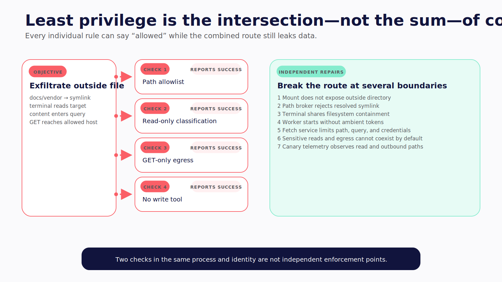
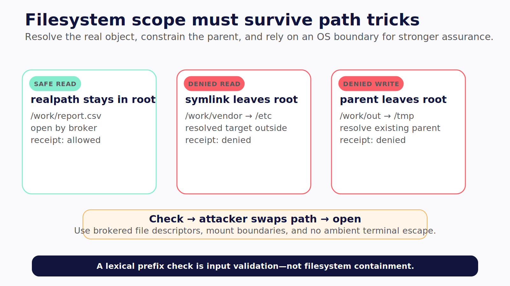

# Chapter 13 — Draw the Blast Radius

The worker is allowed to read the assigned repository and send GET requests to an approved documentation host.

Inside the repository, `docs/current` is a symlink to a directory outside the workspace. The agent reads a file through the symlink. It then places the content in a query string to the approved host. The path rule says allowed. The network rule says allowed. The combined route exfiltrates the file.

Least privilege is not the sum of green checkboxes. It is the intersection of every authority surface.



*Figure 13.2 — Each isolated rule can pass while the combined route still leaks data; independent enforcement breaks the path.*

> **Reader outcome:** By the end of this chapter, you will be able to write and adversarially test an explicit machine policy for paths, commands, network, credentials, approvals, isolation, and recovery.

## Replace one access switch with a capability matrix

Classify impact before implementation:

| Surface     | Read                   | Local write             | External write       | Destructive or privileged                   |
| ----------- | ---------------------- | ----------------------- | -------------------- | ------------------------------------------- |
| Filesystem  | Inspect source         | Patch worktree          | Upload artifact      | Delete, overwrite, change protected config  |
| Process     | Inspect status         | Run tests               | Trigger remote job   | Kill service, install daemon, escalate user |
| Network     | Fetch allowlisted docs | Download pinned package | POST to API          | Change infrastructure, billing, or access   |
| Identity    | Anonymous access       | Run-scoped read token   | Service write token  | Impersonate user or use admin role          |
| Persistence | Read checkpoint        | Append run state        | Update shared memory | Delete or rewrite audit history             |

Then express the policy across independent dimensions:

- server-selected workspace and immutable base revision;
- read, write, and explicit-deny path rules;
- executable identity, subcommand, structured arguments, and child-process policy;
- network protocol, exact destination, port, method, redirects, and byte limits;
- credential lease by action, resource, scope, and lifetime;
- approval class bound to canonical intent;
- OS sandbox, container, VM, or host profile;
- CPU, memory, disk, process, step, time, and cost limits;
- checkpoint, artifact, audit, cleanup, and recovery rules.

The model never receives a generic “machine allowed” bit. The execution broker receives a canonical intent and returns allow, deny, or approval under one policy version.


*Figure 13.1 — Each rung closes a different production question; visibility alone does not supervise a machine action.*

## Evaluate semantic machine intents

The companion's cataloged `L2-POLICY` function evaluates path, command, and network intents. The complete catalog region is shown so the deny order and command/network guards remain visible:

```ts
export function evaluateMachineIntent(
  policy: MachinePolicy,
  intent: MachineIntent,
): PolicyDecision {
  if (intent.kind === "path") {
    const path = normalizedRelativePath(intent.path);
    if (!path)
      return {
        outcome: "deny",
        risk: "privileged",
        reason: "path escapes workspace",
      };
    if (policy.paths.deny.some((rule) => matchesRule(path, rule))) {
      return {
        outcome: "deny",
        risk: "privileged",
        reason: "path is explicitly denied",
      };
    }
    const allowed = policy.paths[intent.operation].some((rule) =>
      matchesRule(path, rule),
    );
    if (!allowed)
      return {
        outcome: "deny",
        risk: intent.operation,
        reason: "path is not allowlisted",
      };
    return decide(
      intent.operation,
      policy,
      `${intent.operation} path is allowlisted`,
    );
  }

  if (intent.kind === "command") {
    if (
      intent.executable.includes("/") ||
      intent.args.some((arg) => arg.includes("\0"))
    ) {
      return {
        outcome: "deny",
        risk: "privileged",
        reason: "command must use structured argv",
      };
    }
    const rule = policy.commands.find(
      (entry) => entry.executable === intent.executable,
    );
    if (!rule || intent.args.length > rule.maxArgs) {
      return {
        outcome: "deny",
        risk: "privileged",
        reason: "command is not allowlisted",
      };
    }
    const subcommand = intent.args[0];
    if (subcommand && !rule.subcommands.includes(subcommand)) {
      return {
        outcome: "deny",
        risk: rule.risk,
        reason: "subcommand is not allowlisted",
      };
    }
    return decide(rule.risk, policy, "command and argv are allowlisted");
  }

  let url: URL;
  try {
    url = new URL(intent.url);
  } catch {
    return { outcome: "deny", risk: "external", reason: "invalid URL" };
  }
  const method = intent.method.toUpperCase();
  const rule = policy.network.find(
    (entry) =>
      entry.protocol === url.protocol &&
      entry.hostname === url.hostname &&
      entry.methods.includes(method as "GET" | "POST" | "PUT" | "DELETE"),
  );
  if (!rule)
    return {
      outcome: "deny",
      risk: "external",
      reason: "network destination is not allowlisted",
    };
  return decide("external", policy, "network destination is allowlisted");
}
```

**Verification label:** `L2-POLICY` is original companion code. Three policy tests pass: explicit path deny wins, an allowlisted write command requires approval, and a hostname suffix attack is denied. Formatting, lint, typecheck, and build also pass in the recorded companion verification.

This function is a teaching policy evaluator, not a sandbox. It validates semantic intent before dispatch. It cannot stop a child process, constrain an interpreter, prevent a filesystem race, enforce DNS behavior, or isolate the host. The full companion file contains the types and normalization helpers used above.

## Resolve paths, then enforce below the application

Lexical path checks catch `..` and absolute paths. They do not tell you where an existing symlink points. Prefix comparisons also fail around sibling names such as `/workspace/app-old`.

The companion's complete cataloged `L2-WORKSPACE` function resolves the trusted root, checks lexical containment, follows existing read targets, and resolves the existing parent for a new write:

```ts
export async function resolveWorkspacePath(
  workspaceRoot: string,
  requestedPath: string,
  mode: "read" | "write",
): Promise<string> {
  if (isAbsolute(requestedPath) || requestedPath.includes("\0")) {
    throw new Error("workspace path must be a safe relative path");
  }

  const root = await realpath(workspaceRoot);
  const lexicalTarget = resolve(root, requestedPath);
  if (!isWithin(root, lexicalTarget)) throw new Error("path escapes workspace");

  if (mode === "read") {
    const target = await realpath(lexicalTarget);
    if (!isWithin(root, target))
      throw new Error("symlink resolves outside workspace");
    return target;
  }

  // A new write target may not exist, so resolve its existing parent. This
  // catches a symlinked directory that points outside the workspace.
  const parent = await realpath(dirname(lexicalTarget));
  if (!isWithin(root, parent))
    throw new Error("write parent resolves outside workspace");
  return lexicalTarget;
}
```

**Verification label:** `L2-WORKSPACE` is original companion code. Three filesystem tests pass: a real in-workspace read succeeds, a read through an outward symlink fails, and a write through a symlinked parent fails.

The limitations belong beside the code. This is a check-then-open sequence. The filesystem can change between resolution and use. It assumes the write target's parent exists. It does not constrain a terminal running as the same OS user. For stronger assurance, execute inside a mount namespace, sandbox, container, or VM that exposes only the intended root, and use descriptor-relative no-follow operations in a small broker where the platform supports them.



*Figure 13.3 — Realpath and parent checks close common path tricks, while a brokered descriptor or OS mount boundary provides stronger protection against races and ambient terminal reach.*

## Constrain commands as structured programs

Do not approve and execute a single shell string if you can avoid it. Resolve an executable by trusted identity, pass an argument vector directly, set a minimal environment, choose the working directory server-side, and constrain child processes.

An allowlist containing `bash`, `sh`, `python`, `node`, or `ruby` is effectively a code-execution grant unless the sandbox provides the real boundary. The same is true of a package manager that can run lifecycle scripts, a build tool that loads repository plugins, or `git` configured with external helpers.

For each command rule, decide:

- exact executable path or content digest;
- permitted subcommands and flags;
- argument count, formats, and path canonicalization;
- stdin source and maximum size;
- working directory;
- environment variables and config-file lookup;
- child-process and interpreter behavior;
- network and filesystem profile;
- timeout, output, CPU, memory, and process limits;
- whether the action needs approval;
- expected postconditions and required checks.

Avoid using shell metacharacter filtering as the main control. Quoting rules vary, and valid arguments can still instruct an allowed program to load code or write elsewhere. A policy that permits `npm test` must account for the repository's scripts and dependencies, not only the word `test`.

Test shell injection at both layers. Send arguments containing separators, substitutions, redirections, newlines, nulls, and option-like filenames. Then test semantic escape: an allowed interpreter reads an outside file, a test runner loads a malicious plugin, and a package install executes a lifecycle script. Structured argv solves parsing ambiguity; isolation constrains what the resulting program can do.

## Treat network policy as a data boundary

Egress controls where read data can travel and which external effects the worker can create.

Default to no network for mutation and verification phases. Add exact destinations and methods when the outcome requires them. Use a proxy or broker that can enforce protocol, resolved destination, redirects, method, request and response size, and credential scope.

An allowed hostname is not a complete rule. Consider:

- DNS rebinding and private-address resolution;
- HTTP redirects to a different host;
- alternate ports and protocols;
- attacker-controlled paths or subdomains;
- query strings carrying sensitive data;
- uploads disguised as GET parameters;
- cloud metadata endpoints;
- loopback services;
- Unix sockets and container-engine sockets;
- package registries that serve executable artifacts.

A broad documentation domain can still be an exfiltration destination. Separate documentation retrieval from source-bearing mutation runs when possible. Retrieve approved content through a read-only service that strips credentials, limits size, records provenance, and returns data rather than browser authority.

## Broker credentials per action

Start workers without long-lived secrets. Do not blanket-inherit the developer's environment, SSH agent, cloud configuration, browser cookies, keychain, signing keys, or production kubeconfig.

A credential broker should:

1. receive the canonical intent and trusted run identity;
2. verify tool, resource, policy, and any approval;
3. issue a short-lived token for one service and action class;
4. inject it only into the executing subprocess or API call;
5. constrain egress to its intended service;
6. redact the value from events, logs, crash dumps, and verifier output;
7. revoke or expire it when the action or run ends.

Use separate read and write identities. A token that can read repository metadata should not also merge pull requests. A deployment credential should not exist during repository research. Prefer workload identity or one-use grants over copied static keys.

Canary-test the boundary. Put a synthetic secret in the parent environment and verify it never reaches the worker, UI, trace, child process, or network. Then grant one scoped canary token to one tool and prove that a second tool cannot read it.

## Test combinations, not isolated controls

Security reviews often prove each rule in isolation. The real attack path crosses them.

Consider a synthetic repository containing `docs/vendor`, a symlink to an outside directory. The read policy allows `docs/**`. Network policy permits GET requests to `support.vendor.example`. The worker has no write tool, so the configuration looks read-only.

The agent reads `docs/vendor/token.txt` through an unconstrained terminal. It URL-encodes the content and places it in a GET query to the allowed support host. The path allowlist, read-only classification, GET-only egress, and absence of a write tool all report success. Data still leaves.

The repaired design closes the chain at several points:

- the workspace mount does not expose the outside directory;
- the path broker rejects the resolved symlink target;
- the terminal runs inside the same filesystem boundary as file tools;
- the worker environment contains no ambient token;
- the egress proxy limits path and query size or routes documentation through a separate fetch service;
- sensitive reads and external network cannot coexist in the same phase without an explicit higher-risk profile;
- canary tests observe both read and outbound flows.

Now try a different combination. An allowlisted `npm test` loads a repository plugin. The plugin connects to a permitted package registry and sends source inside a telemetry payload. The command name, subcommand, and host are all allowed. The policy needs script/plugin provenance, a networkless verifier phase, and sandbox enforcement, not a longer string allowlist.

Use attack trees that end in an effect: read outside scope, execute downloaded code, persist hostile instruction, impersonate a service, exfiltrate data, mutate an external system, or escape cleanup. For each path, identify at least two independent enforcement points and one observable signal. Independence matters. Two checks in the same process and identity can fail together.

Approval does not repair a wide boundary. A reviewer might legitimately approve `npm test` without seeing the repository plugin's behavior. Present the canonical program, effective environment, network profile, and known script surface, then let containment bound what the approved process can do.

## Choose isolation by threat, not convenience

| Environment            | Best fit                                  | What it isolates                                 | What remains                                                           |
| ---------------------- | ----------------------------------------- | ------------------------------------------------ | ---------------------------------------------------------------------- |
| Git worktree           | Parallel edits, clean diff, cheap discard | Repository checkout and branch state             | Same user, host, secrets, processes, and network                       |
| OS sandbox             | Frequent narrow local runs                | Covered process filesystem/network operations    | Coverage gaps, escape permissions, sockets, inherited environment      |
| Container              | Reproducible dependencies and mounts      | Namespaces and resource limits under host kernel | Privileged mode, host mounts, engine socket, kernel, copied secrets    |
| VM                     | Untrusted builds and disposable workers   | Guest kernel and virtual hardware                | Hypervisor/admin plane, network, copied credentials, image persistence |
| Dedicated host/account | Persistent agent with separate identity   | Personal-device and cross-account blast radius   | Accumulated state, service authority, egress, operator trust           |

A worktree is excellent recovery infrastructure for code. It is not process isolation. A container is useful only under its actual mounts, privileges, network, socket, and credential configuration. A dedicated machine is safer than a personal laptop when it has a dedicated identity and no personal accounts; it is not automatically safe or multi-tenant.

Choose **ephemeral workers** when tasks can start from an immutable image, receive a bounded workspace and short-lived credentials, return artifacts, and disappear. They reduce persistence and simplify rebuild after suspicious behavior.

Choose a **dedicated persistent machine** when the agent needs durable local indexes, device access, a long-lived gateway, or expensive warm state. Harden it as infrastructure: minimal encrypted OS, non-admin agent user, inbound deny, default-deny egress, no personal browser profile, short-lived service identities, automatic patching, immutable base image, per-run workspaces, resource ceilings, remote kill and credential revocation, centralized redacted logs, and scheduled rebuild.

Do not place mutually untrusted tenants on one persistent agent host because application authentication seems adequate. Separate the identity and kernel boundary.

## Verify effective configuration at launch

Policy names such as `sandboxed` and `isolated` are intentions. Before dispatch, attest the effective worker:

| Property    | Evidence to record                                            |
| ----------- | ------------------------------------------------------------- |
| Identity    | UID/GID or workload identity; no admin membership             |
| Image       | Immutable image digest and patch level                        |
| Workspace   | Server-selected mount, mode, base revision, worktree ID       |
| Filesystem  | Mount list, writable paths, home/device exposure              |
| Network     | Namespace/profile, proxy identity, destinations, DNS behavior |
| Sockets     | Explicit list; container engine and SSH agent absent          |
| Credentials | Lease IDs and scopes, never values                            |
| Resources   | Effective CPU, memory, disk, process, and time limits         |
| Runtime     | Sandbox/backend version and strict-failure setting            |

Compare effective state with the requested profile. If a required mount is unexpectedly read-write, the sandbox binary is unavailable, the network namespace failed, or the worker runs as root, block the run. Do not log a warning and continue under the same profile name.

Recheck during long runs. A worker can spawn a background process before cleanup, fill disk, renew a token, or lose network-proxy enforcement after restart. Heartbeats should include bounded effective-state attestations and policy version, not merely “alive.”

Use immutable base images for ephemeral workers and rebuild persistent hosts on schedule. Patch drift creates a hidden fleet of different authority envelopes. A clean-machine acceptance suite should run after every image, kernel, sandbox, or container-runtime change.

Effective configuration also belongs in the user evidence for high-risk actions. The interface does not need raw mount tables, but it can show “ephemeral VM, repository-only mount, network off, no credentials” with a link to the signed run record.

## Design recovery before allowing writes

Recovery mechanisms solve different effects:

- **Discard** removes an unmerged worktree or disposable worker.
- **Restore** returns files or a volume to a recorded snapshot.
- **Revert** creates a new version-control change reversing a committed change.
- **Compensate** performs another external action to counter a prior one.
- **Revoke and rebuild** addresses possible credential or host compromise.

Record the base revision and expected postcondition before every local write. Record result hashes, external operation IDs, and receipts afterward. Reject a stale Undo when the current file no longer matches the version the action changed.

The pinned Hermes–CopilotKit demo's diff card is useful visibility, but its cached-content/string-replacement Undo is best effort. It is not atomic rollback and can conflict with concurrent edits. The production path should prefer a candidate worktree, content-addressed artifacts, git-native patch/revert operations, and explicit external compensation.

Recovery can fail. Test failed restore, failed revert due to new commits, failed compensation, and a leaked secret that cannot be “unseen.” Increasing autonomy without those paths only increases the number of incidents the team cannot classify.

## Run an adversarial policy suite

Create synthetic fixtures for:

1. `..`, absolute paths, alternate separators, case variance, and null bytes;
2. an in-root symlink to an outside file and an outside directory;
3. a check-then-open race where the platform allows controlled reproduction;
4. shell separators and substitution inside arguments;
5. an allowlisted interpreter reading outside the root;
6. a package lifecycle script making a network request;
7. a repository instruction requesting policy disablement;
8. a poisoned skill changing hooks or tool configuration;
9. an MCP result steering a privileged capability;
10. redirects, suffix hosts, metadata endpoints, and loopback;
11. inherited canary credentials;
12. an exposed Docker or SSH-agent socket;
13. exfiltration to an otherwise allowed host;
14. stale approval after canonical arguments change;
15. discard, restore, revert, compensation, revocation, and rebuild.

Capture one real denial per class from the enforcement layer. A screenshot of a policy file proves configuration. A denial event plus sandbox/proxy evidence proves the case you ran.

## Failure drills

### Sandbox unavailable

If the selected profile requires a sandbox, fail the run. Do not silently fall back to unsandboxed execution because the platform dependency is missing.

### Privileged container configuration

Reject privileged mode, broad host mounts, and container-engine sockets unless an explicitly higher-risk profile authorizes them. Record the effective configuration, not only the requested one.

### Credential leak in logs

Revoke the credential, preserve restricted incident evidence, fix redaction at ingestion, and add the canary trajectory to regression. Deleting the visible log line does not finish the response.

### Persistent host compromise

Stop scheduling, revoke leases, preserve evidence, and rebuild from a trusted image. Do not ask the same possibly compromised host to prove it cleaned itself.

## Exercise — Write and break the policy

For the ledger repository upgrade, produce:

```text
workspace/base revision:
read, write, and deny paths:
executables, subcommands, and argv constraints:
child-process and package-script policy:
network destinations, methods, redirects, and sockets:
credential leases:
approval classes:
isolation profile and effective-config check:
resource budgets:
postconditions and verifier pipeline:
discard/restore/revert/compensation/rebuild paths:
adversarial fixtures and denial evidence:
```

Do not promote the profile until every denied case fails below the model and every allowed write is recoverable.

## Builder Checklist

- [ ] Permission is classified by surface and impact, not one access switch.
- [ ] Deny rules precede allow and approval decisions.
- [ ] Existing paths and write parents are canonicalized and symlink-tested.
- [ ] Application path checks are backed by process-level isolation.
- [ ] Commands use structured argv and constrain interpreters, scripts, and children.
- [ ] Egress is default-deny and covers redirects, private destinations, and sockets.
- [ ] Workers start without ambient personal or admin credentials.
- [ ] Credentials are short-lived, action-scoped, and separately redacted.
- [ ] Worktree, sandbox, container, VM, and dedicated host claims match reality.
- [ ] Recovery and rebuild paths are tested before increasing autonomy.
- [ ] Effective isolation failure blocks execution.
- [ ] Adversarial denials are captured from the enforcement layer.

## Bridge

The decision dimensions are now concrete. Chapter 14 compares Claude Code, Hermes, and OpenClaw by those dimensions and their captured operating models, without pretending they are interchangeable or permanently frozen.
