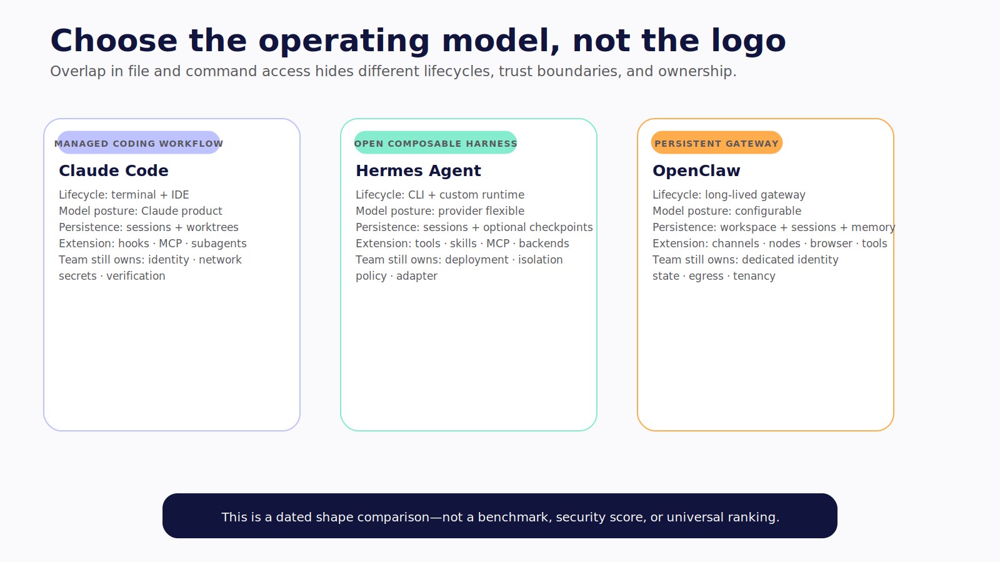

# Chapter 14 — Choose the Harness, Not the Logo

Claude Code, Hermes, and OpenClaw can each reach files and execute commands under the right configuration. That overlap makes a simple feature checklist tempting.

It also hides the decision.

One is primarily a managed coding workflow. One is an open, provider-flexible agent harness with several execution backends. One is a persistent gateway designed to connect an agent workspace to channels, devices, skills, and host tools. Their trust models, defaults, lifecycle, and operator burden are not interchangeable.

> **Reader outcome:** By the end of this chapter, you will be able to compare Claude Code, Hermes, and OpenClaw on dated engineering dimensions, weight them for a specific workload, and document the controls your team still owns.



*Figure 14.1 — Choose the lifecycle and authority model that fit the workload; overlapping features do not make the products interchangeable.*

## Freeze the evidence before comparing

> **Comparison date — Verified July 2026.** This chapter uses Claude Code repository `b7784f2c63ed4585c32bc20b94d3b64cf4fe6df3` with locally observed CLI version `2.1.207`; Hermes Agent `5d410355ac2ca49241edcbb20f2b37e1b725ca91`, package `0.18.2`; and OpenClaw `2372c71697113eed6247af9bdb7f58d684844251`, package `2026.7.2`. Documentation is rolling. Re-run every default and compatibility claim at publication and deployment time.

Only `claude --version` was runtime-verified in the comparison pass. No live model, mutation, permission denial, sandbox, quality, latency, or cost benchmark was performed across the three systems. The Hermes and OpenClaw rows are pinned first-party source and documentation findings, not hands-on equivalence claims.

Do not include current price, default model, exact tool count, or “best” language without a fresh primary-source pass. Those facts drift quickly and rarely decide the architecture.

## Define the workload first

Write the selection problem before naming candidates:

```text
primary task shape:
requesters and trust relationship:
model/provider requirements:
workspace and host requirements:
read, write, external, and privileged authority:
instructions, skills, plugins, MCP, and delegation:
approval and isolation requirements:
persistence and channel/device needs:
recovery objective:
hosting and operational owner:
compliance, retention, and audit constraints:
```

Then assign weights. A coding team may weight IDE workflow, repository permissions, and worktrees highly. A research team may weight provider choice and remote execution. A personal gateway may weight persistent sessions, channels, device nodes, and dedicated identities.

Without weights, the product with the longest feature list wins by accident.

## Captured-version comparison

| Dimension              | Claude Code                                                                               | Hermes Agent                                                                | OpenClaw                                                                           |
| ---------------------- | ----------------------------------------------------------------------------------------- | --------------------------------------------------------------------------- | ---------------------------------------------------------------------------------- |
| Primary shape          | Managed terminal/IDE coding agent                                                         | Open-source general agent harness and CLI                                   | Persistent personal-agent gateway across channels, devices, and tools              |
| Source/license posture | Public distribution repository under Anthropic's stated terms; do not treat as MIT source | MIT at captured pin                                                         | MIT at captured pin                                                                |
| Model posture          | Anthropic-managed Claude product                                                          | Provider/model flexible across documented API modes                         | Provider/model configurable through gateway runtime                                |
| Context and memory     | Project/user instructions, auto memory, resumable sessions                                | Project context, sessions, memory, skills, delegation                       | Agent workspace files, sessions, Markdown memory, skills                           |
| Extension              | Tools, MCP, hooks, skills/plugins, subagents                                              | Toolsets, MCP, skills, plugins, delegation, terminal backends               | Tools, skills, plugins, nodes, channels, browser/device capabilities               |
| Approval posture       | Permission rules and modes for reads, edits, and commands                                 | Documented `smart`, `manual`, and off/YOLO modes                            | Exec security/ask modes and approvals; host posture needs deliberate configuration |
| Isolation              | OS-level Bash sandbox support plus devcontainer/worktree patterns                         | Local or isolated terminal backends, including container and remote options | Sandbox modes/backends; gateway remains on host                                    |
| Recovery               | Worktrees, hooks, normal version-control workflow                                         | Opt-in checkpoints plus worktree workflow                                   | Managed worktrees and snapshot/restore behavior                                    |
| Operating burden       | Managed product plus organization configuration and surrounding controls                  | Team owns deployment, providers, integrations, hardening, updates           | Team owns persistent gateway, identities, channels/devices, hardening, state       |
| Strong teaching use    | Coding permissions, hooks, sandbox configuration                                          | Harness internals, tool/provider flexibility, execution backends            | Persistent gateway trust and dedicated-agent operations                            |

This table says what the captured systems are shaped to do. It does not rank code quality, security, intelligence, speed, or economic value.

## Claude Code: managed coding workflow

Choose Claude Code when the primary job is software development, the Claude product and model posture fit the organization, and its terminal/IDE lifecycle, permission system, hooks, MCP, subagents, and worktree patterns align with the team's workflow.

At the captured documentation state, permission rules distinguish read-oriented behavior from edits and non-read-only commands. Deny, ask, and allow precedence is documented. Bash sandboxing uses platform mechanisms, while built-in tool permissions remain a separate layer. Strict sandbox availability and unsandboxed escape settings matter as much as turning the feature on. See the first-party [permissions](https://code.claude.com/docs/en/permissions) and [sandboxing](https://code.claude.com/docs/en/sandboxing) guides.

Subagents can isolate context and narrow tools. They are not independent machines by default. Hooks can intercept lifecycle events. They are controls only when the exact documented blocking behavior is tested. Worktrees isolate repository checkouts. They do not isolate user credentials or the host.

You still own repository authorization, the surrounding identity and network posture, secrets, MCP trust, hook correctness, required verification, external side effects, retention, incident response, and any multi-tenant boundary outside the product's documented model.

Before deployment, verify the exact version's permission modes, sandbox failure behavior, escape permissions, environment inheritance, socket access, MCP configuration, hook exits, worktree lifecycle, and noninteractive behavior.

## Hermes: open and composable harness

Choose Hermes when provider flexibility, open harness internals, broad tool composition, or selectable local and remote execution backends are requirements, and the team is prepared to own integration and hardening.

At upstream `0.18.2`, the first-party source documents an `AIAgent` loop, prompt construction, provider resolution, tool dispatch, persisted sessions, grouped toolsets, skills, delegation, approvals, file protections, SSRF-related controls, checkpoints, worktrees, and several terminal backends. Its [architecture](https://github.com/NousResearch/hermes-agent/blob/5d410355ac2ca49241edcbb20f2b37e1b725ca91/website/docs/developer-guide/architecture.md) and [security guide](https://github.com/NousResearch/hermes-agent/blob/5d410355ac2ca49241edcbb20f2b37e1b725ca91/website/docs/user-guide/security.md) make the operating model inspectable. **Verified July 2026.**

File-tool path protections do not constrain a terminal running with the same OS authority. Lazy dependency installation, skill requirements, provider credentials, MCP environment filtering, terminal backend configuration, and checkpoint enablement are security and operations choices, not footnotes.

The captured upstream repository does **not** contain the AG-UI adapter used by the Hermes–CopilotKit demo. Do not say Hermes `0.18.2` has native AG-UI or CopilotKit support from this evidence. The demo requires an older external fork/runtime and preview client path that was absent during the run. **Verified July 2026.**

You still own provider and model integration, deployment, service identity, policy, process isolation, credentials, egress, skill/plugin promotion, adapter compatibility, persistence, upgrades, monitoring, and recovery.

## OpenClaw: persistent gateway and agent workspace

Choose OpenClaw when the desired product is a persistent personal or bounded-team agent gateway across channels, devices, browser or node capabilities, skills, and host tools, and the organization can dedicate identities and infrastructure to that trust model.

At the captured revision, OpenClaw is organized around a WebSocket gateway, agent workspaces, sessions, channels, nodes, skills, plugins, and tools. Its first-party documentation separates sandboxing, tool policy, and elevated execution. Sandbox mode, scope, workspace exposure, exec security, and approval behavior are configurable dimensions. **Verified July 2026.**

The captured defaults require attention: sandboxing was documented as off by default, and gateway/node host exec used a permissive security posture with asking disabled unless configured. Docker sandbox networking had a different default. These are dated product defaults, not vulnerability claims. They tell builders to configure where execution happens, which tools exist, and when approval occurs before connecting untrusted content or additional users. See the pinned [sandboxing](https://github.com/openclaw/openclaw/blob/2372c71697113eed6247af9bdb7f58d684844251/docs/gateway/sandboxing.md) and [exec approvals](https://github.com/openclaw/openclaw/blob/2372c71697113eed6247af9bdb7f58d684844251/docs/tools/exec-approvals.md) docs.

Plugins run in process, skills are trusted code, and persistent sessions and logs can retain private data. Bind mounts, personal browser profiles, engine sockets, and broad gateway tokens can collapse an otherwise careful deployment.

OpenClaw's security guidance says one gateway is not a hostile multi-tenant boundary. Use separate gateways, OS users, or hosts for mutually untrusted principals. You still own those identities, channel authorization, dedicated-machine hardening, secrets, network, retention, plugin/skill trust, incident response, and external-tool policy.

## Compare defaults and ceilings separately

Two teams can deploy the same harness with opposite risk profiles. One enables a strict sandbox, no ambient secrets, phase-specific tools, and default-deny egress. The other runs as an admin user with a personal browser and a permissive terminal.

Record both:

- **Default posture:** what a clean install does at the captured version.
- **Configurable ceiling:** what first-party controls can achieve when correctly deployed.
- **Residual ownership:** what remains outside the product.
- **Verified posture:** what your exact environment actually enforced under adversarial tests.

Documentation establishes available controls. Configuration establishes intent. A denial test establishes the case that ran.

The same distinction applies to managed and self-hosted systems. Self-hosted does not automatically mean safer; it gives the team more control and more responsibility. Managed does not remove application authorization, data governance, or recovery obligations.

## Score fit after defining weights

Use a simple weighted decision record:

| Dimension                       | Weight | Required threshold | Evidence                          |
| ------------------------------- | -----: | -----------------: | --------------------------------- |
| Task fit and developer workflow |     15 |                4/5 | Scenario run                      |
| Identity and tenant model       |     15 |                5/5 | Architecture plus denial test     |
| Tool and approval policy        |     15 |                4/5 | Pinned docs and policy fixtures   |
| Process isolation               |     15 |                5/5 | Effective config and escape tests |
| Model/provider posture          |     10 |                3/5 | Contract and availability review  |
| Skills, plugins, MCP            |     10 |                3/5 | Supply-chain audit                |
| Persistence and recovery        |     10 |                4/5 | Restart and recovery game day     |
| Operations and ownership        |     10 |                4/5 | Runbook, SLOs, staffing           |

Define what each score means before evaluating. A product that misses a required threshold is not rescued by a higher total.

Run the same bounded workload under each serious candidate: inspect an immutable repository, propose one change, request one canonical approval, execute in the intended isolation profile, run a fixed verifier, return a diff, cancel one run, and discard or recover. Record behavior, not charisma.

The evidence packet did not perform this benchmark. The table above is the method the reader should use, not a hidden result.

## Combine through boundaries, not overlapping privilege

A team may use Claude Code for managed repository work, Hermes for a custom provider-flexible worker, and OpenClaw for a persistent personal gateway. Composition becomes dangerous when all three receive broad terminal access to the same host and secrets.

Use typed delegation:

```text
persistent gateway
  → authenticated task envelope
  → isolated coding worker
  → artifact bundle and verification record
  → separate merge/deploy decision
```

The gateway does not forward a raw channel transcript as an admin shell prompt. The worker receives objective, acceptance criteria, base revision, path and command policy, network profile, credential handles, budget, expiry, and required artifacts. It returns evidence without inheriting the gateway's channel or personal identity.

One broad agent with three terminal implementations is not defense in depth. It is three escape routes.

## Work through three different selections

### Repository migration for one engineering team

The task is code-focused, developers already use Claude, the organization wants a managed CLI and IDE experience, and repository writes remain under ordinary review. Claude Code may fit well if its exact permission, sandbox, hook, MCP, and worktree posture passes the required tests.

The decision record should still reject ambient cloud credentials, require repository authorization outside the model, pin hooks and MCP servers, run deterministic CI, and separate merge or deploy authority. Choosing a managed coding product does not turn the developer workstation into a hostile-code sandbox automatically.

### Provider-flexible research and coding worker

The team needs to route among approved providers, add specialized skills, run on local and remote execution backends, and integrate a custom control plane. Hermes may fit because the harness is open and composable.

That flexibility increases owned surface. The team must pin provider adapters, disable or govern lazy installation, promote skills and plugins, select approval modes, isolate terminal execution, manage checkpoints and worktrees, build the AG-UI adapter if needed, and operate the service. The Hermes–CopilotKit demo's absent fork cannot serve as the production dependency until identified and reproduced.

### Persistent assistant across devices and channels

The desired system maintains an agent workspace, receives requests through channels, connects to devices or nodes, and runs on a dedicated personal or team machine. OpenClaw may fit that operating model more naturally than a coding-only CLI.

The decision hinges on trust. Use dedicated service accounts and browser profiles, configure sandbox and exec policy explicitly, review skills and plugins as trusted code, restrict gateway access, separate mutually untrusted users, and govern persistent memory and logs. A long-lived gateway accumulates state and identity that an ephemeral coding worker can discard.

None of these examples produces a universal winner. The same organization may make different selections for all three workloads. Product fit is a relationship between a task and an authority envelope.

## Re-run the comparison at two gates

Refresh the table at publication freeze and again before deployment. The book's immutable pins preserve what was inspected; they do not freeze current product behavior.

At refresh, verify from first-party sources and an exact environment:

- product name, package/version, license/terms, and supported platforms;
- model/provider requirements and data flow;
- default permission, approval, sandbox, and network posture;
- strict-failure and escape settings;
- skill, plugin, MCP, hook, subagent, and worktree behavior;
- persistence, checkpoint, memory, and deletion behavior;
- noninteractive and multi-user trust model;
- update channel and security patch process.

Record changed rows, not only the new conclusion. A default that became stricter may improve posture. A newly added integration may widen supply-chain or credential surface. Run the same scenario suite after the documentation pass because configuration names do not prove effective enforcement.

## Failure and security checks

### Stale comparison

Recheck exact versions, default modes, supported platforms, licensing, provider compatibility, and security controls. Keep the captured table dated in the current draft.

### Logo-driven ranking

Ask which requirement or weight produced the result. If none exists, the decision is taste presented as architecture.

### Context isolation mistaken for machine isolation

Subagents and sessions may isolate prompts or memory. Verify OS identities, processes, mounts, network, and credentials independently.

### Container mistaken for complete security

Inspect effective privileges, mounts, engine sockets, network, kernel boundary, persistent volumes, and injected secrets.

### Self-hosted assumed private

Trace provider calls, telemetry, updates, plugin downloads, logs, backups, and external integrations. Hosting location alone does not define data flow.

### Managed assumed complete

Map application authentication, repository policy, MCP trust, external API authorization, retention, verification, and incident ownership around the product.

## Exercise — Write the decision record

Choose a real workload and produce a one-page decision:

```text
workload and smallest authority:
requesters and trust model:
weights and required thresholds:
candidate pins and comparison date:
documented controls:
runtime tests actually performed:
selected harness and why:
rejected alternatives and why:
residual controls the team owns:
publication/deployment refresh date:
```

The record should remain understandable if every product logo is removed.

## Builder Checklist

- [ ] The workload and authority envelope precede the product shortlist.
- [ ] Every comparison row has an evidence date and immutable pin where possible.
- [ ] Documented, source-present, and runtime-verified claims remain separate.
- [ ] Defaults, configurable ceilings, and verified deployment posture are distinct.
- [ ] Model, price, and tool-count claims are refreshed or omitted.
- [ ] Context separation is not described as OS isolation.
- [ ] Managed and self-hosted responsibilities are explicit.
- [ ] Required thresholds can reject a high aggregate score.
- [ ] Combined harnesses communicate through typed, authenticated delegation.
- [ ] No cross-product benchmark is implied without a reproduced run.

## Bridge

Chapter 15 applies these dimensions to the real Hermes–CopilotKit seam. The demo makes machine work visible inside an application. We will keep that strength, label the missing runtime evidence, and harden the path from observation to supervision.
