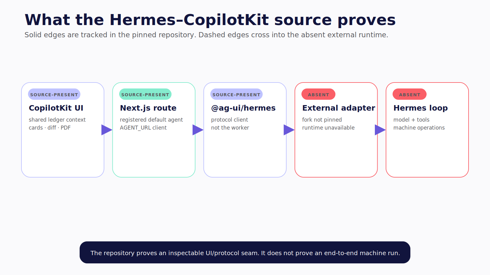
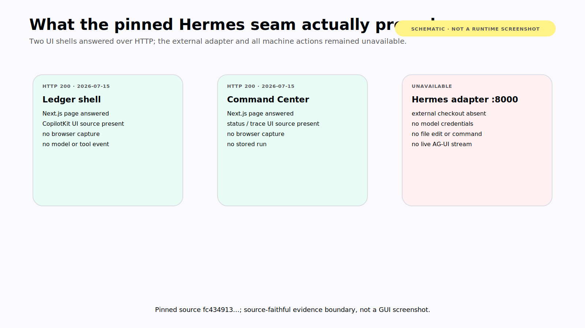
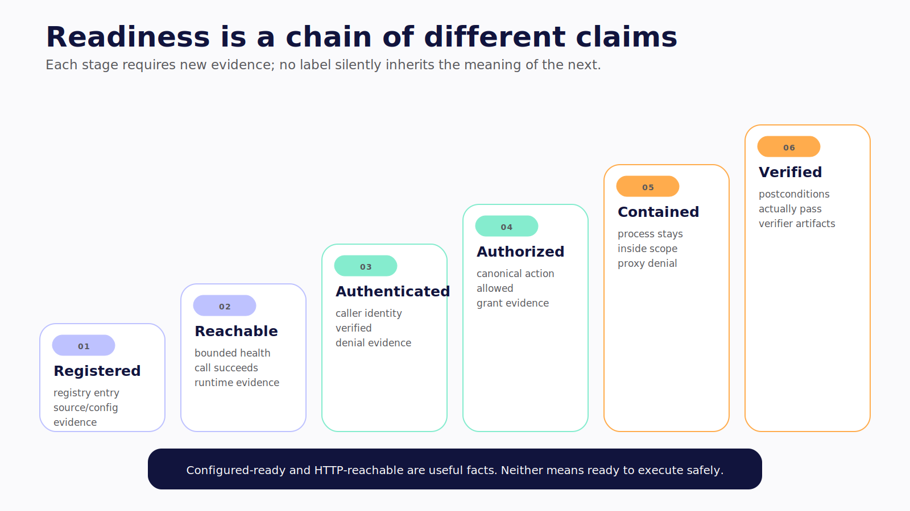
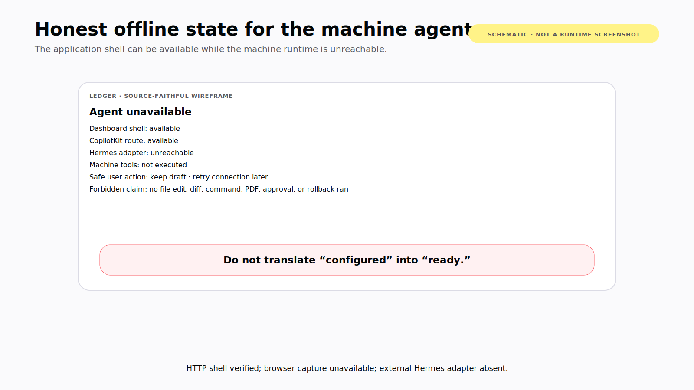
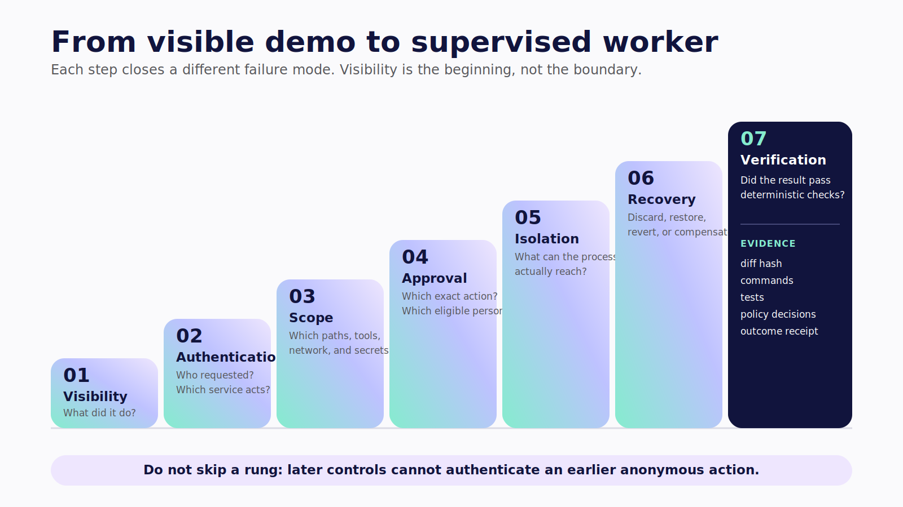
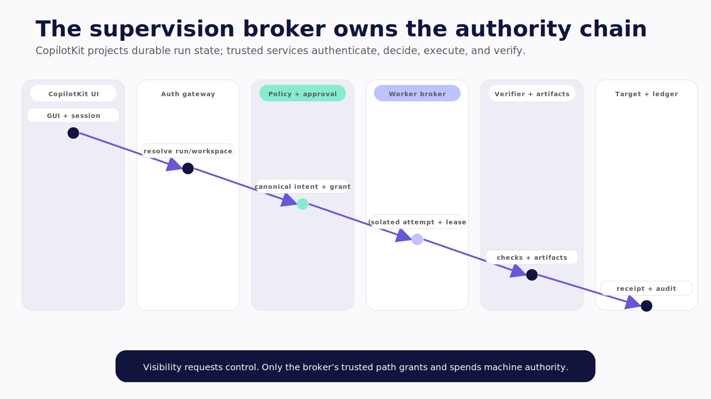
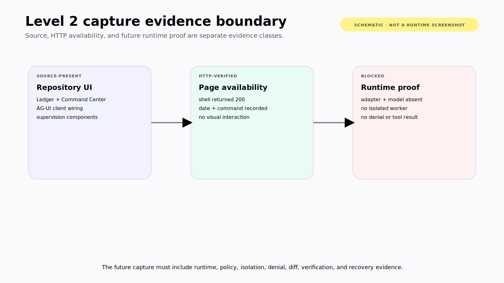

# Chapter 15 — From Visibility to Supervision

The demo is compelling: a user asks for a change inside the financial ledger, Hermes operates on the application's repository, and CopilotKit renders the machine tool call, file diff, and result beside the product being changed.

Now add the annotations the polished frame hides:

```text
permissive execution default
working directory used as context
external adapter and Hermes runtime absent from the repository
no per-user authorization in file/PDF routes
prefix path checks without canonical symlink resolution
display-only tool renderer
best-effort string-replacement Undo
```

That does not make the demo useless. It makes it an unusually good baseline for learning where visibility ends.

> **Reader outcome:** By the end of this chapter, you will be able to connect a CopilotKit control plane to a machine harness, state exactly what the pinned Hermes demo proves, and harden the seam through authentication, scope, approval, isolation, recovery, and verification.

## What the pinned source proves

At `hermes-cpk@fc43491368f19248ca58e1409501cd28722d0f61`, the intended topology is source-present:

```text
CopilotKit React UI
  → local Next.js /api/copilotkit
  → @ag-ui/hermes client
  → external Hermes AG-UI adapter
  → Hermes model/tool loop
  → machine operations in the launch working directory
  → AG-UI events
  → CopilotKit cards, diffs, and PDF renderer
```



*Figure 15.1 — The pinned repository proves a UI and protocol seam, not an end-to-end Hermes machine run.* **Verified July 2026.**

The pinned [`run-adapter.sh`](https://github.com/jerelvelarde/hermes-cpk/blob/fc43491368f19248ca58e1409501cd28722d0f61/run-adapter.sh#L4-L46) selects an application directory, enables a Hermes toolset, changes directory, and invokes `python -m agui_adapter`. The pinned [CopilotKit route](https://github.com/jerelvelarde/hermes-cpk/blob/fc43491368f19248ca58e1409501cd28722d0f61/expense-tracker-live/app/api/copilotkit/%5B%5B...all%5D%5D/route.ts#L1-L24) registers `HermesAgent` under `default` and points it at `AGENT_URL`. The [provider](https://github.com/jerelvelarde/hermes-cpk/blob/fc43491368f19248ca58e1409501cd28722d0f61/expense-tracker-live/app/providers.tsx#L24-L124) shares ledger context and renders machine tool events. The [DiffCard](https://github.com/jerelvelarde/hermes-cpk/blob/fc43491368f19248ca58e1409501cd28722d0f61/expense-tracker-live/components/DiffCard.tsx#L12-L61) displays a client-side diff and exposes Undo.

Those source paths establish a UI and protocol seam. They do not establish an end-to-end run.

## What the recent run proved

 **Verified July 2026.**

*Figure 15.5 — HTTP-verified evidence boundary, rechecked July 15, 2026: the reference Ledger and Command Center shells returned HTTP 200, while the external adapter and all machine actions remained unavailable. Source-faithful schematic; not a GUI screenshot or tool-run claim.*

The recorded pass started the live Ledger, reference Ledger, and Command Center shells from the pinned repository. The following named surfaces returned HTTP 200:

- live Ledger page and `/api/health`;
- live Ledger `/api/copilotkit/info`, reporting CopilotKit `1.62.3` and a registered `default` agent; **Verified July 2026.**
- reference Ledger page and its CopilotKit status route;
- Command Center shell.

The reference Ledger reported `agent: "unreachable (fetch failed)"` for `http://localhost:8000`. Port `8000` refused connections. Running the documented launcher stopped because no model key was configured. The external `/hermes/` checkout, adapter virtual environment, and adapter implementation were absent.

No model call, AG-UI tool stream, file edit, diff interaction, PDF generation, approval, denial, cancellation, replay, or rollback occurred. No Level 2 PNG was captured because the required in-app browser backend was unavailable.

> **Version note — Verified July 2026.** The web-shell and offline-adapter claims above are runtime evidence under the exact recorded commands. Everything beyond them remains source-present, externally dependent, or target architecture.

This is the evidence discipline the interface itself should teach: registered is not reachable; reachable is not authenticated; authenticated is not authorized; authorized is not contained; completed is not verified.



*Figure 15.2 — A stronger readiness label requires a new class of evidence; it cannot be inferred from configuration.*

## Why the baseline is unsafe

### Permissive execution

The launcher defaults `HERMES_YOLO` to `1`. That avoids an interactive stall during a live-edit demo. It also means the baseline does not prove approval policy. A final book run must keep permissive execution disabled and capture a real allow, deny, and approval path.

### Working directory as a convention

`cd "$APP_DIR"` selects relative-path context. It does not jail the adapter or terminal process. The OS user, mounts, environment, network, and sockets determine what else the process can reach.

### Missing external runtime

The tracked repository contains the three UI applications, scripts, docs, and skill. Its gitignored external `/hermes/` runtime is absent. The pinned upstream Hermes `0.18.2` does not contain the demo's AG-UI adapter. Do not transfer upstream security or feature claims to the missing fork, and do not claim native Hermes AG-UI support from this evidence. **Verified July 2026.**

Before reproduction, identify the exact fork, adapter revision, preview client package, license, model/provider compatibility, and security posture. Pin them in the companion lock and run record.

### Unauthenticated file surfaces

The source-present [file route](https://github.com/jerelvelarde/hermes-cpk/blob/fc43491368f19248ca58e1409501cd28722d0f61/expense-tracker-live/app/api/file/route.ts#L7-L41) and [PDF route](https://github.com/jerelvelarde/hermes-cpk/blob/fc43491368f19248ca58e1409501cd28722d0f61/expense-tracker-live/app/api/pdf/route.ts#L7-L35) normalize and prefix-check paths. They do not resolve existing symlink targets before access, and the route code does not establish per-user authorization.

A surrounding deployment might add a gate. It is not present in these files, so the book cannot infer it. The hardened version needs an authenticated gateway, server-selected workspace, canonical path broker, tenant/user policy, and process isolation.

### Renderer mistaken for policy

The wildcard renderer makes reads, writes, patches, generic calls, and PDFs legible. It does not authorize or confine them. Rendering an “approved” event also does not create a grant.

This distinction is the core rule:

> A panel that shows a command after it ran is observability; supervision begins when the system can decide whether it may run at all.

### Best-effort Undo

For a patch, the demo reads current content and uses string replacement. For a write, it can send cached prior text. It does not bind Undo to a base hash, perform an atomic transaction, or prove success before presenting the outcome. Concurrent edits can make Undo a no-op or overwrite newer work.

Call it demo Undo. Production recovery uses a candidate worktree, base revision, patch or snapshot hashes, stale-state rejection, git-native restore/revert, and explicit compensation for effects outside the repository.

## GTM Operations Workspace exposes a complementary seam

The pinned `GTM Operations Workspace` source lets one CopilotKit surface select Hermes, Anthropic, or OpenAI-backed paths. Its Hermes branch registers an AG-UI client, while the hosted-model branches use service adapters. The frontend uses a render-only catch-all for machine tool cards rather than advertising a fake wildcard frontend capability. **Verified July 2026.**

Its source also teaches honest readiness. The backend registry says environment-derived readiness and live smoke testing are different. In the fresh run, Hermes appeared configuration-ready because the UI flag was enabled, while the bounded health probe returned `agent: "unreachable (fetch failed)"`. **Verified July 2026.**



*Figure 15.6 — The honest offline state shared by the pinned shells: UI configuration and HTTP availability can coexist with an unreachable agent. No model, tool, file, diff, PDF, or approval run occurred.*

The middleware can add Basic Auth or a shared-password cookie gate when configured. That can be appropriate for a single-user demo deployment. It is not per-user identity, service-to-service authentication, tenant isolation, or tool authorization. When the configuration is absent, the source-present gate is inert.

The lesson is not that a selectable backend is unsafe. It is that selection, configuration, reachability, capability parity, authorization, and verification are separate states.

## Climb the hardening ladder

Harden one property at a time so every rung closes a named risk.



*Revisit Figure 13.1 — The Hermes–CopilotKit seam starts at visibility; each later rung adds a separately enforced control.*

### 1. Visibility

Stream the proposed action, canonical target, safe arguments, lifecycle, policy decision, result digest, diff, verifier outcome, and receipt. Label model narration separately from execution evidence.

AG-UI and CopilotKit are excellent at this interaction layer. They still do not enforce machine permissions.

### 2. Authentication

Authenticate the user at the application gateway. Authenticate gateway-to-adapter and adapter-to-worker traffic. Do not expose the worker or adapter directly. Correlate requester, session, run, workspace, and acting service identity.

Reject unauthenticated info, join, event-stream, file, PDF, approval, cancellation, and artifact routes. A health route may expose only the minimum deployment-safe status.

### 3. Scope

Resolve a client-requested repository through a trusted workspace registry. Return a server-selected workspace ID, base revision, and isolation profile. Ignore absolute roots supplied by the browser.

Canonicalize path intents, enforce read/write/deny policy, constrain executable and arguments, default-deny network, and start without ambient credentials. Apply the `L2-POLICY` and `L2-WORKSPACE` patterns from Chapter 13 before dispatch, then back them with OS-level containment.

### 4. Approval

Replace permissive execution with typed action intents. Require contextual approval for mutation, dependency installation, external communication, privilege escalation, deployment, and any policy exception.

The decision binds an eligible principal to the canonical workspace, path or argv, argument digest, impact, policy version, and expiry. A changed command requires reevaluation. A UI event alone cannot grant capability; the trusted policy service must issue a one-use grant the worker validates.

### 5. Isolation

Create a unique worktree inside a sandbox, container, or VM. Mount only the intended repository and required read-only tooling. Use a non-admin worker identity, default-deny egress, no personal browser or home directory, no container-engine socket, and explicit resource ceilings.

Fail closed when the required isolation backend is unavailable. Record effective mounts, network, user, image digest, and sandbox version, not only the requested profile name.

### 6. Recovery

Checkpoint before mutation. Record base revision, content hashes, canonical intent, approval grant, worker attempt, patch, artifact hashes, and external operation IDs. Provide discard for unmerged candidates, restore for snapshots, revert for committed code, and compensation for external effects.

Never claim that closing the CopilotKit pane, cancelling the stream, or stopping the model undoes worker effects. Wait for an execution-broker acknowledgement and reconcile the worktree and external receipts.

### 7. Verification

Run the repository's required checks through a deterministic verifier that is distinct from the model loop. Record executable, arguments, environment profile, exit code, duration, and artifact digest. Add diff policy, secret scan, denied-path assertion, and egress assertion.

Do not let the assistant's “done” message transition the run to verified. The verifier event does.

## Design a supervision broker

The hardened request path should read like an ownership chain:

```text
CopilotKit UI
  → authenticated AG-UI gateway
  → server-resolved run and workspace
  → canonical machine intent
  → policy decision or version-bound approval
  → isolated worker with one-use credential lease
  → observation and content-addressed artifacts
  → deterministic verifier
  → review, merge, discard, revert, or compensate
```



*Figure 15.3 — The interface projects durable state while trusted services bind identity, grant authority, execute, and verify.*

The broker, not the model, performs five critical operations:

1. resolves subject and workspace from trusted registries;
2. canonicalizes path, command, network, and credential intent;
3. evaluates policy and consumes a matching grant;
4. selects an effective isolated worker profile;
5. records result and verifier evidence in an append-only action ledger.

Do not rebuild every machine capability as a browser tool. Let the machine harness retain its filesystem, terminal, and provider integrations. Expose typed intents and events to the application, while keeping authorization and execution in trusted services.

## Preserve the identity chain

The user, application, gateway, agent runtime, worker, credential, and external service are different actors. Collapsing them into “Hermes” makes audit and authorization impossible.

For every action, retain:

```text
requesting user
authenticated application session
agent/run acting on the request
gateway service identity
worker attempt identity
credential lease subject and scope
approver, if any
target-system receipt actor
```

The browser does not tell the worker which Unix user or cloud role to use. The gateway maps the authenticated subject and workspace through policy. The credential broker issues a lease to the canonical action, not to the conversational thread in general.

Service-to-service authentication matters even on localhost. A directly reachable adapter that trusts any request can turn another local process into a machine-agent operator. Bind listeners narrowly, authenticate calls, rotate service credentials, and separate health information from operator authority.

If the system supports several human users, authorize thread and artifact access at every route. A user who can view a diff may not be allowed to approve it. A reviewer may approve only one repository or impact class. The worker should receive a grant proving the server's decision, not a user role copied from the client.

Store the chain in an action ledger using references and digests. Do not copy raw credentials, full secrets, or unnecessary file content into it. The goal is to answer who requested, who acted, which policy allowed it, and which target acknowledged it.

## Design the supervision surface by state

A production CopilotKit pane should project the durable run, not merely render whatever tool events arrive.

### Planning

Show objective, server-selected repository, base revision, read-only scope, budget, and proposed acceptance criteria. Let the user narrow scope before mutation tools become available.

### Intent proposed

Show semantic action, canonical path or structured argv, impact, effective isolation profile, network and credential needs, and the reason policy allowed, denied, or requested review.

### Waiting for approval

Show exact digest-bound proposal, reviewer eligibility, expiry, safer alternative, and what will remain if rejected. Disable historical controls after decision or version change.

### Executing

Show worker attempt, heartbeat, current tool, safe arguments, cancellation scope, resource/budget state, and observed artifacts. Keep model narration visually distinct from broker evidence.

### Verifying

Show required checks, exact executable and arguments, exit codes, durations, and output/artifact references. A check not run is pending or skipped under explicit policy, never implicitly green.

### Review and terminal states

Show content-addressed diff, denied-path and egress assertions, receipts, known side effects, unresolved outcomes, and available discard, merge, restore, revert, or compensation operations. Preserve completed effects when a later step fails or is cancelled.

The UI needs a reconnect path for every nonterminal state. It should fetch current state and event cursor from the gateway, not rely on a component's in-memory history. Historical action cards are read-only unless the server confirms a current pending decision.

Accessibility remains a safety property. Policy denial, approval, current command, changed paths, and cancellation state must be available to keyboard and assistive technology and must not depend on color or a fast token stream.


*Figure 15.4 — The supervision surface changes with durable run state and never treats historical controls as live authority.*

## Define the event contract

Use domain events that make boundaries explicit:

```text
machine.run.created
machine.workspace.assigned
machine.intent.proposed
machine.intent.canonicalized
machine.policy.decided
machine.approval.requested | decided | expired
machine.worker.leased | heartbeat | lost
machine.action.started | acknowledged | result
machine.artifact.created
machine.verification.started | result
machine.cancel.requested | acknowledged
machine.recovery.started | result
machine.run.terminal
```

Each event carries stable IDs, schema version, trusted producer, time, and safe payload or artifact reference. A model may trigger the proposal. It must not produce the policy-decision event. The policy service owns that event; the worker owns execution acknowledgement; the verifier owns check results.

Consumers should reject impossible transitions and unknown schema versions. A completed tool message cannot skip `policy.decided`. A verifier result for another worktree cannot complete this run. A UI reconnect detects cursor gaps and requests an authorized snapshot.

AG-UI can transport custom events alongside its standard lifecycle. The application still defines the domain schema and producer trust. Chapter 16's cataloged bridge demonstrates this visibility-versus-enforcement separation in code.

## Gate the hardened build with acceptance tests

The target is publication-ready only when a clean machine can reproduce:

1. installation from pinned dependencies without undisclosed forks;
2. one command that starts UI, authenticated gateway, worker, and verifier;
3. an unauthenticated request denied at gateway and adapter boundaries;
4. a run bound to one server-selected workspace and unique worktree;
5. an in-root symlink read and write denied below the model;
6. an unapproved command and network destination denied;
7. approval bound to canonical path or argv, reviewer, digest, and expiry;
8. one approved edit with no long-lived secret in the worker environment;
9. real AG-UI events and a content-addressed diff;
10. cancellation showing the broker's actual acknowledgement;
11. deterministic checks with exit codes and artifacts;
12. candidate discard and a separate restore or revert demonstration;
13. canary secret absent from UI, logs, traces, and child processes;
14. gateway restart and same-run resume while waiting;
15. exact repository, adapter, package, model, policy, and isolation pins in the record.

Add adversarial cases for wrong user, wrong workspace, expired grant, stale file hash, duplicate worker, sandbox unavailable, and external outcome unknown. The final evidence packet should link each claim in the chapter to a test, source pin, or explicitly blocked capture.

## Interrupt and cancel truthfully

A supervisor must know where the current action lives.

- **Before dispatch:** cancel the queued intent and consume no grant.
- **Waiting for approval:** expire or reject the proposal; no worker effect should exist.
- **Executing cooperatively:** send cancellation through the broker and wait for acknowledgement.
- **Executing non-cooperatively:** terminate the worker under policy, then reconcile effects.
- **After local write:** retain the candidate and offer discard or review.
- **After external write:** query by operation ID and compensate if the domain supports it.

The UI should display `cancel_requested` until the broker reports a terminal state. A disconnected event stream means the UI lost visibility. It does not tell you whether the worker stopped.

## Capture evidence, not theater



*Figure 15.7 — Current Level 2 evidence stops at source presence and HTTP shell availability. Live machine behavior and GUI capture remain blocked, so this figure must never be presented as a Hermes tool run.* **Verified July 2026.**

The publication set should include:

| Capture                | Must show                                                   | Current state             |
| ---------------------- | ----------------------------------------------------------- | ------------------------- |
| Offline baseline       | Pinned shell and explicit adapter-unreachable status        | HTTP-verified, no PNG     |
| Tool intent            | Tool name, canonical target, run/workspace ID, lifecycle    | External runtime required |
| Content-addressed diff | Base hash, patch, candidate worktree                        | Hardened build required   |
| Approval               | Exact argv/path, impact, reviewer, digest, expiry           | Not present               |
| Policy denial          | Out-of-root path or denied destination plus enforcer reason | Not present               |
| Verification           | Actual commands, exit codes, durations, artifact digest     | Not present               |
| Recovery               | Discard/restore/revert or compensation receipt              | Demo Undo only            |
| Worker profile         | Identity, image, mounts, network, credential lease          | Architecture only         |

Every caption records repository SHA, external runtime SHA, lockfile, policy version, isolation profile, synthetic fixture, prompt, model, command, date, and what the frame does not prove.

## Failure drills

### Client-selected root

Send an absolute root and another tenant's workspace ID. The gateway must ignore or reject both and resolve scope from trusted identity.

### Renderer-only approval

Emit an “approved” custom event without a server grant. The worker must deny execution.

### Symlinked file route

Place an in-root symlink to a canary outside file. The application broker and sandbox must both block access.

### Fake readiness

Configure the adapter URL without running the adapter. Show `configured` or `unreachable`, never `ready to execute`.

### Concurrent Undo

Modify the file after the agent's patch, then invoke demo Undo. The hardened recovery path must reject the stale base rather than overwrite the newer edit.

### Cancellation without acknowledgement

Close the UI stream during a worker action. Rejoin the same run and show the broker's actual state instead of submitting another task.

## Exercise — Harden one visible edit

Reproduce the baseline only after pinning and licensing the external Hermes runtime and adapter. Use synthetic credentials and a disposable repository.

Then:

1. disable permissive execution;
2. authenticate user and service boundaries;
3. bind one server-selected workspace and unique worktree;
4. deny one outside path and one network destination;
5. approve one canonical edit with an expiring grant;
6. execute it in the chosen isolation profile;
7. stream real AG-UI tool events and a content-addressed diff;
8. run deterministic checks;
9. discard the candidate;
10. separately demonstrate a restore or revert.

Record each rung's evidence and unresolved gap. If the adapter cannot be pinned, stop at source and HTTP evidence instead of substituting an untracked runtime.

## Builder Checklist

- [ ] The external Hermes runtime, adapter, preview package, license, and model compatibility are pinned.
- [ ] Source-present, HTTP-verified, and end-to-end runtime evidence remain separate.
- [ ] Permissive execution is disabled for publication and production profiles.
- [ ] Gateway, adapter, worker, artifact, and approval routes authenticate.
- [ ] Workspace, tool, path, command, network, and credential scope are enforced server-side.
- [ ] CopilotKit and AG-UI visibility is never described as machine permission enforcement.
- [ ] Approval consumes a one-use grant bound to canonical intent.
- [ ] Worker isolation and effective configuration are verified.
- [ ] Diff and recovery use versions and hashes, not cached-string optimism.
- [ ] Deterministic verifier evidence gates completion.
- [ ] Cancellation waits for broker acknowledgement and reconciles effects.
- [ ] Every screenshot caption states exactly what was and was not run.

## Bridge

A single hardened run is a milestone, not an operating model. Chapter 16 adds queues, leases, heartbeats, budgets, cleanup, observability, recovery, and incident response so the worker can remain safe when browsers disconnect and processes fail.
