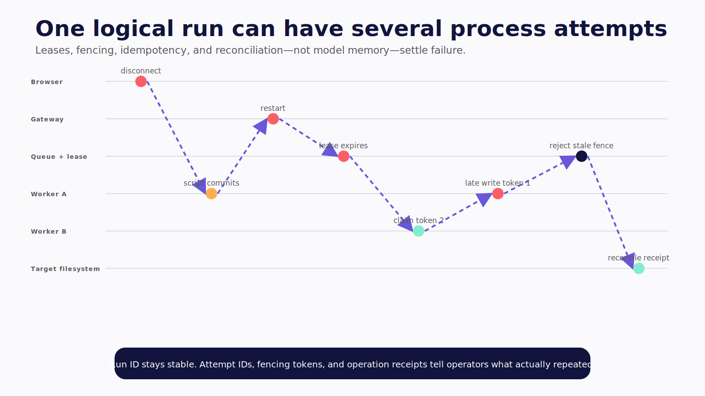
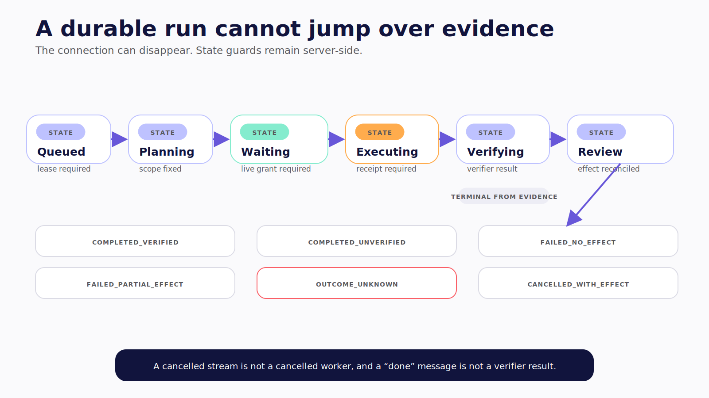

# Chapter 16 — Operate the Worker

The browser disconnects while the worker is installing a dependency. The package script finishes and changes a generated file. The gateway restarts before recording the result. The queue's visibility timeout expires, and a second worker claims the same task from the old checkpoint.

Is that one run, two attempts, one committed change, or three incidents?

The answer cannot depend on what the model remembers.



*Figure 16.1 — One logical run can have several attempts; fencing and receipts settle which effects are authoritative.*

> **Reader outcome:** By the end of this chapter, you will be able to operate machine agents as durable workers with queues, leases, isolated workspaces, budgets, typed events, idempotent effects, verification, cleanup, recovery, and incident response.

## Persist the run outside the connection

A browser tab, SSE stream, terminal session, or channel thread is a view onto work. It is not the work's durable owner.

A `MachineRun` record should include:

| Field group | Required data                                                                |
| ----------- | ---------------------------------------------------------------------------- |
| Identity    | Run ID, requester, acting service identity, tenant or trust boundary         |
| Workspace   | Registry ID, immutable base revision, worktree or worker volume              |
| Lifecycle   | Queued, planning, waiting, executing, verifying, review, terminal state      |
| Control     | Policy version, isolation profile, approval/grant references                 |
| Budget      | Maximum steps, wall time, compute, disk, output, network, and cost           |
| Attempts    | Lease owner, attempt number, heartbeat, start/end, worker image              |
| Effects     | Canonical intent digests, idempotency keys, external operation IDs, receipts |
| Evidence    | Checkpoints, event cursor, diffs, artifacts, verifier results                |
| Governance  | Data class, retention, cleanup, incident hold, deletion state                |

Keep the logical run stable across process attempts. A retry creates another attempt under the same run, not a fresh user task. Keep worker attempt IDs separate from tool operation IDs so operators can tell whether another process repeated the same effect.

Use an explicit state machine. A run cannot jump from `waiting_for_approval` to `completed` without a consumed grant, execution result, and required verification. A cancelled stream does not move the worker to `cancelled`.



*Figure 16.2 — The connection can disappear, but server-side state guards still require grants, receipts, and verifier evidence.*

> Autonomy becomes operable when every run can be located, bounded, verified, stopped, and recovered without relying on the model's memory of what happened.

## Queue, lease, and heartbeat

The queue should deliver at least once under failure. The worker must make repeated delivery safe.

When a worker claims a run:

1. acquire a time-bounded lease with a fencing token;
2. verify run state, policy version, workspace base, and cancellation state;
3. create or attach the assigned isolated workspace;
4. heartbeat before the lease expires;
5. checkpoint before and after consequential steps;
6. record external operation IDs and receipts;
7. release or expire the lease under a terminal attempt outcome.

A stale worker may continue after losing its lease. Use fencing tokens or version preconditions so its later state writes and tool grants fail. Process termination alone is not enough; a partitioned worker may still reach external services.

Lease length should exceed normal heartbeat jitter but remain short enough for recovery. Long tools need their own liveness and cancellation contract. Do not extend a lease indefinitely merely because the model continues streaming tokens.

## Make effects idempotent

Every consequential operation receives a stable idempotency key derived from the logical run, canonical intent, and operation version. Retries reuse the key.

For a repository patch, the base content hash is the precondition and the result hash is the receipt. For a pull request, ticket, message, or deployment, store the external provider's operation ID. If the request times out after possible commit, query by that identity before retrying.

Model unknown outcome explicitly:

```text
not_started → dispatched → committed | failed_known | outcome_unknown
outcome_unknown → reconciled_committed | reconciled_not_committed | manual_review
```

Do not generate a new idempotency key because the first attempt “felt stuck.” Do not let the model decide that an ambiguous write probably failed. The operation ledger and target system settle the state.

Some commands are not naturally idempotent. Place them in a disposable worktree or wrapper that enforces preconditions. For external systems without idempotency, serialize through an operation table or require human reconciliation before a second attempt.

## Stream visibility without confusing it with authority

The cataloged `L2-AGUI` companion excerpt makes the boundary explicit:

```ts
export class VisibleMachineBridge {
  constructor(
    private readonly enforcer: MachineEnforcer,
    private readonly events: AgUiEventSink,
  ) {}

  async request(intent: MachineIntent): Promise<PolicyDecision> {
    this.events.emit({
      type: EventType.CUSTOM,
      name: "machine.intent.proposed",
      value: intent,
    });

    // AG-UI provides visibility. Only this separately deployed enforcer can
    // authorize the action; emitting an "approved" event grants no capability.
    const decision = await this.enforcer.authorize(intent);
    this.events.emit({
      type: EventType.CUSTOM,
      name: "machine.intent.decided",
      value: decision,
    });
    return decision;
  }
}
```

**Verification label:** `L2-AGUI` is original companion code. It passes format, lint, typecheck, and build against AG-UI `0.0.57`. It was not connected to a live Hermes worker or browser capture. **Verified July 2026.**

The complete catalog region shows the order: emit proposal, ask the separately deployed enforcer, then emit decision. An attacker cannot gain machine authority by emitting a matching custom event. The executor must receive and validate a grant or policy decision through a trusted service path.

Events should carry references and safe summaries, not every secret-bearing argument or terminal byte. Persist a monotonically ordered cursor so a rejoining UI can fetch the latest authorized state and resume after a gap.

Expose:

- proposed and canonical intent;
- policy version and outcome;
- approval status and expiry;
- worker attempt and isolation profile;
- action start, heartbeat, acknowledgement, and result digest;
- worktree diff and artifact hashes;
- verifier commands and exit statuses;
- cancellation, recovery, and terminal outcome.

Do not expose hidden reasoning. Operational evidence is enough to supervise.

## Name cancellation by layer

| Request                 | What may stop                            | What remains                                                     |
| ----------------------- | ---------------------------------------- | ---------------------------------------------------------------- |
| Stop model generation   | Further tokens and cooperative loop work | Dispatched tools and completed effects                           |
| Cancel queued run       | Future worker claim                      | Any already leased attempt requires separate action              |
| Cancel current tool     | Tool work that acknowledges cancellation | Accepted external action may continue                            |
| Halt after atomic step  | Next agent step                          | Current step and prior effects                                   |
| Terminate worker        | Local processes in the worker boundary   | External effects, durable files, child services outside boundary |
| Discard candidate       | Unmerged worktree or disposable VM       | External actions and audit history                               |
| Roll back or compensate | Runs a new recovery operation            | Recovery may fail; original history remains                      |

The UI enters `cancel_requested` when the user asks. It enters `cancelled` only when the scheduler and execution broker acknowledge the applicable scope. If the worker finished first, show the completed effect and available recovery rather than rewriting history to match the click.

Disconnect is not cancellation. Rejoin by stable run ID and event cursor, re-authenticate, reconcile state from the server, and continue displaying the same attempt or its successor.

## Use the right recovery verb

**Discard** destroys an unmerged candidate. **Restore** returns a file or workspace to a snapshot. **Revert** creates a new commit or version that reverses a recorded change. **Compensate** calls an external system to counter an effect. **Revoke and rebuild** responds to possible credential or host compromise.

Before every write, record the base revision or resource version and expected postcondition. Afterward, record the result digest or receipt. A recovery command uses those preconditions. If the current resource has moved, stop and present a conflict.

Do not restore a whole workspace to undo one file when another run has since changed it. Do not revert an external deployment by restoring only local git state. Do not “clean” a suspicious persistent worker when the incident requires rebuilding from a trusted image.

Run recovery through policy and audit. A rollback can be more destructive than the original action.

## Set budgets and terminal outcomes

Bound steps, wall time, model tokens, cost, CPU, memory, disk, output volume, network bytes, child processes, tool retries, and approval wait. A budget crossing should stop new work and preserve a truthful partial result.

Define terminal outcomes from evidence:

- `completed_verified`: required postconditions passed;
- `completed_unverified`: work exists but required checks did not finish;
- `failed_no_effect`: failure before consequential change;
- `failed_partial_effect`: known effects remain;
- `outcome_unknown`: target acceptance is unresolved;
- `cancelled_no_effect` or `cancelled_with_effect`;
- `rolled_back` or `compensation_failed`.

Do not collapse them into success, failure, and cancelled. Operators need the effect state to decide whether retry is safe.

## Observe outcomes without warehousing secrets

The minimum dashboard includes:

| Metric                                          | What it reveals                          |
| ----------------------------------------------- | ---------------------------------------- |
| Verified outcomes by task class                 | Work completed, not merely narrated      |
| Denials and approvals by capability             | Policy pressure and approval fatigue     |
| Rejection and edit rate                         | Proposal quality and scope               |
| Tool error and retry rate                       | Integration fragility and duplicate risk |
| Steps, wall time, and cost per verified outcome | Efficiency                               |
| Sandbox unavailable or escape request           | Boundary degradation                     |
| Credential leases by scope                      | Privilege creep                          |
| Egress destinations and denials                 | Unexpected data flow                     |
| Recovery and compensation success               | Actual reversibility                     |
| Stale worktrees, checkpoints, and leases        | Cleanup and data-governance debt         |

Log identity references, policy version, canonical intent digest, decision, isolation profile, result digest, operation ID, and artifact reference. Redact credential values and sensitive tool output at ingestion. Restrict access to transcripts and diffs; they may contain source, customer data, or secrets.

Trace retention is not memory retention. Keep agent-authored memory, run checkpoints, operational logs, and product artifacts under separate policies and deletion paths.

## Coordinate concurrent repository work

Give each run a unique worktree and base revision. Two workers may edit the same logical file safely in isolation, but their candidates can still conflict at merge time.

Do not solve this by sharing one mutable checkout and adding a UI lock. Use repository-native merge or rebase checks against the current target revision. If the base moved, re-run the relevant analysis and verifier after conflict resolution. A diff verified against yesterday's base is not verified against today's merge candidate.

Lock only truly singleton external operations, and make the lock durable and fenced. A deployment environment, release tag, or schema migration may allow one active operation. A stale worker that lost the lock must be unable to commit later.

Expose concurrency honestly: candidate based on revision, target now at revision, conflicts, checks invalidated, and reviewer action required. Never present “tests passed” from the pre-rebase candidate as evidence for the post-rebase artifact.

## Automate cleanup

Every run allocates state: worktree, container or VM, image layer, dependency cache, checkpoint, artifact, log, credential lease, and queue message. Assign expiry and cleanup ownership at creation.

Terminal cleanup should:

1. revoke credentials and grants;
2. terminate remaining child processes;
3. collect allowed artifacts and verifier evidence;
4. discard or archive the candidate under policy;
5. delete ephemeral volumes and browser profiles;
6. release lease and workspace locks;
7. mark checkpoint and trace retention;
8. record cleanup result.

Alert on orphaned resources and cleanup failures. A stale worktree can contain proprietary code. A retained VM disk can contain credentials. A forgotten approval remains a replay risk unless expiration is enforced server-side.

## Failure and security review: prepare the incident path

When behavior looks suspicious:

1. stop new scheduling and revoke active worker leases;
2. terminate affected workers without claiming prior effects were undone;
3. revoke credential leases and rotate possibly exposed long-lived secrets;
4. preserve immutable run, worktree, policy, skill/plugin hashes, and operation IDs;
5. block implicated tools, destinations, skills, plugins, or MCP servers;
6. determine affected repositories, users, tenants, and external systems;
7. discard, restore, revert, compensate, or rebuild from recorded effects;
8. turn the trajectory into a regression test and policy fixture;
9. communicate observed facts, inferences, remediation, and unknowns.

Practice this with synthetic canaries. The first time the team learns how to revoke a worker identity should not be during an exfiltration alert.

## Roll out authority gradually

Start with offline evaluation on adversarial synthetic repositories. Move to read-only shadow runs without credentials. Allow local writes only in disposable worktrees with mandatory review. Add narrow network reads. Then add low-risk external writes with one-use credentials and version-bound approval.

Graduate on evidence for path containment, denied egress, credential scoping, idempotency, cancellation acknowledgement, restart recovery, verified outcomes, and incident response. Demo success rate alone is not a promotion gate.

## Exercise — Run the worker game day

Execute these scenarios on the target release profile:

```text
cancel while a tool is running
disconnect UI while worker continues
restart gateway while waiting for approval
let a lease expire while a stale worker remains alive
retry after an external success with a lost response
revoke a credential lease mid-run
make verification fail after a valid patch
discard one candidate worktree
restore or revert a separate recorded change
fail one compensation
trigger suspicious egress and rebuild the worker
```

For each, record the durable run state, attempt, events, effects, receipts, user-facing language, cleanup, and regression case.

## Builder Checklist

- [ ] Run state survives browser, gateway, and worker restarts.
- [ ] Queue delivery uses leases, heartbeats, fencing, and bounded attempts.
- [ ] Consequential effects use stable idempotency and external operation IDs.
- [ ] AG-UI events expose evidence but grant no machine authority.
- [ ] Cancellation acknowledgement names the layer that stopped.
- [ ] Discard, restore, revert, compensate, revoke, and rebuild remain distinct.
- [ ] Budgets stop new work and preserve truthful partial outcomes.
- [ ] Metrics measure verified effects, boundary degradation, and recovery.
- [ ] Logs and traces redact secrets and follow explicit retention.
- [ ] Worktrees, workers, grants, credentials, and checkpoints clean up automatically.
- [ ] Incident containment and rebuild are practiced with synthetic canaries.
- [ ] Authority increases only after the clean-machine acceptance suite passes.

## Bridge to Organizational Agents

Level 2 often begins with one operator and one environment. Level 3 adds several requesters, shared channels, organizational service identities, institutional memory, delegation, and approval across people who do not share the same authority.

The machine worker should not absorb that social complexity. It should receive a narrow, authenticated task envelope and return evidence. Part IV builds the organizational actor that can create that envelope without turning a Slack mention into ambient machine authority.
