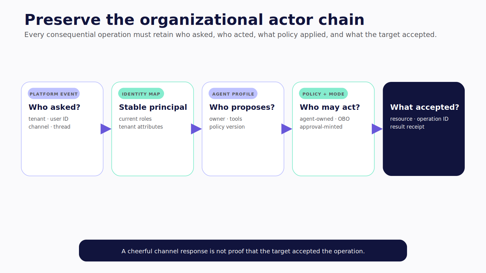
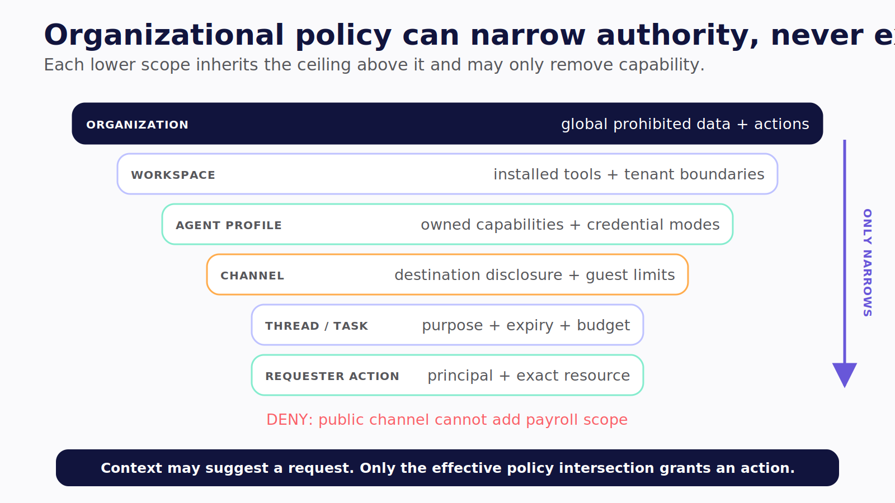
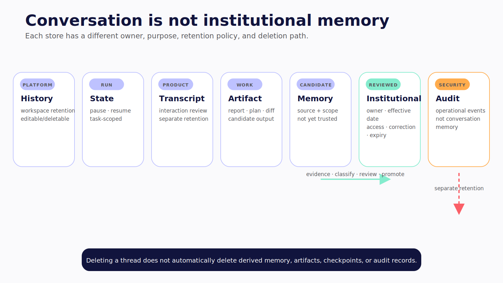

# Chapter 17 — When the Agent Joins the Team

A teammate asks an agent in a shared Slack channel to open a customer record. The teammate cannot access the record directly. The agent's service account can.

The message is authentic. The requested action is understandable. The capability exists. None of those facts answer the question that matters:

> Under whose authority would the record be opened?

If the system treats visibility in a channel as permission to spend every capability attached to the bot, it has built a confused deputy with a friendly avatar. The agent has more authority than the requester, and the requester can induce it to use that authority for a purpose the target system would have denied.

This is the threshold between adding an agent to a channel and introducing an organizational actor.

> **Reader outcome:** By the end of this chapter, you will be able to distinguish a channel bot, a channel agent, and a governed organizational actor; map the requester, agent, policy, and target identities; and decide what is still missing before a shared agent should receive organizational authority.

## Three different products can share one avatar

Teams often call all three of these systems “the bot.” That hides important engineering differences.

| System | What it can do | State and autonomy | Authority model | Operational owner |
| --- | --- | --- | --- | --- |
| Channel bot | Match commands, post messages, call fixed handlers | Usually request-scoped and deterministic | Platform installation plus handler credentials | Integration owner |
| Channel agent | Interpret goals, use tools, stream progress, pause, and resume | Multi-step run state and adaptive tool selection | Often a shared service identity with app-defined checks | Agent application team |
| Governed organizational actor | Act and delegate across shared systems under identity, policy, approval, memory, and audit controls | Durable runs, bounded memory, asynchronous work, and explicit handoffs | Requester-, resource-, environment-, and action-aware authorization | Named product, security, data, and service owners |

A channel bot can still perform consequential writes. A channel agent can still be tightly constrained. The taxonomy is not a score for intelligence. It describes how much interpretation, persistence, and shared authority the system carries—and therefore what controls the builder must supply.

The organizational threshold is crossed when authority becomes shared, durable, and accountable—not when the agent gets a Slack avatar.

## Preserve the actor chain

For every consequential operation, preserve at least three identities:

1. **Who asked?** The human or service principal that initiated this request.
2. **Who acted?** The agent principal and the execution identity used for the tool call.
3. **Who accepted the action?** The target system, resource, and operation identifier that confirm the effect.

In practice, the full tuple is larger:

```text
requester principal
+ agent principal and profile
+ tenant or workspace
+ channel and thread
+ policy version
+ action and canonical arguments
+ target resource and sensitivity
+ credential mode
+ environment and risk
+ approval record, when required
```

Do not keep this tuple only in a prompt. The model can use a summarized form as context, but trusted services must bind and enforce the real values outside model-generated text.

The platform sender ID is an ingress fact. Map it to a stable application principal through a verified tenant-specific identity binding. Preserve the raw platform identity for audit, but make authorization decisions on the stable principal and current attributes. A renamed Slack handle or recycled display name must not silently become a new grant.

The agent also needs its own principal. “The bot token” is not a sufficient identity model. Name the agent profile, its owner, permitted channels, tool catalog, environments, credential mode, policy version, and kill switch. Two profiles may use the same model and code while holding different authority: a public support agent and a private incident agent should not be interchangeable because both render through Slack.

Finally, capture target acceptance. If the agent creates a Linear ticket, store the ticket ID and target receipt. If it starts a machine run, store the machine-run ID and signed result envelope. A cheerful channel response is not proof that the target accepted the operation.



*Figure 17.1 — Preserve who asked, who proposed, which identity acted, which policy applied, and what the target accepted.*

## Apply policy from broad to narrow

A useful context hierarchy is:

```text
organization policy
  → tenant or workspace policy
    → agent profile
      → channel policy
        → thread or task context
          → requester and current action
```

Higher levels constrain lower ones. A user message cannot override an organization-wide prohibition. A channel marked for public customer collaboration cannot invoke an internal payroll tool merely because an administrator installed the same agent in both places. A thread can narrow scope; it must not expand the parent channel's authority.

The model does not decide this hierarchy. A policy enforcement point evaluates the trusted identity and resource tuple before a tool or delegation boundary. The model proposes intent. Policy turns that proposal into allow, deny, narrow, or request-approval.



*Figure 17.3 — Organizational policy composes from broad to narrow; lower context can remove authority but cannot add capability prohibited above it.*

This distinction prevents two common mistakes.

First, do not confuse instructions with authorization. “Only finance managers may run this tool” in a system prompt is guidance. It becomes a control only when a trusted identity resolver and policy service enforce it.

Second, do not confuse channel membership with resource permission. Membership may be an attribute in a decision, but it does not automatically confer access to every system the agent can reach.

## Treat channel context as untrusted, sensitive input

Shared channels carry useful social context: participants, prior decisions, reactions, attachments, urgency, and the language the team uses. They also carry copied secrets, stale conclusions, external guests, malicious instructions, and data with different retention rules.

Use the smallest context window that can support the task. Default to the triggering message and its thread, not the entire workspace. Label message authors and retrieval sources. Separate quoted content from trusted application instructions. Do not let an attachment redefine tool policy or identity. Redact secrets before model context and traces. Re-check authorization when retrieved context names a sensitive resource.

The same rule applies to output. A result that the agent was allowed to compute may still be unsafe to post in the originating channel. Evaluate disclosure at the destination. A private analysis tool should be able to return “three accounts require review” without pasting the restricted account records into a broad channel.

## Design against the confused deputy

A confused deputy appears when a system with authority cannot reliably distinguish whose request it is serving or what policy should apply. Organizational agents are especially exposed because their service credentials are often broader than any single channel participant's access.

Use one of three credential modes deliberately:

- **Agent-owned service authority:** The action is performed as the agent. Policy must authorize both the agent profile and the requester to induce that class of action.
- **On-behalf-of authority:** A short-lived delegated credential carries the requester as subject and the agent as actor. The target can apply the requester's permissions.
- **Approval-minted authority:** A trusted policy service issues a narrow, expiring grant for one canonical action after eligible approval.

Do not claim that one mode is always superior. A scheduled reporting agent cannot always act on behalf of an online user. A support triage agent may properly own permission to create draft records. A high-impact production change should usually require a narrowly minted grant even if the requester is an administrator.

Whichever mode you choose, make it visible in the proposal and audit record. “Agent will act as OperationsAgent using the ticket-draft service role” is more useful than “OpenTag wants to use Linear.”

## Give organizational memory a promotion path

A shared agent is tempting to treat every conversation as institutional knowledge. That turns casual discussion, unreviewed model output, and personal data into an unowned database.

Separate these stores:

- **Platform history** belongs to Slack, Teams, or Discord under platform and workspace retention.
- **Run state** exists so one task can pause, resume, and recover.
- **Transcript** records the interaction required for product behavior and review.
- **Working artifact** is a report, plan, diff, or decision candidate.
- **Candidate memory** is a proposed reusable fact with sources and scope.
- **Institutional memory** is reviewed, provenance-bearing knowledge with an owner, effective date, access policy, correction path, and expiry.
- **Audit record** is an operational/security event stream, not conversation memory.

Promotion should be explicit: extract a candidate, attach evidence, classify sensitivity, require the appropriate review, store it under a scope, expose provenance on retrieval, and support correction, expiry, and deletion. “The agent remembers the channel” is not a governance design.



*Figure 17.2 — Institutional memory is promoted through evidence, classification, review, ownership, and expiry; audit remains a separate store.*

## Assign owners before assigning tools

An organizational actor needs more than a repository maintainer.

Name a product owner for which work the agent should perform, a service owner for availability and incidents, a security owner for identity and policy, a data owner for retention and memory, and owners for every consequential target integration. One person may fill several roles in a small team, but the responsibilities must still exist.

Also document the control paths:

- who may install the agent;
- who may add it to a channel;
- who may change tools, policies, models, and prompts;
- who may approve each risk class;
- who can stop new runs, revoke credentials, or disable one integration;
- who can inspect and delete retained data;
- how the agent is removed from platforms and target systems.

If nobody owns retained memory or can enumerate active credentials, the system is not ready for organizational scope.

## Failure and security review

Walk through these failures before implementation:

- A guest in a shared channel mentions the agent and requests an internal record.
- A legitimate requester quotes a malicious instruction from an issue.
- A user edits the requested arguments after another person approves them.
- The agent posts a restricted result into the broad channel that initiated the task.
- A removed employee's approval action remains clickable.
- The agent's service credential is revoked after approval but before execution.
- A transcript is deleted while derived institutional memory remains.
- The channel adapter is removed, but scheduled runs and target credentials continue.

For each scenario, identify the trusted identity source, policy decision, enforcement point, effect state, user-facing message, audit event, and recovery action. If the answer depends on the model “knowing better,” the control is missing.

## Exercise — Classify the agent you already have

Choose one channel integration and complete this authority map:

```text
agent profile and owner:
allowed tenants/workspaces/channels:
who may invoke it:
tools and target resources:
credential mode per tool:
approval rules and eligible approvers:
memory stores, owners, retention, deletion:
audit destination and access:
kill switches:
decommission steps:
```

Then label the system **channel bot**, **channel agent**, or **governed organizational actor**. List the concrete gaps that prevent the next label. Do not use the number of tools or quality of responses as the test.

## Builder Checklist

- [ ] Requester, agent, approver, execution, and target identities remain distinct.
- [ ] Platform identities map to stable tenant-scoped application principals.
- [ ] Organization, workspace, agent, channel, and action policy compose outside the model.
- [ ] Channel membership and prompt instructions are not treated as authorization.
- [ ] Every tool declares credential mode, target scope, risk, and owner.
- [ ] Sensitive output is authorized for its destination, not only its source.
- [ ] Memory promotion, provenance, retention, correction, and deletion are defined.
- [ ] Audit records live outside editable conversation history.
- [ ] Stop, revoke, incident, and decommission paths have named owners.

## Bridge to Channels

The authority map tells us what an organizational actor must preserve. It does not yet move a message, stream an agent run, or render an approval in a platform-native surface.

Chapter 18 builds that channel/runtime boundary with CopilotKit Channels. It shows what one cross-platform abstraction can normalize, where Slack, Discord, and Teams still differ, and why adapter state and event dedup do not solve business authorization or exactly-once side effects.
