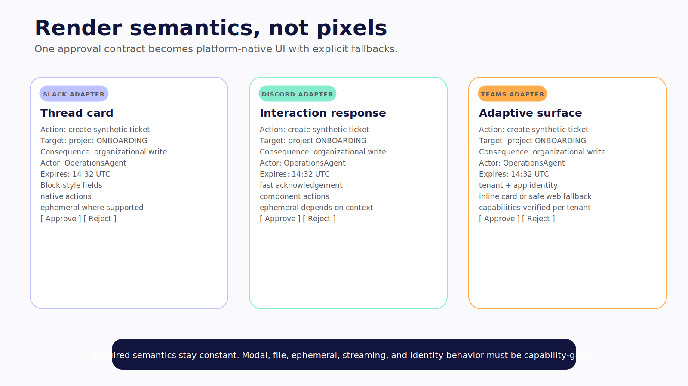
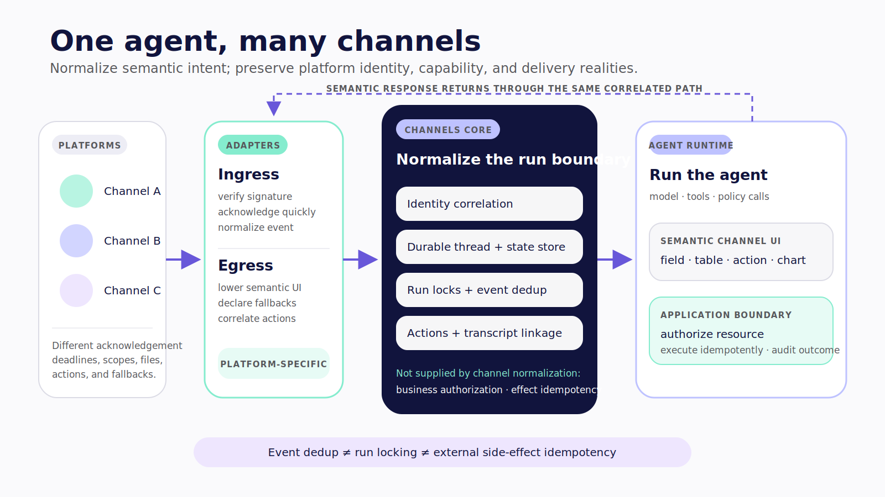
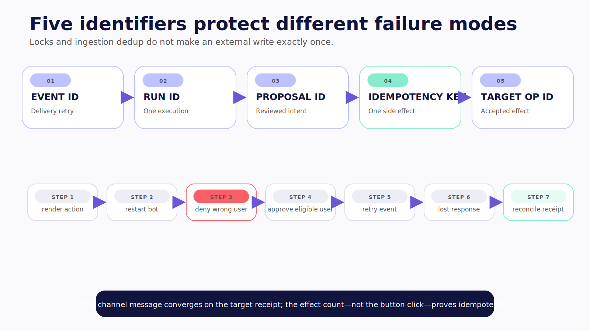
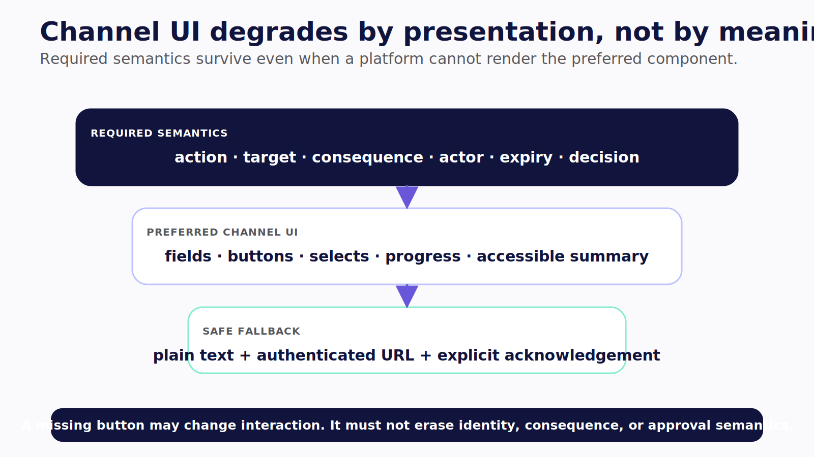
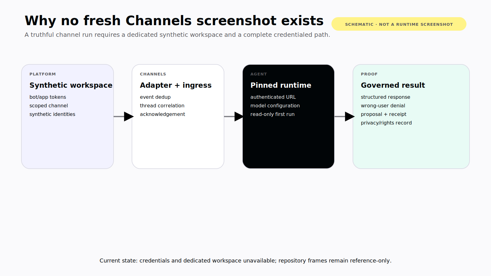

# Chapter 18 — One Agent, Many Channels

Build one semantic approval: a title, a summary of the proposed action, two fields, and **Approve** and **Reject** buttons.

In Slack, the adapter may render it as Block Kit inside a thread. In Discord, the interaction and ephemeral-response rules differ. In Microsoft Teams, the same intent travels through a bot registration, a Teams app manifest, and an Adaptive Card-shaped surface. Modal support, file paths, identity lookup, reactions, typing indicators, and acknowledgement deadlines are not identical.

The agent can be shared. The platform contract cannot be wished away.



*Figure 18.2 — Semantic priorities remain constant while interaction, identity, and fallback behavior stay platform-specific.*

> **Reader outcome:** By the end of this chapter, you will be able to connect a self-hosted AG-UI agent to Slack through the current CopilotKit Channels packages, choose durable state and invocation behavior, render semantic channel UI, and plan tested fallbacks for Slack, Discord, and Teams. **Verified July 2026.**

## Start with the current package boundary

At the book's pinned CopilotKit revision, source packages exist for: **Verified July 2026.**

- `@copilotkit/channels` for channel-neutral bot, thread, state, transcript, action, lock, deduplication, and queue behavior;
- `@copilotkit/channels-ui` for semantic message components;
- `@copilotkit/channels-slack`, `@copilotkit/channels-discord`, and source-present `@copilotkit/channels-teams` platform adapters.

Current public [Channels API reference](https://docs.copilotkit.ai/reference/channels) documents Slack and Discord directly; treat Teams as source-present and version-sensitive until the exact adapter is run in a synthetic Microsoft tenant. The source also contains `@copilotkit/channels-intelligence`, while the [managed Channels guide](https://docs.copilotkit.ai/langgraph-python/channels) describes a waitlist path. Treat package presence as implementation direction, not proof of a generally available managed service.

> **Version note — Verified July 2026.** The implementation claims in this chapter use CopilotKit commit `855446e1abc8f29756dc5e539e5e50a90321ac2d`. The companion compiled against Channels `0.1.1` and the Slack adapter `0.1.2`. Recheck package versions, adapter maturity, and managed availability at publication freeze.

Channels normalizes a useful application seam:

```text
platform event
  → adapter authentication and normalization
  → tenant/channel/thread correlation
  → lock and ingestion deduplication
  → agent run or registered action
  → semantic response
  → platform-specific rendering
```

It does not provide organizational authorization merely by moving data through that seam. Requester policy, target-resource policy, approver eligibility, delegated credentials, and idempotent external effects remain application responsibilities.



*Figure 18.1 — Channels normalizes the interaction seam; target authorization and idempotent side effects remain outside the adapter.*

## Wire a mention-triggered Slack agent

The companion's `L3-CHANNELS` excerpt shows the smallest useful direct path. It validates required configuration, restricts invocation behavior, creates one AG-UI client per thread, and starts a run on mention.

```ts
export function createSlackAgentBot(config: SlackBotConfig) {
  if (!config.botToken || !config.appToken || !config.agentUrl) {
    throw new Error("Slack tokens and AG-UI agent URL are required");
  }

  const bot = createBot({
    adapters: [
      slack({
        botToken: config.botToken,
        appToken: config.appToken,
        respondTo: {
          directMessages: true,
          appMentions: { reply: "thread" },
          threadReplies: "mentionsOnly",
        },
      }),
    ],
    agent: (threadId) => {
      const agent = new HttpAgent(
        config.agentAuthorization
          ? {
              url: config.agentUrl,
              headers: { Authorization: config.agentAuthorization },
            }
          : { url: config.agentUrl },
      );
      agent.threadId = threadId;
      return agent;
    },
    store: { lockTtl: 60_000, dedupTtl: 300_000 },
  });

  bot.onMention(async ({ thread }) => {
    await thread.runAgent();
  });
  return bot;
}
```

**Verification status — `L3-CHANNELS`:** format, lint, typecheck, and build passed in the companion against the named package versions. No Slack conversation was run because the capture environment lacked synthetic workspace tokens and an agent/model runtime. Compile verification is not runtime proof.

The `respondTo` block is a product and security choice. Mention-only behavior reduces accidental ambient invocation and makes the trigger visible. Direct messages may be appropriate for private tasks, but they need separate data and memory rules. If the application later listens to every message, treat that as a new authority mode and rollout stage—not a harmless configuration change.

The optional `Authorization` header protects the agent bridge only if the receiving service validates it, scopes it, rotates it, and avoids logging it. In a multi-tenant service, bind the channel tenant and stable principal server-side. Never accept tenant identity from model-generated arguments.

## Replace demonstration state with a durable store

The excerpt's `store` object configures lock and deduplication time-to-live values, but it does not establish a production data plane. The default in-memory path cannot survive restart or coordinate multiple bot processes.

Use a durable, tenant-partitioned `StateStore` implementation for:

- key/value state and typed application state;
- distributed locks with explicit conflict behavior;
- event-deduplication markers;
- queues and leased work;
- action and transcript records needed across restart.

Define the state schema with Standard Schema-compatible validation. Resolve platform users into stable tenant-scoped identities. Set retention for transcripts and application state independently. Decide what happens when a lock cannot be obtained: reject, queue, wait, or return a truthful “already running” state. Silent parallel runs are not a fallback.

Locking and deduplication solve different races. A lock limits concurrent work on the same key. An ingestion dedup key suppresses a repeated platform event within a window. Neither makes an external ticket creation or payment exactly once.

Separate these identifiers:

```text
platform event ID         detects delivery retry
agent run ID              correlates one execution
proposal ID               identifies one reviewed intent
idempotency key           protects one target side effect
target operation ID       proves what the target accepted
```

The pinned Channels source acquires a lock before checking deduplication, and a dedup-store failure can be configured to warn and continue. That may be a reasonable availability choice for harmless replies. It is unsafe to translate it into “writes cannot repeat.” A consequential tool needs its own durable idempotency record and target-specific reconciliation.



*Figure 18.3 — Locks and ingestion deduplication do not replace side-effect idempotency or target reconciliation.*

## Make actions survive restart

Channel buttons carry opaque routing references. They are not authorization tokens. A forged or replayed action still needs platform-request authentication, principal mapping, a persisted proposal, eligibility checks, expiration, one-use or quorum semantics, and current-policy reauthorization.

Prefer registered actions whose behavior can be reconstructed from durable state. An inline callback closure may work while one process is alive, then disappear after deployment or crash. Store the action's canonical proposal and route the opaque action reference to a trusted handler after restart.

Test this sequence:

1. render the action;
2. restart the bot process;
3. click as an ineligible user;
4. click as an eligible user;
5. retry the same platform event;
6. retry after the target succeeded but the bot lost the response.

The final target effect should happen once, and the channel message should converge on the authoritative receipt.

## Render semantics, not pixels

`@copilotkit/channels-ui` supplies a semantic intermediate representation: messages, markdown, fields, actions, buttons, selects, inputs, tables, and other structured nodes. The application chooses the business object. Each adapter lowers that object into what its platform supports. **Verified July 2026.**

This is not React DOM in a chat client, and it does not promise pixel parity. Design components around semantic priorities:

```text
required: action, target, consequence, actor, expiry
preferred: structured fields, buttons, progress, receipt
fallback: concise text plus a safe URL or command
```

Capability-gate optional behaviors. If a platform does not support a modal, render an inline card or redirect to an authenticated web approval. If ephemeral output is unavailable, avoid posting sensitive detail into the channel. If streaming is coarser, post stable stage transitions instead of simulating token parity.



*Figure 18.4 — Platform capability may change presentation and interaction, but the semantic approval contract and disclosure boundary must survive every fallback.*

## Keep the platform differences in the design

The pinned adapter source declared these practical differences; they are a test plan, not a permanent product promise:

| Concern | Slack | Discord | Microsoft Teams |
| --- | --- | --- | --- |
| Typical acknowledgement budget in adapter source | About 3 seconds | About 3 seconds | About 15 seconds |
| Modal capability declared | Yes | Yes | Not declared at the pin |
| Typing indicator declared | Not declared | Yes | Yes |
| Reactions declared | Yes | Yes | Not declared |
| Ephemeral behavior | Native | Context-dependent | Not declared |
| Deployment identity | Slack app and bot tokens; Socket Mode or signed HTTP | Application/bot, Gateway intents, interactions | Entra application, Azure Bot, Teams app manifest, tenant policy |
| File reality | Slack file APIs and scopes | Discord attachment behavior | Chat files and channel files can take different Graph/SharePoint paths |

All three can stream, but update cadence, edit semantics, and visible presentation differ. The Teams adapter did not wire the same user-lookup behavior at the pin. Do not design approval around a capability until the exact adapter version and tenant configuration prove it.

Platform controls are also layered.

For Slack HTTP ingress, verify request signatures and timestamps; for Socket Mode, secure and rotate app- and bot-level tokens. Minimize OAuth scopes. A valid Slack event proves platform origin, not business authorization.

For Discord, request only needed Gateway intents and understand which are privileged. Intents control data delivery, not which business records a user may change. Acknowledge interactions quickly, then continue asynchronously.

For Teams, account for Entra registration, Azure Bot configuration, the app manifest, resource-specific consent, Graph permissions, and tenant app policy. A local M365 Agents Playground is useful development evidence; it is not proof of a production tenant's consent and identity path.

## Use OpenTag as a case study, not a package template

OpenTag demonstrates the product shape well: one channel agent, an AG-UI backend, MCP-connected tools, platform-native structured output, and a blocking confirmation step. Its published demo shows issue triage, tables, charts, ticket-draft progress, and an approval card inside Slack.

The pinned main branch at `df93bc0dccd0afc8eb7bb02206ffbe2ef7922322` uses older `@copilotkit/bot*` package names and directly wires Slack, Discord, Telegram, and WhatsApp. It does not wire Teams. Do not combine that code with current `@copilotkit/channels*` imports as if they were one release. **Verified July 2026.**

The case study also makes the governance delta visible. Sender context can tell the model who wrote a message; it does not enforce what that principal may do. A blocking confirmation can pause a write; by itself it does not prove approver eligibility, canonical arguments, expiry, replay resistance, current-policy reauthorization, or a durable audit receipt. Those controls arrive in Chapter 19.

**Repository-evidence note.** The six inspected OpenTag frames are README-demo references, not newly executed sessions. They remain in the evidence ledger but are excluded from the publication layout until identities, workspace details, rights, and privacy treatment are cleared.



*Evidence plate 18.A — Honest Channels capture boundary. A truthful runtime capture requires a dedicated synthetic workspace, non-production platform credentials, a pinned model and runtime, and a recorded approval-to-receipt flow. This is a schematic, not a channel screenshot.*

## Failure and security review

Before calling the adapter production-ready, force these conditions:

- an invalid Slack signature or expired timestamp;
- a Discord event without a required intent;
- a Teams tenant without expected consent;
- platform delivery retry before and after acknowledgement;
- two mentions in one thread at the same moment;
- lock-store timeout and dedup-store timeout;
- process restart while an action is waiting;
- unsupported semantic component on each adapter;
- deleted or renamed platform user;
- one target write that succeeds before the response is lost.

Record whether the system rejects, queues, falls back, or continues. “Warn and continue” must be an explicit risk decision per operation class.

## Exercise — Connect one channel honestly

Connect a self-hosted agent to a synthetic Slack workspace using minimum scopes, mention-only invocation, a durable tenant-partitioned store, one semantic status component, and one read-only tool.

Record the repository SHA, package lockfile, app scopes, ingress mode, agent URL authentication, model/provider version, run ID, event ID, acknowledgement latency, and screenshot metadata. Restart between the initial message and one registered action. Only after that passes, add a proposed write protected by the Chapter 19 gate.

## Builder Checklist

- [ ] Current package names and exact versions are recorded.
- [ ] The claimed adapter ran in a synthetic tenant; source presence is not labeled runtime proof.
- [ ] Ingress authenticity, acknowledgement, retries, and scopes are tested.
- [ ] Invocation mode is explicit: DM, mention, thread reply, ambient, or scheduled.
- [ ] Durable tenant-partitioned state replaces the in-memory demonstration path.
- [ ] Lock conflicts, dedup failures, queues, and restart behavior are defined.
- [ ] Platform event IDs, run IDs, proposal IDs, idempotency keys, and target receipts are distinct.
- [ ] Semantic UI has capability-gated, disclosure-safe fallbacks.
- [ ] Opaque channel action IDs are never treated as authorization.
- [ ] OpenTag main and managed-development evidence are not mixed.

## Bridge to Identity and Approval

Channels can authenticate platform ingress, correlate a thread, run an agent, preserve state, and render a native approval surface. Those are essential interaction primitives. They do not answer who is eligible to click, whether the proposal changed, or what identity the target system should honor.

Chapter 19 builds that trusted actor chain and turns a button click into a persisted, expiring, reauthorized, idempotent organizational action.
