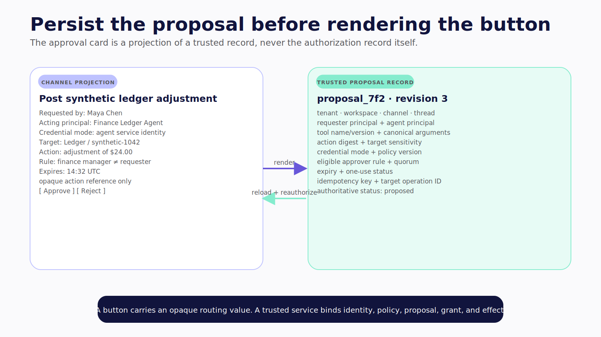
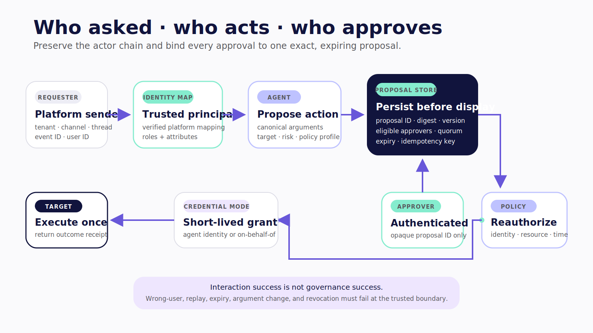
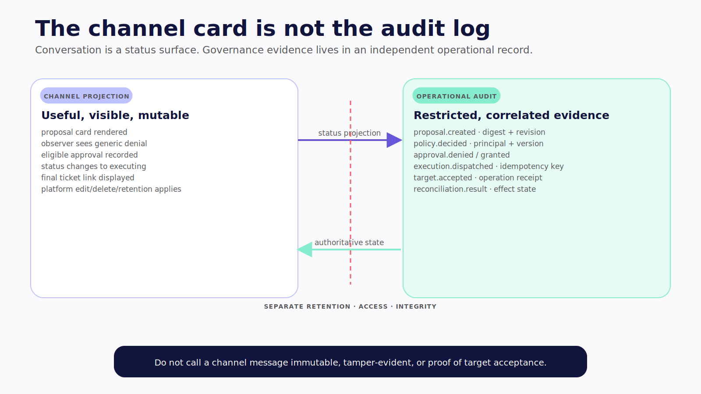

# Chapter 19 — Who Asked, Who Acts, Who Approves

The agent proposes a ticket with a high-priority label. The approval card appears in a shared incident channel. An observer clicks **Approve** before the incident commander sees it. While the card is waiting, another run changes the ticket arguments. The original button still works. The agent's service account still has permission to create the ticket.

The interface paused. The organization did not govern the action.

An approval is valid only when it binds an authenticated, eligible principal to one canonical proposal under current policy for a limited time—and the resulting effect is protected against replay.

> **Reader outcome:** By the end of this chapter, you will be able to preserve the requester/actor/approver chain, combine role and attribute policy, design a durable approval record, and execute a reviewed action with expiry, argument binding, reauthorization, idempotency, and audit evidence.

## Follow identity from platform to target

A consequential channel action crosses several principals:

```text
platform sender
  → tenant-scoped application principal
    → agent service principal
      → execution credential or delegated subject
        → target-system principal and resource

eligible approver
  → authenticated platform identity
    → current application principal and attributes
      → proposal-bound approval grant
```

Each arrow needs a trusted mapping. Do not infer it from display names, email-shaped text in a prompt, or an action's visible label.

The platform adapter authenticates the event according to platform rules. An identity resolver maps `(platform, tenant, platform_user_id)` to a stable application principal. The policy service loads current roles and attributes. The agent runtime receives a safe subset as context, but the tool broker receives the trusted principal object directly.

At execution, store both the agent as actor and the credential's subject. OAuth 2.0 Token Exchange, standardized in [RFC 8693](https://www.rfc-editor.org/rfc/rfc8693), provides useful actor/subject vocabulary for on-behalf-of designs. It does not automatically make an agent deployment compliant or secure; the issuer, audience, scope, lifetime, and target validation still matter.

## Combine RBAC and ABAC

Role-based access control answers broad organizational questions: finance manager, incident commander, repository maintainer. Attribute-based access control answers contextual ones: which tenant, which record sensitivity, which environment, which amount, which channel, which time window, and whether the requester owns the affected resource.

Use both.

For example, a `support-lead` role may propose an account credit. Attribute policy can require that the account belongs to the same tenant, the amount is below a threshold, the request originated in an approved private channel, and the approver is not the requester. A production deployment may require an `incident-commander` role plus an active incident assignment and a change window.

A useful decision shape is:

```text
allow =
  agent-profile policy
  AND channel policy
  AND requester policy
  AND resource and environment policy
  AND approval policy, when required
```

[NIST SP 800-162](https://csrc.nist.gov/pubs/sp/800/162/upd2/final) provides a formal ABAC model, while [NIST SP 800-207](https://csrc.nist.gov/pubs/sp/800/207/final) reinforces resource-centric, continuously evaluated access rather than trust derived from network or location. Apply those ideas to the organizational agent without claiming that an LLM prompt is a policy engine.

## Decide whether the agent or requester owns the action

An organizational agent commonly uses one of two target identities.

With an **agent service identity**, the target records that the agent performed the action. This is appropriate for agent-owned queues, draft artifacts, or scheduled operations. The policy service must still decide whether this requester may induce this agent action.

With **on-behalf-of delegation**, the target applies the requester's permissions while recording the agent as actor. This reduces the confused-deputy gap for user-initiated work, but it requires identity federation and short-lived token exchange the target understands.

Neither mode removes the need for approval. The requester may be authorized to propose a payment yet require another principal to approve it. Conversely, an agent service identity may be authorized to create low-risk drafts without approval while publication requires a separate grant.

Show the mode on the proposal:

```text
Requested by: Maya Chen
Acting principal: Finance Ledger Agent
Credential mode: agent service identity
Target: Ledger / account synthetic-1042
Action: post adjustment of $24.00
Approval rule: one finance manager other than requester
Expires: 14:32 UTC
```

## Persist the proposal before rendering the button

The approval UI should be a projection of a trusted record, not the record itself. Persist a canonical proposal before producing the platform action reference.

| Field | Why it exists |
| --- | --- |
| `proposal_id` and revision | Stable reference and optimistic-concurrency boundary |
| tenant, workspace, channel, thread | Organizational and interaction scope |
| requester and agent principals | Who asked and who proposes to act |
| tool name and version | Exact implementation contract |
| canonical arguments and digest | What is being approved |
| target resource and sensitivity | What changes and how consequential it is |
| credential mode | Agent-owned, on-behalf-of, or approval-minted |
| policy version | Decision basis at proposal time |
| eligible approver rule and separation constraints | Who may approve |
| threshold or quorum | How many independent decisions are required |
| expiry and one-use state | Limits replay window |
| idempotency key | Protects the external effect |
| run, event, trace, and target operation IDs | Correlation and evidence |
| status | Proposed, approved, rejected, expired, executing, executed, failed, or outcome unknown |

Canonicalize structured arguments before hashing. Sort object keys, normalize types, and exclude display-only text. Never hash a prose summary and assume it binds the actual tool call.

The button should contain an opaque reference such as `proposal_id + action_nonce`, not the entire trusted proposal and not a bearer grant. When clicked, authenticate the new platform event and reload the server-side record.



*Figure 19.2 — The card is a projection; the persisted proposal is the optimistic-concurrency and authorization boundary.*

## Build the smallest governed gate

The companion's `L3-GOVERN` excerpt implements an instructional core: register a live request, bind approval to an action ID and digest, reject ineligible principals, suppress a repeated write by idempotency key, and record a minimal audit trail.

```ts
export class GovernedWriteGate<TResult> {
  private readonly requests = new Map<string, WriteRequest>();
  private readonly results = new Map<string, TResult>();
  private readonly auditLog: AuditRecord[] = [];

  constructor(private readonly now: () => number = Date.now) {}

  register(request: WriteRequest): void {
    if (request.expiresAt <= this.now())
      throw new Error("write request is already expired");
    if (this.requests.has(request.requestId))
      throw new Error("duplicate request id");
    this.requests.set(request.requestId, request);
    this.record("requested", request, request.requestedBy);
  }

  approve(
    requestId: string,
    approver: Principal,
    expectedActionId: string,
  ): ApprovalGrant {
    const request = this.requireLiveRequest(requestId);
    if (request.actionId !== expectedActionId)
      throw new Error("approval action binding mismatch");
    const eligible =
      request.eligibleApproverIds.includes(approver.id) ||
      approver.roles.some((role) =>
        request.eligibleApproverRoles.includes(role),
      );
    if (!eligible) throw new Error("principal is not an eligible approver");

    this.record("approved", request, approver.id);
    return {
      grantId: randomUUID(),
      requestId,
      actionId: request.actionId,
      actionDigest: actionDigest(request),
      approvedBy: approver.id,
      expiresAt: request.expiresAt,
      idempotencyKey: request.idempotencyKey,
    };
  }

  async execute(
    grant: ApprovalGrant,
    effect: (request: WriteRequest) => Promise<TResult>,
  ): Promise<TResult> {
    const request = this.requireLiveRequest(grant.requestId);
    if (
      grant.actionId !== request.actionId ||
      grant.actionDigest !== actionDigest(request)
    ) {
      throw new Error("approval grant does not match the stored action");
    }

    const prior = this.results.get(grant.idempotencyKey);
    if (prior !== undefined) {
      this.record("replay_suppressed", request, grant.approvedBy);
      return prior;
    }

    const result = await effect(request);
    this.results.set(grant.idempotencyKey, result);
    this.record("executed", request, grant.approvedBy);
    return result;
  }

  audit(): readonly AuditRecord[] {
    return this.auditLog.map((record) => ({ ...record }));
  }

  private requireLiveRequest(requestId: string): WriteRequest {
    const request = this.requests.get(requestId);
    if (!request) throw new Error("unknown write request");
    if (request.expiresAt <= this.now())
      throw new Error("write request expired");
    return request;
  }

  private record(
    event: AuditRecord["event"],
    request: WriteRequest,
    actorId: string,
  ): void {
    this.auditLog.push({
      event,
      requestId: request.requestId,
      actionId: request.actionId,
      actorId,
      at: this.now(),
      actionDigest: actionDigest(request),
    });
  }
}
```

**Verification status — `L3-GOVERN`:** the companion tests pass for an unauthorized-principal rejection and replay suppression with a single external-effect invocation.

Read the limitations as part of the example. The maps are process-local, the policy is a simple ID-or-role check, approval is single-person, and execution does not re-fetch an external authorization decision. This is a tested teaching kernel, not a production policy service. Production replaces maps with transactional durable storage, adds tenant partitioning and concurrency control, resolves current attributes, enforces separation and quorum, and reconciles target receipts after uncertain outcomes.



*Figure 19.1 — Approval binds an eligible principal to one exact, expiring proposal and is reauthorized before execution.*

## Reauthorize at the last responsible moment

Approval does not freeze the world. A role can be revoked, a resource can become more sensitive, a change window can close, or the agent credential can expire while a card waits.

Use this execution sequence:

1. The model proposes a structured action; no write occurs.
2. A trusted service validates schema, resolves the target, classifies risk, canonicalizes arguments, and persists the proposal.
3. The channel renders a human-readable projection with an opaque action reference.
4. A click arrives as a new authenticated event.
5. The service maps the clicker to a current principal and checks eligibility, separation of duties, quorum, expiry, action state, and replay.
6. Immediately before execution, re-evaluate requester, agent, approver, resource, environment, policy, and credential availability.
7. Mint or fetch the narrow execution credential.
8. Call the target using the durable idempotency key.
9. Persist the target operation ID, result digest, effect state, and audit event.
10. Update every visible card from the authoritative proposal state.

If the target succeeded but the response was lost, mark the effect `outcome_unknown` and reconcile by idempotency key or target operation ID. Do not ask for a second approval and create another effect simply because the channel message still says “executing.”

## Model quorum and separation explicitly

High-impact actions may require two approvals or distinct roles. Store approvals as individual records, not a mutable counter.

Each decision should include approver principal, attributes used, policy version, decision, timestamp, proposal digest, and authenticated event reference. Enforce uniqueness per principal. Compute quorum transactionally. If two approvers click simultaneously, one transition should win and both decisions should remain reconstructable.

Separation of duties can require:

- approver is not the requester;
- approver is not the agent-profile owner;
- two approvers belong to different roles or teams;
- security review plus resource-owner review;
- break-glass use requires a post-action review.

Rejecting an ineligible click should not reveal sensitive proposal details the clicker could not otherwise see. Return a generic denial and log the exact policy reason in the restricted audit system.

## Keep audit outside the conversation

The channel card is a useful status surface. It is editable, deletable, and subject to platform retention. It is not the audit log.

Persist append-oriented events for proposal creation, policy decisions, rendered action references, approval attempts, denials, grants, expiry, execution dispatch, target acceptance, reconciliation, and cancellation. Include identity references, policy versions, canonical digest, idempotency key, run/trace correlation, target receipt, and redaction metadata.

Do not call the log immutable or tamper-evident unless the storage and integrity mechanism actually provide those properties. Be precise about who can alter or delete it and how long it is retained.



*Figure 19.3 — Conversation communicates status; the operational record preserves restricted, correlated evidence under its own retention policy.*

## Failure and security review

The minimum approval test suite includes:

- wrong user clicks a valid card;
- requester tries to satisfy a separation-of-duties rule;
- same user double-clicks;
- two eligible users click simultaneously;
- tool arguments change after proposal;
- proposal expires before click and after approval;
- process restarts before click;
- process restarts after target success but before state commit;
- approver role is revoked before execution;
- service credential is revoked before execution;
- target returns a duplicate-operation receipt;
- platform action event is replayed from another channel or tenant.

Assert the external effect count, not only the HTTP response. Confirm every denial and uncertain outcome has a stable state and audit event.

## Exercise — Govern one ticket creation

Extend the synthetic channel agent with a `create_ticket` proposal. Persist the target project, title, description, priority, labels, requester, agent profile, eligible approver rule, expiry, policy version, canonical digest, and idempotency key.

Render it in Slack. Prove that an observer cannot approve it, changed arguments invalidate the original grant, restart does not lose the action, double-click creates one ticket, and the final card displays the target ticket ID. Then document which production gaps remain beyond the `L3-GOVERN` teaching kernel.

## Builder Checklist

- [ ] Platform identities map to stable, tenant-scoped principals.
- [ ] Requester, agent actor, delegated subject, approver, and target identity are recorded separately.
- [ ] RBAC provides coarse roles and ABAC enforces resource/environment context.
- [ ] Credential mode is explicit for every tool.
- [ ] Canonical arguments and revision are persisted before rendering approval.
- [ ] Action references are opaque routing values, never bearer authorization.
- [ ] Eligibility, separation, quorum, expiry, replay, and current policy are checked server-side.
- [ ] Reauthorization and credential validation happen immediately before execution.
- [ ] External writes use durable idempotency and capture target receipts.
- [ ] Approval and execution audit remains outside channel history.
- [ ] Wrong-user, changed-argument, replay, concurrency, restart, and revocation tests pass.

## Bridge to Delegation

The organizational actor can now turn a message into a bound, authorized action. Some requests still require machine-level work: inspect a repository, run tests, or produce a patch.

Chapter 20 delegates that work without forwarding the whole conversation or the organizational agent's ambient credentials. The same actor chain becomes a signed, expiring capability envelope, and the Level 2 worker returns evidence instead of inheriting social authority.
