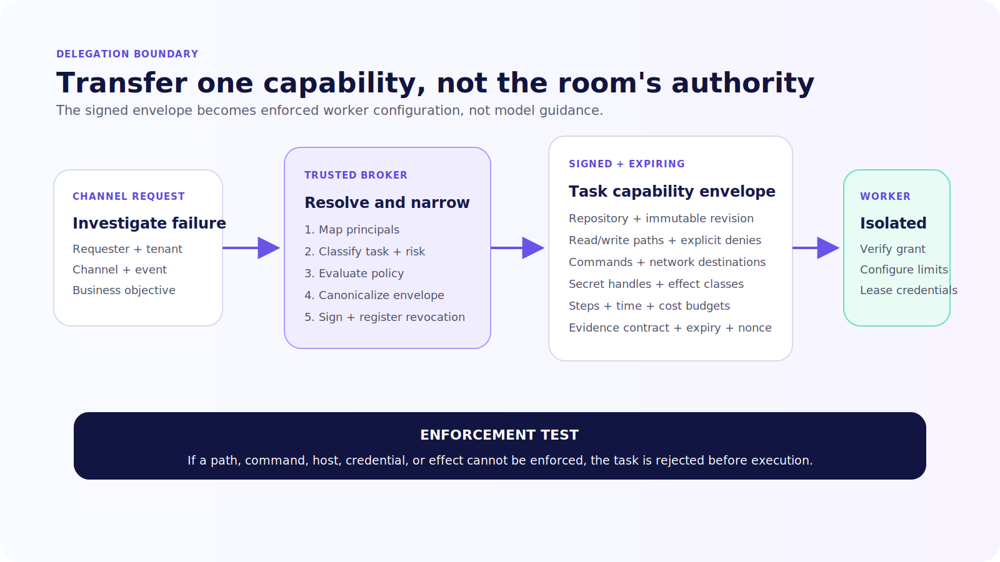
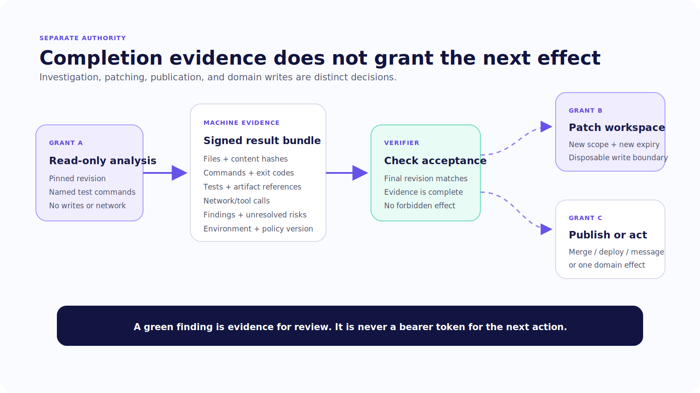

# Chapter 20 — Delegation Without Ambient Authority

A finance-operations lead mentions the organizational agent in a private channel: “Find out why the reconciliation tests started failing after yesterday’s change.”

The agent can see the thread. Its service identity can read the incident record. A connected machine worker can clone repositories, inspect files, and run commands. The shortest implementation is to forward the conversation and the agent’s credentials to the worker.

It is also the implementation most likely to turn a narrow investigation into organizational compromise.

The machine does not need the room’s social history. It does not need the organizational agent’s broad token. It needs a pinned repository, read-only paths, an allowed command set, a deadline, acceptance criteria, and a place to return evidence.

> A safe handoff transfers a bounded capability and a chain of accountability, not the authority of the room it came from.

> **Reader outcome:** By the end of this chapter, you will be able to design a signed, expiring Level 3-to-Level 2 task envelope; return machine evidence without granting publication authority; promote reviewed institutional memory; and correlate the channel request, organizational run, machine run, approval, and target result without turning the transcript into an audit log.

## Delegate an outcome, not a conversation

Delegation crosses two authority surfaces. The organizational agent understands the requester, channel, policy, and business objective. The machine worker understands a filesystem, commands, processes, network, and artifacts. Passing a transcript between them preserves words while dropping the controls each side needs.

Turn the request into a typed contract at the trusted organizational boundary:

```text
channel request
  → resolve requester, tenant, channel, and agent profile
  → classify task and target environment
  → create canonical objective and acceptance criteria
  → evaluate delegation policy
  → issue signed, expiring task capability
  → start isolated worker with narrow credentials
  → verify returned artifacts
  → render evidence for organizational review
```

The contract should be smaller than the context that produced it. Include source references when the worker needs them, but do not automatically include unrelated messages, attachments, participants, or retrieved records. Repository text remains untrusted data. It cannot widen the signed policy bundle.

The delegation envelope needs enough information to reproduce and govern the work:

- immutable task ID, tenant, workspace, channel, thread, and originating event;
- requester principal, delegating agent principal, and current policy version;
- canonical objective and typed acceptance criteria;
- repository or workspace locator pinned to an immutable revision;
- allowed read and write paths, explicit denied paths, commands, and network destinations;
- secret handles rather than secret values;
- step, wall-time, token, and cost budgets;
- effect classes allowed, prohibited, or requiring a separate approval;
- required evidence, callback identity, and terminal states;
- issued time, expiry, nonce, schema version, signing key ID, and revocation handle.



*Figure 20.1 — Delegation narrows organizational intent into a capability envelope; it does not forward ambient credentials or conversational authority.*

## Make the envelope verifiable

The target architecture below is original book code, not an upstream OpenTag or Channels API. It shows the fields the trusted delegation broker must bind before a worker starts.

```ts
type DelegationEnvelope = {
  schema: "book.delegation.v1";
  taskId: string;
  audience: "machine-worker-broker";
  origin: { tenantId: string; channelId: string; eventId: string };
  actors: { requesterId: string; agentId: string };
  policyVersion: string;
  objective: string;
  acceptance: readonly string[];
  workspace: { repository: string; revision: string };
  capabilities: {
    readPaths: readonly string[];
    writePaths: readonly string[];
    commands: readonly string[];
    networkHosts: readonly string[];
  };
  effects: readonly ("read" | "workspace_write")[];
  delegation: { maxDepth: number; maxChildren: number };
  budget: { maxSteps: number; deadline: string; maxCostUsd: number };
  requiredEvidence: readonly string[];
  issuedAt: string;
  expiresAt: string;
  nonce: string;
  revocationId: string;
};
```

Serialize the canonical envelope, sign its digest with a key controlled by the delegation service, and send the envelope plus signature to the worker broker. The worker verifies the issuer, signature, audience, schema, time window, and nonce before provisioning anything. It then derives local controls from the envelope rather than handing the JSON to the model as a request to follow politely.

Keep signing metadata outside the canonical payload: issuer, key ID, algorithm, payload digest, and signature. That separation lets you rotate keys without changing the task contract. Admission should fail closed when canonical serialization, signature verification, audience matching, expiry, nonce replay protection, policy lookup, or worker-policy compilation fails. Record the failed stage without copying the envelope's sensitive fields into a channel response.

The envelope is not a sandbox. It is the input to enforcement. The broker must configure the canonical workspace, filesystem policy, command broker, network policy, credential leases, resource limits, and evidence collector. If a requested capability cannot be enforced by the selected worker environment, reject the task before execution.

Use one-use or short-lived credentials with the smallest target audience. The worker receives a handle that the broker can exchange for a narrow credential after policy checks. It should not inherit the organizational agent process environment, channel adapter tokens, long-lived cloud keys, or a general secret-store session.

Revocation must be active, not documentary. When the organizational service revokes `revocationId`, the broker stops issuing new credentials, denies new tools, marks queued work ineligible, and requests cancellation of the running task. It then records what actually stopped. Revocation cannot erase a file already read or undo a side effect already accepted by a target.

## Admit and execute in two phases

Separate **task admission** from **worker execution**. Admission validates the envelope, checks policy, reserves budget, records the task, and returns a durable acceptance ID. Execution claims that accepted task with a lease and fencing token, provisions the environment, and begins work.

This split matters when a platform acknowledgement deadline is shorter than the machine task. The channel handler can durably accept an eligible request and respond with a task reference without holding the event connection open. A worker can start later, retry infrastructure setup, or move between hosts while the organizational run continues to show truthful state.

Use a state model such as:

```text
proposed → admitted → leased → running → verifying → completed
              │          │         │          ├→ rejected_evidence
              │          │         ├→ outcome_unknown
              │          ├→ lease_expired
              ├→ revoked
              └→ expired
```

Persist the envelope digest, policy decision, and budget reservation atomically with admission. A queue message is a delivery mechanism, not the task record. If the queue redelivers, the broker looks up the accepted task rather than creating another one.

Give each worker claim a monotonically increasing fencing token. Every brokered command, credential lease, evidence append, and terminal transition includes that token. When a lease expires and another worker claims the task, the broker rejects late calls from the stale token. Killing the first process without fencing leaves a window in which two workers can act under one grant.

Do not silently extend the envelope because a worker started late. The original deadline and credential expiry remain part of the requester’s risk decision. If more time or authority is necessary, create a revised envelope, re-evaluate policy, and make the supersession visible in the channel.

### Bound delegation fan-out

An organizational agent may delegate one investigation, whose worker may be capable of starting subagents or calling other runtimes. That fan-out can multiply cost and authority faster than the channel UI reveals.

Put maximum child tasks, depth, concurrent workers, and cumulative budget in the envelope. Require child envelopes to be equal to or narrower than the parent. Preserve the full delegation chain and reject cycles. A worker that needs a capability absent from its parent must return a proposal to the organizational boundary rather than mint the capability itself.

For the read-only finance investigation, set depth to zero. The worker may run the approved test command; it may not ask another general machine agent to “research the issue” under a different harness.

## Separate investigation authority from publication authority

For the finance-operations case, the first delegation is deliberately read-only:

```yaml
objective: explain why reconciliation tests fail at revision 8f2c...
read_paths: ["src/reconciliation/**", "tests/reconciliation/**", "package.json"]
write_paths: []
commands: ["npm test -- tests/reconciliation", "git diff --stat"]
network_hosts: []
max_steps: 18
deadline: 2026-07-15T20:00:00Z
required_evidence: [files_read, commands, exit_codes, test_report, findings]
```

This grant cannot create a patch, push a branch, post a ticket, update the ledger, or publish a channel announcement. If the worker concludes that a code change is needed, it returns a proposal. A second delegation may permit writes inside a disposable worktree. A separate organizational approval governs merge, deployment, external communication, or any domain mutation.

This separation limits blast radius and improves review. The person approving a machine investigation is not silently approving every downstream action that the investigation might suggest.

Use distinct IDs and grants:

```text
delegation grant: may inspect revision and run named tests
patch grant:      may edit named paths in disposable workspace
publication grant: may merge or post one reviewed artifact
domain grant:     may perform one canonical business action
```

Each grant has its own policy decision, expiry, credential, idempotency behavior, and audit event. Do not stretch the original mention into an authorization chain that never asks again.

## Return evidence, not “done”

The machine worker should return a structured evidence bundle even when it fails. At minimum, include:

- task ID, worker run ID, environment image, tool manifest, and policy version;
- source revision and canonical workspace identity;
- files inspected and changed, including hashes;
- commands, normalized arguments, start/end times, and exit status;
- test, lint, typecheck, or build outputs with artifact references;
- external network and tool calls;
- credential lease IDs and approval IDs, never secret values;
- policy denials, exceptions, budget exhaustion, and unresolved risks;
- produced diff or artifact digest;
- terminal state and worker signature.

A verifier checks the bundle against the acceptance criteria and the final workspace. It should not accept a test result produced before the last file change or a diff from a different revision. When the task is read-only, the verifier must prove that no write occurred inside the authorized workspace and no external effect was requested.

The organizational agent then renders the evidence as application-owned UI: findings, source paths, command results, and a clearly labeled next action. The model may summarize. The underlying artifact remains inspectable.



*Figure 20.2 — Machine completion returns evidence; patching, publishing, and business effects remain separately authorized organizational actions.*

## Keep five identifiers distinct

A complete handoff needs correlation without collapsing different records:

| Identifier | Record it names | What it does not prove |
| --- | --- | --- |
| Platform event ID | Authenticated channel delivery | Requester authorization or exactly-once work |
| Organizational run ID | Level 3 task lifecycle | Machine execution or target acceptance |
| Delegation task and grant IDs | Approved worker scope | Successful execution |
| Machine run ID | One leased worker attempt | Correct final artifact or business effect |
| Target operation ID | Accepted external effect | That the requester was eligible |

Carry a shared correlation ID through traces and events, but authorize from trusted records rather than telemetry headers. A trace can help locate the machine run. The task envelope defines what it may do. The target receipt proves what the downstream system accepted.

Append audit events outside conversational state for delegation proposed, policy decided, grant issued, grant revoked, worker admitted, credential leased, command allowed or denied, evidence returned, verification completed, and downstream proposal created. Include canonical digests and references instead of raw secrets or entire transcripts.

Do not call this audit immutable unless the storage has restricted writers, append-only or tamper-evident behavior, integrity checks, retention controls, and tested export. “Audit event” describes the record’s purpose, not a storage guarantee.

### Reconcile late and conflicting results

A result may arrive after revocation, expiry, lease loss, or task supersession. Preserve it as evidence, but do not let it overwrite the authoritative task or trigger the next grant automatically. Mark its admission status, worker token, envelope digest, and arrival time. The verifier can inspect it for incident value while the organizational run remains revoked or superseded.

When two valid analysis attempts return different findings, do not ask the model to merge them invisibly. Compare their source revision, files, commands, environment, and evidence completeness. Present the conflict to the task owner or run a separately authorized verifier. The system should be able to say “two bounded attempts disagree” without converting uncertainty into a confident institutional memory.

## Promote institutional memory deliberately

The worker finds that reconciliation tests assume a UTC cutoff while the service writes local timestamps. That conclusion may help future incidents, but it should not become shared memory merely because a model said it.

Create a candidate memory with:

```ts
type MemoryCandidate = {
  candidateId: string;
  statement: string;
  sourceArtifacts: readonly { uri: string; digest: string }[];
  tenantId: string;
  proposedScope: "team" | "workspace" | "organization";
  sensitivity: "internal" | "restricted";
  ownerId: string;
  observedAt: string;
  proposedExpiresAt: string;
};
```

Then classify sensitivity, verify the cited artifacts, check whether the statement is a fact, decision, hypothesis, or temporary workaround, and route it to an eligible knowledge owner. The approved institutional record adds reviewer, effective date, policy scope, correction history, expiry, and deletion state.

Retrieval must show provenance and effective date. A later correction supersedes the old record without erasing the historical decision trail. Deleting a transcript should trigger a derived-data search, but it does not automatically delete platform history, traces, backups, tool artifacts, or institutional records with separate lawful retention. Build the inventory and workflow explicitly.

The transcript, candidate memory, institutional record, and audit event are four different objects. Combining them creates both security and product failures: hostile channel text becomes policy, old conclusions persist without review, and deletion becomes impossible to reason about.

### Authorize memory use at retrieval

Approval at promotion time does not grant every future requester access. Resolve the current principal, tenant, channel, task purpose, record scope, sensitivity, and effective date before retrieval. Return source references with the memory so the agent and user can distinguish an approved record from current evidence gathered for this run.

Do not copy a restricted memory into a broad prompt and hope the model avoids disclosure. Filter at the memory service, minimize the returned fields, and authorize the destination before rendering. Record which memory version influenced the run. When a record expires or is quarantined, new runs must stop retrieving it even if an older transcript still contains its text.

For the finance case, the reviewed UTC-cutoff finding may be visible to the finance-operations team. It should not automatically appear in a public support channel or a different tenant’s reconciliation task. Scope travels with the record, not with the model’s recollection.

Test that rule with the same fact requested from an eligible private channel, an ineligible broad channel, and another tenant. The first retrieval should include provenance; the other two should reveal neither the record nor its existence.

## Failure and security review

Test the delegation boundary with hostile and ambiguous conditions:

- a repository file instructs the worker to upload credentials;
- an envelope names a path that resolves through a symlink outside the workspace;
- the worker requests a command or network host absent from the grant;
- policy is revoked after the worker starts but before its next credential lease;
- the worker returns a green summary without the required test artifact;
- a late result arrives after expiry or after another worker owns the task;
- a patch is produced during a read-only delegation;
- a finding from a private channel is proposed as organization-wide memory;
- the source artifact is deleted while derived memory remains;
- a machine result is posted into a channel whose members cannot read the source.

For each case, assert the enforcement point, durable state, audit event, user-visible status, and cleanup action. A denial should be explainable without exposing the sensitive path or policy detail to an ineligible viewer.

## Exercise — Delegate read-only analysis

Use a synthetic repository and a synthetic finance-operations channel. Create a signed envelope that permits read access to one test directory, two exact commands, no network, no writes, and a ten-minute deadline.

Prove five things:

1. a modified envelope fails signature verification;
2. a repository instruction cannot add a network destination;
3. revocation prevents a late command or credential lease;
4. the returned bundle includes file hashes, commands, exit codes, and test artifacts;
5. the organizational UI cannot offer merge or publication under the read-only grant.

Create one candidate memory from the findings. Attach evidence, limit it to the finance-operations team, require an eligible reviewer, and demonstrate correction or expiry. The inspectable result is the envelope, denial test, evidence bundle, memory record, and correlated audit events.

Run the exercise from a clean worker image twice: once with the valid envelope and once with a single-byte payload modification. Save the canonical payload digest, broker admission record, command-policy snapshot, evidence-bundle digest, and denial event. Another engineer should be able to decide which run was authorized without reading the channel transcript.

## Builder Checklist

- [ ] Delegation carries a typed objective and acceptance criteria, not an unconstrained transcript.
- [ ] Requester, delegating agent, tenant, channel, revision, policy, and grant remain bound.
- [ ] Paths, commands, network, credentials, effects, time, steps, and cost are explicitly scoped.
- [ ] The broker enforces the envelope in an isolated worker environment.
- [ ] Credentials are short-lived, audience-bound, revocable, and absent from model context.
- [ ] Read, patch, publication, and domain-action grants are separate.
- [ ] Returned files, commands, tests, diffs, hashes, exceptions, and provenance are verified.
- [ ] Transcript, working artifact, candidate memory, institutional memory, and audit remain separate.
- [ ] Memory promotion includes evidence, scope, sensitivity, owner, review, correction, expiry, and deletion.
- [ ] Cross-system IDs correlate channel, organizational run, worker, approval, and target receipt.
- [ ] Wrong scope, injection, revocation, late result, and deletion tests pass.

## Bridge to deployment choice

The delegation design exposes a long list of responsibilities: channel ingress, identity, policy, credentials, state, worker isolation, memory, evidence, audit, and operations. A direct Channels application can own all of them. An open product can supply more assembly. A managed service can own selected infrastructure and administration.

Chapter 21 compares those choices without confusing hosting with accountability.
