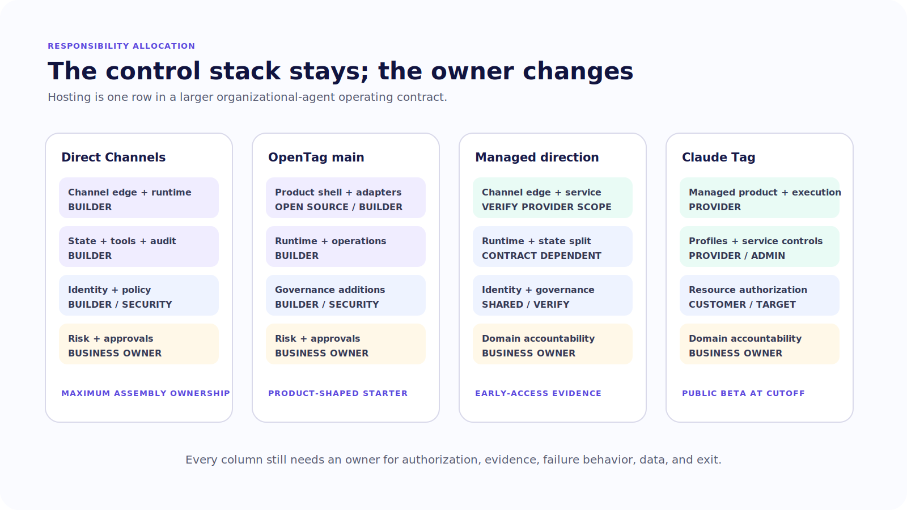
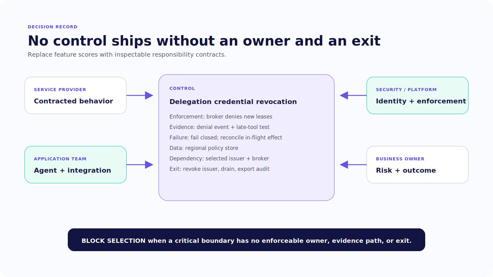

# Chapter 21 — Managed, Open, and In Between

Two organizational agents appear in Slack with the same surface: a mention, a streamed status, a structured result, and an approval button.

Behind one, the application team owns the platform adapter, ingress verification, queues, state store, identity mapping, policy service, model runtime, credentials, tool broker, worker isolation, memory, audit export, upgrades, and on-call rotation. Behind the other, a managed product owns some of those layers.

The button does not tell you which ones.

“Managed” and “self-hosted” are deployment labels. The architecture decision is the allocation of responsibility at every boundary where the agent receives context, exercises authority, retains data, or fails.

> Hosting is not the architecture decision. The architecture decision is who owns each boundary when the agent acts.

> **Version note — Verified July 2026.** Every named product comparison in this chapter is tied to the dated source set below and requires publication-time refresh.

> **Reader outcome:** By the end of this chapter, you will be able to compare direct CopilotKit Channels, OpenTag, CopilotKit’s managed direction, and Claude Tag by responsibility, evidence, authority, data handling, operations, and exit path; then produce a build-versus-buy decision record for the finance-operations case without treating product availability or marketing claims as guarantees.

## Start with responsibilities, not products

Chapter 20 created a read-only repository-analysis delegation. To operate it, somebody must own all of these jobs:

```text
platform install and authenticated ingress
tenant, channel, thread, and principal correlation
agent runtime and model route
state, locks, deduplication, and queues
tool and credential brokering
policy and approval records
machine-worker isolation and revocation
memory promotion and deletion
trace, action ledger, export, and incident response
capacity, spend, upgrades, and decommissioning
```

A vendor can supply a service for several jobs. It cannot make the remaining jobs disappear. The application team still owns the business decision that a finance-operations member may initiate a repository investigation, which repositories are in scope, whether findings may be posted to the channel, and which later actions require approval.

Use four responsibility roles:

- **service provider** owns the behavior promised by the product and contract;
- **application team** owns agent behavior, domain tools, integration logic, and product experience;
- **security/platform team** owns organizational identity, policy, credentials, network, data, and incident controls;
- **business owner** owns acceptable outcomes, risk classes, approver rules, retention needs, and escalation.

One organization may assign several roles to the same people. Keep the roles separate in the decision record because a product upgrade, incident, or audit will ask different questions of each.



*Figure 21.1 — The control stack remains; deployment choices move responsibility between parties rather than removing it.*

## Read the evidence date before the comparison

Product surfaces move quickly. This comparison uses official sources and immutable repository pins reviewed on July 14, 2026. It is an engineering snapshot, not a permanent buyer’s guide.

> **Version note — Verified July 2026.** Direct Channels claims use CopilotKit commit `855446e1abc8f29756dc5e539e5e50a90321ac2d`. OpenTag `main` uses `df93bc0dccd0afc8eb7bb02206ffbe2ef7922322`; the separate managed-development snapshot uses `d6a807783136a9e0b6a610f16648df8f1980cdbc`. Claude Tag claims use Anthropic’s official June 23, 2026 announcement and product documentation captured in the source registry. Reverify availability, channels, regions, package names, retention, and service responsibilities at publication freeze.

The evidence supports four distinct shapes.

Before reading the product sections, create a blank responsibility record with one row for every control in Figure 21.1. For each candidate, fill only five columns: owner, enforcement point, obtainable evidence, failure behavior, and exit path. Write `unverified` instead of inferring an answer from a feature name. This prevents a polished demo from silently answering architecture questions it never exercised.

### Direct CopilotKit Channels

Direct Channels is the assembly path. At the book's pinned revision, source packages exist for Slack, Discord, and Teams alongside channel-neutral runtime primitives and semantic channel UI. Current public API reference documents Slack and Discord directly; Teams remains source-present and version-sensitive until the pinned adapter is run in a synthetic Microsoft tenant. The source includes state-store categories, identity correlation, transcripts, locks, deduplication, queues, actions, and thread capabilities. ([Pinned Teams package](https://github.com/CopilotKit/CopilotKit/tree/855446e1abc8f29756dc5e539e5e50a90321ac2d/packages/channels-teams); [current Channels reference](https://docs.copilotkit.ai/reference/channels), accessed 2026-07-15.)

These are application primitives. The builder selects and operates the agent runtime, store, tenancy model, authorization, approval system, tools, credentials, memory service, audit backend, and deployment. Direct Channels offers maximum implementation control and maximum ownership of the operating envelope.

Choose this path when the team needs a custom agent application, must control its trusted boundaries, can operate the stack, and benefits from direct access to channel semantics. Do not choose it merely because open source feels safer. Source visibility does not create isolation, authorization, data governance, or on-call coverage.

### OpenTag `main`

**Verified July 2026.** OpenTag is an official open-source, self-hostable reference project showing how one agent application can enter multiple channel surfaces. At the pinned `main` revision, it directly wires Slack, Discord, Telegram, and WhatsApp, uses earlier `@copilotkit/bot*` package names, connects an AG-UI agent and MCP tools, and demonstrates structured interactions and human confirmation. ([Pinned OpenTag `main`](https://github.com/CopilotKit/OpenTag/tree/df93bc0dccd0afc8eb7bb02206ffbe2ef7922322), accessed 2026-07-15.)

That revision does not establish the policy engine, durable institutional-memory service, bound organizational approval, machine-delegation broker, or enterprise audit described in Chapters 19 and 20. Use it as a product-shaped starting point, not as proof that the organizational governance layer already exists.

Choose OpenTag when its application structure and supported surfaces accelerate the product you want to own. Budget for package migration, current adapter testing, state and identity hardening, and the same operational responsibilities as any self-hosted application.

### CopilotKit managed direction

**Verified July 2026.** The separate OpenTag managed-development pin and `@copilotkit/channels-intelligence` source show a managed direction with current Channels package names. Public documentation at the evidence cutoff described managed Slack and Teams paths as waitlisted or early access. Source presence proves an implementation direction, not general availability, regional coverage, pricing, or a complete responsibility contract. ([Managed-development snapshot](https://github.com/CopilotKit/OpenTag/tree/d6a807783136a9e0b6a610f16648df8f1980cdbc); [managed Channels page](https://docs.copilotkit.ai/langgraph-python/channels), accessed 2026-07-15.)

Treat this option as evidence-gated until you can provision it and answer:

- Which platform-edge, adapter, runtime, state, and observability duties are managed?
- Which identity, approval, retention, residency, deletion, and export guarantees are contractual?
- How does the application authenticate to the service and partition tenants?
- Which channel capabilities and regions are available?
- What happens during service degradation, termination, and data export?

If those answers are not available, keep the direct path as the reproducible architecture and record the managed path as a future option.

### Claude Tag

**Verified July 2026.** Anthropic introduced Claude Tag on June 23, 2026 as a managed organizational-agent product in public beta for Claude Team and Enterprise. Current official documentation describes Slack as its supported collaboration surface. Anthropic says it intends to expand availability, but the current public pages do not name or commit to Microsoft Teams. The documented product model includes an agent service identity for channel work, selected channel and profile configuration, isolated ephemeral execution environments, proxied credentials, schedules, memory, logs, and spend controls. Direct messages differ: they run under the individual's account and personal connectors. ([Claude Tag overview](https://claude.com/docs/claude-tag/overview); [announcement](https://www.anthropic.com/news/introducing-claude-tag); [identity](https://claude.com/docs/claude-tag/concepts/agent-identity), accessed 2026-07-15.)

Those features make Claude Tag a useful managed Level 3 reference because the product explicitly owns more than a channel adapter. They do not mean the requesting user’s permissions automatically constrain every agent action. Profile scope, requester eligibility, channel policy, connected resources, memory behavior, and shared service authority still need deliberate governance.

The official security material at the cutoff also described retained session and memory behavior incompatible with zero-data-retention organizations. The sandbox holds no credentials; an Agent Proxy injects them at the boundary. That may change, so verify the current contract rather than carrying the statement forward indefinitely. ([Security and data handling](https://claude.com/docs/claude-tag/concepts/security-and-data); [memory](https://claude.com/docs/claude-tag/users/memory), accessed 2026-07-15.)

Choose a managed product such as Claude Tag when its supported workflows, identity model, execution boundary, data terms, administration, and operating controls match the organization’s requirements better than owning the full stack. Keep application-level authorization and business accountability explicit.

## Compare the boundaries that can fail

Use a responsibility matrix instead of a feature checklist.

| Boundary | Direct Channels | OpenTag `main` | Managed direction | Claude Tag at cutoff |
| --- | --- | --- | --- | --- |
| Channel edge | Builder operates adapter | Builder operates project adapters | Service role requires verification | Anthropic-managed Slack integration |
| Agent runtime | Builder-selected | Built-in AG-UI pattern in pin | Managed split requires verification | Managed Claude execution |
| State and durability | Builder selects stores and semantics | Builder responsibility | Contract/API must define | Managed product behavior |
| Requester authorization | Application-owned | Not complete in pin | Responsibility must be verified | Organization config plus app/tool policy still required |
| Agent credentials | Builder brokers and rotates | Builder responsibility | Service split must be verified | Managed profile connections and proxy documented |
| Approval binding | Application-owned | Demonstration confirmation | Guarantees must be verified | Verify exact per-tool/action semantics |
| Institutional memory | Application-owned | Not established in pin | Scope and ownership unclear until verified | Managed memory with documented scope rules |
| Audit and export | Builder-owned | Builder-owned | Contract and export need verification | Product logs/admin controls documented |
| Machine delegation | Builder designs broker | Not established in pin | Not established by inspected evidence | Depends on configured tools and connections |
| On-call and upgrades | Builder | Builder | Shared according to contract | Anthropic service plus customer configuration/integration owners |
| Exit and deletion | Builder owns every store | Builder owns every store | Export/deletion terms must be verified | Product contract and connected systems govern |

The matrix deliberately uses “verify” rather than guessing. A buyer’s responsibility is not reduced by an undocumented promise.

## Ask four questions for every managed claim

When a provider says it manages identity, memory, audit, or security, unpack the noun.

1. **What exact behavior is supplied?** Identity might mean platform sender lookup, agent service identity, SSO administration, or target-system authorization. Those are different controls.
2. **Where is it enforced?** A setting in an admin UI is useful only if the runtime and tool boundary deny work when the setting is missing, stale, or unavailable.
3. **What evidence can you obtain?** Look for decision records, target receipts, export APIs, logs, version histories, and failure notifications—not only a green status page.
4. **What remains yours?** Domain authorization, data classification, approver eligibility, tool correctness, and business recovery often remain application responsibilities.

Apply the same discipline to self-hosting. “We control the data” is incomplete when the system sends content to a model provider, stores traces in another service, leaves artifacts in tools, or retains backups nobody can delete. Ownership is a duty to implement and operate the control, not a badge earned by running a container.

## Validate the operating contract with failure scenarios

A responsibility matrix becomes credible when each owner can answer a failure. During evaluation or procurement, run the same scenario against every candidate architecture and record which party detects, contains, explains, and recovers it.

Use at least these tests:

- duplicate platform delivery before and after acknowledgement;
- identity or policy dependency unavailable during a high-risk request;
- approver role revoked while a proposal waits;
- target commits but the response is lost;
- channel adapter starts while the state store or worker broker does not;
- service credential is revoked while scheduled and queued work exists;
- institutional-memory record is corrected or deleted;
- tenant requests complete export and decommissioning.

For a managed service, ask for product behavior, administrative evidence, export shape, notification timing, and contractual responsibility. For a self-hosted stack, run the fault and capture your own logs, states, receipts, alerts, and recovery time. Do not compare a vendor’s documented promise with your prototype’s happy path. Compare equivalent evidence and name the gaps honestly.

Also evaluate change management. Who announces a breaking adapter change? Can you pin a version or defer rollout? Which migrations modify state, action IDs, or memory? Can a provider change model behavior independently of application deployment? What regression suite runs before a new version receives production traffic? A managed upgrade reduces maintenance only when the compatibility and evidence contract is strong enough for your risk.

For the finance-operations case, require a demonstration that a revoked worker grant blocks a late command and that the organizational status reflects the authoritative task state. If a candidate cannot expose or export the task, grant, and effect correlation needed to investigate that failure, record the limitation as an architecture constraint rather than an observability inconvenience.

Repeat the review with the people who will carry the pager, approve the risk, govern the data, and own the finance outcome. A technically elegant allocation still fails when its named owners cannot access the evidence or perform the recovery the record assigns to them.

## Carry the finance-operations case across each option

The canonical request is unchanged: a finance-operations lead asks the channel agent to investigate a reconciliation-test failure. The organizational agent resolves the requester, creates a read-only delegation proposal, obtains policy approval if required, starts a sandboxed worker, and returns signed evidence.

The deployment choice changes who operates each step:

- With **direct Channels**, your team authenticates channel ingress, runs the state store and agent, evaluates policy, signs the delegation, brokers the machine worker, retains evidence, and updates the channel.
- With **OpenTag**, the product shell and channel wiring accelerate the surface, but your team still adds and operates the governance and delegation layers absent from the pin.
- With a **managed CopilotKit path**, the service may own more channel-edge and runtime work, but you must verify the exact contract before removing any component from your architecture diagram.
- With **Claude Tag**, Anthropic owns the managed agent product and execution environment described in its docs; your organization still configures the agent profile and connections, decides who may invoke it, governs shared authority and memory, and owns downstream business effects.

None of these options should grant the worker a finance system token merely because the investigation began in a finance channel. The Chapter 20 envelope and separate-grant design survive every deployment model.



*Figure 21.2 — A product decision is complete only when every control has an owner, evidence source, failure behavior, data location, and exit path.*

## Design the exit before the pilot

An organizational agent accumulates more than source code. It creates platform installations, OAuth or Entra grants, service identities, policy records, state, transcripts, memory, schedules, queues, traces, audit events, model-provider records, machine artifacts, and downstream business objects.

Before rollout, ask whether you can:

- export configuration, prompts, policies, tool definitions, and agent profiles;
- export task, approval, memory, and audit records in usable form;
- map vendor IDs back to organizational principals and target receipts;
- rotate or revoke every credential without waiting for the vendor;
- delete or retain each data class according to policy;
- migrate active schedules and pending approvals safely;
- disable the service while preserving evidence for an incident;
- reconstruct the application on another runtime without forwarding ambient authority.

An exit path does not require perfect portability. It requires an owned plan for what stops, what moves, what remains for retention, what is deleted, and how the organization verifies the result.

## Failure and security review

Review these product-choice failures:

- a source-present managed package is described as generally available;
- a public beta is deployed without an owner for breaking changes;
- a self-hosted store silently falls back to memory after configuration failure;
- the vendor authenticates the platform user, but the tool trusts that identity as business authorization;
- the service agent can reach resources the requester cannot;
- an administrator disables a channel integration while schedules or delegated workers continue;
- memory export omits provenance or private-channel scope;
- audit export cannot correlate to target receipts;
- contract termination deletes state needed for incident or legal retention;
- the team cannot reproduce a critical workflow without one undocumented service behavior.

For each risk, name the enforcing party, evidence, notification path, recovery owner, and contractual dependency. If both vendor and customer assume the other owns a boundary, nobody does.

## Exercise — Write the responsibility record

Evaluate the finance-operations investigation under two candidate deployment models. Create one row for every boundary from channel ingress through worker evidence and memory deletion.

Use this format:

```yaml
control: delegation credential revocation
provider_owner: none
application_owner: agent platform team
security_owner: identity platform
business_owner: finance operations
enforcement: worker broker denies new leases by revocation ID
evidence: audit event + denied late-tool test
data_location: regional policy store
failure_mode: fail closed for new commands; reconcile in-flight effect
exit_path: revoke issuer key, drain workers, export audit
open_dependency: select production broker
```

Mark every statement as verified, source-present, contract-dependent, or unresolved. Reject the option if a critical control has no owner or evidence path. The deliverable is a decision record, not a feature score.

Review the record with four sign-offs: the application owner confirms implementation duties, the security/platform owner confirms identity and containment, the business owner confirms action and approval policy, and the operator confirms evidence and recovery access. A candidate does not pass because the group likes it; it passes when each critical row has an accountable owner and a testable acceptance condition.

## Builder Checklist

- [ ] The comparison uses a dated evidence set and immutable repository pins.
- [ ] OpenTag `main` and managed-development source are not mixed into one release claim.
- [ ] Managed CopilotKit availability, adapters, regions, and service responsibilities remain evidence-gated.
- [ ] Claude Tag beta status, supported channels, identity, memory, and retention claims are reverified before publication or purchase.
- [ ] Channel edge, runtime, state, identity, credentials, approvals, memory, audit, worker delegation, and operations each have an owner.
- [ ] Business authorization remains explicit even when platform identity is managed.
- [ ] Self-hosting is not treated as proof of isolation, governance, or data control.
- [ ] Managed hosting is not treated as transfer of business accountability.
- [ ] Required logs, receipts, exports, notifications, and SLO evidence are documented.
- [ ] Data locations, retention, deletion, residency, and subprocessors are reviewed.
- [ ] Migration, incident preservation, credential revocation, and decommission paths exist before rollout.

## Bridge to operations

The responsibility matrix selects who operates each boundary. It does not prove that those owners can contain a duplicate event, a revoked credential, a poisoned memory, or a partial restart.

Chapter 22 turns the chosen architecture into a staged rollout, service objectives, kill switches, game days, retention workflows, and a complete decommission plan.
