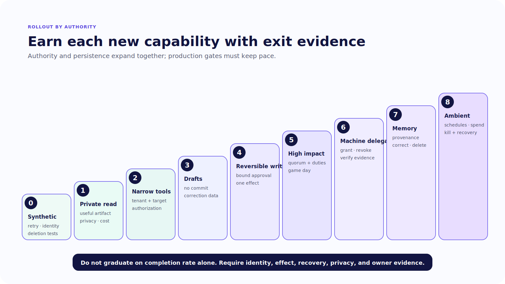
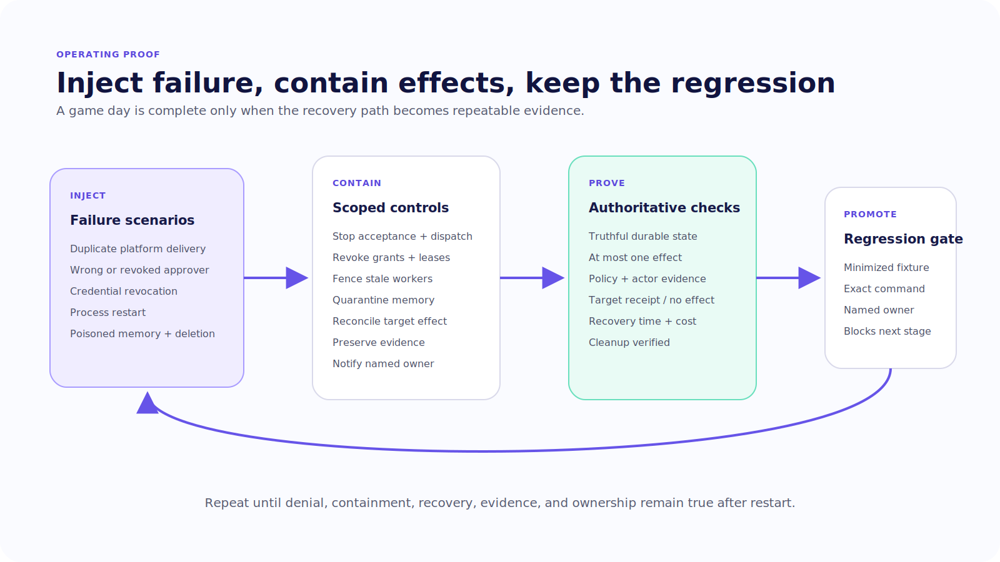

# Chapter 22 — Operate the Organizational Actor

The finance-operations agent is live. It answers private-channel questions and can delegate read-only repository analysis. The first week looks quiet.

Then the platform delivers one mention twice. A removed approver still has an old card open. The worker broker loses access to its credential issuer while three tasks remain queued. A process restarts after approval but before the organizational run records the worker ID. A scheduled job continues after the connector that created it is revoked.

None of these failures is solved by a better system prompt.

An organizational agent is a service with shared authority, retained context, asynchronous work, and dependencies across systems. Operating it means controlling how that authority expands, proving how it fails, and preserving the ability to revoke and remove it.

> An organizational agent is not fully deployed until the organization knows how to constrain it, observe it, revoke it, and erase what should not outlive it.

> **Reader outcome:** By the end of this chapter, you will be able to stage an organizational-agent rollout, define product and safety objectives, design granular kill and revoke controls, run failure game days, govern retention and offboarding, and decommission the agent across platforms, credentials, queues, memory, traces, schedules, and delegated artifacts.

## Roll out authority in stages

Do not launch “the agent” as one indivisible capability. Launch a sequence of authority modes. Each stage adds a new way to act, persist, or delegate and requires explicit exit evidence.

| Stage | New capability | Required exit evidence |
| ---: | --- | --- |
| 0 | Synthetic workspace, users, channels, tools, and data | Injection, retry, wrong-user, restart, isolation, and deletion tests pass |
| 1 | One private-team read-only pilot | Source coverage, disclosure review, latency, cost, and user-correction data |
| 2 | Narrow real read tools | Tenant, channel, requester, and resource authorization tests |
| 3 | Draft actions with no commit | Draft usefulness, rejection reasons, and stale-state behavior |
| 4 | Reversible idempotent writes | Bound approval, one effect, receipt, restart, and compensation drill |
| 5 | High-impact writes | Quorum, separation of duties, business/security sign-off, incident exercise |
| 6 | Sandboxed machine delegation | Signed grant, revocation, evidence verification, and no authority amplification |
| 7 | Curated institutional memory | Provenance, sensitivity, poisoning, correction, expiry, and deletion tests |
| 8 | Ambient or scheduled work | Spend, kill switch, missed/duplicate schedule, ownership, and containment evidence |

Begin every stage with synthetic identities and data. Expand tenants, channels, tools, and action classes only after the current mode meets its gates. Do not use a global task-completion percentage to graduate. A system can complete more work by denying less, requesting broader credentials, or retrying ambiguous effects.

Represent graduation as a signed rollout record, not a meeting conclusion. Record the stage, enabled scopes, test-suite revision, evidence links, unresolved exceptions, risk owner, approval time, and rollback target. The deployment controller should reject a capability configuration above the approved stage. Otherwise the ladder is documentation rather than enforcement.

The canonical finance-operations case should remain at Stage 1 until the team can reproduce the read-only repository investigation from a clean environment, reject an ineligible requester, revoke a worker grant, verify evidence, and prevent restricted findings from reaching a broad channel. Machine delegation belongs at Stage 6 even if a demo worker already exists. The stage reflects the proven operating control, not the repository folder structure.



*Figure 22.1 — Authority and persistence expand only after the previous stage produces inspectable exit evidence.*

## Define service objectives around the user journey

Measure the organizational task from platform delivery through target evidence:

```text
authenticated event
  → durable acceptance
  → first useful artifact
  → policy or approval decision
  → delegated/tool execution
  → target receipt or verified no-effect result
  → truthful terminal status
```

Useful service indicators include:

- event acknowledgement success and platform retry rate;
- accepted event to first useful artifact;
- completion, cancellation, recovery, and outcome-unknown rates;
- policy allow, deny, approval, and dependency-error distribution;
- approval delivery, rejection, edit, expiry, replay, and wrong-user rates;
- duplicate platform events, duplicate run suppression, and side-effect idempotency conflicts;
- cost, steps, and elapsed time per verified successful organizational task;
- memory proposal, approval, retrieval, correction, expiry, and deletion volume;
- worker admission, isolation denial, revocation, evidence-verification, and cleanup results;
- unwanted-action reports and mean time to containment.

Set objectives for journey stages, not only server uptime. A healthy webhook that drops accepted work is not a healthy product. A fast response that posts restricted data to the wrong channel is not a success. A “completed” run without a target receipt is not a verified outcome.

Safety invariants remain gates rather than error-budget items. Cross-tenant disclosure, an unauthorized write, execution after invalid approval, machine escape, unreviewed institutional-memory promotion, or continued scheduled work after revocation should trigger containment and incident response.

Segment metrics by tenant class, channel mode, tool, action risk, model route, and deployment version. Avoid putting raw user IDs, channel IDs, message content, or resource names into high-cardinality metric labels. Use restricted traces and the action ledger for per-case investigation.

## Make dependency failure explicit

An organizational agent depends on platform adapters, state and lock stores, queues, policy, identity, credential brokers, model providers, tools, worker isolation, memory, tracing, and target systems. Decide whether each dependency is fail-open, fail-closed, or degraded for each operation class.

For low-risk public help, an identity-correlation failure may produce an anonymous read-only response. For a repository delegation or finance write, the same failure should stop the operation. A dedup-store failure may allow a harmless status response to proceed, but a consequential write still needs its own durable idempotency record. A trace outage may permit read-only work if local audit and product state remain intact; an unavailable approval or policy service should reduce authority rather than be routed around.

Represent this as configuration owned by the service, not an incident-time guess:

```yaml
dependency: policy_service
operation_class: machine_delegation
failure_mode: fail_closed
user_state: blocked_dependency
retry_owner: organizational_run_worker
deadline_seconds: 60
alert_owner: agent-platform-oncall
recovery: resume after current policy and grant are recorded
```

Expose partial startup. If Slack starts but Teams fails, the service is degraded, not healthy. If the queue starts but the credential broker cannot issue worker leases, machine delegation is unavailable even though mentions still receive acknowledgements. Publish capability-level readiness so the UI and on-call team see the same truth.

## Build kill switches that match the blast radius

One global emergency switch is necessary and insufficient. Give operators control at these scopes:

- global service and deployment version;
- tenant or organization;
- platform workspace and channel;
- agent profile and invocation mode;
- tool, target resource class, and action risk;
- credential issuer, connection, and individual lease;
- schedule and ambient listener;
- machine-worker pool, workspace, and active grant;
- memory retrieval, promotion, and specific record.

Separate **stop accepting new work** from **stop dispatching**, **request cancellation**, **revoke credentials**, and **contain completed effects**. A global ingress switch may stop new mentions while queued tasks and schedules continue. Revoking a tool token may leave cached credentials or active machine leases. Terminating a worker does not undo a target write.

Every switch needs an authenticated operator path, authorization, reason, time, audit event, expiry where appropriate, and test. The interface should show which controls were acknowledged by each dependency. Do not display “stopped” merely because the channel stream closed.

Keep a break-glass path for incidents, but narrow and expire it. Record who invoked it, what policy it bypassed, which resources it reached, and the mandatory review. Break glass should not become the everyday answer to brittle policy.

## Treat schedules as stored authority

A schedule is not merely a timer. It is a durable instruction to invoke an agent later, often without the requester present. Store its owner, agent profile, tenant and channel, objective, tool and memory scope, credential mode, policy version, budget, cadence, start and end dates, next run, and disable reason.

Reauthorize every occurrence. The owner may have left, the channel may have changed sensitivity, a connection may be revoked, or the target may move into a higher risk class. Do not assume that approval to create a schedule authorizes every future effect. High-impact scheduled work should produce a proposal or use a narrowly defined service-owned action with its own policy.

Handle time explicitly: timezone, daylight-saving changes, missed-run behavior, overlap, catch-up limits, and duplicate scheduler delivery. Give each occurrence a stable logical ID so redelivery does not create another effect. Decide whether a missed run is skipped, delayed, or escalated; never replay an unbounded backlog after an outage.

Ambient listeners carry similar stored authority. Record which events they observe, which channels and message classes are excluded, what context they retain, what can trigger a tool, and how users discover and disable the behavior. Expanding from mention-only invocation to ambient listening is a new rollout stage with a new privacy and cost review.

During offboarding, schedules and listeners must be discoverable from both the agent control plane and the target systems they call. Disable them before revoking credentials so the service can record a clear terminal state rather than generating an endless queue of unauthorized retries.

## Run game days before writes

The first four exercises are mandatory before Stage 4:

### Duplicate platform delivery

Deliver the same authenticated platform event twice, once before and once after the acknowledgement boundary. Assert one durable task acceptance. If two agent runs occur, assert that downstream idempotency still produces at most one target effect. Record both platform event and action IDs.

### Wrong approver

Have a valid but ineligible channel participant click a live approval card. Return a disclosure-safe denial, preserve the proposal, append a restricted policy event, and verify that no grant or target effect exists. Then revoke an eligible approver’s role after approval but before execution and prove reauthorization blocks the action.

### Credential revocation

Start the Chapter 20 worker, revoke its grant, and attempt another command and credential lease. Assert denial, worker state, cancellation acknowledgement, preserved evidence, and cleanup. If a tool already committed an effect, route to reconciliation rather than claim revocation reversed it.

### Process restart

Restart after proposal persistence, after approval, after worker dispatch, and after target success but before organizational state commit. The system must recover from durable records, suppress stale workers with leases or fencing, reconcile target outcome, and update the existing channel card from authoritative state.

Before Stage 7, add a memory game day. Insert a candidate memory sourced from malicious repository text, attempt to promote it across a broader scope, revoke its source access, correct it, and delete the originating user. Assert quarantine, provenance, reviewer policy, derived-copy discovery, and retrieval behavior.



*Figure 22.2 — Every operating failure becomes a containment rehearsal and a release-gating regression.*

## Prepare incident response around effects

When the organizational agent may have crossed authority:

1. stop new scheduling and invocation for the affected scope;
2. block new dispatch and revoke active grants, leases, and credentials;
3. preserve platform events, policy decisions, approvals, run state, worker evidence, target operation IDs, memory provenance, and deployment versions;
4. determine what was proposed, allowed, attempted, accepted, disclosed, retained, and delegated;
5. identify affected tenants, channels, users, repositories, tools, and target systems;
6. restore, revert, or compensate confirmed effects through domain-owned procedures;
7. quarantine suspect memory and rebuild derived indexes from reviewed sources;
8. notify service, security, data, business, and platform owners according to impact;
9. create minimized, redacted regression fixtures for the failure trajectory;
10. re-enable one narrow scope only after control and recovery evidence pass.

Preserve the difference between observation and inference. A trace may show that the agent requested a command. Worker evidence may show that it executed. A target receipt may show that the target accepted an effect. Incident communication should state which level is known.

Define incident severity before launch. Cross-tenant data, service-identity compromise, machine escape, unauthorized high-impact action, or poisoned organization-wide memory should not share the same response queue as a missing typing indicator.

## Govern retention, deletion, and offboarding

Build a data map for every copy created by the system:

| Data class | Typical locations | Required lifecycle questions |
| --- | --- | --- |
| Platform content | Slack, Teams, Discord | Workspace retention, legal hold, participant access, uninstall behavior |
| Agent state | State store, checkpoints, queues | Tenant key, TTL, resume, migration, deletion |
| Transcripts | Product transcript store | Identity mapping, consent, export, correction, deletion |
| Tool artifacts | Tickets, documents, repositories | Business owner, versioning, target retention, compensation |
| Machine artifacts | Workspaces, diffs, logs, caches | Cleanup, legal evidence, secret scan, revision ownership |
| Institutional memory | Memory store and indexes | Provenance, scope, review, expiry, correction, derived copies |
| Traces and audit | Observability and action ledger | Access, redaction, sampling, integrity, retention, export |
| Provider records | Model and managed services | Contract, region, subprocessors, deletion, incident access |

Deleting a user from the channel platform does not finish offboarding. Revoke application identity bindings, active sessions, approval eligibility, OAuth or Entra grants, personal credentials, schedules owned by the user, pending delegations, and break-glass access. Find memories and artifacts derived from that user according to policy. Preserve records that must remain for legal or security reasons under restricted access and explicit retention.

Test deletion with a synthetic user. Inventory the expected copies, run the workflow, and verify each store. Record what remains, why, who can access it, and when it expires.

## Decommission the whole actor

Decommissioning is the final production feature. It should work even if the original team has changed.

Use this order:

1. announce the freeze and stop new installs, schedules, and invocation;
2. stop accepting and dispatching tasks, then settle or explicitly abandon queued and in-flight work;
3. revoke platform installations, webhooks, signing secrets, OAuth or Entra grants, service identities, tool connections, worker issuers, and active leases;
4. expire or resolve pending proposals and approvals;
5. remove ambient listeners and scheduled jobs from both agent and target systems;
6. export required configuration, policy, audit, memory, and task records;
7. retain, migrate, or delete state, transcripts, traces, backups, memory, and artifacts by data class;
8. clean disposable workspaces, caches, images, and delegated machine outputs;
9. verify target systems contain no active credentials or orphaned automation;
10. publish a signed closure record naming completed checks, retained data, exceptions, and owners.

Run the process as a game day before depending on it. A system that cannot be removed safely is carrying unpriced operational debt.

## Exercise — Operate the finance-operations pilot

Create a Stage 1 rollout record for the read-only finance-operations investigation. Define the eligible workspace and channel, invocation mode, tool and delegation policy, product indicators, safety invariants, budgets, dependency failure modes, kill switches, data map, and owners.

Run duplicate delivery, wrong approver, credential revocation, and four restart points. Add the memory-poisoning and deletion scenario before enabling memory. Capture authoritative state, effect count, audit events, user-visible status, recovery time, and the exact regression command for each failure.

Finally, execute the decommission runbook in the synthetic environment. The exercise passes when the agent cannot receive new work, no schedule or credential remains active, retained evidence is accounted for, and another engineer can verify closure from the record.

Package the results as one operator handoff: rollout record, capability-readiness response, game-day table, effect ledger, kill-switch acknowledgements, data inventory, decommission closure record, and exact regression commands. The handoff succeeds when an engineer outside the implementation team can identify the current authority stage, stop one scope, and trace one injected failure to its authoritative outcome.

## Builder Checklist

- [ ] Authority expands through evidence-gated rollout stages.
- [ ] Product outcomes, policy decisions, safety invariants, recovery, spend, and unwanted actions are measured together.
- [ ] Dependency behavior is fail-open, fail-closed, or degraded by operation class.
- [ ] Partial adapter, store, policy, credential, worker, and tool readiness is visible.
- [ ] Global, tenant, channel, agent, tool, credential, schedule, worker, and memory controls exist.
- [ ] Stop, cancel, revoke, reconcile, compensate, and contain are distinct operations.
- [ ] Duplicate delivery, wrong approval, revocation, restart, and memory-poisoning game days pass.
- [ ] Incident response preserves identity, policy, effect, target, memory, and deployment evidence.
- [ ] Retention, export, correction, deletion, legal hold, and offboarding cover derived copies.
- [ ] On-call, security, data, business, integration, and decommission owners are named.
- [ ] Decommissioning revokes every install, identity, credential, webhook, schedule, queue, memory path, and delegated artifact.

## Bridge to production engineering

The organizational actor is now bounded, chosen, and operable. Its production questions are the same ones we saw inside applications and machines: Did the system take an acceptable path? Did policy hold? Did an effect happen once? Did the user see truthful state? Did failure remain inside budget?

Part V applies one evaluation, security, reliability, and architecture-selection discipline across all three levels. Chapter 23 begins by grading the trajectory that acted, not merely the sentence that appeared in the channel.
