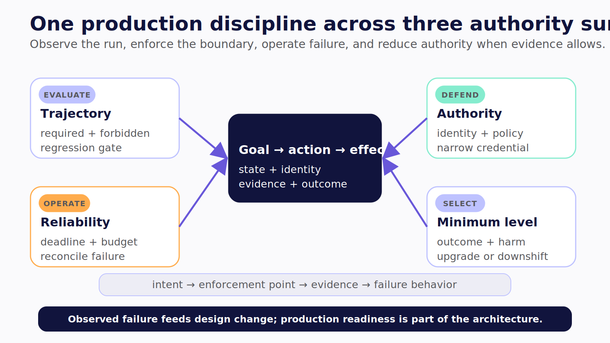

# Part V — Production Engineering Across All Levels

The three operating surfaces change what an agent can reach, but the production questions converge. Did the system take an acceptable path? Did it remain inside its authority? Did it recover without repeating an effect? Did it finish within the user's time and cost budget? Can the team prove those answers after the run ends?

This part turns the book's architecture into one operating discipline.

- Chapter 23 evaluates the trajectory rather than grading only the final response.
- Chapter 24 converts authority into trust zones, enforcement points, adversarial tests, and incident controls.
- Chapter 25 treats latency, retries, queues, recovery, and cost as one bounded reliability system.
- Chapter 26 returns to the opening decision: choose the smallest authority surface that can produce the outcome.

The goal is not to bolt “production readiness” onto a finished demo. Production engineering changes the design itself. It determines which tools exist, where identity is resolved, how state persists, what evidence is retained, when a run stops, and whether a higher level of agency is justified at all.

The recurring test is simple:

```text
intent → enforcement point → evidence → failure behavior
```

If one of those links is missing, the system has an aspiration rather than a control.



*Figure V.1 — The same operating discipline evaluates behavior, defends authority, contains failure, and feeds evidence back into a smaller or stronger design.*
