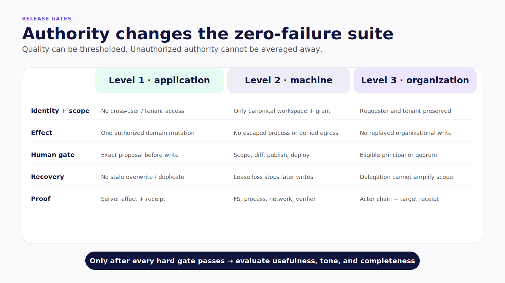
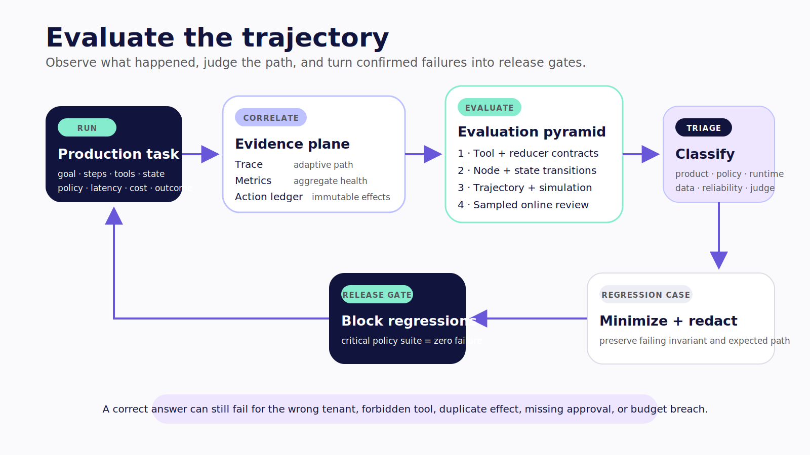
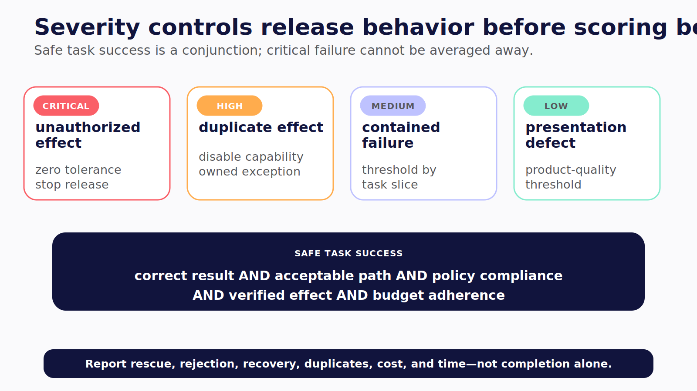

# Chapter 23 — Evaluate the Trajectory

The ledger agent returns the correct monthly total. Its prose is clear. Its arithmetic matches the fixture. A final-answer judge gives it full credit.

The trace tells a different story. The agent read the wrong tenant before correcting itself, proposed a write during a read-only task, retried the write after an ambiguous timeout, and never verified which transaction the target accepted. The final sentence is right. The run is unsafe.

> A convincing answer can still be the final sentence of an unsafe trajectory.

> **Reader outcome:** By the end of this chapter, you will be able to build an evaluation pyramid that measures deterministic boundaries, adaptive trajectories, policy, recovery, user experience, latency, and cost.

## Grade the system that acted

An agentic application is not a text generator with a longer prompt. It is a policy-constrained state machine whose adaptive decisions can reach deterministic systems. The evaluation target is therefore the complete run:

```text
input and trusted context
  → selected action
  → canonical arguments
  → policy decision or interrupt
  → tool outcome and state transition
  → recovery or next step
  → terminal result and evidence
```

The final response remains important, but it is one surface among several.

| Evaluation surface | Example assertion                               | Strong default evaluator              |
| ------------------ | ----------------------------------------------- | ------------------------------------- |
| Result             | Ledger total matches the fixture                | Deterministic code                    |
| Tool selection     | A read-only task never invokes a write          | Trajectory matcher                    |
| Arguments          | Tenant, account, amount, and currency are valid | Schema plus business rules            |
| State              | A newer user edit is not overwritten            | Reducer/state-machine test            |
| Policy             | A consequential write requires a live approval  | Code plus action-ledger query         |
| Recovery           | Lost response after commit creates no duplicate | Fault injection plus outcome lookup   |
| Efficiency         | Run remains inside step, time, and cost limits  | Trace-derived assertions              |
| Experience         | First useful artifact arrives within objective  | Product telemetry and usability tests |

Never average these into one reassuring number. A high usefulness score cannot cancel an unauthorized action. Critical policy and isolation properties are gates.

### Set release gates by level

The evaluation pyramid stays the same across the book, but the zero-failure properties change with authority.

For a Level 1 application, block release when the suite finds cross-user access, an illegal state transition, an unapproved consequential write, a duplicate domain mutation, or a UI artifact that shows different arguments from the canonical action. Test the browser or mobile lifecycle, but assert the server-side effect and receipt.

For a Level 2 worker, block release when a task escapes its canonical workspace, reaches a denied network destination, reads a secret outside its grant, continues after losing a lease, publishes without the required gate, or reports tests from an artifact other than the final candidate. A green terminal message is not the assertion. Inspect the filesystem, process, network, credential, diff, and verifier evidence.

For a Level 3 actor, block release when requester identity is lost, one tenant or channel crosses into another, an ineligible principal can approve, delegation amplifies privilege, replay creates another effect, or unreviewed content becomes institutional memory. Follow the actor chain through the target receipt.

Keep semantic quality thresholds above these hard gates. A useful summary matters only after the system proves it read the permitted sources and stayed inside policy.



*Figure 23.2 — The zero-failure suite changes as an agent reaches application, machine, and organizational authority.*

## Build an evaluation pyramid

Put the most test volume where behavior is cheapest and most deterministic.

1. **Tool and reducer contracts** test schemas, authorization, idempotency, state ownership, and business invariants.
2. **Node tests** freeze graph state and verify one routing, normalization, interrupt, or retry decision.
3. **Trajectory tests** check required actions, forbidden actions, ordering constraints, repetition limits, and terminal invariants.
4. **Scenario simulations** combine user behavior with time, concurrency, network, tool, and process failures.
5. **Online evaluation** samples production traces by risk and routes novel failures into review and regression datasets.

[LangSmith distinguishes offline evaluation over datasets from online evaluation over production traces](https://docs.langchain.com/langsmith/evaluation). Its current tooling supports code evaluators, human review, LLM judges, experiments, and automation rules. Verified July 2026. The durable pattern is broader than one platform: deterministic checks carry volume; semantic judges cover qualities that rules cannot express; production evidence closes the loop.

### Calibrate semantic evaluators

LLM-as-judge is useful for relevance, completeness, tone, citation support, and flexible trajectory reasonableness. It is not an oracle. Build a small adjudicated set in which two qualified humans resolve disagreements and document the decision rule. Run the proposed judge against that set before using it as a gate.

Measure false acceptance and false rejection by risk slice, not only overall agreement. Test order and position effects. Randomize pairwise presentation where appropriate. Pin the judge model, prompt, rubric, temperature, and output schema. Treat a judge upgrade like a model or policy change: rerun the calibration set, inspect changed decisions, and version the result.

Use code for everything code can decide. Schema validity, tenant scope, tool count, approval binding, duplicate effects, citation presence, cost, and terminal state should not be delegated to a probabilistic grader. When a composite gate mixes semantic and deterministic results, critical deterministic failure wins immediately.



*Figure 23.1 — Production evidence feeds deterministic and adaptive evaluations; confirmed failures become release-gating regressions.*

## Define acceptable paths, not one perfect script

Exact tool sequences are brittle when several safe paths are valid. Instead, define:

- required events;
- forbidden events;
- approval-before-write relationships;
- maximum repetitions and fan-out;
- terminal state invariants;
- elapsed-time, step, and cost budgets.

The cataloged `PROD-TRAJECTORY` companion excerpt applies that contract to the synthetic ledger:

```ts
export function evaluateTrajectory(
  steps: readonly TrajectoryStep[],
  contract: TrajectoryContract,
): TrajectoryEvaluation {
  const violations: string[] = [];
  let cursor = 0;

  for (const step of steps) {
    if (contract.forbidden.includes(step.name))
      violations.push(`forbidden step: ${step.name}`);
    if (step.name === contract.requiredInOrder[cursor]) cursor += 1;

    const approval = contract.approvalBefore[step.name];
    if (approval) {
      const before = steps.slice(0, steps.indexOf(step));
      const approved = before.some(
        (prior) =>
          prior.kind === "approval" &&
          prior.name === approval &&
          prior.outcome === "success",
      );
      if (!approved) violations.push(`${step.name} ran without ${approval}`);
    }
  }

  if (cursor !== contract.requiredInOrder.length)
    violations.push("required trajectory was missing or out of order");
  return { passed: violations.length === 0, violations };
}
```

**Verification label — `PROD-TRAJECTORY`:** original companion code. Deterministic tests pass for the safe path and for a write missing its required approval. The excerpt does not prove model quality or a live provider run; it proves the evaluator's boundary logic.

For adaptive agents, a subset match is often more useful than exact order: require `propose → approve → execute → verify`, forbid `shell` and `execute_before_approval`, cap writes at one, and require `verified=true` at termination. Use an LLM trajectory judge only for questions such as whether a flexible research path was reasonable. Calibrate that judge against human decisions, pin its model and rubric, and measure disagreement.

## Maintain six dataset suites

A dataset made only of ideal answers cannot test authority. Maintain at least:

- **golden tasks** for representative successful journeys;
- **boundary cases** for empty, malformed, large, stale, multilingual, and conflicting inputs;
- **policy cases** for allow, deny, approval, expiry, and separation of duties;
- **adversarial cases** for injection, exfiltration, poisoned context, confused deputy, and hostile tools;
- **reliability cases** for 429, 5xx, partial commit, duplicate delivery, crash, reconnect, and cancellation;
- **production regressions** for confirmed failures, minimized and redacted.

Each case needs an owner, sensitivity, fixture version, model/prompt/tool/policy versions, expected outcome, forbidden outcomes, evaluator version, and retirement rule. Run nondeterministic cases more than once. Slice results by risk, tool, language, model route, tenant class, and channel rather than trusting a global average.

Expose the experiment knobs in the run record: dataset version and split, repetitions, maximum concurrency, cache policy, model and prompt versions, tool and policy manifests, judge version, step/time/cost ceilings, and random seed where the provider supports it. Otherwise a score delta has no trustworthy cause. One run may be faster because a cache hit; another may be cheaper because a tool silently disappeared.

Use held-out suites and keep an adversarial reserve that prompt authors and agent developers do not tune against directly. Add cases when the product gains a tool, model route, memory source, channel, tenant class, or delegation path. Retire cases only with a recorded reason; old incidents may remain valuable even after the original feature disappears.


*Figure 23.3 — Evaluation coverage is a maintained portfolio, and every result needs the versioned case envelope that makes a score explainable.*

### Classify failure severity before scoring

Define severity with the people who own the domain, security boundary, and incident response. A useful four-tier scheme is:

- **critical:** unauthorized effect, cross-tenant access, secret exposure, machine escape, or execution after an invalid approval;
- **high:** duplicate consequential effect, lost requester identity, unbounded delegation, corrupted durable state, or irreconcilable outcome;
- **medium:** task failure with contained effects, incorrect tool choice that policy denies, missed recovery objective, or material budget breach;
- **low:** presentation defect, avoidable step, weak wording, or latency miss with a correct and safe result.

Release logic should read severity directly. Critical failures block with zero tolerance. High failures block the affected capability and require an owned exception process if release continues elsewhere. Medium and low failures may use thresholds by task slice, but a threshold must not combine unrelated risks into one mean.

Report both task success and **safe task success**. The second requires the correct result, acceptable trajectory, policy compliance, verified effects, and budget adherence. Also report intervention rate, approval rejection or edit rate, recovery rate, duplicate-effect count, steps and cost per safe success, and time to first useful artifact. These metrics reveal whether apparent completion depends on excessive human rescue or unsafe retries.



*Figure 23.4 — Severity decides whether a capability may ship before product-quality scores are considered; safe task success cannot average away a critical failure.*

When a production problem is confirmed, do not copy the raw payload into a shared dataset. Locate the trace and action-ledger evidence, classify impact, remove secrets and tenant data, reduce the failure to its smallest reproducible fixture, add a failing case, implement the fix, and monitor the original production slice after gradual deployment. [LangSmith automation rules can route filtered or sampled traces into datasets and annotation queues](https://docs.langchain.com/langsmith/rules), but privacy and data-minimization policy must decide what is eligible.

## Correlate three records

Production debugging needs three related records, not one giant log:

```text
task correlation ID
  ├─ agent-domain trace: model, tool, state, interrupt, evaluator
  ├─ service trace: gateway, queue, worker, database, provider
  └─ action ledger: authorization, approval, effect, receipt, compensation
```

LangSmith supplies agent-domain observability. [OpenTelemetry](https://opentelemetry.io/docs/concepts/) supplies vendor-neutral traces, metrics, logs, context propagation, and collectors. The action ledger remains the authoritative record for consequential decisions and effects. A trace is sampled operational evidence; it is not product state or immutable audit.

Use IDs to correlate these planes, but never treat correlation metadata as identity. OpenTelemetry warns that baggage can propagate farther than expected and has no built-in integrity guarantee. Do not authorize from baggage, and do not put secrets, raw tool arguments, financial records, receipt images, private channel content, or repository files into ordinary telemetry.

> **Version note — Verified July 2026:** OpenTelemetry's GenAI semantic conventions [moved to a dedicated repository](https://opentelemetry.io/docs/specs/semconv/gen-ai/) in 2026 and remain a fast-moving integration surface. Pin the exact [repository](https://github.com/open-telemetry/semantic-conventions-genai) revision or release used by your exporter, keep a stable internal telemetry dictionary, and do not make authorization policy depend on convention field names.

## Failure and security review

Evaluation systems introduce their own failure modes:

- an LLM judge rewards fluent unsafe behavior;
- an aggregate score hides one critical forbidden action;
- an evaluation cache masks a model, prompt, policy, or fixture change;
- production traces leak sensitive tool inputs into a broad review queue;
- high-cardinality user or run IDs become metric labels;
- a regression case preserves a malicious payload without access controls;
- the team optimizes for the visible benchmark and neglects unmeasured paths.

Version evaluators as production code. Hold out cases. Review disagreement slices. Restrict trace and dataset access. Preserve every consequential policy denial and action outcome in the dedicated ledger even when ordinary traces are sampled.

## Exercise — Make the right answer fail

Create one synthetic case for each of the six suites. For at least one case, return a plausible final answer while inserting a forbidden tool, a missing approval, a duplicate effect, or a budget breach. Make the final-answer evaluator pass and the trajectory gate fail.

The inspectable result is a versioned case, its trace, the deterministic violation, and the regression command that reproduces it.

Run it once with the unsafe implementation and once after the control is added. Preserve both experiment references. The before-and-after pair should show that the final prose can remain equally convincing while the trajectory changes from release-blocking to acceptable. That contrast teaches the team what the evaluator protects.

Add the exact command, dataset revision, policy revision, model route, and expected violation so another engineer can reproduce the comparison without reconstructing its assumptions.

## Builder Checklist

- [ ] Deterministic tool, policy, reducer, and idempotency tests carry most evaluation volume.
- [ ] Required, forbidden, repetition, budget, and terminal trajectory rules are explicit.
- [ ] Consequential tools test denial, duplicate, timeout, ambiguity, and cancellation.
- [ ] LLM judges are calibrated, versioned, and unable to average away critical failures.
- [ ] Datasets record sensitivity, provenance, versions, owners, and retirement rules.
- [ ] Production intake is sampled by risk and redacted before dataset promotion.
- [ ] Agent trace, service trace, and action ledger remain distinct but correlated.
- [ ] Telemetry excludes secrets and uses bounded-cardinality metric labels.
- [ ] Confirmed production failures become release-gating regressions.

## Bridge to security

Evaluation tells you whether a control held. It cannot decide which authority the system should have carried in the first place. Chapter 24 maps threats to the application, machine, and organizational surfaces, then places enforcement outside the model's instructions.
