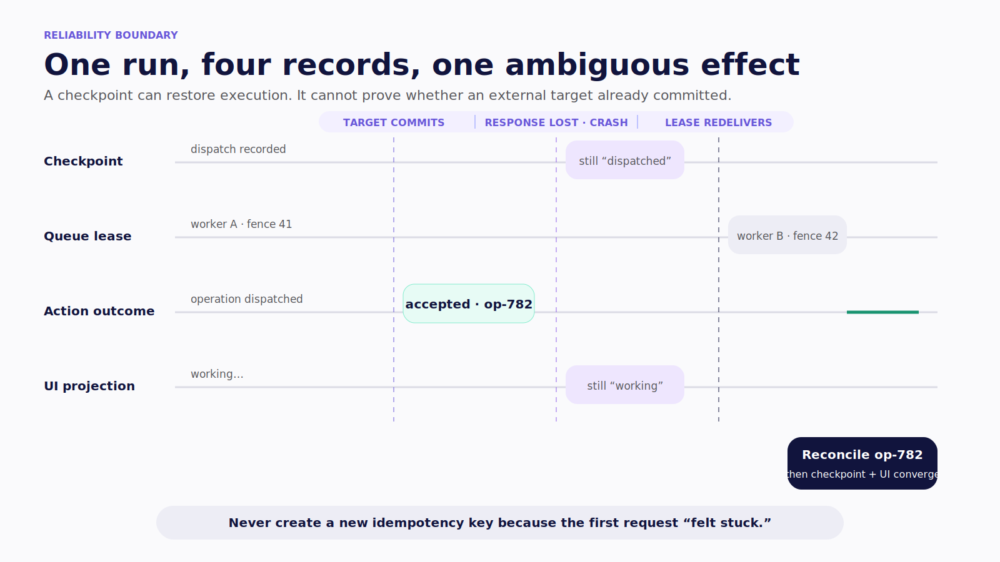
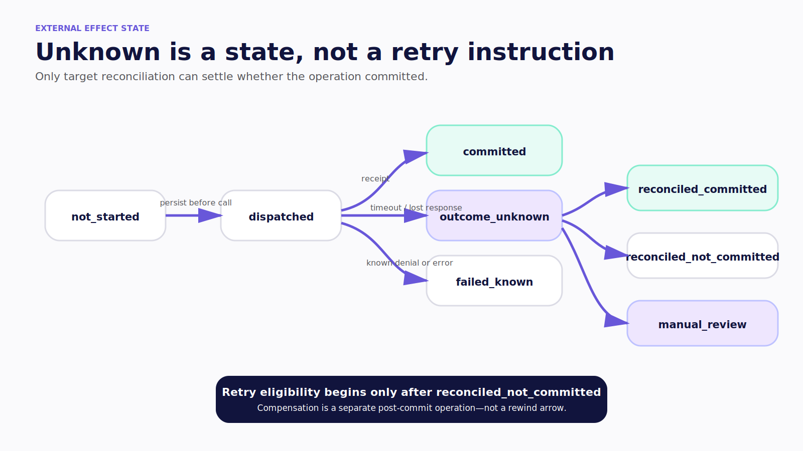
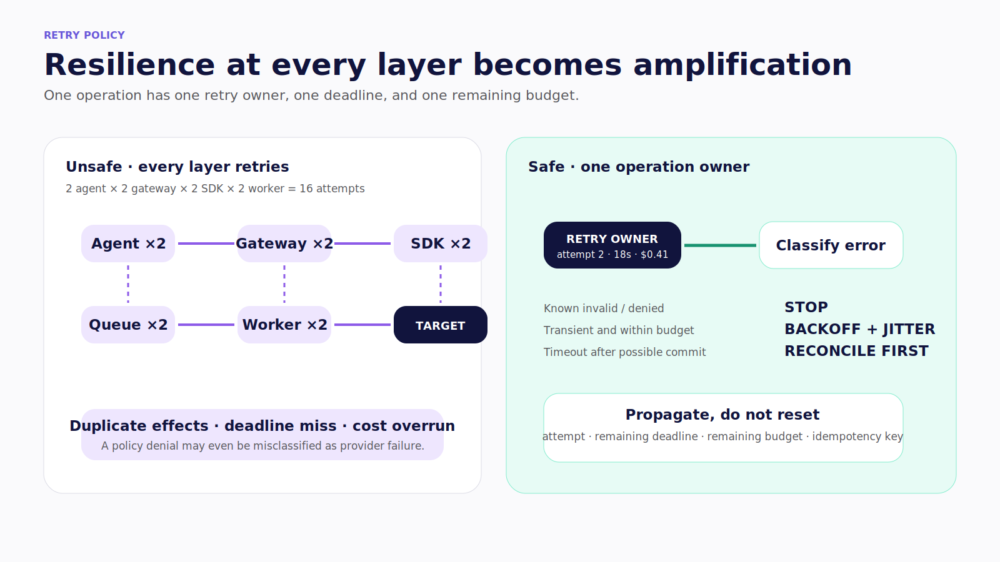
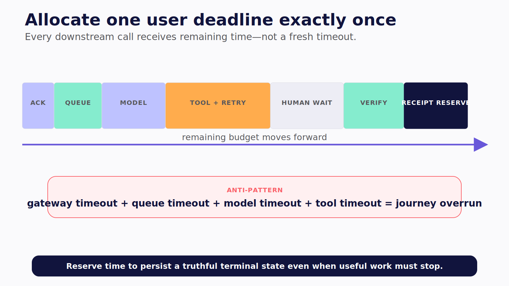
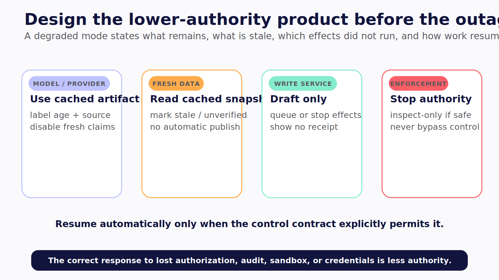
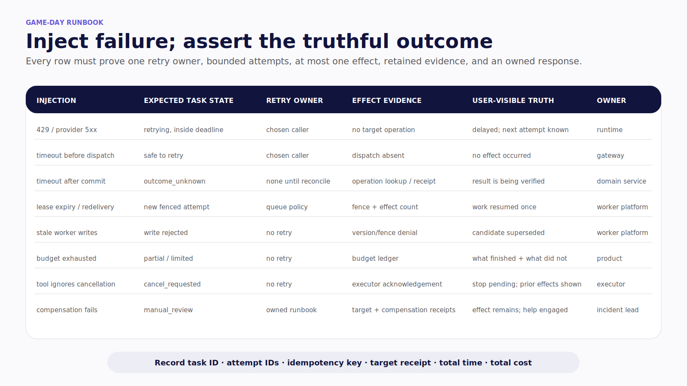

# Chapter 25 — Reliability Has a Budget

The model provider slows down. The gateway retries. The queue's lease expires and redelivers the task. The worker retries the tool. The organizational agent delegates a second copy because the first appears stuck.

Every layer is trying to be resilient. Together they miss the user's deadline, exceed the cost ceiling, and create the same ticket twice.

> Reliability is not how often the agent keeps trying. It is how predictably the system reaches a truthful outcome inside its authority and budget.

> **Reader outcome:** By the end of this chapter, you will be able to operate agentic systems within explicit latency, reliability, concurrency, and cost budgets, with one retry owner, idempotent effects, recoverable state, and honest degraded modes.

## Separate the four durable records

Agent systems commonly collapse four different records into “the run.” Keep them distinct:

| Record         | What it proves                                      | What it does not prove                    |
| -------------- | --------------------------------------------------- | ----------------------------------------- |
| Checkpoint     | Runtime can resume from known state                 | External effect did not already commit    |
| Queue lease    | One worker may act for a limited interval           | A stale or partitioned worker has stopped |
| Action outcome | Target accepted, denied, or reconciled an operation | Agent state recorded the outcome          |
| UI projection  | User can see a current status                       | Status is authoritative or durable        |

[LangGraph persistence](https://docs.langchain.com/oss/python/langgraph/persistence) makes execution state recoverable. It cannot turn an external API into an exactly-once system. A process can fail after the target commits but before the checkpoint records success. A queue can redeliver. A user can double-click. Reliability starts by making those ambiguous boundaries explicit.



*Figure 25.1 — Checkpoint, queue lease, action outcome, and UI projection can disagree after a target commits and a response is lost.*

## Give every consequential effect an identity

Derive a stable idempotency key from the logical task, canonical action, target, and operation version. Every retry of the same intended effect reuses that key.

Persist an operation record before dispatch:

```text
not_started → dispatched → committed | failed_known | outcome_unknown
outcome_unknown → reconciled_committed | reconciled_not_committed | manual_review
```

When a timeout occurs after possible commit, query the target by idempotency key or provider operation ID. Do not create a new key because the first request “felt stuck.” If the target offers no idempotency or outcome lookup, serialize through a durable operation table or require manual reconciliation before a second attempt.

For a file patch, the base content hash is the precondition and the result hash is the receipt. For a ticket, message, payment, pull request, or deployment, retain the target's operation identifier. Record compensation separately; restoring a checkpoint does not undo an accepted external effect.



*Figure 25.2 — An unknown target outcome must be reconciled before retry.*

## Choose one retry owner

Classify errors before retrying.

| Error class                            | Default action                                               |
| -------------------------------------- | ------------------------------------------------------------ |
| Invalid argument or schema             | Fail; return a correctable error                             |
| Authentication failure                 | Stop and refresh or escalate through trusted identity flow   |
| Authorization or policy denial         | Do not retry; preserve the decision                          |
| Rate limit or transient provider error | Retry at the chosen layer with backoff and jitter            |
| Timeout before dispatch                | Retry if deadline and budget remain                          |
| Timeout after possible commit          | Reconcile outcome before any retry                           |
| Tool unavailable                       | Degrade, queue, or fail according to task policy             |
| Budget exhausted                       | Stop new work and return truthful partial state              |
| Cancellation requested                 | Follow the documented scope; do not reinterpret as retryable |

One layer owns the retry policy for one operation. Gateways, SDKs, queues, workers, and agent loops must not all multiply attempts independently. Propagate attempt number, remaining deadline, and remaining budget.

Use capped exponential backoff with jitter for genuinely transient errors. Amazon's guidance explains why immediate and layered retries amplify overload, and why jitter reduces synchronized retry waves: [Timeouts, retries, and backoff with jitter](https://aws.amazon.com/builders-library/timeouts-retries-and-backoff-with-jitter/).



*Figure 25.3 — Layered retries multiply attempts; one operation needs one retry owner, deadline, budget, and reconciliation rule.*

## Propagate one deadline

Start with the user journey deadline. Divide it deliberately among durable acceptance, queueing, model work, tools, intervention, verification, and response. Each downstream call receives the remaining deadline, not a fresh full timeout.

```text
user deadline
  ├─ acknowledgement budget
  ├─ queue-delay budget
  ├─ planning and model budget
  ├─ tool and retry budget
  ├─ approval wait or expiry
  ├─ verification budget
  └─ final response reserve
```

Reserve enough time to persist a terminal or resumable state. Killing a worker at the outer deadline without recording partial effects produces uncertainty rather than reliability.



*Figure 25.5 — Propagate remaining time through the run and preserve a terminal-state reserve; fresh downstream timeouts silently overrun the user journey.*

## Enforce budgets before the next step

Budgets belong inside the execution loop. Observe cost in telemetry, but enforce limits before another model call, tool call, delegation, or artifact expansion.

The cataloged `PROD-BUDGET` companion guard demonstrates the core rule:

```ts
export class RunBudgetGuard {
  private steps = 0;
  private costUsd = 0;
  private readonly startedAt: number;

  constructor(
    private readonly budget: RunBudget,
    private readonly now: () => number = Date.now,
  ) {
    this.startedAt = now();
  }

  consume(costUsd: number): void {
    if (!Number.isFinite(costUsd) || costUsd < 0)
      throw new Error("step cost must be non-negative");
    const nextSteps = this.steps + 1;
    const nextCost = this.costUsd + costUsd;
    const elapsed = this.now() - this.startedAt;

    if (nextSteps > this.budget.maxSteps)
      throw new BudgetExceededError("step budget exceeded");
    if (nextCost > this.budget.maxCostUsd)
      throw new BudgetExceededError("cost budget exceeded");
    if (elapsed > this.budget.maxDurationMs)
      throw new BudgetExceededError("time budget exceeded");

    this.steps = nextSteps;
    this.costUsd = nextCost;
  }
}
```

**Verification label — `PROD-BUDGET`:** original companion code. Its deterministic test proves that a step crossing the cost ceiling throws before mutating the counters. It is a teaching guard, not a complete production quota service.

Production budgets should also cover tokens, tool calls by risk, graph depth, subagent fan-out, parallelism, output bytes, network requests and egress, CPU, memory, disk, and human-wait expiry. On exhaustion, return what completed, what remains, known side effects, artifacts, the stopping reason, and whether an eligible human may extend the task.

## Operate queues as at-least-once systems

A worker claims a durable task with a lease and fencing token, verifies current task and cancellation state, heartbeats during long work, and commits state with version preconditions. A stale worker that lost its lease must be unable to write later.

Track queue age, oldest eligible work, claimed versus running tasks, heartbeat loss, retry amplification, dead-letter volume, and reconciliation backlog. A dead-letter queue is not a graveyard. Define who inspects it, how sensitive payloads are protected, what conditions permit redrive, and how idempotency remains intact. AWS documents [visibility timeouts](https://docs.aws.amazon.com/AWSSimpleQueueService/latest/SQSDeveloperGuide/sqs-visibility-timeout.html) and [dead-letter queue redrive](https://docs.aws.amazon.com/AWSSimpleQueueService/latest/SQSDeveloperGuide/sqs-configure-dead-letter-queue-redrive.html); the same operating questions apply even when you use another queue.

## Make cancellation truthful

“Stop” must name the layer:

- stop model generation;
- cancel queued work;
- ask the current tool to stop;
- halt after the current atomic step;
- terminate a worker;
- discard an unmerged candidate;
- compensate a completed effect.

The UI enters `cancel_requested` when the user clicks. It enters a terminal cancelled state only when the relevant scheduler or executor acknowledges what stopped. If an external action completed first, show the effect and available compensation. Disconnect is not cancellation; a rejoining client fetches the same durable task by ID and event cursor.

## Define journey SLOs and safety invariants

Time to first token measures one provider behavior. Agent SLOs describe the user's journey:

| Journey               | Useful indicator                                               |
| --------------------- | -------------------------------------------------------------- |
| Accept task           | Durably accepted eligible tasks / valid submissions            |
| First useful artifact | Time from acceptance to usable plan, source, diff, or card     |
| Complete task         | Verified correct terminal outcomes within deadline             |
| Resume                | Recoverable failures resumed without lost or duplicate effects |
| Consequential write   | Verified authorized correct writes / eligible attempts         |
| Intervention          | Approval requests delivered and resolved before expiry         |
| Efficiency            | Cost and steps per verified successful outcome                 |

Google's SRE guidance recommends objectives tied to user-visible behavior and tail latency rather than averages: [Service Level Objectives](https://sre.google/sre-book/service-level-objectives/). Use error-budget policy to decide when reliability work must displace feature work.

Safety invariants are different. Unauthorized writes, cross-tenant access, secret leakage, execution after invalid approval, and machine escape have zero tolerance. They trigger containment and incident response, not an ordinary error-budget calculation.

## Route, cache, and isolate deliberately

A fallback model is a new execution route, not an automatic reliability win. It must pass equivalent tool, schema, policy, privacy, and approval suites. Do not treat a model refusal or policy denial as provider failure that deserves a more permissive route.

Route on an explicit capability contract: required tool or structured-output support, evaluated quality for the task slice, latency and cost envelope, data residency and retention rules, modality, context needs, provider health, and action risk. Record the selected route and reason in the run. Evaluate every route independently.

Fallback should preserve or reduce authority. If the alternate model cannot satisfy the same schemas, tool constraints, privacy requirements, or approval behavior, enter a degraded read-only mode or stop. A provider outage is not permission to send regulated data elsewhere, drop verification, or replace a proposal-only model with one that can execute.

Context has a reliability budget too. Keep system policy and tool contracts, trusted invocation context, semantic task state, recent messages, retrieved evidence, and large artifact references separate. Summaries may omit an approval, denial, exact amount, or obligation. Preserve those invariants in typed state outside summarized conversation. Test long-running compaction by checking required fact retention and tool behavior, not only token savings.

Cache only where staleness and scope are acceptable. Never reuse an authorization decision beyond policy lifetime, an approval beyond its exact action and expiry, or a side-effect outcome that remains ambiguous. Include tenant, resource, model, prompt, schema, policy, and data version in relevant cache keys.

Choose tenant isolation at every layer. A pooled runtime improves utilization but increases noisy-neighbor and policy burden. A siloed worker or store contains authority at higher cost. A bridge model shares the control plane while isolating high-authority workers, secrets, or data. Tenant isolation must cover threads, checkpoints, memory, traces, artifacts, caches, queues, credentials, tools, and deletion—not only a `tenant_id` field.

Scale gateways, queues, durable workers, checkpointers, artifact stores, and tool executors independently. Apply concurrency limits by tenant, provider, tool, and risk class. Reserve capacity for interactive acknowledgements and approval resolutions so long research or machine tasks cannot starve control traffic. Bound delegation fan-out, and use bulkheads and circuit breakers around slow dependencies.

Autoscaling on CPU alone misses the real pressure. Watch queue age, oldest eligible task, provider saturation, tool saturation, heartbeat loss, stuck interrupts, per-tenant concurrency, and outcome-reconciliation backlog. Admission control should reject or defer work before overload destroys the latency and budget guarantees already promised to accepted tasks.

### Design degraded modes before the outage

Name the safe reduced product for each dependency failure. A research agent may return cached public sources with an age label but disable fresh claims. A ledger may allow read-only browsing while writes queue or stop. A channel agent may create a draft without publishing it. A machine agent may inspect an existing artifact but refuse execution when isolation or policy services are unavailable.

Every degraded response should state what remains available, what is stale or unverified, which effects did not run, and whether the task will resume automatically. Do not route around a failed authorization, audit, sandbox, or credential service. The correct degraded mode for lost enforcement is usually less authority, not a best-effort continuation.



*Figure 25.6 — A degraded mode is a named lower-authority product with explicit stale data, disabled effects, and resume behavior—not an improvised bypass.*

## Failure and security review

Game-day the system with:

- 429 and 5xx provider failures;
- timeout before dispatch and timeout after target commit;
- queue lease expiry and duplicate delivery;
- stale worker continuing after fencing;
- gateway or worker restart during approval;
- provider fallback with incompatible tool behavior;
- budget exhaustion after a known partial effect;
- cancellation while a tool ignores cancellation;
- one tenant saturating shared workers or telemetry;
- compensation failure and target outcome that cannot be reconciled.

For every scenario, prove one retry owner, bounded attempts, one consequential effect, truthful task state, retained evidence, and owned incident action.

## Exercise — Run the failure matrix

Inject 429, 5xx, timeout-before-commit, timeout-after-commit, queue redelivery, provider degradation, and budget exhaustion into one canonical task. Record task ID, attempt IDs, idempotency key, target receipt, checkpoints, queue state, user-visible state, total time, and cost.

The exercise passes only when the system creates at most one effect, settles ambiguity explicitly, stops inside budget, and exposes a truthful terminal state.

Keep the failure fixture in the release suite.



*Figure 25.4 — A game-day matrix ties injected failures to truthful task state, retry ownership, effect evidence, user status, and response ownership.*

## Builder Checklist

- [ ] Checkpoint, queue lease, action outcome, and UI projection are separate records.
- [ ] Every consequential write has stable idempotency or an explicit manual path.
- [ ] Ambiguous outcomes reconcile before retry.
- [ ] Error classifier, retry owner, limits, backoff, jitter, and deadline are explicit.
- [ ] Deadlines and budgets propagate and are enforced before each new step.
- [ ] Queue leases, fencing, heartbeats, dead letters, and redrive are tested.
- [ ] Cancellation names the layer and never claims prior effects were undone.
- [ ] Journey SLOs measure useful artifacts, terminal correctness, recovery, and cost.
- [ ] Safety invariants trigger immediate containment rather than consume error budget.
- [ ] Routes, caches, tenants, and concurrency preserve policy and isolation.

## Bridge to architecture selection

The book now has the production controls for all three surfaces. Chapter 26 uses them as design costs. The final question is not how much agency the stack can support, but how little authority the product needs to create the outcome.
