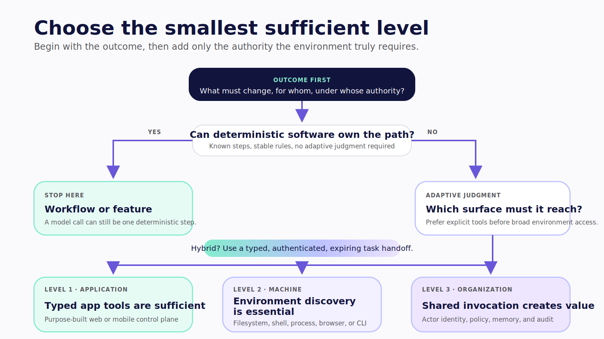
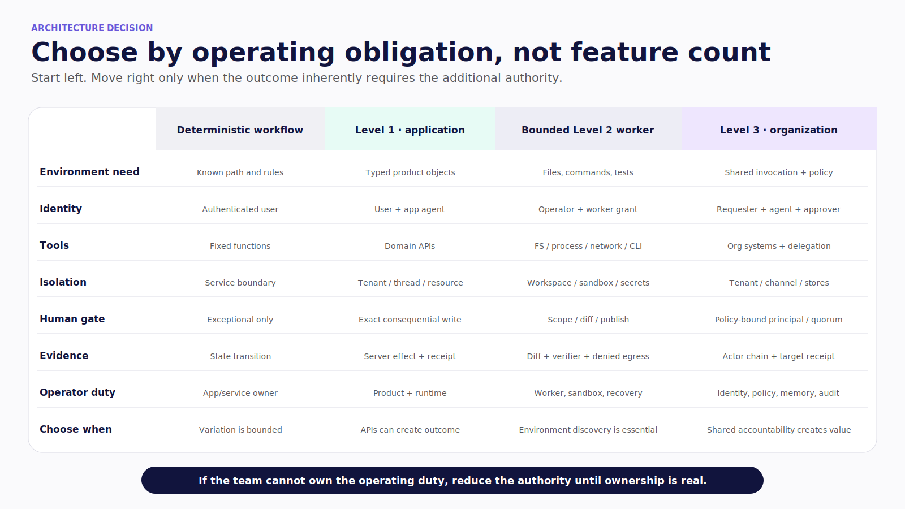
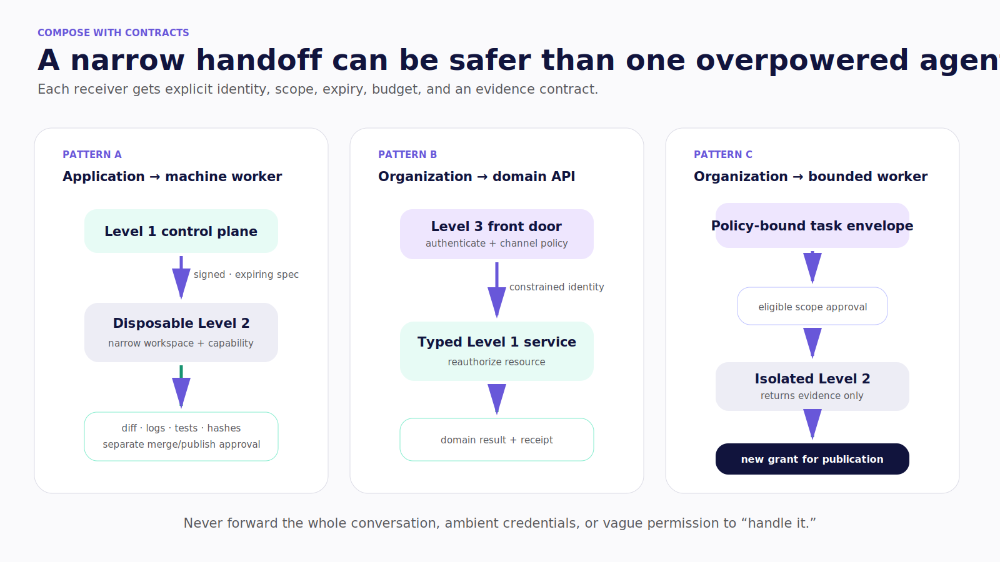

# Chapter 26 — Choose the Smallest Sufficient Level

Return to the personal ledger from Part II. A user wants to understand spending, reconcile a receipt, and share one approved result with a finance team.

You could build a Level 1 application with typed ledger tools. You could give a Level 2 worker filesystem and shell access to a directory of statements. You could invite a Level 3 agent into the team's channels and let it delegate reconciliation work.

All three can produce a result. They do not create the same product, authority, or operating burden.

> The best agent architecture is not the one with the most autonomy. It is the one that creates the outcome with the least authority you must continuously defend.

> **Reader outcome:** By the end of this chapter, you will be able to select Level 1, Level 2, Level 3, no agent, or a narrow hybrid from the outcome, environment, identity, interaction, risk, and operating constraints.

## Start below Level 1

First ask whether the task needs an agent at all.

Use an ordinary UI or deterministic workflow when the path and inputs are known, correctness rules are expressible, the model would choose among a tiny stable set of steps, or the harm of a wrong action cannot be bounded. A form, query builder, filter, scheduled job, or state machine is often the better product.

An LLM can still help at one narrow boundary: classify text, extract a draft, summarize evidence, or propose a plan. The application remains in control of execution.



*Figure 26.1 — Start with the outcome and stop at the smallest authority surface that can create it.*

Use this decision sequence:

1. Can a deterministic workflow create the outcome? Use it.
2. Can typed application tools create it? Keep the agent at Level 1.
3. Does it inherently require arbitrary files, commands, installed tools, or environment feedback? Add a bounded Level 2 worker.
4. Does it need shared invocation, service identity, organizational policy, institutional context, or multi-party accountability? Govern it as Level 3.
5. Can the higher authority be isolated as one narrow task? Delegate through a typed contract rather than expanding the primary agent.
6. Can you bound and recover from the maximum credible harm? If not, reduce authority or keep the step human-operated.

## Compare the operating obligation

| Dimension        | Level 1 — application                | Level 2 — machine                             | Level 3 — organization                                     |
| ---------------- | ------------------------------------ | --------------------------------------------- | ---------------------------------------------------------- |
| Best for         | Domain objects and typed app actions | Files, commands, tests, local/cloud tooling   | Team requests and shared asynchronous workflows            |
| Authority        | Product APIs and tenant state        | Filesystem, process, network, credentials     | Shared systems, service identity, delegation, memory       |
| Default identity | User plus application agent          | Operator plus machine worker                  | Requester, agent principal, delegate, approver             |
| Isolation        | User, tenant, thread, resource       | Workspace, container/VM, network, secrets     | Tenant, workspace, channel, stores, delegated workers      |
| Human control    | Domain write approval or edit        | Scope, command, diff, publish/deploy approval | Policy-bound approver or quorum                            |
| Dominant failure | Wrong app mutation or state conflict | Exfiltration, unsafe code, machine compromise | Confused deputy, cross-team leakage, organizational misuse |
| Operating burden | Lowest                               | High worker, sandbox, and recovery burden     | Highest identity, governance, memory, and audit burden     |

Do not score only features. Score the eleven knobs that the team must own:

- user surface and interruption;
- runtime and durability;
- model routes and fallbacks;
- tools and side effects;
- task state, memory, and artifacts;
- acting and delegated identity;
- tenant, machine, and network isolation;
- human approval and compensation;
- evaluation and adversarial suites;
- traces, action ledger, and SLOs;
- deployment, capacity, incidents, upgrades, and retirement.

The winning design is the least complex one that satisfies the outcome and risk constraints.

Make the operating owner part of the selection, not an afterthought. A team that cannot patch worker images, rotate agent credentials, review memory, answer approval incidents, or reconcile ambiguous effects does not yet have the capacity for the authority that requires those duties. Reduce scope until ownership is real.



*Figure 26.2 — Choose by the operating obligation created by the outcome, not feature count.*

## Know the upgrade triggers

Move from Level 1 to a bounded Level 2 worker only when the work cannot be represented safely as application APIs and genuinely needs environment discovery, arbitrary files, commands, installed CLIs, or test feedback. Before doing so, define the worker lifecycle, filesystem/network/process/credential policy, task scope, allowed artifacts, diff and verifier contract, external-write boundary, cleanup, and recovery suite.

The GTM Operations Workspace-to-Hermes seam shows the interaction opportunity. The audited `hermes-cpk` repository remains an unsafe baseline until the external runtime, isolation, permissions, credentials, recovery, and runtime evidence are pinned. A visible command pane is not a reason to accept machine authority.

Move to Level 3 only when the agent becomes a shared organizational participant. Triggers include multiple requesters, shared channels, a service identity, channel policy, organizational tools, multi-party approval, institutional memory, schedules, or asynchronous ownership. A personal task placed in Slack is still a personal task with a larger privacy surface.

Before Level 3, define requester, agent, delegate, approver, and target identities; tenant/workspace/channel scope; policy; retention; memory governance; action ledger; support ownership; incident response; and decommissioning.

## Compose levels with contracts

A hybrid can be smaller than one overpowered agent when each handoff is narrow.

### Application control plane with machine worker

The Level 1 application owns the goal, durable task state, user-visible plan, and approvals. It creates a signed, expiring specification for a disposable Level 2 worker. The worker receives a narrow workspace and capability, then returns a diff, logs, test results, and artifact hashes. A separate approval governs merge, publish, or deployment.

### Organizational front door with domain API

A channel agent authenticates the requester and evaluates channel policy, then invokes a typed Level 1 service under a constrained identity. The domain service reauthorizes the resource and returns a receipt. No machine worker is necessary simply because the request began in a channel.

### Organizational supervisor with bounded worker

A Level 3 agent creates a policy-bound task envelope. An eligible principal approves the machine scope. The Level 2 worker operates in isolation and returns evidence. Another policy decision governs the external organizational write. Delegation and publication use different grants, credentials, budgets, and audit events.



*Figure 26.3 — Narrow authenticated handoffs let application, machine, and organizational surfaces compose without ambient authority.*

Every handoff should carry:

```text
task ID and canonical objective
requester and delegating agent identities
tenant, resource, and workspace scope
allowed capabilities and denied capabilities
input artifact hashes and output contract
deadline, budget, nonce, and expiry
policy and schema versions
required evidence and terminal states
callback identity and signature
```

Do not forward the entire conversation, ambient credentials, or vague permission to “handle it.” The receiver reauthorizes its own resources.


*Figure 26.4 — A narrow task envelope preserves identity, scope, integrity, time, evidence, and receiver authentication while rejecting ambient delegation.*

## Downshift when the workflow stabilizes

An agent can help discover a variable process. Instrument the trajectories. When stable branches emerge, replace them with deterministic nodes and narrower tools. Keep the model only at the genuinely adaptive boundary.

Downshifting reduces cost, latency, variance, evaluation surface, and authority. It is a production success, not a loss of sophistication.

Define reassessment triggers in advance:

- new capability cannot fit a typed tool;
- a machine task becomes common enough to deserve a managed worker pool;
- several people need shared accountability rather than copied results;
- incidents show that current authority is too broad;
- trajectory data shows an adaptive branch has become predictable;
- operating cost exceeds the value of the autonomy it buys.


*Figure 26.5 — Production maturity can increase or remove agency; stable branches should become deterministic so authority, variance, latency, and evaluation surface shrink.*

## Record the decision

Create a one-page architecture decision record:

```markdown
# Agent authority decision

Outcome and non-goals:
Why deterministic workflow is insufficient:
Selected level(s) and maximum credible harm:

Surface, runtime, models, tools, and state:
Identity/delegation and isolation boundaries:
Human gates, cancellation, and compensation:
Evaluation, evidence, SLOs, and budgets:
Incident, kill, cleanup, and retirement owners:

Rejected lower-authority design and why:
Conditions that force an upgrade or downshift:
Current runtime-evidence status:
```

The “rejected lower-authority design” is mandatory. If you cannot explain why a typed API is insufficient, shell access is convenience rather than architecture. If you cannot explain why shared identity is required, a channel agent is distribution rather than Level 3 governance.

## Failure and security review

Watch for five convenience-driven mistakes:

- granting shell access because an API is inconvenient;
- placing private work in a shared channel without organizational value;
- turning transcripts into institutional memory before provenance and deletion exist;
- splitting a predictable workflow into several agents because the diagram looks advanced;
- delegating across levels without preserving requester, policy, budget, expiry, and evidence.

Also watch for the opposite mistake: forcing a high-variance environment task through dozens of brittle application tools when an isolated worker would be clearer and safer. “Smallest” means sufficient, not artificially constrained.

## Exercise — Make the authority decision

Choose one real use case. Write the outcome, non-goals, user surface, required context, minimum tools, acting identity, maximum credible harm, human gates, recovery, evaluation, operating owner, and why the next-higher level is unnecessary today.

Then implement one vertical slice and one failure path. A Level 1 slice might render a read tool and bind one write approval. A Level 2 slice might produce a diff in a disposable worktree and prove denied egress. A Level 3 slice might reject the wrong approver and return an audited domain receipt.

Do not add another tool until the existing slice has an enforcement point, evidence, and known failure behavior.

## Builder Checklist

- [ ] Outcome, non-goals, and maximum credible harm are explicit.
- [ ] Deterministic workflow and narrower model-powered features were considered first.
- [ ] Selected level is the smallest authority surface that can create the outcome.
- [ ] Higher authority is isolated behind typed, authenticated, expiring task contracts.
- [ ] Identity, isolation, human gates, recovery, evaluation, and operating owners are assigned.
- [ ] The next-higher level is rejected for a written reason.
- [ ] Upgrade and downshift triggers are defined.
- [ ] One vertical slice and one meaningful failure path are proven before expansion.

## Bridge — build the first slice

The interface is the control plane. The enforcement point lives at the trusted boundary. Everything else in this book follows from learning to see that boundary clearly.

Return to the companion examples. Choose one level. Build one vertical slice. Prove one denial or recovery path. Expand authority only when the evidence earns it.

A production engineer in 2026 is not the person who knows the most agent frameworks. It is the person who can choose the right authority, expose the right controls, measure the real trajectory, and operate failure safely.
