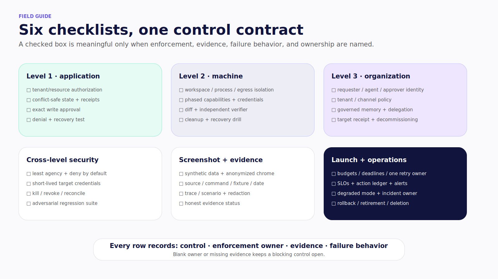
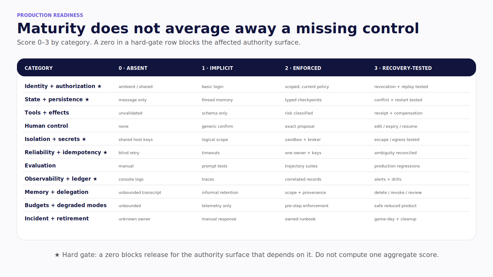
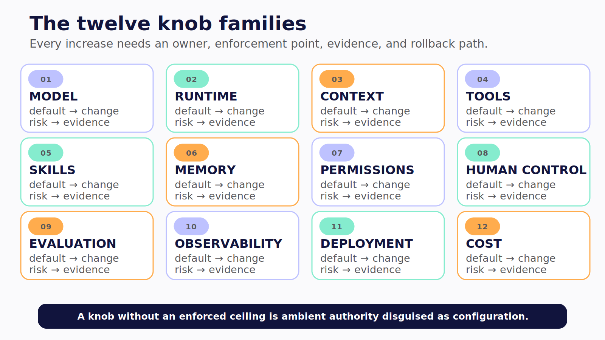
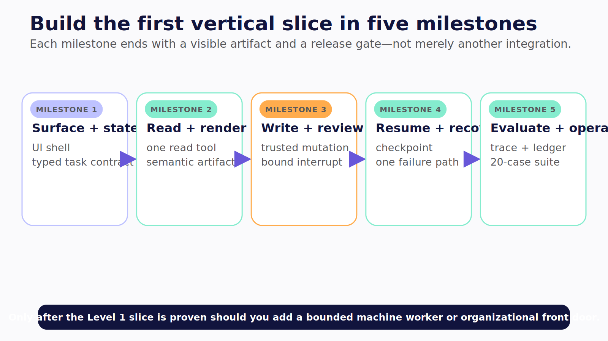

# Part VI — Field Guide and Back Matter

The field guide turns the book's architecture into launch artifacts. Use these pages in design review, implementation planning, release gates, and game days. A checked box is not evidence by itself. Record the enforcement owner, the artifact that proves the control, and the behavior when the control cannot run.

## Production checklist pack

Use the six checklist families together:

1. Level 1 — application identity, typed tools, conflict-safe state, exact write approval, effects, and receipts.
2. Level 2 — workspace, process, network, credential, lifecycle, verifier, cleanup, and recovery controls.
3. Level 3 — requester, agent, delegate, approver, tenant, channel, memory, target, and decommissioning controls.
4. Cross-level security — least agency, deny by default, short-lived credentials, kill/revoke, reconciliation, and adversarial evaluation.
5. Screenshot and evidence — synthetic data, anonymized chrome, source, command, fixture, scenario, redaction, rights, and honest evidence status.
6. Launch and operations — budgets, deadlines, one retry owner, SLOs, action ledger, degraded modes, incidents, upgrades, and retirement.



*Figure 27.1 — Six checklist families turn chapter controls into owned launch gates.*

The full working version should live beside the companion repository as an editable worksheet. Every blocking row needs a named owner and a link to its test, receipt, policy decision, trace, or runbook.

## Production-readiness scorecard

Score each category from zero to three:

- **0 — absent:** the control is missing or depends on ambient trust;
- **1 — implicit:** the intent exists, but enforcement or evidence is incomplete;
- **2 — enforced:** a trusted boundary applies the control and records evidence;
- **3 — recovery-tested:** denial, restart, ambiguity, revocation, or incident behavior is exercised.

Identity and authorization, state and persistence, isolation and secrets, reliability and idempotency, and observability/action records are hard gates. A zero blocks the authority surface that depends on it. Do not average a missing hard control into one maturity score.



*Figure 27.2 — Maturity scores cannot average away a zero in a hard-gate control.*

## Consolidated knobs reference

Use the twelve families as an index during design review. For every changed default, record the owner, reason, expanded risk, enforcement ceiling, evidence, rollback path, and which authority levels inherit the change. Configuration is not a control until a trusted boundary applies it.



*Figure 27.3 — The knobs reference turns configuration into an owned decision: every increase needs an enforced ceiling, evidence, and rollback path.*

## Evidence-bearing quickstart

Build one Level 1 vertical slice before expanding authority. The sequence is surface and typed state, one read tool and semantic artifact, one trusted write and bound review, persistence plus one recovery path, then correlated evidence and an evaluation suite. Add a bounded machine worker or organizational front door only after the base slice proves its enforcement and failure behavior.



*Figure 27.4 — Each quickstart milestone ends with a visible artifact and a production gate, not merely another integration.*

## Architecture decision record

Before expanding authority, record the outcome and non-goals, maximum credible harm, rejected lower-authority design, selected level or hybrid, identities, tools, state and memory, isolation, human gates, evidence, SLOs, budgets, incidents, retirement owner, and the conditions that force an upgrade or downshift.

The final test remains the same throughout the book:

```text
intent → enforcement point → evidence → failure behavior
```

If any link is missing, the system has an aspiration rather than a control.
